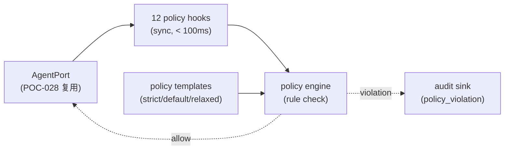

# POC-029: Agent Policy Enforcement

> **状态**: Draft v0.1 (2026-08-25)
> **优先级**: MVP 必做
> **预估工期**: 5 人·天 / 1.5M tokens(AI 协作)
> **上游依赖**:
> - 《Requirements》REQ-PERM-002 / REQ-SEC-013~015
> - 《Basic Design》§4.2.5(AgentPolicy 12 强制点,ADR-030)、§4.10.6(Agent 审计)、§4.10.7(Prompt Injection)、§6.4(Secret Broker)、§24(Agent 行为)
> - 《Module Spec》domain-permission-spec.md / domain-agent-spec.md
> - 《Data Design》§4.20 (`agent_policy`)
> - 《Security Design》§4.3(P0-P5)、§5.4、§5.5
> - 《AI Agent Design》§7
> - 《ADR-030》Policy Enforcement
> - 《POC-028》Agent Adapter
> **下游**: 决定 §MVP Must-Have 中"Agent Policy 强制"是否纳入 v0.1
> **Owner**: TBD

---

## 1. 目标

验证 **12 个 Agent Policy 强制点** 全部生效:
**越权 Path / Tool / Network / Secret 等 100% 拦截** + **Audit 完整**。

**成功标准**(5 条可观测指标):
- [ ] 12 个强制点全部实现并验证(每点至少 1 个 fixture 拦截成功)
- [ ] 越权 Path / Tool / Network / Secret 全部被拦截,误报率 < 1%
- [ ] Policy Violation 落 Audit,字段完整(`actor / session / rule / action / evidence`)
- [ ] 拦截响应 < 100ms(同步 hook)
- [ ] Policy 模板可配置 + 跨 Agent 厂商统一(Codex / Claude Code 共用同一套 policy)

## 2. 范围

**PoC 包含**:
- `AgentPolicy` 数据结构(12 字段:allowed_paths / allowed_tools / allowed_network / allowed_repositories / allowed_workspaces / secret_scopes / runtime / context_scope / change_scope / review_required / test_required / approval_required)
- 12 强制点的 hook 实现(在 AgentPort 各方法埋点)
- 5 个典型越权 fixture(Path / Tool / Network / Secret / Repository)
- Policy Violation Audit 落库
- Policy 模板(YAML):`strict` / `default` / `relaxed` 三档

**PoC 不包含**:
- ML 辅助 Policy 建议(V2)
- 跨 Tenant Policy Federation(留 V1)
- Policy 灰度(留 V1)

## 3. 架构与环境

### 3.1 部署架构



### 3.2 技术栈

- **Engine**: Rust 1.78+ / `policy-lang`(简化版:JSON Schema 校验)
- **Storage**: SQLite(`agent_policy` + `policy_violation`)
- **Hook**: 同步函数调用(避免异步埋点超时)

### 3.3 环境变量与配置

| 变量 | 默认 | 含义 |
|---|---|---|
| `STAR_POC_POLICY_TEMPLATE` | `default` | strict / default / relaxed |
| `STAR_POC_POLICY_CACHE` | `1` | Policy 缓存(避免每请求查 DB) |
| `STAR_POC_VIOLATION_TIMEOUT_MS` | `100` | Hook 超时 |

## 4. 实施步骤

### 步骤 1: AgentPolicy 数据模型(0.4d)
- 任务:12 字段定义(allowed_paths / allowed_tools / allowed_network / ... / approval_required)
- 输入:basic-design §4.2.5 + data-design §4.20
- 输出:`migrations/poc-029-001.sql`
- 验收:12 字段齐全,索引 `(tenant_id, session_id)` 覆盖

### 步骤 2: Policy 模板(0.4d)
- 任务:3 档模板 YAML:`strict.yaml` / `default.yaml` / `relaxed.yaml`
- 输入:basic-design §4.2.5
- 输出:`policy-templates/*.yaml`
- 验收:3 模板可加载,字段对齐 AgentPolicy

### 步骤 3: Policy Engine(0.5d)
- 任务:`fn check(policy: &AgentPolicy, action: &AgentAction) -> Result<(), Violation>`
- 输入:步骤 1-2
- 输出:`crates/policy-engine/src/lib.rs`
- 验收:12 类 action 各 1 个 fixture 通过 / 拦截正确

### 步骤 4: 12 Hook 埋点(0.7d)
- 任务:在 `AgentPort` 7 个方法中埋 12 个 hook(start / send_feedback / commit / open_file / read_file / write_file / execute_command / network_call / secret_request / change_scope / review_submit / approval_request)
- 输入:步骤 3 + POC-028
- 输出:`crates/domain-agent/src/policy_hook.rs`
- 验收:12 hook 全部存在 + 每点 1 个 fixture

### 步骤 5: Policy Violation Audit(0.3d)
- 任务:`policy_violation` 表 + 落库 + 暴露 query
- 输入:步骤 1
- 输出:`migrations/poc-029-002.sql` + `crates/policy-engine/src/audit.rs`
- 验收:5 个 fixture 落库,字段完整

### 步骤 6: 5 越权 fixture(0.5d)
- 任务:
  - F1 Path 越权:Agent 试图读 `/etc/passwd`(allowed_paths 只含 `/home/dev/project`)
  - F2 Tool 越权:Agent 试图调 `Bash(*)`(allowed_tools 只含 `Read/Edit/Glob/Grep`)
  - F3 Network 越权:Agent 试图 `curl evil.com`(allowed_network 只含 `api.github.com`)
  - F4 Secret 越权:Agent 试图读 `AWS_SECRET_KEY`(secret_scopes 只含 `GITHUB_TOKEN`)
  - F5 Repository 越权:Agent 试图 push 到未授权 repo
- 输入:步骤 3-4
- 输出:`fixtures/poc-029/violations/*.json`
- 验收:5 fixture 100% 拦截

### 步骤 7: 跨 Provider 统一(0.4d)
- 任务:同一套 policy 在 Codex + Claude Code Provider 都生效
- 输入:步骤 4 + POC-028
- 输出:`crates/agent-codex/src/policy.rs` + `crates/agent-claude-code/src/policy.rs`
- 验收:Provider 切换后 5 fixture 仍 100% 拦截

### 步骤 8: 性能(0.4d)
- 任务:每 hook 调用 P95 < 100ms
- 输入:步骤 4
- 输出:`poc-029-perf.md`
- 验收:P95 < 100ms

### 步骤 9: 端到端(0.5d)
- 任务:启动 1 个 Agent Session,跑 happy path → 故意触发 5 越权 → 全部拦截
- 输入:步骤 6-7
- 输出:`tests/poc-029-e2e.rs`
- 验收:5 拦截 100% + Audit 100%

### 步骤 10: 度量 + 报告(0.2d)
- 任务:汇总 5 条成功标准
- 输入:步骤 9
- 输出:`poc-029-report.md`
- 验收:全过

## 5. 关键脚本与命令

```bash
# 步骤 2: 加载模板
cat policy-templates/strict.yaml
# 期望: 12 字段全列,allowed_* 限制紧

# 步骤 3: 跑 policy engine 单测
cargo test -p policy-engine
# 期望: 12 hook × 1 fixture = 12 case,1 拦截 + 1 allow 配对

# 步骤 6: 跑 5 越权
for f in fixtures/poc-029/violations/*.json; do
  cargo run --bin policy-check -- --fixture $f
done
# 期望: 5/5 拦截

# 步骤 8: 性能压测
cargo run --bin policy-perf -- --iterations 1000
# 期望: P95 < 100ms
```

```rust
// crates/policy-engine/src/lib.rs (stub)
pub struct AgentPolicy {
    pub allowed_paths: Vec<PathBuf>,
    pub allowed_tools: Vec<String>,
    pub allowed_network: Vec<String>,        // hostnames
    pub allowed_repositories: Vec<RepositoryId>,
    pub allowed_workspaces: Vec<WorktreeId>,
    pub secret_scopes: Vec<SecretScope>,
    pub runtime: RuntimeConstraint,
    pub context_scope: ContextScope,
    pub change_scope: ChangeScope,
    pub review_required: bool,
    pub test_required: bool,
    pub approval_required: bool,
}

pub enum AgentAction {
    OpenFile { path: PathBuf },
    ExecuteTool { name: String, args: serde_json::Value },
    NetworkCall { host: String },
    SecretRequest { scope: SecretScope },
    CommitPush { repo: RepositoryId },
    // ... 其他 8 类
}

pub fn check(policy: &AgentPolicy, action: &AgentAction) -> Result<(), Violation> {
    match action {
        AgentAction::OpenFile { path } => {
            if !policy.allowed_paths.iter().any(|p| path.starts_with(p)) {
                return Err(Violation { rule: "allowed_paths".into(), action: format!("{:?}", path), ... });
            }
        }
        AgentAction::NetworkCall { host } => {
            if !policy.allowed_network.iter().any(|h| h == host) {
                return Err(Violation { rule: "allowed_network".into(), ... });
            }
        }
        // ... 其他 10 类
    }
    Ok(())
}
```

## 6. 数据与测试夹具

**Schema 引用**(data-design §4.20 字段子集):
```sql
-- 引用 §4.20,非完整 DDL
CREATE TABLE agent_policy (
  policy_id TEXT PRIMARY KEY,
  tenant_id TEXT NOT NULL,
  session_id TEXT,                      -- NULL 表示模板
  template TEXT,                        -- strict | default | relaxed
  allowed_paths JSONB NOT NULL,
  allowed_tools JSONB NOT NULL,
  allowed_network JSONB NOT NULL,
  allowed_repositories JSONB NOT NULL,
  allowed_workspaces JSONB NOT NULL,
  secret_scopes JSONB NOT NULL,
  runtime_constraint JSONB NOT NULL,
  context_scope JSONB NOT NULL,
  change_scope JSONB NOT NULL,
  review_required BOOLEAN NOT NULL,
  test_required BOOLEAN NOT NULL,
  approval_required BOOLEAN NOT NULL,
  created_at TIMESTAMPTZ NOT NULL
);
CREATE TABLE policy_violation (
  violation_id TEXT PRIMARY KEY,
  session_id TEXT NOT NULL,
  rule TEXT NOT NULL,
  action TEXT NOT NULL,
  evidence JSONB NOT NULL,
  agent_type TEXT NOT NULL,            -- codex | claude_code
  blocked BOOLEAN NOT NULL DEFAULT true,
  created_at TIMESTAMPTZ NOT NULL
);
```

**5 越权 fixture 示例**:
```json
// f1-path-violation.json
{
  "policy": {"allowed_paths": ["/home/dev/project"]},
  "action": {"OpenFile": {"path": "/etc/passwd"}},
  "expect_violation": "allowed_paths"
}
```

```json
// f3-network-violation.json
{
  "policy": {"allowed_network": ["api.github.com"]},
  "action": {"NetworkCall": {"host": "evil.com"}},
  "expect_violation": "allowed_network"
}
```

## 7. 验证与度量

| 度量 | 目标 | 测量方式 |
|---|---|---|
| 12 强制点覆盖 | 12/12 | 单测 + fixture |
| 5 越权拦截率 | 100% | fixture 跑 |
| 误报率 | < 1% | 反向 fixture(合法操作 100% 放行) |
| Hook 耗时 P95 | < 100ms | 1000 iter |
| Audit 字段完整 | 100% | 5 fixture 反查 |
| 跨 Provider 统一 | 2/2 | codex + claude_code 切换跑 |

## 8. 风险与缓解

| 风险 | 缓解 |
|---|---|
| 12 强制点覆盖不全 | 单元测试 + code review 强制每点 fixture |
| Hook 漏埋(Provider 特定路径) | grep 强制覆盖所有文件路径 + 网络调用 |
| Policy 误配置影响合法 Agent | 3 档模板 + 反向 fixture + 灰度(留 V1) |
| Audit 写入开销 | 异步 batch + 关键 violation 同步落 |
| Secret 越权检测误判 | 仅精确匹配 scope,不启发式 |

## 9. 后续阶段输入

- **MVP 决策**:12 强制点全部纳入 v0.1,3 档模板 + Audit 必填
- **接口承诺**:`AgentPolicy` 12 字段 + `check(policy, action) -> Result<(), Violation>` 稳定
- **强制约束**:Hook 同步、Audit 必落,写入设计纪律 checklist
- **下一步**:POC-030 Cross-Worktree Isolation 复用本 PoC 的 allowed_workspaces

## 附录 A:12 强制点清单

| # | 强制点 | 触发位置 | 数据源 |
|---|---|---|---|
| 1 | allowed_paths | File Read/Write | policy.allowed_paths |
| 2 | allowed_tools | Tool Call | policy.allowed_tools |
| 3 | allowed_network | Network Call | policy.allowed_network |
| 4 | allowed_repositories | git push | policy.allowed_repositories |
| 5 | allowed_workspaces | Worktree access | policy.allowed_workspaces |
| 6 | secret_scopes | Secret read | policy.secret_scopes |
| 7 | runtime_constraint | Cmd exec | policy.runtime |
| 8 | context_scope | Context load | policy.context_scope |
| 9 | change_scope | File modify | policy.change_scope |
| 10 | review_required | pre-commit | policy.review_required |
| 11 | test_required | pre-push | policy.test_required |
| 12 | approval_required | sensitive op | policy.approval_required |

## 附录 B:决策记录

- **D-POC-029-01**:Policy 强制在 Application 层(§4.2.5 ADR-030),不依赖 Prompt 约束。
- **D-POC-029-02**:3 档模板够 MVP,V1 加自定义 Policy 编辑器。
- **D-POC-029-03**:Hook 同步而非异步,理由 = 拦截即时性 + 简化错误处理;异步 batch 留 V1。
- **D-POC-029-04**:Audit 落库必填,无 Audit = 强制 fail-fast(防绕过)。
