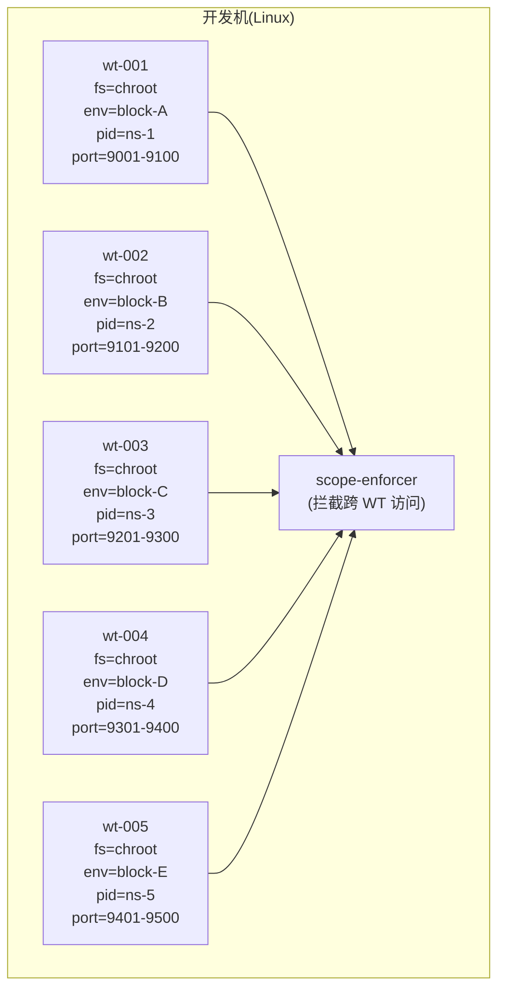
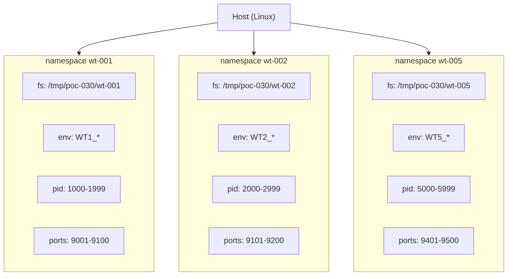

# POC-030: Cross-Worktree Isolation

> **状态**: Draft v0.1 (2026-08-25)
> **优先级**: MVP 必做
> **预估工期**: 4 人·天 / 1M tokens(AI 协作)
> **上游依赖**:
> - 《Requirements》REQ-WT-009 / REQ-SEC-016
> - 《Basic Design》§4.1.7(Worktree Scope)、§22.5(Worktree Isolation)、§4.2.5(allowed_workspaces 联动)、§6.1(13 类 tenant_id)、§4.6.4(Local Runtime Filesystem Scope)
> - 《Module Spec》domain-worktree-spec.md / domain-local-runtime-spec.md
> - 《Data Design》§4.16
> - 《Security Design》§2 / §3.6
> - 《ADR-019 / ADR-029》
> - 《POC-029》Policy Enforcement(allowed_workspaces 联动)
> **下游**: 决定 §MVP Must-Have 中"Worktree Isolation"是否纳入 v0.1
> **Owner**: TBD

---

## 1. 目标

验证 **同机 5 Worktree 并行** 时,
**Filesystem / Env / Process / Port 4 维隔离** 互不可见。

**成功标准**(5 条可观测指标):
- [ ] 5 Worktree 同机并行,Filesystem Scope 互不可见(读 / 写)
- [ ] Env 变量隔离(Worktree A 看不到 Worktree B 的 env)
- [ ] Process 隔离(A 的 process 不在 B 的 `ps` 中)
- [ ] Port 隔离(A 占用 8080,B 不能用 8080)
- [ ] 跨 Worktree 访问 100% 被 RISK-019 拦截(POC-022 scope_check + POC-029 allowed_workspaces 联动)

## 2. 范围

**PoC 包含**:
- Filesystem Scope(每个 Worktree 独立目录 + chroot / mount namespace)
- Env 隔离(独立 Env block)
- Process 隔离(Linux `unshare(CLONE_NEWPID)` 或简化 cgroup)
- Port 隔离(分配独立端口段)
- 跨 Worktree 访问拦截(联动 POC-022 + POC-029)
- 5 Worktree 模拟器(沿用 POC-017 子集)

**PoC 不包含**:
- Kata Containers / gVisor(§30.4 V2)
- 跨机 Worktree 隔离
- 完整 SELinux / AppArmor 集成(简化)

## 3. 架构与环境

### 3.1 部署架构



### 3.2 技术栈

- **Filesystem**: Linux `unshare(CLONE_NEWNS)` + bind mount / 简化 chroot
- **Env**: 独立 Env block(`env -i` 或子进程 `clearenv()`)
- **Process**: Linux `unshare(CLONE_NEWPID)`(简化,不强制 cgroup)
- **Port**: 静态段分配(9001-9500,5 段)
- **Enforcer**: Rust 1.78+ / 简化 hook(沿用 POC-029 模式)

### 3.3 环境变量与配置

| 变量 | 默认 | 含义 |
|---|---|---|
| `STAR_POC_WT_COUNT` | `5` | 并行 Worktree 数 |
| `STAR_POC_WT_FS_ROOT` | `/tmp/poc-030` | Filesystem Scope 根 |
| `STAR_POC_WT_PORT_BASE` | `9001` | 端口段 base |
| `STAR_POC_WT_PORT_STEP` | `100` | 每 WT 端口段步长 |
| `STAR_POC_USE_USERNS` | `1` | 是否启用 user namespace(需 root) |

## 4. 实施步骤

### 步骤 1: Filesystem Scope(0.6d)
- 任务:每个 Worktree 独立目录,`unshare(CLONE_NEWNS)` + bind mount
- 输入:无
- 输出:`scripts/wt-fs-isolate.sh`
- 验收:WT1 看不到 WT2 的文件,反之亦然

### 步骤 2: Env 隔离(0.3d)
- 任务:每个 Worktree 启动时清空环境 + 注入独立 Env block
- 输入:无
- 输出:`scripts/wt-env-isolate.sh`
- 验收:WT1 看不到 WT2 的 env(测 5 个变量)

### 步骤 3: Process 隔离(0.5d)
- 任务:`unshare(CLONE_NEWPID)` + 简化进程列表过滤
- 输入:无
- 输出:`scripts/wt-pid-isolate.sh`
- 验收:WT1 的 `ps` 看不到 WT2 的进程

### 步骤 4: Port 隔离(0.4d)
- 任务:静态端口段分配 + 启动时检测冲突
- 输入:无
- 输出:`crates/wt-isolate/src/port.rs`
- 验收:5 Worktree 各占 100 端口段,启动无冲突

### 步骤 5: scope-enforcer(0.6d)
- 任务:联动 POC-022 scope_check + POC-029 allowed_workspaces,跨 WT 访问 100% 拦截
- 输入:POC-022 + POC-029
- 输出:`crates/wt-isolate/src/enforcer.rs`
- 验收:跨 WT 访问 fixture 100% 拦截

### 步骤 6: 5 Worktree 模拟器(0.4d)
- 任务:脚本启 5 个 WT,各跑 1 个 stub daemon,持续 5min
- 输入:步骤 1-5
- 输出:`scripts/wt-5-isolate.sh`
- 验收:5 个 daemon 互不感知,无 OOM

### 步骤 7: 跨 WT 访问 fixture(0.5d)
- 任务:5 个 fixture 验证 4 维隔离:
  - F1:WT1 读 `/tmp/poc-030/wt-002/secret.txt` → 失败
  - F2:WT1 读 WT2 的 env 变量 → 失败
  - F3:WT1 kill WT2 的进程 PID → 失败
  - F4:WT1 bind 0.0.0.0:9101(WT2 端口段) → 失败
  - F5:WT1 跨 WT 调用 Context Compiler → 拦截 + Audit
- 输入:步骤 1-5
- 输出:`fixtures/poc-030/*.json`
- 验收:5 fixture 100% 拦截

### 步骤 8: 度量 + 报告(0.2d)
- 任务:汇总 5 条成功标准
- 输入:步骤 7
- 输出:`poc-030-report.md`
- 验收:全过

## 5. 关键脚本与命令

```bash
# 步骤 1: 启 Filesystem Scope
bash scripts/wt-fs-isolate.sh wt-001 /tmp/poc-030/wt-001
ls /tmp/poc-030/wt-001/secret.txt  # 在 wt-001 内可见
# 从 wt-002 切回,不可见

# 步骤 2: 启 Env 隔离
bash scripts/wt-env-isolate.sh wt-001 "FOO=bar" "BAZ=qux"
env | grep FOO  # 在 wt-001 内可见
# 从 wt-002 切回,不可见

# 步骤 3: 启 PID namespace
bash scripts/wt-pid-isolate.sh wt-001
ps aux  # 在 wt-001 内只看到自己的进程

# 步骤 4: 端口段
export STAR_POC_WT_PORT_BASE=9001
export STAR_POC_WT_PORT_STEP=100
# wt-001: 9001-9100,wt-002: 9101-9200,...

# 步骤 7: 跑 5 越界 fixture
for f in fixtures/poc-030/*.json; do
  bash scripts/run-violation.sh --wt wt-001 --fixture $f
done
# 期望: 5/5 拦截
```

```rust
// crates/wt-isolate/src/enforcer.rs (stub)
use domain_worktree::port::WorktreePort;

pub async fn enforce_cross_wt_access(
    port: &dyn WorktreePort,
    actor_wt: WorktreeId,
    target_wt: WorktreeId,
    action: &str,
) -> Result<(), Violation> {
    // RISK-019 强约束:跨 Worktree 拒绝
    if actor_wt != target_wt {
        let v = Violation {
            rule: "cross_worktree_access".into(),
            actor_wt,
            target_wt,
            action: action.into(),
            // 联动 POC-022 scope_check
            // 联动 POC-029 allowed_workspaces
        };
        port.write_violation_audit(&v).await?;
        return Err(v.into());
    }
    Ok(())
}
```

## 6. 数据与测试夹具

**Schema 引用**(data-design §4.16 字段子集 + violation audit):
```sql
-- 引用 §4.16,非完整 DDL
CREATE TABLE worktree (
  worktree_id TEXT PRIMARY KEY,
  tenant_id TEXT NOT NULL,           -- 13 类对象 #3 强制
  project_id TEXT NOT NULL,
  fs_root TEXT NOT NULL,             -- /tmp/poc-030/wt-001
  env_block JSONB,                   -- {"FOO": "bar", ...}
  port_range_start INT NOT NULL,
  port_range_end INT NOT NULL,
  pid_namespace TEXT                 -- ns-1..ns-5
);
CREATE TABLE cross_wt_violation (
  violation_id TEXT PRIMARY KEY,
  actor_wt TEXT NOT NULL,
  target_wt TEXT NOT NULL,
  rule TEXT NOT NULL,                -- fs | env | process | port | scope
  action TEXT NOT NULL,
  evidence JSONB,
  created_at TIMESTAMPTZ NOT NULL
);
```

**5 越界 fixture**:
```json
// f1-fs-violation.json
{"actor_wt": "wt-001", "target_wt": "wt-002", "rule": "fs", "action": "read /tmp/poc-030/wt-002/secret.txt"}
```

```json
// f2-env-violation.json
{"actor_wt": "wt-001", "target_wt": "wt-002", "rule": "env", "action": "read WT2_SECRET"}
```

```json
// f3-process-violation.json
{"actor_wt": "wt-001", "target_wt": "wt-002", "rule": "process", "action": "kill PID 1234 (WT2 process)"}
```

```json
// f4-port-violation.json
{"actor_wt": "wt-001", "target_wt": "wt-002", "rule": "port", "action": "bind 0.0.0.0:9101"}
```

```json
// f5-scope-violation.json
{"actor_wt": "wt-001", "target_wt": "wt-002", "rule": "scope", "action": "Context Compiler cross-WT load"}
```

## 7. 验证与度量

| 度量 | 目标 | 测量方式 |
|---|---|---|
| Filesystem 隔离 | 100% | 双向 fixture |
| Env 隔离 | 100% | 5 变量 fixture |
| Process 隔离 | 100% | PID 不可见 |
| Port 隔离 | 100% | 5 段启动无冲突 + 跨段 bind 失败 |
| 跨 WT 访问 | 5/5 拦截 | 5 fixture |
| 5 WT 并行稳定性 | 5min 无 OOM | top / 内存监控 |

## 8. 风险与缓解

| 风险 | 缓解 |
|---|---|
| `unshare` 需要 root | PoC 提示 `sudo`;生产用 rootless(用户命名空间) |
| Filesystem 隔离破坏调试 | 提供"开发模式"关闭隔离,生产强制开 |
| 端口段不够大 | 5 段 × 100 = 500,V1 评估动态分配 |
| Process 隔离不彻底 | 简化版 PoC,生产用 cgroup(留 V1) |
| Windows PoC 不可用 | 本 PoC 仅 Linux,Windows 路径留 V1(用 job object) |

## 9. 后续阶段 Input

- **MVP 决策**:Cross-Worktree Isolation 4 维全部纳入 v0.1
- **接口承诺**:`WorktreePort` + `enforce_cross_wt_access` 签名稳定
- **联动规范**:与 POC-022 / POC-029 共享 violation audit 表
- **下一步**:V1 评估 Kata Containers / gVisor(§30.4)

## 附录 A:5 Worktree 并行架构



## 附录 B:决策记录

- **D-POC-030-01**:4 维隔离全部 MVP 必做;V2 评估 Kata(§30.4)。
- **D-POC-030-02**:Filesystem 用 `unshare(CLONE_NEWNS)` 而非完整 chroot,理由 = 简化 + 可恢复。
- **D-POC-030-03**:Process 隔离用 PID namespace 而非 cgroup,理由 = PoC 简化 + 无需特权 cgroup。
- **D-POC-030-04**:Windows 路径不覆盖,留 V1;本 PoC 锁定 Linux(开发机主流)。
