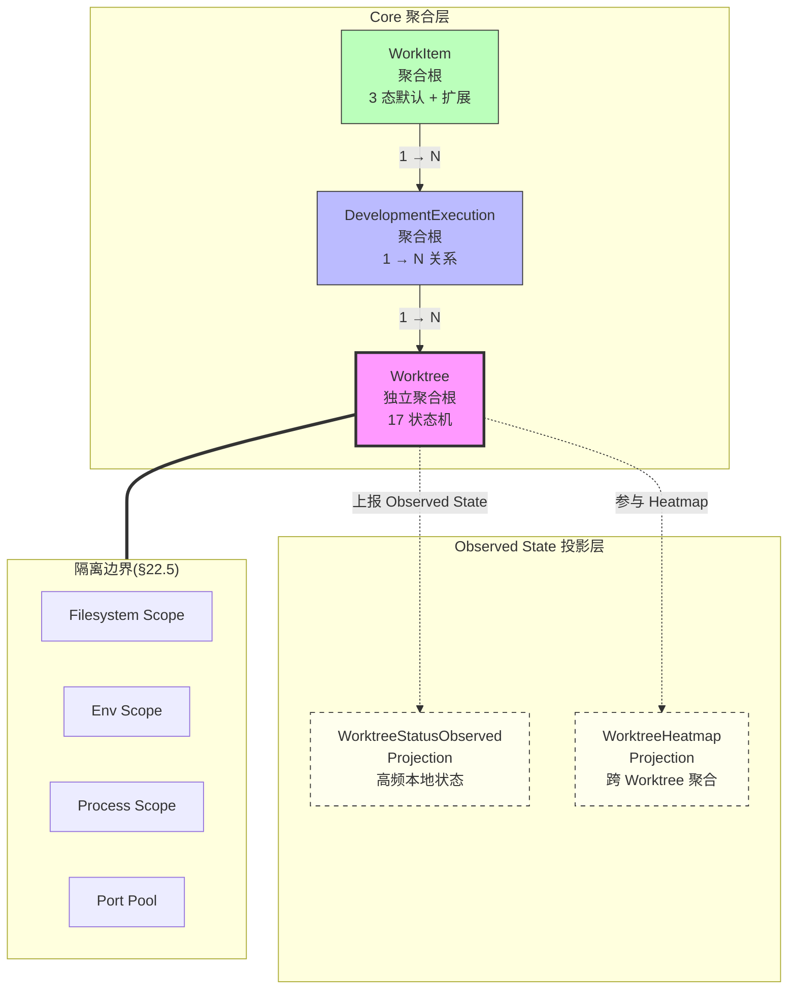

# RFC-016: Worktree as First-class Domain Entity

> **状态**: Proposed
> **作者**: Mavis(Star 架构师)
> **创建日期**: 2026-08-25
> **最后更新**: 2026-08-25
> **相关 ADR**: ADR-016
> **相关 Requirement**: REQ-WT-001, REQ-WT-002, REQ-WT-003, REQ-DEV-001, REQ-DEV-002, REQ-WF-002, REQ-DATA-003
> **相关 upstream**:
> - 《Basic Design》§4.1, §10 ADR-016, §22.1~22.7, §30.2 MVP Must Have
> - 《Requirements》§22 Worktree Orchestration, §41 ID 登记 WT-001~003
> - 《Module Spec》domain-worktree-spec.md
> - 《PoC Spec》poc-017-worktree-state-sync.md, poc-018-offline-reconnect.md, poc-019-multi-worktree-observation.md, poc-024-file-level-conflict.md

---

## 摘要

本 RFC 提议将 Worktree 提升为 Star 平台的一级领域对象(独立聚合根),而非 Repository Metadata 字段或 Branch 附属。Worktree 通过 development_execution 间接关联 WorkItem,承载独立的状态机(Status / Health / ConflictState / Ahead / Behind / ChangedFiles / TestState),支撑 1 WorkItem → N Worktree 的并行执行模式。本决策是 Vibe Coding 多 Agent 并行的隔离边界基石,直接回应 REQ-WT-001~003 与 §22 Worktree Orchestration 的硬约束。

## 动机

### 背景

Vibe Coding 的核心场景是"多 Agent 同 Repository 并行执行不同 WorkItem",Worktree 是这一并行模式的物理隔离边界(《Basic Design》§4.1,§22.1)。然而,传统 SCM 工具(Git / GitHub / GitLab)将 Worktree 视为 Repository 的次级概念(`.git/worktrees/` 内部目录),缺乏业务级状态管理、跨 Worktree 冲突检测、与 WorkItem 的解耦关系等能力。Star 平台必须在 Worktree 与 WorkItem 之间建立独立的一级领域对象,才能承载 1 → N 的并行关系、Status Independence、Isolation 等业务不变量。

### 现状

当前系统(尚未实现)的设计草案曾考虑过两种简化方案:

- **方案 A 候选**:把 Worktree 视为 Repository Metadata 的一个字段(`repositories.worktree_paths TEXT[]`)
- **方案 B 候选**:把 Worktree 作为独立表,但 `worktrees.work_item_id` 直接外键关联

这两种简化方案都不能满足以下业务需求:

1. **多 WorkItem 共享 Branch** 的场景(例如 1 个 Release Branch 上有 3 个 WorkItem 各自 Worktree)
2. **跨 Worktree 冲突** 的聚合查询(需要在 Worktree 维度上做 Heatmap 投影,而不是从 Repository 反查)
3. **Status Independence** —— Worktree 的 `AGENT_RUNNING / BLOCKED / CONFLICTED` 等状态独立于 WorkItem 的 `TODO / IN_PROGRESS / DONE`(REQ-WF-002 强制约束)
4. **跨 Execution 追溯** —— 同一 Worktree 可能经历多个 DevelopmentExecution(例如 AI 重启、Handoff),不能被绑定在单一 WorkItem 上

### 解决目标

1. Worktree 作为独立聚合根,具备完整的状态机与生命周期管理(§4.1.3 17 个状态)
2. 1 WorkItem → N Worktree 关系明确建模,支持并行与冲突检测
3. Worktree Status 与 WorkItem Status 完全解耦(REQ-WF-002)
4. Worktree 状态变更走独立事务,与 Observed State Projection 分离(REQ-DATA-003)
5. 跨 Worktree 聚合查询(Conflict / Heatmap)可直接基于聚合根,无需反查 WorkItem
6. Worktree 与 DevelopmentExecution 解耦,Worktree 可在多个 Execution 间复用与迁移

## 详细设计

### 决策(Decision)

**采用方案 C**:Worktree 作为独立聚合根(Aggregate Root),通过 `worktree.development_execution_id` 间接关联 WorkItem,WorkItem 与 Worktree 之间不建立直接外键,所有跨域查询经过 `development_execution` 聚合层(《Basic Design》§2.1,§4.1)。

### 替代方案(Alternatives Considered)

#### 方案 A: Worktree 作为 Repository Metadata 字段

- 描述:在 `repositories` 表中增加 `worktree_paths TEXT[]`、`worktree_branches TEXT[]`、`worktree_statuses JSONB` 等字段,把 Worktree 视为 Repository 的子结构
- 优点:
  - 数据库 Schema 简单,不需要新建表
  - 写路径短,创建 Worktree 只需 UPDATE Repository
- 缺点:
  - 违反 §4.1.1 "Worktree 是隔离边界" 的定位,无法承载独立的 Status / Health / ConflictState
  - 1 WorkItem → N Worktree 的关系无法表达
  - 跨 Worktree 聚合查询(Conflict / Heatmap)需要 JSONB 反序列化,性能差且难以索引
  - Observed State 与 Business State 混存在 JSONB 字段,违反 REQ-DATA-003
- 拒绝理由:不能承载 Worktree 状态机(17 个状态)、不支持并行场景、违反 §4.1.1 一级领域对象定位

#### 方案 B: Worktree 作为独立表但与 WorkItem 直接关联

- 描述:创建 `worktrees` 表,直接外键 `work_item_id`,WorkItem 是聚合根,Worktree 是子实体
- 优点:
  - Schema 清晰,关系简单
  - 从 WorkItem 反查 Worktree 列表性能高
- 缺点:
  - 跨 Worktree 聚合查询必须以 WorkItem 为入口,无法支持 "Repository 维度的 Heatmap" 场景
  - Worktree 跨 DevelopmentExecution 复用困难(WorkItem 是 Execution 的 owner,Worktree 不能脱离 WorkItem 单独存在)
  - Status Independence 的实现需要在 Worktree 状态机外再做 WorkItem 状态机,双层状态机管理复杂
- 拒绝理由:不支持 Worktree 作为独立查询入口,Heatmap 投影需经过 WorkItem,违反 §22.4 Conflict Intelligence 需求

#### 方案 C: Worktree 作为独立聚合根,通过 development_execution 间接关联 WorkItem(选定)

- 描述:Worktree 是独立聚合根,`worktrees` 表持有 `development_execution_id` 外键,`development_executions` 持有 `work_item_id` 外键,WorkItem 与 Worktree 通过 DevelopmentExecution 间接关联
- 优点:
  - 1 WorkItem → N Worktree 关系明确(REQ-DEV-001)
  - Worktree 状态机独立,Status Independence 天然支持(REQ-WF-002)
  - 跨 Worktree 聚合查询(Conflict / Heatmap)以 Repository / Project 为入口,无需经过 WorkItem
  - Worktree 可在 DevelopmentExecution 间复用(Handoff / 重新分配)
  - 隔离边界清晰(《Basic Design》§22.5 Isolation)
- 缺点:
  - 跨域查询路径长(WorkItem → Execution → Worktree)
  - 数据写入需跨表事务(创建 Worktree 需同时写 Execution 与 Worktree)
  - 架构复杂度上升,需要新的 Port 抽象

## 后果

### 正面后果(Positive Consequences)

1. **支持 1 WorkItem → N Worktree 并行模式**(REQ-DEV-001):同一 WorkItem 拆分为多个 Worktree,各自由不同 Agent 并行执行
2. **Status Independence 天然实现**(REQ-WF-002):Worktree 状态机(17 个状态)与 WorkItem 状态机(3 个默认 + 扩展)完全独立,可任意组合
3. **跨 Worktree 聚合查询可行**:Heatmap 投影、Conflict Detection 可直接以 Repository / Project 维度执行
4. **Worktree 复用 / Handoff 简化**:同一 Worktree 可被多个 AgentSession 占用,或在 DevelopmentExecution 间迁移
5. **隔离边界清晰**:Filesystem / Env / Process / Port / Context 全部以 Worktree 维度隔离(§22.5)
6. **缓解 RISK-019 Cross-Worktree Context Leakage**:Worktree 是 Context Compiler 的强制 Scope 边界
7. **AI Audit 完整**:每个 Worktree 是 AI 操作的可追溯单元,所有 AgentSession / ChangeSet / Validation 都反查到 Worktree

### 负面后果(Negative Consequences / Trade-offs)

1. **数据写入跨表事务**:创建 Worktree 需要同时 INSERT DevelopmentExecution + Worktree,事务边界变长
2. **跨域查询路径长**:WorkItem 反查 Worktree 需经过 2 跳(Execution → Worktree)
3. **Worktree 数量爆炸风险**:1 WorkItem N Worktree + 1 Repository M Worktree 可能导致 1000+ Worktree 单 Repository,需 Heatmap 优化与冷热分层
4. **索引设计复杂**:Worktree 查询入口多(Repository / Project / AgentSession / WorkItem),需要合理的多列复合索引
5. **数据库 Migration 复杂化**:Worktree 是高频更新对象(dirty_state 频繁变),需要谨慎的 Schema Evolution 策略

### 风险(Risks)

| ID | 风险 | 影响 | 缓解措施 |
|---|---|---|---|
| **RISK-A16-1** | Worktree 数量爆炸 | Medium | Heatmap 投影 + 冷热分层;归档策略(>90d 不活跃 → 软删除);UI 分页 + 虚拟滚动 |
| **RISK-A16-2** | Observed State 写放大 | Medium | 走 Projection 表,不入核心事务;每 1s 节流批量上报(§4.1.5,REQ-DATA-003) |
| **RISK-A16-3** | Status Independence 被破坏 | High | 状态机代码层独立(WorktreeState 与 WorkItemState 分离);State Transition API 不允许跨状态机迁移 |
| **RISK-A16-4** | Worktree 与 WorkItem 跨域查询 N+1 | Low | 数据访问层使用 JOIN,WorktreeRepository 一次性加载 Execution + Worktree;N+1 检测 CI Gate |

## 实施计划

### 依赖

- 上游:无(本 RFC 是 Worktree 维度的基础决策)
- 平级:ADR-017 Development Execution Domain(DevelopmentExecution 聚合层)
- 平级:ADR-020 Observed State vs Business State(Observed State 分离)
- 平级:ADR-029 Worktree Conflict Detection(Heatmap 投影)
- 下游:domain-worktree Module(§4.1 详细设计)
- 下游:domain-development Module(DevelopmentExecution 聚合)
- PoC 验证:poc-017 Worktree State Sync(必做),poc-018 Offline / Reconnect(必做),poc-019 Multi-Worktree Observation(必做),poc-024 File-level Conflict(必做)

### 阶段

1. **Phase 1(MVP)**:Worktree 作为独立聚合根实现,状态机 17 个状态;1 WorkItem → N Worktree 关系建模;Status Independence 验证;Heatmap 投影第一阶段(以 Worktree 维度聚合)
2. **Phase 2(V1)**:跨 Execution 复用 Worktree;Handoff 时 Worktree 状态机迁移(WAITING_HANDOFF → ASSIGNED);Saved Worktree Views 个性化(§30.3)
3. **Phase 3(V2)**:Semantic Conflict Detection(AI 辅助);Cross-Worktree Dependency Graph;Multi-Agent Comparison(§30.4)

### 回滚策略

如果 Worktree 独立聚合根导致严重的性能问题(>预期 2x),降级方案:

1. **Phase 1 降级**:保留 Worktree 表结构,但把 Observed State 字段从主表迁出到独立 Projection 表(降低主表写放大)
2. **Phase 2 降级**:在 Worktree 与 WorkItem 之间增加直接外键 `worktree.work_item_id`(可选,只读),作为查询优化路径,但不修改聚合根关系
3. **Phase 3 降级**:推迟 V2 候选功能,维持 MVP 范围

回滚触发条件:Worktree Repository 列表查询 P95 > 500ms(100 Worktree),Heatmap 计算 P95 > 1s(100 Worktree / 10k Files)

## 待决问题(Open Questions)

1. **Worktree 软删除 vs 硬删除**:Worktree 处于 `ABANDONED` 状态后,何时物理删除(30d / 90d / 永久保留)?需要 SRE / DBA 共同决定
2. **Worktree 与 Branch 的关系**:Worktree 是否必须绑一个 Branch?Detached HEAD Worktree 是否允许?需要 Product Owner 确认
3. **Heatmap 实时性**:Heatmap 是触发式(Worktree 状态变更时)还是定时计算(每 5s)?两种方案的复杂度差异大
4. **跨 Project 共享 Worktree**:同一 Repository 跨 Project 时,Worktree 归属哪个 Project?需要 Tenant / Workspace 维度决策
5. **Worktree 所有权**:Worktree 是 User 拥有还是 Project 拥有?User 离开 Project 时 Worktree 如何处理?

## 评审检查清单(Code Review Checklist)

1. [ ] `worktrees` 表是否包含 `tenant_id` / `workspace_id` / `project_id` 三级隔离字段(REQ-SEC-001)
2. [ ] `worktrees` 表是否包含 `development_execution_id` 外键,而**不包含** `work_item_id` 直接外键
3. [ ] Worktree 状态机 17 个状态是否完整实现(《Basic Design》§4.1.3)
4. [ ] Observed State 字段(dirty_state / test_state / build_state)是否走 Projection 表,不入核心事务
5. [ ] Status Independence 是否在 API 层验证:Worktree 状态迁移 API 不允许操作 WorkItem 字段
6. [ ] Heatmap 投影是否以 Repository 为入口,而不是以 WorkItem 为入口
7. [ ] Isolation §22.5 的 9 项(Filesystem / Env / Process / Port / Secret / Build Artifact / Dependency Cache / Agent Memory / Temp File)是否在 Local Runtime 强制
8. [ ] Completion 判定 §22.7 的 7 项检查是否全部实现,默认策略 = 全部必须
9. [ ] Reconciliation §22.6 是否在 Local Runtime Reconnect 时强制触发,不静默合并
10. [ ] AI Audit 是否记录 Worktree 维度的所有 Agent 操作(OpenTelemetry TraceId 关联)

## 替代方案 ADR 引用

- ADR-001~015(原文档,本仓库未提供)
- 本仓库内 ADR-016(本 RFC 提请)
- 相关 ADR:ADR-017(Development Execution),ADR-020(Observed State),ADR-029(Conflict Detection)

## 变更历史

| 日期 | 版本 | 变更 |
|---|---|---|
| 2026-08-25 | v0.1 | 初稿 |

## 附录 A:关键示意

**图示说明**:

- 实线箭头 = 聚合根之间的事务性关联(强一致)
- 虚线箭头 = 投影关系(最终一致)
- 双线箭头 = 强制隔离边界(Local Runtime 强制)
- 紫色高亮 = Worktree 独立聚合根(本 RFC 核心)
- 黄色虚线 = Observed State 投影(高频本地状态,REQ-DATA-003 分离)
