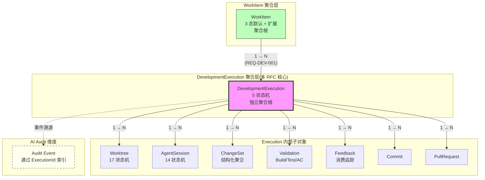

# RFC-017: Development Execution Domain

> **状态**: Proposed
> **作者**: Mavis(Star 架构师)
> **创建日期**: 2026-08-25
> **最后更新**: 2026-08-25
> **相关 ADR**: ADR-017
> **相关 Requirement**: REQ-DEV-001, REQ-DEV-002, REQ-DEV-003, REQ-AUDIT-002
> **相关 upstream**:
> - 《Basic Design》§4.8 domain-development, §10 ADR-017, §21 全章
> - 《Requirements》§21 Development Execution, §41 ID 登记
> - 《Module Spec》domain-development-spec.md
> - 《PoC Spec》poc-020-agent-session-tracking.md, poc-021-structured-feedback-agent-instruction.md, poc-022-context-compiler.md, poc-029-agent-policy-enforcement.md

---

## 摘要

本 RFC 提议将 DevelopmentExecution 设立为 Star 平台的独立聚合根,作为 WorkItem 与真实代码环境之间的抽象层。DevelopmentExecution 聚合 Worktree、AgentSession、ChangeSet、Validation、Feedback、Commit、PR 等子对象,WorkItem 与 DevelopmentExecution 之间建立 1 → N 关系(REQ-DEV-001)。这一抽象层解决了"WorkItem 直接关联所有子对象"导致的聚合根过载、事务边界模糊、跨 Execution 状态难以追溯等问题,是支撑 Vibe Coding 并行执行与 AI Audit 的核心架构决策。

## 动机

### 背景

Vibe Coding 的执行模型中,一个 WorkItem(需求项)从创建到交付可能经历多次"开发会话"(AgentSession),每次会话可能创建多个 Worktree、提交多个 ChangeSet、接收多个 Feedback、运行多次 Validation、生成多个 Commit / PR(《Basic Design》§21.1)。如果把 WorkItem 作为聚合根直接关联所有子对象,会导致聚合根过载、事务边界模糊、跨执行会话难以追溯。

### 现状

传统开发流程中,"开发任务"通常直接对应到 Git Branch + PR,不存在独立的"Execution"概念。但 Vibe Coding 引入了新的复杂性:

1. **AI 重启**:Agent Session 可能因为 Token 超限、Policy 拒绝、Crash 等原因重启(§7.4 AgentSession 14 状态),每次重启是一次新的 Execution
2. **多 Worktree 并行**:同一 WorkItem 拆分为多个 Worktree 并行执行,需要 Execution 维度协调
3. **AI Handoff**:一个 AgentSession 把 Worktree 交给另一个 AgentSession(§24.5),产生 HandoffContextPacket,需要 Execution 维度追踪
4. **跨 Validation 周期**:Worktree 状态从 AGENT_RUNNING → VALIDATING → FEEDBACK_RECEIVED → AGENT_RUNNING 循环,每次循环是 Execution 内的一个阶段
5. **AI Audit 完整性**:§REQ-AUDIT-002 要求"AI 修改了什么 / 哪个 Agent 执行的 / 哪个 Worktree / 什么时候 / 哪些验证通过 / 哪些 Feedback 被消费",需要 Execution 维度统一索引

### 解决目标

1. WorkItem 与代码执行环境之间建立清晰的中间层,聚合根职责单一
2. 1 WorkItem → N DevelopmentExecution 关系明确建模
3. 1 Execution 聚合 Worktree / AgentSession / ChangeSet / Validation / Feedback / Commit / PR 等子对象
4. Execution 内部状态机清晰,与 AgentSession 状态机解耦
5. AI Audit 通过 Execution 维度统一追溯
6. 跨 Execution 状态查询可行(同一 WorkItem 下所有 Execution 列表)
7. 事务边界清晰:Execution 是事务一致性的最小单元

## 详细设计

### 决策(Decision)

**采用方案 B**:DevelopmentExecution 作为独立聚合根,WorkItem 1 → N 关系,Execution 内部聚合 Worktree、AgentSession、ChangeSet、Validation、Feedback、Commit、PR 等子对象(《Basic Design》§4.8,§21.1)。

### 替代方案(Alternatives Considered)

#### 方案 A: WorkItem 直接关联所有子对象

- 描述:`work_items` 表直接外键关联 `worktrees`、`agent_sessions`、`change_sets`、`validations`、`feedbacks`、`commits`、`pull_requests` 等所有子对象,WorkItem 是唯一聚合根
- 优点:
  - 数据库 Schema 简单,只有一个聚合根
  - 从 WorkItem 反查所有子对象性能高
- 缺点:
  - 聚合根过载:WorkItem 包含 7+ 子对象,事务边界过长,锁竞争严重
  - 跨 Execution 状态难以表达:WorkItem 直接关联 AgentSession,无法表达"同一 WorkItem 的多次执行"
  - AI Handoff 困难:AgentSession 之间的转移无独立的 Execution 边界
  - 审计粒度不足:WorkItem 维度的审计无法区分"AI 第一次 vs 第二次执行"
  - 状态机复杂度爆炸:WorkItem 状态需要同时跟踪所有子对象的状态,组合爆炸
- 拒绝理由:聚合根过载、无法表达多 Execution、违反 DDD 单一聚合根原则

#### 方案 B: DevelopmentExecution 作为聚合根,WorkItem 1 → N(选定)

- 描述:`development_executions` 是独立聚合根,`work_items` 1 → N 关联 `development_executions`,Execution 内部聚合 Worktree、AgentSession、ChangeSet、Validation、Feedback、Commit、PR 等子对象
- 优点:
  - 事务边界清晰:Execution 是事务一致性的最小单元
  - 1 WorkItem → N Execution 关系明确(REQ-DEV-001)
  - 跨 Execution 状态查询可行(同一 WorkItem 下所有 Execution 列表)
  - AI Handoff 简化:Execution 是 Handoff 的边界单元
  - AI Audit 完整:Execution 维度统一索引
  - 状态机分层:WorkItem 状态 / Execution 状态 / AgentSession 状态三层解耦
- 缺点:
  - 数据模型复杂,多一层聚合
  - 跨 Execution 查询需要 JOIN
  - 性能开销(每次执行需创建 Execution 记录)
- **本设计选定**

#### 方案 C: 使用 Graph Database 表达复杂关系(§30.6 Non-Goals 排除)

- 描述:引入 Neo4j / ArangoDB 等 Graph Database,用 Graph 表达 WorkItem / Worktree / AgentSession / ChangeSet 之间的复杂关系
- 优点:
  - 关系查询性能极高
  - 灵活的关系表达
- 缺点:
  - 违反 §30.6 Explicit Non-Goals "Graph Database 不在 MVP/V1/V2 任何阶段实现"
  - 增加运维成本(新数据库、备份、监控)
  - 与 PostgreSQL Single Source of Truth 冲突(REQ-DATA-001)
  - 团队 Graph DB 经验不足,实施风险高
- 拒绝理由:违反 §30.6 Non-Goals 约束、与 Single Source of Truth 冲突

## 后果

### 正面后果(Positive Consequences)

1. **事务边界清晰**:Execution 是事务一致性的最小单元,Worktree / ChangeSet / Validation 在 Execution 内部事务提交
2. **1 WorkItem → N Execution 关系明确**(REQ-DEV-001):支持 WorkItem 多次执行、AI 重启、Handoff 等场景
3. **跨 Execution 状态查询可行**:同一 WorkItem 下所有 Execution 列表、Execution 间状态对比
4. **AI Handoff 简化**(§24.5):HandoffContextPacket 在 Execution 间传递,Execution 边界清晰
5. **AI Audit 完整**(REQ-AUDIT-002):"谁要求 AI 做什么 / AI 使用了什么 Context / AI 修改了什么" 通过 Execution 维度统一索引
6. **状态机分层**:WorkItem 状态(3 态默认 + 扩展) / Execution 状态(5-6 态) / AgentSession 状态(14 态)三层解耦
7. **支持多 Worktree 并行**:同一 Execution 内部可有 N Worktree(1 Execution → N Worktree),Worktree 间通过 Execution 协调

### 负面后果(Negative Consequences / Trade-offs)

1. **数据模型复杂**:多一层聚合,Schema 复杂度上升
2. **跨 Execution 查询需 JOIN**:WorkItem 反查 Worktree 需 WorkItem → Execution → Worktree(2 跳)
3. **性能开销**:每次执行需创建 Execution 记录,写放大
4. **Execution 数量爆炸风险**:AI 频繁重启(每天 10+ 次)导致 Execution 数量激增
5. **状态机同步复杂**:WorkItem / Execution / AgentSession 三层状态机需协调(但解耦也是优势)

### 风险(Risks)

| ID | 风险 | 影响 | 缓解措施 |
|---|---|---|---|
| **RISK-A17-1** | Execution 数量爆炸 | Medium | Lifecycle Policy(>90d 不活跃 → 归档);状态机压缩(连续 FAILED 状态合并);Storage 分层 |
| **RISK-A17-2** | 跨 Execution 状态不一致 | High | 最终一致策略(Reconciliation 协议);UI 区分 Current / Stale / Offline;Outbox 模式保证事件投递 |
| **RISK-A17-3** | Execution 内部事务过大 | Medium | Saga 模式拆分(Worktree 创建 / ChangeSet 提交 / Validation 触发分阶段);Outbox 事件驱动 |
| **RISK-A17-4** | 状态机分层导致复杂度上升 | Low | 状态机代码层独立(WorkItemStateMachine / ExecutionStateMachine / AgentSessionStateMachine);状态转换 API 严格校验 |
| **RISK-A17-5** | AI Audit 索引膨胀 | Medium | TraceId + ExecutionId 联合索引;冷热分层(最近 30d 热数据,30d+ 冷数据归档) |

## 实施计划

### 依赖

- 上游:ADR-016 Worktree First-class Domain Entity(Worktree 聚合根先存在)
- 上游:ADR-021 Agent Adapter Model(AgentSession 抽象)
- 上游:ADR-022 SCM Adapter Model(Commit / PR 抽象)
- 上游:ADR-027 ChangeSet Storage(ChangeSet 聚合)
- 平级:ADR-023 Structured Feedback Model(Feedback 关联)
- 平级:ADR-024 Context Compiler(Context Packet 关联)
- 下游:domain-development Module(§4.8 详细设计)
- 下游:domain-audit Module(AI Audit 索引)
- PoC 验证:poc-020 Agent Session Tracking(必做),poc-021 Structured Feedback(必做),poc-022 Context Compiler(必做),poc-029 Agent Policy Enforcement(必做)

### 阶段

1. **Phase 1(MVP)**:DevelopmentExecution 聚合根实现,5 状态机(CREATED / RUNNING / VALIDATING / COMPLETED / ABANDONED);1 WorkItem → N Execution 关系建模;Execution 内部聚合 Worktree / AgentSession / ChangeSet / Validation / Feedback / Commit / PR
2. **Phase 2(V1)**:Execution Lifecycle Policy(归档策略);跨 Execution 状态对比;HandoffContextPacket 在 Execution 间传递
3. **Phase 3(V2)**:Execution 性能分析(平均执行时长 / 重启率 / Handoff 频率);Execution Template(预定义 Execution 类型,例如"仅 Build Fix")

### 回滚策略

如果 Execution 聚合根导致严重的性能问题(>预期 2x),降级方案:

1. **Phase 1 降级**:把 Execution 内部的部分子对象(例如 Validation)从聚合根拆出,走独立事务(弱一致性)
2. **Phase 2 降级**:减少 Execution 状态机(从 5 态简化为 3 态:CREATED / RUNNING / COMPLETED)
3. **Phase 3 降级**:推迟 V2 候选功能,维持 MVP 范围

回滚触发条件:Execution 创建 P95 > 100ms,WorkItem 反查 Execution 列表 P95 > 500ms(1000 WorkItem)

## 待决问题(Open Questions)

1. **Execution 状态机粒度**:Execution 状态机应该是 5 态(简单)还是 10+ 态(精细)?MVP 倾向 5 态,但需要 Product 确认
2. **Handoff 是否创建新 Execution**:AgentSession A Handoff 给 AgentSession B 时,Execution 边界如何处理?同一 Execution 还是新 Execution?
3. **Execution 归档策略**:>90d 不活跃 Execution 是否物理删除?需要 SRE / DBA / Legal 共同决定(可能涉及 AI Audit 留存要求)
4. **跨 Execution Commit 合并**:同一 WorkItem 多个 Execution 产生的 Commit,何时合并?人工触发还是自动?
5. **Execution 权限模型**:Execution 是否独立于 WorkItem 权限?还是 WorkItem 权限自动继承?

## 评审检查清单(Code Review Checklist)

1. [ ] `development_executions` 表是否包含 `tenant_id` / `workspace_id` / `project_id` 三级隔离字段
2. [ ] `development_executions` 表是否包含 `work_item_id` 外键
3. [ ] Execution 状态机是否完整实现(5 态 MVP:CREATED / RUNNING / VALIDATING / COMPLETED / ABANDONED)
4. [ ] Execution 内部子对象(Worktree / AgentSession / ChangeSet / Validation / Feedback / Commit / PR)是否全部通过 `execution_id` 外键关联
5. [ ] 1 WorkItem → N Execution 关系是否在 API 层验证(防止 Execution 数量爆炸)
6. [ ] AI Audit 是否通过 ExecutionId 统一索引(REQ-AUDIT-002)
7. [ ] HandoffContextPacket 是否在 Execution 间传递时保留 Provenance(§24.5)
8. [ ] Execution 状态转换是否走 Outbox 模式,保证事件最终一致
9. [ ] Execution Lifecycle Policy(>90d 归档)是否实现
10. [ ] 跨 Execution 状态查询 API(WorkItem → Execution 列表)是否实现

## 替代方案 ADR 引用

- ADR-001~015(原文档,本仓库未提供)
- 本仓库内 ADR-017(本 RFC 提请)
- 相关 ADR:ADR-016(Worktree First-class),ADR-021(Agent Adapter),ADR-022(SCM Adapter),ADR-023(Structured Feedback),ADR-024(Context Compiler),ADR-027(ChangeSet Storage)

## 变更历史

| 日期 | 版本 | 变更 |
|---|---|---|
| 2026-08-25 | v0.1 | 初稿 |

## 附录 A:关键示意

**图示说明**:

- 实线箭头 = 聚合根之间的事务性关联
- 虚线箭头 = 事件溯源关系(最终一致)
- 紫色高亮 = DevelopmentExecution 独立聚合根(本 RFC 核心)
- 绿色 = WorkItem 聚合根(《Basic Design》§4.9)
- 黄色虚线 = AI Audit 维度
- 所有子对象(WT / AGS / CS / VAL / FBK / CMT / PR)通过 `execution_id` 外键关联到 DevelopmentExecution
