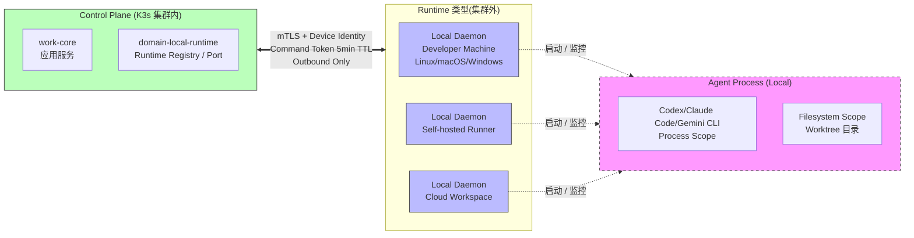

# RFC-018: Local Runtime Architecture

> **状态**: Proposed
> **作者**: Mavis(Star 架构师)
> **创建日期**: 2026-08-25
> **最后更新**: 2026-08-25
> **相关 ADR**: ADR-018
> **相关 Requirement**: REQ-LRT-001, REQ-LRT-002, REQ-LRT-003, REQ-SEC-001, REQ-SEC-003
> **相关 upstream**:
> - 《Basic Design》§4.6 domain-local-runtime, §10 ADR-018, §23 全章, §30.2 MVP Must Have
> - 《Requirements》§23 Local Runtime, §41 ID 登记 LRT-001~003
> - 《Module Spec》domain-local-runtime-spec.md
> - 《PoC Spec》poc-016-local-runtime-secure-connection.md, poc-030-cross-worktree-isolation.md

---

## 摘要

本 RFC 提议 Local Runtime 采用"独立 Local Daemon + Control Plane"架构:Local Daemon 是运行于 Developer Machine / Self-hosted Runner / Cloud Workspace 的 Rust 二进制,通过 mTLS + Device Identity 与 Control Plane 通信,执行白名单 Command 上报 Observed State。本架构**不**采用 SSH 远程执行(避免形成 Remote Shell),也**不**将 Agent Container 内嵌到 Local Daemon(避免破坏 K8s Tax 纪律),更**不**将 Local Daemon 部署到 K8s 集群(避免增加 Application Workload 计数)。本决策严格遵循 §23.1"Local Runtime 不计入 K8s Workload"与 §23.2"禁止 Remote Shell"的不变量。

## 动机

### 背景

Star 平台需要在开发者机器 / 企业 Runner / 云工作区上运行 Agent 与 Build / Test 工具(《Basic Design》§23)。这一执行环境与 Control Plane(K3s 集群中的 work-core)的通信是系统最易受攻击的边界,也是架构最复杂的部分之一。需要同时满足:

1. **安全**:不能形成 Remote Shell(§23.2),不能允许 Control Plane 任意 SSH 到 Developer Machine
2. **可扩展**:支持 Local / Self-hosted / Cloud Workspace 三种 Runtime 类型
3. **可观察**:Local Daemon 状态、Agent Process 状态、Worktree Observed State 需上报 Control Plane
4. **资源纪律**:不增加 K8s Application Workload 计数(§23.1)
5. **多平台**:支持 Linux / macOS / Windows 三种 Developer Machine OS

### 现状

传统方案在 Vibe Coding 平台中有以下候选:

- **方案 A 候选**:SSH 远程执行(Control Plane 通过 SSH 到 Developer Machine 启动 Agent / Build)
- **方案 B 候选**:Agent Container 内嵌(将 Agent Docker 容器直接部署到 K8s,与 Local Daemon 概念混淆)
- **方案 C 候选**:Web 远程 IDE(类似 GitHub Codespaces / Gitpod,完全在云端开发)

这些方案都不能满足以下需求:

1. **安全边界清晰**:SSH 是 Remote Shell 攻击面,Web IDE 需要 Full IDE 复杂度(MVP 范围外,§30.6 Non-Goals)
2. **支持本地开发**:用户主要在本地机器开发,SSH 会形成 Reverse Shell 风险
3. **不破坏 K8s 资源纪律**:Agent Container 不能算 work-core 资源,也不能算 Application Workload
4. **多平台一致性**:SSH 在 Windows 上体验差,Web IDE 强制云端

### 解决目标

1. Local Runtime 与 Control Plane 通信使用 mTLS + Device Identity 双向认证
2. 严格白名单 Command Token,Control Plane 只能执行预定义 Command,不能任意执行 Shell
3. Local Daemon 主动反向连接到 Control Plane(Outbound Only),不开放 Inbound 端口
4. 不依赖 SSH(避免 Remote Shell 风险)
5. 不部署到 K8s 集群(避免 Application Workload 计数)
6. 支持 Linux / macOS / Windows 三平台一致体验
7. Device Revocation / Remote Disable 可行(RISK-016 缓解)

## 详细设计

### 决策(Decision)

**采用方案 C**:Local Daemon 是独立 Rust 二进制,运行于 Developer Machine / Self-hosted Runner / Cloud Workspace,通过 mTLS + Device Identity 主动反向连接到 Control Plane(Outbound Only),执行白名单 Command,上报 Observed State(《Basic Design》§4.6,§23.1,§23.2)。

### 替代方案(Alternatives Considered)

#### 方案 A: SSH 远程执行(形成 Remote Shell)

- 描述:Control Plane 通过 SSH 到 Developer Machine 启动 Agent / Build / Test,采用 `ssh user@host command` 模式
- 优点:
  - 实现简单,直接复用 SSH 基础设施
  - 用户熟悉,跨平台一致(Linux / macOS / Windows)
- 缺点:
  - **形成 Remote Shell**(§23.2 明确禁止):SSH 攻击面大,Reverse Shell 风险,Key 管理复杂
  - Inbound 端口开放:Developer Machine 需要开放 SSH 端口(22),增加攻击面
  - Command 执行无白名单:任何 Command 都可以通过 SSH 执行,无法强制 Filesystem / Process Scope
  - Agent 难以 Lifecycle 管理:SSH 会话断开后 Agent 进程孤儿化
  - 违反 §23.2 硬约束
- 拒绝理由:形成 Remote Shell 违反 §23.2 硬约束、安全风险高

#### 方案 B: Agent Container 内嵌到 Local Daemon(破坏 K8s Tax 纪律)

- 描述:将 Agent 容器(如 Codex / Claude Code Container)直接嵌入到 Local Daemon,通过 K8s 部署 Local Daemon 作为 sidecar,统一管理 Agent 生命周期
- 优点:
  - 容器化隔离,与 K8s 资源管理体系一致
  - Agent 启动 / 停止 / 重启易管理
- 缺点:
  - **破坏 K8s Tax 纪律**:Local Daemon 部署到 K8s 集群,会增加 Application Workload 计数(违反 §23.1)
  - 容器嵌套(Container-in-Container)资源开销大
  - 开发者机器无法运行 K8s(Local Daemon 必须跑在 K8s,不适用于 Local 类型 Runtime)
  - 违反 §23.1"Local Runtime 不计入 K8s Workload"不变量
- 拒绝理由:破坏 K8s Tax 纪律、不支持 Local 类型 Runtime

#### 方案 C: 独立 Local Daemon + mTLS + 白名单 Command(选定)

- 描述:Local Daemon 是 Rust 独立二进制,运行于 Developer Machine / Self-hosted Runner / Cloud Workspace,通过 mTLS + Device Identity 主动反向连接到 Control Plane(Outbound Only),执行白名单 Command,上报 Observed State
- 优点:
  - **严格安全边界**:mTLS + Device Identity + Command 白名单 + Filesystem Scope + Process Scope
  - **不增加 K8s Workload**:Local Daemon 部署在 Developer Machine / Runner,不计入 K8s
  - **可支持多种 Runtime**:Local / Self-hosted / Cloud Workspace 三种 Runtime 类型统一架构
  - **Device Revocation / Remote Disable 可行**:RISK-016 缓解
  - **主动反向连接**:不开放 Inbound 端口,NAT 友好
  - **不依赖 SSH**:避免 Remote Shell 风险
  - **多平台一致**:Rust 跨平台编译,Linux / macOS / Windows 一致体验
- 缺点:
  - 实施复杂度高(mTLS / Device Identity / Command Token TTL)
  - 需要 Device Identity 管理体系(注册 / 撤销)
  - Local Daemon 升级策略需谨慎(强制最低版本,§23.5,RISK-029)
- **本设计选定**

## 后果

### 正面后果(Positive Consequences)

1. **严格安全边界**:mTLS + Device Identity + Command 白名单 + Filesystem Scope + Process Scope,多层防御
2. **不增加 K8s Workload**:Local Daemon 不部署到 K8s,严格遵循 §23.1
3. **支持多种 Runtime**:Local / Self-hosted / Cloud Workspace 统一架构,降低多 Runtime 维护成本
4. **Device Revocation / Remote Disable 可行**(RISK-016 缓解):设备丢失 / 离职可立即吊销
5. **NAT 友好**:Outbound Only,无需 Inbound 端口
6. **不形成 Remote Shell**:严格白名单 Command Token,无任意 Shell 执行
7. **可观察**:Observed State(Worktree dirty / Agent Running / Test Result)实时上报 Control Plane
8. **缓解 RISK-016 Local Runtime Compromise**:多层防御 + Revocation

### 负面后果(Negative Consequences / Trade-offs)

1. **实施复杂度高**:mTLS / Device Identity / Command Token TTL 实现成本
2. **Device Identity 管理**:注册 / 撤销 / 续期流程需配套基础设施
3. **Local Daemon 升级策略**:需强制最低版本,客户端升级困难(§23.5,RISK-029 Local Runtime Version Fragmentation)
4. **跨平台测试成本**:Linux / macOS / Windows 三平台 Filesystem / Process Scope 行为差异(§29)
5. **Token 过期处理**:Command Token TTL 5min,过期后需重新申请,增加延迟

### 风险(Risks)

| ID | 风险 | 影响 | 缓解措施 |
|---|---|---|---|
| **RISK-A18-1** | Local Runtime Compromise | Critical | mTLS + Device Identity + Command 白名单 + Filesystem Scope + Revocation + Remote Disable(§4.6.3, ADR-019) |
| **RISK-A18-2** | Local Runtime Version Fragmentation | Medium | 强制最低版本;向后兼容 API;Runtime Version 分布监控(RISK-029) |
| **RISK-A18-3** | Filesystem Scope 跨平台不一致 | High | §29 平台差异矩阵;Platform Abstraction Layer;CI 三平台测试 |
| **RISK-A18-4** | Device Identity 泄露 | High | Short-lived Token(5min TTL);mTLS Client Certificate 自动轮转;Keychain 存储 |
| **RISK-A18-5** | Local Daemon Crash | High | Daemon Supervisor(Systemd / launchd / Windows Service)自动重启;Crash Report 上报 |

## 实施计划

### 依赖

- 上游:无(Local Runtime 是基础设施层)
- 平级:ADR-019 Local Runtime Security Model(mTLS / Device Identity / 白名单)
- 平级:ADR-020 Observed State vs Business State(Observed State 上报)
- 平级:ADR-030 Agent Policy Enforcement(Policy 强制点)
- 下游:domain-local-runtime Module(§4.6 详细设计)
- 下游:Local Daemon Binary(独立 Rust crate,非 `domain-*` crate)
- PoC 验证:poc-016 Local Runtime Secure Connection(必做),poc-030 Cross-Worktree Isolation(必做)

### 阶段

1. **Phase 1(MVP)**:Local Daemon Rust 二进制实现,Linux / macOS / Windows 三平台;mTLS + Device Identity 双向认证;白名单 8 个 Command(`StartAgent` / `StopAgent` / `RunCommand` / `ApplyFeedback` / `ReportObservation` / `CreateWorktree` / `CommitChange` / `Cleanup`);Observed State 上报
2. **Phase 2(V1)**:Self-hosted Runner 类型支持;Cloud Workspace 类型支持(第 4 种 Runtime);Runtime Policy 模板
3. **Phase 3(V2)**:Advanced Runtime Isolation(Kata Containers / Firecracker);Cloud Development Runtime(GitHub Codespaces 集成)

### 回滚策略

如果 Local Runtime 架构在 MVP 阶段遇到严重问题,降级方案:

1. **Phase 1 降级**:白名单 Command 从 8 个简化为 4 个(`StartAgent` / `StopAgent` / `RunCommand` / `ReportObservation`),减少 Filesystem Scope 实施压力
2. **Phase 2 降级**:仅支持 Local 类型 Runtime,推迟 Self-hosted / Cloud Workspace
3. **Phase 3 降级**:推迟 Advanced Runtime Isolation 与 Cloud Development Runtime

回滚触发条件:Local Daemon mTLS 握手 P95 > 500ms,Command Token 申请 P95 > 200ms

## 待决问题(Open Questions)

1. **Device Identity 存储**:Device Key 存储在 Keychain(macOS) / Credential Manager(Windows) / Secret Service(Linux) 是否足够安全?需要 Security Team 评估
2. **Command Token TTL**:5min TTL 是否合适?太短增加重新申请频率,太长增加泄露风险窗口
3. **Local Daemon 自升级**:Daemon 是否支持自升级(类似 Docker Daemon)?还是需要用户手动升级?
4. **跨平台 Filesystem Scope 性能**:Linux / macOS / Windows 上 Filesystem Scope(类似 Landlock / Seatbelt / Windows Job Object)性能差异大,需要 PoC 030 验证
5. **Cloud Workspace 集成优先级**:第 4 种 Runtime 何时实现?V1 还是 V2?

## 评审检查清单(Code Review Checklist)

1. [ ] Local Daemon 是否通过 mTLS 双向认证连接到 Control Plane
2. [ ] Device Identity 是否唯一,支持 Revocation
3. [ ] Command Token 是否有 TTL(5min),过期后是否需要重新申请
4. [ ] 白名单 Command 列表是否明确(8 个:`StartAgent` / `StopAgent` / `RunCommand` / `ApplyFeedback` / `ReportObservation` / `CreateWorktree` / `CommitChange` / `Cleanup`)
5. [ ] Filesystem Scope 是否在 Linux(Landlock) / macOS(Seatbelt) / Windows(Job Object) 三平台分别实现
6. [ ] Process Scope 是否限制 Agent Process 只能访问授权 Worktree 目录
7. [ ] Remote Disable 是否可行:Control Plane 发送 Revoke Command 后,Local Daemon 立即停止接受新 Command
8. [ ] Observed State 上报是否走 Throttle(每 1s 批量上报,避免网络风暴)
9. [ ] Local Daemon 升级策略:是否强制最低版本,向后兼容
10. [ ] Crash Report 是否自动上报到 Control Plane,便于运维监控

## 替代方案 ADR 引用

- ADR-001~015(原文档,本仓库未提供)
- 本仓库内 ADR-018(本 RFC 提请)
- 相关 ADR:ADR-019(Local Runtime Security Model),ADR-020(Observed State),ADR-030(Agent Policy Enforcement)

## 变更历史

| 日期 | 版本 | 变更 |
|---|---|---|
| 2026-08-25 | v0.1 | 初稿 |

## 附录 A:关键示意

**图示说明**:

- 双线箭头 = mTLS + Device Identity 双向认证
- 虚线箭头 = Local Daemon 启动 / 监控 Agent Process
- 蓝色 = Runtime 类型(集群外,不计入 K8s Workload)
- 绿色 = Control Plane(K3s 集群内)
- 紫色虚线 = Agent Process Scope(每个 Worktree 独立)
- **关键不变量**:Local Daemon **不**部署到 K3s 集群,严格遵循 §23.1
