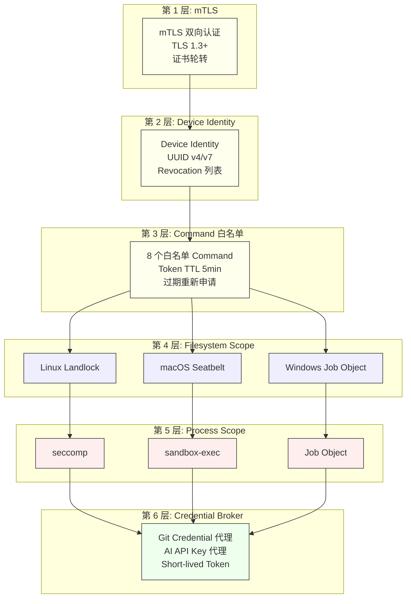

# RFC-019: Local Runtime Security Model

> **状态**: Proposed
> **作者**: Mavis(Star 架构师)
> **创建日期**: 2026-08-25
> **最后更新**: 2026-08-25
> **相关 ADR**: ADR-019
> **相关 Requirement**: REQ-LRT-004, REQ-LRT-005, REQ-SEC-001, REQ-SEC-002, REQ-SEC-003
> **相关 upstream**:
> - 《Basic Design》§4.6.3 Security 项, §10 ADR-019, §23.2 16 项强制项, §34 Security Threat Model
> - 《Requirements》§16 Security & Tenant Isolation, §23 Local Runtime
> - 《Security Design》security-design.md 第 4 章 Local Runtime
> - 《Module Spec》domain-local-runtime-spec.md
> - 《PoC Spec》poc-016-local-runtime-secure-connection.md, poc-030-cross-worktree-isolation.md

---

## 摘要

本 RFC 提议 Local Runtime Security Model 采用"mTLS + Device Identity + Command 白名单 + Filesystem Scope + Process Scope + Credential Broker"的多层防御体系,严格执行 §23.2 列出的 16 项强制项。本模型不仅是技术架构,也是抵御 RISK-016 Local Runtime Compromise 的关键防线,通过 Device Revocation / Remote Disable 能力在设备丢失或被攻陷时立即切断威胁。本决策是 Star 平台零信任安全模型的核心组件,与 §34 Security Threat Model 共同构成完整的安全防御体系。

## 动机

### 背景

Local Runtime 是系统最易受攻击的边界(《Basic Design》§34),因为:

1. **暴露在不可信网络**:Developer Machine 可能连接公共 WiFi,Self-hosted Runner 可能部署在企业 DMZ
2. **持有高权限**:Local Daemon 可启动 Agent、读写 Worktree 目录、访问 Git Credential
3. **可被物理访问**:开发者机器可能被他人短暂使用,Self-hosted Runner 可能被运维误操作
4. **跨平台差异**:Linux / macOS / Windows 安全原语不一致(Landlock / Seatbelt / Job Object 行为差异)
5. **升级困难**:Local Daemon 升级需要用户主动操作(§23.5,RISK-029),旧版本可能存在已知漏洞

### 现状

传统方案在 Vibe Coding 平台中通常采用以下简化模型:

- **方案 A 候选**:仅 mTLS 双向认证,无 Device Identity、无 Filesystem Scope
- **方案 B 候选**:多层防御(mTLS + Device Identity + Command 白名单 + Filesystem Scope + Process Scope + Credential Broker)
- **方案 C 候选**:不实施 Filesystem Scope,只靠 Application 层 Authorization 强制

这些方案都不能满足以下需求:

1. **设备级身份管理**:仅 mTLS 不能区分"哪台设备"在通信,无法实现 Revocation
2. **Filesystem Scope 强制**:Application 层 Authorization 容易被绕过,必须在 OS 层强制(Landlock / Seatbelt / Job Object)
3. **Process Scope 限制**:Agent Process 可能尝试访问 Worktree 外的文件,需要 OS 层 Process 隔离
4. **Credential 安全**:Git Credential / AI Provider API Key 不能直接给 Agent,必须通过 Credential Broker 代理

### 解决目标

1. mTLS 双向认证 + Device Identity 唯一标识
2. Command Token TTL 5min,过期后需重新申请
3. Command 白名单,Control Plane 只能执行预定义 8 个 Command
4. Filesystem Scope:Agent Process 只能访问授权 Worktree 目录
5. Process Scope:Agent Process 不能 fork 到 Worktree 外的进程
6. Credential Broker:Git Credential / AI API Key 通过 Broker 代理,Agent 不直接持有
7. Device Revocation / Remote Disable 立即生效
8. Filesystem / Process Scope 在 Linux / macOS / Windows 三平台一致体验

## 详细设计

### 决策(Decision)

**采用方案 B**:多层防御 mTLS + Device Identity + Command 白名单 + Filesystem Scope + Process Scope + Credential Broker(《Basic Design》§4.6.3,§23.2,§34)。

### 替代方案(Alternatives Considered)

#### 方案 A: 仅 mTLS 双向认证

- 描述:Local Daemon 与 Control Plane 仅通过 mTLS 认证,无 Device Identity,无 Filesystem Scope,无 Process Scope
- 优点:
  - 实施简单,mTLS 双向认证是成熟方案
  - 无需复杂 Filesystem / Process Scope 实现
- 缺点:
  - **无设备级身份**:mTLS Certificate 不能区分"哪台设备",无法 Revocation
  - **无 Filesystem Scope**:Agent 可访问 Worktree 外文件,即使 Application 层阻止,Agent 仍可绕过(例如直接读 `~/.ssh/`)
  - **无 Process Scope**:Agent 可 fork 到任意进程,执行任意命令
  - **无 Credential Broker**:Agent 持有 Git Credential / AI API Key,泄露后攻击者直接获得权限
  - 违反 §23.2 16 项强制项
- 拒绝理由:无 Filesystem / Process Scope,违反 §23.2 16 项强制项

#### 方案 B: 多层防御 mTLS + Device Identity + Command 白名单 + Filesystem Scope + Process Scope + Credential Broker(选定)

- 描述:六层防御体系,严格执行 §23.2 16 项强制项
- 优点:
  - **多层防御**:即使一层被突破,其他层仍能阻止攻击
  - **Device Identity 唯一**:每台 Device 唯一身份,支持 Revocation
  - **Filesystem Scope OS 层强制**:Linux(Landlock) / macOS(Seatbelt) / Windows(Job Object)
  - **Process Scope OS 层强制**:Agent 进程不能 fork 到 Worktree 外
  - **Credential Broker 代理**:Git Credential / AI API Key 不直接给 Agent
  - **Command 白名单 + TTL**:Command Token 5min TTL,过期后重新申请
  - **Remote Disable**:RISK-016 缓解
- 缺点:
  - 实施复杂度极高(6 层防御,每层都需独立实现)
  - 跨平台 Filesystem / Process Scope 实现差异大(§29)
  - PoC 验证复杂,需要专门的安全测试
  - 性能开销(Landlock / Seatbelt 系统调用)
- **本设计选定**

#### 方案 C: 不实施 Filesystem Scope(降级)

- 描述:仅 mTLS + Device Identity + Command 白名单,Filesystem Scope 由 Application 层 Authorization 强制
- 优点:
  - 实施复杂度低于方案 B
  - 跨平台一致性较好(Application 层不依赖 OS 原语)
- 缺点:
  - **Application 层 Authorization 可被绕过**:Agent 可直接读 `~/.ssh/id_rsa` 等敏感文件,绕过 Application 层检查
  - **违反 §23.2 强制项**:Filesystem Scope 是 §23.2 列出的强制项之一
  - **安全风险高**:Agent 越权访问风险
- 拒绝理由:违反 §23.2 强制项、Application 层 Authorization 可被绕过

## 后果

### 正面后果(Positive Consequences)

1. **多层防御**:6 层防御(mTLS / Device Identity / Command 白名单 / Filesystem Scope / Process Scope / Credential Broker),每层独立
2. **Device Revocation / Remote Disable 可行**:RISK-016 缓解,设备丢失 / 离职可立即吊销
3. **Filesystem Scope OS 层强制**:Agent 无法绕过(除非 OS 本身被攻陷)
4. **Process Scope 限制**:Agent 不能 fork 到 Worktree 外进程
5. **Credential Broker 代理**:Agent 不直接持有 Git Credential / AI API Key,缓解 RISK-018 Agent Secret Leakage
6. **Command Token TTL**:5min 过期窗口,泄露后攻击窗口短
7. **跨平台一致**:虽然 Landlock / Seatbelt / Job Object 实现差异大,但通过 Platform Abstraction Layer 统一 API
8. **可审计**:所有 Command / File Access / Process Fork 都记录到 Audit Log

### 负面后果(Negative Consequences / Trade-offs)

1. **实施复杂度极高**:6 层防御,每层独立实现,跨平台测试成本高
2. **Filesystem Scope 跨平台行为差异**:Linux(Landlock) / macOS(Seatbelt) / Windows(Job Object)配置语法、限制粒度差异大(§29)
3. **性能开销**:Landlock / Seatbelt 系统调用增加延迟(PoC 030 需测量)
4. **Command Token 过期处理**:5min TTL 过期后需重新申请,增加延迟
5. **升级策略复杂**:强制最低版本,旧版本 Daemon 需升级或 Revoke
6. **PoC 验证复杂**:6 层防御需专门安全测试,验证 16 项强制项

### 风险(Risks)

| ID | 风险 | 影响 | 缓解措施 |
|---|---|---|---|
| **RISK-A19-1** | Local Runtime Compromise | Critical | 多层防御;Device Revocation;Remote Disable(§4.6.3) |
| **RISK-A19-2** | Filesystem Scope 跨平台不一致 | High | §29 平台差异矩阵;Platform Abstraction Layer;CI 三平台测试 |
| **RISK-A19-3** | Command Token 泄露 | High | Short-lived TTL(5min);Token Rotation;mTLS Client Certificate 自动轮转 |
| **RISK-A19-4** | Device Identity 泄露 | Critical | Keychain / Credential Manager 存储;mTLS 双向认证;Revocation 即时生效 |
| **RISK-A19-5** | Filesystem Scope 性能开销 | Medium | 静态规则预编译;PoC 030 性能基准;按需启用 |
| **RISK-A19-6** | Filesystem Scope 误配置 | High | 配置文件 dry-run 模式;变更审计;PoC 016 / 030 验证 |

## 实施计划

### 依赖

- 上游:ADR-018 Local Runtime Architecture(Local Daemon 与 Control Plane 通信基础)
- 上游:ADR-030 Agent Policy Enforcement(Policy 强制点)
- 下游:domain-local-runtime Module Security 子模块
- 下游:Local Daemon Binary Security 子模块
- PoC 验证:poc-016 Local Runtime Secure Connection(必做,16 项强制项验证),poc-030 Cross-Worktree Isolation(必做)

### 阶段

1. **Phase 1(MVP)**:mTLS + Device Identity 实现;Command Token TTL 5min;8 个 Command 白名单(`StartAgent` / `StopAgent` / `RunCommand` / `ApplyFeedback` / `ReportObservation` / `CreateWorktree` / `CommitChange` / `Cleanup`);Filesystem Scope(Linux Landlock / macOS Seatbelt / Windows Job Object);Process Scope(seccomp / sandbox-exec / Job Object);Credential Broker
2. **Phase 2(V1)**:Self-hosted Runner / Cloud Workspace 适配;Runtime Policy 模板;Filesystem Scope 性能优化
3. **Phase 3(V2)**:Advanced Runtime Isolation(Kata Containers / Firecracker);Hardware Security Module(HSM)集成

### 回滚策略

如果 Local Runtime Security Model 在 MVP 阶段遇到严重问题,降级方案:

1. **Phase 1 降级**:Filesystem Scope 简化为"只读限制"(允许读所有目录,只限制写);Process Scope 推迟到 V1
2. **Phase 2 降级**:仅支持 Linux 平台(Landlock),推迟 macOS / Windows
3. **Phase 3 降级**:推迟 Advanced Runtime Isolation

回滚触发条件:Filesystem Scope 性能开销 > 10%,Command Token 申请 P95 > 200ms

## 待决问题(Open Questions)

1. **Filesystem Scope 性能开销**:Landlock / Seatbelt / Job Object 系统调用开销需 PoC 030 测量
2. **跨平台 Filesystem Scope 配置语法**:Platform Abstraction Layer 抽象层 API 设计需统一
3. **Command Token 轮转策略**:5min TTL 过期后是否需要重新 mTLS 握手?还是仅 Token 刷新?
4. **Device Identity 存储介质**:Keychain / Credential Manager / TPM 哪个更安全?需要 Security Team 评估
5. **Credential Broker 缓存策略**:Git Credential 缓存时间?(避免每次 Git 操作都调用 Broker)
6. **Remote Disable 触发条件**:何时触发 Remote Disable?用户主动 / 异常行为检测 / Token 泄露?

## 评审检查清单(Code Review Checklist)

1. [ ] mTLS 双向认证是否强制启用(TLS 1.3+)
2. [ ] Device Identity 是否唯一(UUID v4 / v7),是否支持 Revocation
3. [ ] Command Token 是否有 TTL(5min),过期后是否立即失效
4. [ ] Command 白名单是否严格(8 个:`StartAgent` / `StopAgent` / `RunCommand` / `ApplyFeedback` / `ReportObservation` / `CreateWorktree` / `CommitChange` / `Cleanup`)
5. [ ] Filesystem Scope 是否在 Linux(Landlock) / macOS(Seatbelt) / Windows(Job Object) 三平台分别实现
6. [ ] Process Scope 是否限制 Agent Process 不能 fork 到 Worktree 外(seccomp / sandbox-exec / Job Object)
7. [ ] Credential Broker 是否代理 Git Credential / AI API Key,Agent 不直接持有
8. [ ] Remote Disable 是否触发后立即停止接受新 Command
9. [ ] Audit Log 是否记录所有 Command / File Access / Process Fork
10. [ ] §23.2 16 项强制项是否全部实现并通过 PoC 016 验证

## 替代方案 ADR 引用

- ADR-001~015(原文档,本仓库未提供)
- 本仓库内 ADR-019(本 RFC 提请)
- 相关 ADR:ADR-018(Local Runtime Architecture),ADR-030(Agent Policy Enforcement)

## 变更历史

| 日期 | 版本 | 变更 |
|---|---|---|
| 2026-08-25 | v0.1 | 初稿 |

## 附录 A:关键示意

**图示说明**:

- 6 层防御体系,从外到内:网络层 → 设备层 → 命令层 → 文件系统层 → 进程层 → 凭据层
- 紫色 = Filesystem Scope(三平台分别实现)
- 红色 = Process Scope(三平台分别实现)
- 绿色 = Credential Broker(代理敏感凭据)
- 黄色 = 基础安全层(mTLS / Device Identity / Command 白名单)
- **关键不变量**:每层独立,即使一层被突破,其他层仍能阻止攻击
