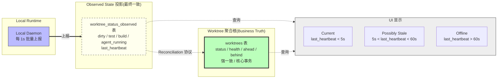

# RFC-020: Observed State vs Business State

> **状态**: Proposed
> **作者**: Mavis(Star 架构师)
> **创建日期**: 2026-08-25
> **最后更新**: 2026-08-25
> **相关 ADR**: ADR-020
> **相关 Requirement**: REQ-DATA-003, REQ-WF-002, REQ-RT-001, REQ-RT-003
> **相关 upstream**:
> - 《Basic Design》§4.1.5 关键不变量 5, §10 ADR-020, §22.1 dirty_state / test_state, §23.3 Observed State, §5.8 Lifecycle Policy
> - 《Requirements》§14 Data Model, §15 Realtime, §41 ID 登记
> - 《Data Design》data-design.md 第 3 章 Projection 表
> - 《Module Spec》domain-worktree-spec.md, domain-agent-spec.md
> - 《PoC Spec》poc-017-worktree-state-sync.md, poc-018-offline-reconnect.md

---

## 摘要

本 RFC 提议将 Observed State(高频本地状态,如 Worktree dirty / test_state / agent_running)与 Business State(业务核心状态,如 WorkItem.status / Worktree.status)严格分离,前者走独立 Projection 表(最终一致),后者走核心事务(强一致)。这一分离有效控制 Write Amplification / Event Volume / Database Growth / Observability Cardinality,支撑 UI 区分 Current / Stale / Offline / Unknown 状态,缓解 RISK-022 Stale Worktree State。本决策是 Vibe Coding 平台在高频本地状态与业务状态之间找到清晰边界的关键架构选择。

## 动机

### 背景

Vibe Coding 平台中,Worktree 状态是高频变化的(《Basic Design》§22.1):

- `dirty_state`:Agent 每次文件修改都变化(可能每秒 10+ 次)
- `test_state`:每次 Test Run 更新(分钟级)
- `agent_running`:Agent 启动 / 停止 / 重启时变化(分钟级)
- `build_state`:每次 Build 更新(分钟级)

如果这些高频本地状态与 WorkItem.status(核心业务状态)混存在同一张表,会导致:

1. **Write Amplification**:Worktree 表每秒 10+ 次 UPDATE,影响整体数据库性能
2. **Event Volume**:每个 Observed State 变更都触发 Domain Event,事件流暴增
3. **Database Growth**:Observed State 历史记录占大量存储
4. **Observability Cardinality**:Metrics / Logs 维度爆炸,Prometheus / Loki 存储压力

### 现状

传统方案在 Vibe Coding 平台中通常采用以下简化模型:

- **方案 A 候选**:单一 Status JSON 字段(Worktree 全部状态存 JSONB)
- **方案 B 候选**:Business Truth 入核心事务,Observed State 入独立 Projection 表
- **方案 C 候选**:全部走 Event Sourcing(§30.6 Non-Goals 排除)

这些方案都不能满足以下需求:

1. **控制 Write Amplification**:JSONB 字段每次 UPDATE 都修改整行,写放大严重
2. **支撑 UI Current / Stale / Offline 区分**:Event Sourcing 历史回放成本高
3. **业务状态强一致**:WorkItem.status 变更必须强一致(影响 Workflow / Notification)
4. **生命周期管理**:Observed State 需要独立 Lifecycle Policy(>7d 归档)

### 解决目标

1. Business State(Worktree.status / WorkItem.status)入核心事务,强一致
2. Observed State(dirty / test / build / agent_running)入独立 Projection 表,最终一致
3. Write Amplification / Event Volume / Database Growth 全部受控
4. UI 区分 Current / Possibly Stale / Offline / Unknown(§23.4)
5. Local Runtime Reconnect 后触发 Reconciliation(§22.6)
6. Observed State 走独立 Lifecycle Policy(>7d 归档,§5.8)

## 详细设计

### 决策(Decision)

**采用方案 B**:Business Truth 入核心事务,Observed State 入独立 Projection 表(《Basic Design》§4.1.5,§23.3,REQ-DATA-003)。

### 替代方案(Alternatives Considered)

#### 方案 A: 单一 Status JSON 字段

- 描述:Worktree 全部状态(dirty / test / build / agent_running / status / health)存 JSONB 字段
- 优点:
  - Schema 简单,无需多表
  - 写路径短,所有状态一次 UPDATE
- 缺点:
  - **Write Amplification 严重**:JSONB 字段每次 UPDATE 都修改整行(包括 status 等不变字段)
  - **无法精细化索引**:JSONB 内部字段索引复杂
  - **UI 查询复杂**:需要 JSONB 反序列化才能区分 Current / Stale / Offline
  - **Lifecycle 管理困难**:JSONB 字段无法独立归档
  - 违反 REQ-DATA-003 约束
- 拒绝理由:Write Amplification 严重,违反 REQ-DATA-003

#### 方案 B: Business Truth 入核心事务,Observed State 入独立 Projection 表(选定)

- 描述:`worktrees` 表只存 Business State(status / health / ahead / behind),`worktree_status_observed` 表存 Observed State(dirty / test / build / agent_running / last_heartbeat)
- 优点:
  - **Write Amplification 受控**:Observed State 走独立表,高频写不影响 Business State
  - **Event Volume 受控**:Observed State 变更可走 Throttle(每 1s 批量),减少事件流
  - **Database Growth 受控**:Observed State 独立 Lifecycle Policy(>7d 归档)
  - **UI Current / Stale / Offline 可区分**:通过 `last_heartbeat` 时间戳判断
  - **Reconciliation 可行**:Local Runtime Reconnect 后触发 Observed State vs Business State 对比
- 缺点:
  - 多表 Schema,JOIN 查询略多
  - 最终一致 vs 强一致混合,架构复杂度上升
- **本设计选定**

#### 方案 C: 全部走 Event Sourcing(§30.6 Non-Goals 排除)

- 描述:所有状态变更走 Event Sourcing,通过 Event Store + Projection 重建状态
- 优点:
  - 完整审计,所有状态变更可追溯
  - 灵活的 Projection 重建
- 缺点:
  - 违反 §30.6 Explicit Non-Goals "Full Event Sourcing / Complex CQRS 不在 MVP/V1/V2 任何阶段实现"
  - 实施复杂度极高
  - 性能开销(Event 回放延迟)
  - 与 PostgreSQL Single Source of Truth 冲突
- 拒绝理由:违反 §30.6 Non-Goals 约束

## 后果

### 正面后果(Positive Consequences)

1. **Write Amplification 受控**(REQ-DATA-003):Observed State 走独立表,Business State 写频率不受高频本地状态影响
2. **Event Volume 受控**:Observed State 变更可走 Throttle(每 1s 批量),减少事件流 10x+
3. **Database Growth 受控**:Observed State 走独立 Lifecycle Policy(>7d 归档,§5.8)
4. **UI Current / Stale / Offline / Unknown 区分可行**(§23.4):通过 `last_heartbeat` 时间戳 + TTL 判断
5. **Reconciliation 协议清晰**(§22.6):Local Runtime Reconnect 后触发 Observed ↔ Business 对比
6. **缓解 RISK-022 Stale Worktree State**:UI 明确区分 Stale,避免基于过期数据决策
7. **索引优化**:Business State 主键 / 外键索引,Observed State 时间序列索引,各取所长
8. **Metrics 维度清晰**:Business State vs Observed State Metrics 分离,Observability 平台压力下降

### 负面后果(Negative Consequences / Trade-offs)

1. **多表 Schema**:Worktree 状态查询需 JOIN `worktrees` + `worktree_status_observed`
2. **最终一致窗口**:Observed State 上报到 Projection 表有延迟(通常 1s),UI 需明确标注
3. **架构复杂度上升**:Business Truth(强一致)+ Observed State(最终一致)混合
4. **Reconciliation 协议实施成本**:Local Runtime Reconnect 时需对比 Desired vs Observed,报告偏差
5. **Lifecycle Policy 双轨制**:Business State(长期保留)vs Observed State(>7d 归档)需两套策略

### 风险(Risks)

| ID | 风险 | 影响 | 缓解措施 |
|---|---|---|---|
| **RISK-A20-1** | Observed State 上报延迟 | Medium | Throttle(1s 批量)+ Reconciliation 兜底;UI 标注"Possibly Stale" |
| **RISK-A20-2** | Projection 表数据膨胀 | Medium | Lifecycle Policy(>7d 归档,§5.8);TimescaleDB Hypertables 时序压缩 |
| **RISK-A20-3** | Reconciliation 偏差不静默合并 | High | 偏差 = 不可恢复事件,强制 re-sync 或人工介入(§22.6);Audit 记录 |
| **RISK-A20-4** | UI 显示与 Business State 不一致 | Medium | UI 明确标注 Current / Possibly Stale / Offline / Unknown;Stale 数据需用户确认 |
| **RISK-A20-5** | Observed State 跨表 JOIN 性能 | Low | `worktree_id` + `last_heartbeat` 复合索引;缓存 Worktree 完整状态 |

## 实施计划

### 依赖

- 上游:无(Business / Observed State 分离是基础架构决策)
- 平级:ADR-016 Worktree First-class(Worktree 聚合根)
- 平级:ADR-018 Local Runtime Architecture(本地状态上报)
- 下游:domain-worktree Module Projection 子模块
- 下游:domain-agent Module Observed State 子模块
- PoC 验证:poc-017 Worktree State Sync(必做),poc-018 Offline / Reconnect(必做)

### 阶段

1. **Phase 1(MVP)**:`worktree_status_observed` Projection 表实现;Local Runtime 每 1s 批量上报;UI 区分 Current / Stale / Offline / Unknown;Reconciliation 协议(§22.6);Lifecycle Policy(>7d 归档)
2. **Phase 2(V1)**:TimescaleDB Hypertables 时序压缩;Reconciliation 报告增强;Observed State 实时订阅(WebSocket)
3. **Phase 3(V2)**:AI 异常检测(Observed State Pattern Recognition);Predictive Reconciliation

### 回滚策略

如果 Observed State 分离在 MVP 阶段遇到严重问题,降级方案:

1. **Phase 1 降级**:Observed State 仍走 `worktrees` 表 JSONB 字段,但 Throttle 严格(每 5s 批量),缓解 Write Amplification
2. **Phase 2 降级**:Reconciliation 协议简化,仅做"是否在线"判断
3. **Phase 3 降级**:推迟 Lifecycle Policy,Observed State 永久保留

回滚触发条件:`worktree_status_observed` 表日增长 > 1GB / Worktree,UI 查询 P95 > 500ms

## 待决问题(Open Questions)

1. **Observed State 上报频率**:每 1s 批量是否合适?高频 Worktree(AI 活跃)可能需要更短延迟
2. **Lifecycle Policy 周期**:>7d 归档是否合适?需要 SRE / DBA 评估存储成本
3. **Reconciliation 偏差阈值**:何种偏差触发"不可恢复事件"?需要 Product / SRE 共同定义
4. **TimescaleDB 引入时机**:MVP 阶段是否引入 TimescaleDB Hypertables?或推迟到 V1?
5. **Observed State 跨 Project 共享**:Observed State 是否受 tenant_id 隔离?(应该受,但需明确)

## 评审检查清单(Code Review Checklist)

1. [ ] `worktrees` 表是否只存 Business State(status / health / ahead / behind),不存 dirty / test / build / agent_running
2. [ ] `worktree_status_observed` Projection 表是否独立存在,含 `worktree_id` / `dirty_state` / `test_state` / `build_state` / `agent_running` / `last_heartbeat`
3. [ ] Local Runtime 是否每 1s 批量上报 Observed State(Throttle 避免网络风暴)
4. [ ] UI 是否明确区分 Current / Possibly Stale / Offline / Unknown(通过 `last_heartbeat` TTL)
5. [ ] Reconciliation 协议是否在 Local Runtime Reconnect 时强制触发,不静默合并
6. [ ] Observed State Lifecycle Policy(>7d 归档)是否实现
7. [ ] Write Amplification 是否被监控:Worktree 主表 UPDATE QPS < 1/s(业务状态变更频率)
8. [ ] Event Volume 是否被监控:Observed State 事件 QPS < 10/s(节流后)
9. [ ] Observed State 是否受 tenant_id / workspace_id / project_id 三级隔离
10. [ ] Stale Worktree UI 提示是否触发基于过期数据决策的警告

## 替代方案 ADR 引用

- ADR-001~015(原文档,本仓库未提供)
- 本仓库内 ADR-020(本 RFC 提请)
- 相关 ADR:ADR-016(Worktree First-class),ADR-018(Local Runtime Architecture),ADR-022(Observed State 投影)

## 变更历史

| 日期 | 版本 | 变更 |
|---|---|---|
| 2026-08-25 | v0.1 | 初稿 |

## 附录 A:关键示意

**图示说明**:

- 实线箭头 = Local Runtime 上报路径(高频)
- 虚线箭头 = UI 查询路径 / Reconciliation 协议
- 双线箭头 = 上报(可能批量 Throttle)
- 绿色 = Business Truth(强一致,核心事务)
- 黄色虚线 = Observed State Projection(最终一致,独立表)
- 蓝色 = Local Runtime(集群外)
- 灰色 = UI 渲染层
- **关键不变量**:Observed State 变更**不**触发 Business State 写入,反之亦然
