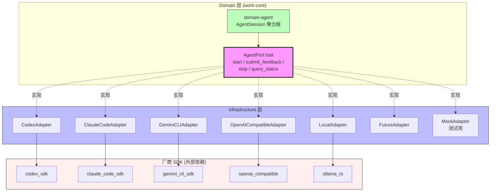

# RFC-021: Agent Adapter Model

> **状态**: Proposed
> **作者**: Mavis(Star 架构师)
> **创建日期**: 2026-08-25
> **最后更新**: 2026-08-25
> **相关 ADR**: ADR-021
> **相关 Requirement**: REQ-PERM-002, REQ-DEV-002, REQ-DEV-003, REQ-SEC-002, REQ-SEC-003
> **相关 upstream**:
> - 《Basic Design》§4.2.4 Agent Adapter 模型, §10 ADR-021, §24.2 Agent Adapter, §28.4 Agent Secret Boundary
> - 《Requirements》§24 Agent Session, §28 AI Extension
> - 《AI Agent Design》ai-agent-design.md 第 2 章 Agent Port
> - 《Module Spec》domain-agent-spec.md
> - 《PoC Spec》poc-028-agent-adapter.md, poc-029-agent-policy-enforcement.md

---

## 摘要

本 RFC 提议 Star 平台采用"Agent Port 抽象 + Adapter 实现"的 Agent Adapter Model,统一 Codex / Claude Code / Gemini CLI / OpenAI Compatible / Local / Future Agent 等多种 Agent 厂商。Domain 层通过 `AgentPort` trait 抽象所有 Agent 操作,由 infrastructure 层的 Adapter 实现具体的厂商 SDK 集成。本决策避免 Domain 层绑定单一 Agent 厂商,实现 AgentPolicy 跨厂商统一,缓解 RISK-030 Agent Vendor Lock-in。

## 动机

### 背景

Vibe Coding 平台的 Agent 厂商生态多样化且持续演化(《Basic Design》§24.2):

- **当前**:Codex(OpenAI) / Claude Code(Anthropic) / Gemini CLI(Google)
- **OpenAI Compatible**:任何兼容 OpenAI API 协议的厂商
- **Local**:本地 LLM(Ollama / LM Studio / vLLM)
- **Future**:未来可能出现的新厂商

如果 Domain 层直接绑定某一厂商 SDK,会导致:

1. **Vendor Lock-in**:切换 Agent 厂商需要修改 Domain 层代码,迁移成本极高
2. **AgentPolicy 分散**:每个 Agent 厂商的 Policy 强制点不同,无法统一
3. **测试困难**:Domain 层测试需要 mock 厂商 SDK
4. **演进困难**:新 Agent 厂商需要修改 Domain 层,违反 OCP(Open-Closed Principle)

### 现状

传统方案在 Vibe Coding 平台中通常采用以下简化模型:

- **方案 A 候选**:直接调用厂商 SDK(Domain 层引入 `codex_sdk` / `claude_code_sdk` 等依赖)
- **方案 B 候选**:Agent Port 抽象 + Adapter 实现(本设计选定)
- **方案 C 候选**:等待行业标准(被动接受现状)

这些方案都不能满足以下需求:

1. **厂商可插拔**:支持未来新 Agent 厂商无需修改 Domain 层
2. **AgentPolicy 跨厂商统一**:所有 Adapter 走相同的 Policy 强制点(§4.2.5)
3. **Domain 层纯净**:禁止厂商类型(`CodexTool` / `ClaudeCodeEvent`)出现在 Domain 层
4. **测试友好**:Domain 层可通过 Mock Adapter 测试,无需真实厂商 SDK

### 解决目标

1. Domain 层通过 `AgentPort` trait 抽象所有 Agent 操作
2. infrastructure 层实现具体 Adapter(CodexAdapter / ClaudeCodeAdapter / GeminiCLIAdapter / OpenAICompatibleAdapter / LocalAdapter / FutureAdapter)
3. AgentPolicy 跨厂商统一(Repository / Worktree / Path / Tool / Network / Secret / Runtime / Context / Change Scope / Review / Test / Approval 12 个强制点)
4. Domain 层零厂商依赖
5. 新 Agent 厂商通过新增 Adapter 即可集成,Domain 层零修改
6. Mock Adapter 支持 Domain 层单元测试

## 详细设计

### 决策(Decision)

**采用方案 B**:Agent Port 抽象 + Adapter 实现,Domain 层定义 `AgentPort` trait,infrastructure 层实现具体 Adapter(《Basic Design》§4.2.4,§24.2)。

### 替代方案(Alternatives Considered)

#### 方案 A: 直接调用厂商 SDK

- 描述:Domain 层直接 import `codex_sdk` / `claude_code_sdk` / `gemini_cli_sdk` 等,各厂商类型(`CodexTool` / `ClaudeCodeEvent`)出现在 Domain 层
- 优点:
  - 实施简单,直接调用 SDK
  - 无需额外抽象层
- 缺点:
  - **Vendor Lock-in**:Domain 层绑定厂商 SDK,切换厂商需修改 Domain 层
  - **AgentPolicy 分散**:不同厂商的 Policy 强制点不同,无法统一
  - **Domain 层污染**:厂商类型(`CodexTool` / `ClaudeCodeEvent`)污染 Domain 模型
  - **测试困难**:Domain 层测试需要 mock 厂商 SDK
  - **违反 §0.3 命名约定**:Domain 层应为纯 Rust crate,不依赖外部 SDK
- 拒绝理由:Vendor Lock-in、Domain 层污染、AgentPolicy 分散

#### 方案 B: Agent Port 抽象 + Adapter 实现(选定)

- 描述:Domain 层定义 `AgentPort` trait,所有 Agent 操作通过 trait 调用;infrastructure 层实现具体 Adapter,每个 Adapter 负责一个厂商 SDK 集成
- 优点:
  - **厂商可插拔**:新厂商通过新增 Adapter 即可集成,Domain 层零修改
  - **AgentPolicy 跨厂商统一**:所有 Adapter 走相同的 12 个强制点(§4.2.5)
  - **Domain 层纯净**:禁止厂商类型出现在 Domain 层
  - **测试友好**:Mock Adapter 支持 Domain 层单元测试
  - **演进灵活**:未来 Agent 厂商协议变化,只需修改对应 Adapter
- 缺点:
  - 抽象成本:Port trait 设计需考虑所有厂商的共性 API
  - Adapter 实现成本:每个厂商 SDK 集成需独立 Adapter
  - 协议差异补偿:不同厂商能力差异需在 ACL(Anti-Corruption Layer)中补偿
- **本设计选定**

#### 方案 C: 等待行业标准(被动)

- 描述:暂不实现抽象,等待行业出现统一的 Agent 协议标准(类似 LSP / MCP)后再抽象
- 优点:
  - 避免过早抽象
  - 等待成熟标准
- 缺点:
  - **被动接受现状**:无法控制标准制定时间表
  - **Vendor Lock-in 风险**:在标准出现前已深度绑定某厂商
  - **竞争力下降**:行业标准可能由竞争对手主导
- 拒绝理由:被动、Vendor Lock-in 风险

## 后果

### 正面后果(Positive Consequences)

1. **厂商可插拔**:MVP 至少 1 厂商(Codex 或 Claude Code),V1 扩展到 3+ 厂商,新厂商零 Domain 改动
2. **AgentPolicy 跨厂商统一**:12 个强制点(Repository / Worktree / Path / Tool / Network / Secret / Runtime / Context / Change Scope / Review / Test / Approval)对所有 Adapter 生效
3. **Domain 层纯净**:禁止 `CodexTool` / `ClaudeCodeEvent` 等厂商类型出现在 Domain 层
4. **测试友好**:Mock Adapter 支持 Domain 层单元测试,无需真实厂商 SDK
5. **演进灵活**:未来 Agent 厂商协议变化(MCP / Agent Protocol)只需修改对应 Adapter
6. **缓解 RISK-030 Agent Vendor Lock-in**:抽象层是反 Vendor Lock-in 的关键
7. **跨 Agent Handoff 可行**:HandoffContextPacket 跨厂商传递(§24.5)
8. **Multi-Agent Comparison 可行**(V2):同 WorkItem 多 Agent 并行,统一 Port 抽象便于对比

### 负面后果(Negative Consequences / Trade-offs)

1. **抽象成本**:Port trait 设计需考虑所有厂商共性 API,可能过度抽象或抽象不足
2. **Adapter 实现成本**:每个厂商 SDK 集成需独立 Adapter,工作量增加
3. **协议差异补偿**:不同厂商能力差异需在 ACL 中补偿(例如某些 Agent 不支持 Tool Calling)
4. **§46 决策表 J.5 提示 V1 复审**:抽象层在 V1 中期需评估是否过度设计
5. **性能开销**:抽象层调用 vs 直接 SDK 调用的性能差异(通常可忽略,但需关注)

### 风险(Risks)

| ID | 风险 | 影响 | 缓解措施 |
|---|---|---|---|
| **RISK-A21-1** | Agent Vendor Lock-in | Medium | Agent Port 抽象(本 RFC);AgentPolicy 跨厂商统一(§4.2.5);监控 Agent Vendor 数量 |
| **RISK-A21-2** | Port 抽象过度设计 | Medium | §46 决策表 J.5 V1 中期复审;Domain 层 Port 最小化(仅必要方法);YAGNI 原则 |
| **RISK-A21-3** | 厂商 SDK 协议变化 | High | Adapter 隔离 SDK 变化;版本锁定 + 升级测试;Adapter 抽象接口稳定 |
| **RISK-A21-4** | 协议差异补偿复杂 | Medium | ACL(Anti-Corruption Layer)模式;Adapter 内部处理差异,Domain 层无感知 |
| **RISK-A21-5** | Mock Adapter 测试覆盖不足 | Low | Contract Testing(Port 行为契约);CI 强制 Adapter 单元测试覆盖率 > 80% |

## 实施计划

### 依赖

- 上游:无(Agent Port 是基础设施层抽象)
- 平级:ADR-030 Agent Policy Enforcement(Policy 强制点)
- 平级:ADR-026 Agent Session Persistence(AgentSession 持久化)
- 平级:ADR-024 Context Compiler(Context Packet 编译)
- 下游:domain-agent Module(§4.2 详细设计)
- 下游:infrastructure-agent Module(Adapter 实现)
- PoC 验证:poc-028 Agent Adapter(必做,至少 1 厂商),poc-029 Agent Policy Enforcement(必做)

### 阶段

1. **Phase 1(MVP)**:`AgentPort` trait 定义;`CodexAdapter` 或 `ClaudeCodeAdapter` 实现(至少 1 厂商);Mock Adapter;AgentPolicy 12 个强制点全部生效
2. **Phase 2(V1)**:扩展到 3+ 厂商(Codex / Claude Code / Gemini CLI);OpenAI Compatible Adapter;Local Adapter(Ollama / LM Studio);Agent Handoff 跨厂商支持
3. **Phase 3(V2)**:Multi-Agent Comparison;Agent Performance Analytics;MCP(Model Context Protocol)集成

### 回滚策略

如果 Agent Port 抽象在 MVP 阶段遇到严重问题,降级方案:

1. **Phase 1 降级**:Port 简化为最小 4 个方法(start / submit_feedback / stop / query_status),推迟 Handoff 等高级方法
2. **Phase 2 降级**:仅支持 1 厂商(Codex),推迟其他厂商
3. **Phase 3 降级**:推迟 Multi-Agent Comparison

回滚触发条件:Agent Port 抽象导致 P95 延迟增加 > 20%,或 Adapter 实现成本超预算 2x

## 待决问题(Open Questions)

1. **Port trait 最小化**:MVP Port 应包含哪些方法?start / submit_feedback / stop / query_status 4 个够吗?
2. **AgentSession 与 Port 关系**:AgentSession 是 Port 的方法参数,还是 Port 返回的对象?
3. **Mock Adapter 测试覆盖**:Contract Testing 如何定义 Port 行为契约?
4. **厂商协议变化应对**:当 Codex SDK 升级破坏 API 时,如何快速修复 Adapter?
5. **OpenAI Compatible 优先级**:何时实现 OpenAI Compatible Adapter?MVP 还是 V1?

## 评审检查清单(Code Review Checklist)

1. [ ] `AgentPort` trait 是否仅在 Domain 层定义,infrastructure 层不修改
2. [ ] Domain 层是否完全无厂商类型(`CodexTool` / `ClaudeCodeEvent`)
3. [ ] infrastructure 层是否至少 1 个 Adapter(Codex 或 Claude Code)实现
4. [ ] Mock Adapter 是否实现,支持 Domain 层单元测试
5. [ ] AgentPolicy 12 个强制点(Repository / Worktree / Path / Tool / Network / Secret / Runtime / Context / Change Scope / Review / Test / Approval)是否全部生效
6. [ ] Adapter 内部是否处理厂商协议差异(ACL 模式)
7. [ ] Port 行为契约是否有 Contract Testing 覆盖
8. [ ] 新 Agent 厂商集成是否只需新增 Adapter,Domain 层零修改
9. [ ] Agent HandoffContextPacket 是否跨厂商 Port 传递(§24.5)
10. [ ] Vendor Lock-in 监控指标是否设置(Agent Vendor 数量 / Adapter 复用率)

## 替代方案 ADR 引用

- ADR-001~015(原文档,本仓库未提供)
- 本仓库内 ADR-021(本 RFC 提请)
- 相关 ADR:ADR-030(Agent Policy Enforcement),ADR-026(Agent Session Persistence),ADR-024(Context Compiler)

## 变更历史

| 日期 | 版本 | 变更 |
|---|---|---|
| 2026-08-25 | v0.1 | 初稿 |

## 附录 A:关键示意

**图示说明**:

- 实线箭头 = Domain 层内部调用关系
- 虚线箭头 = Adapter 实现 Port trait(implements)
- 紫色 = AgentPort trait(本 RFC 核心抽象)
- 绿色 = Domain 层纯净(无厂商依赖)
- 蓝色 = infrastructure 层(Adapter 实现)
- 红色 = 外部厂商 SDK(隔离在 Adapter 内部)
- **关键不变量**:Domain 层零外部 SDK 依赖,新厂商仅需新增 Adapter
