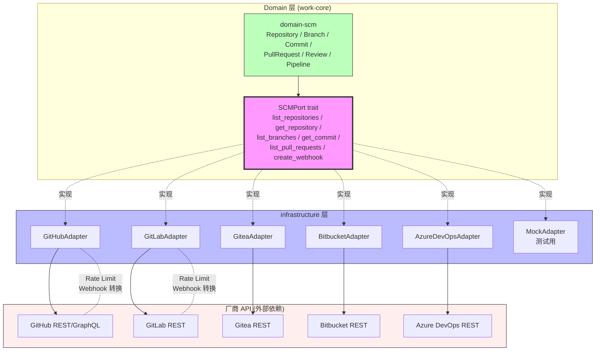

# RFC-022: SCM Adapter Model

> **状态**: Proposed
> **作者**: Mavis(Star 架构师)
> **创建日期**: 2026-08-25
> **最后更新**: 2026-08-25
> **相关 ADR**: ADR-022
> **相关 Requirement**: REQ-SCM-001, REQ-SCM-002
> **相关 upstream**:
> - 《Basic Design》§4.7 domain-scm, §10 ADR-022, §19.1 SCM Adapter, §18.1 SCM Sync Loop 防护
> - 《Requirements》§19 SCM / GitHub / GitLab, §18 Integration
> - 《Integration Design》integration-design.md 第 2 章 SCM Adapter
> - 《Module Spec》domain-scm-spec.md
> - 《PoC Spec》poc-026-github-adapter.md, poc-027-gitlab-adapter.md

---

## 摘要

本 RFC 提议 Star 平台采用"SCM Port 抽象 + 多 Adapter 实现"的 SCM Adapter Model,统一 GitHub / GitLab(当前主导),预留 Gitea / Bitbucket / Azure DevOps / Self-hosted Git(未来扩展)。Domain 层通过 `SCMPort` trait 抽象所有 SCM 操作,由 infrastructure 层的 Adapter 实现具体的厂商 SDK 集成。Domain 层仅出现 `Repository / Branch / Commit / PullRequest / Review / Pipeline` 业务对象,严禁出现 `GitHubPullRequestObject` / `GitLabMergeRequestEntity` 等厂商类型。本决策避免 Domain 层绑定单一 SCM 厂商,缓解 RISK-027 SCM Sync Loop。

## 动机

### 背景

Vibe Coding 平台的 SCM(Software Configuration Management)生态多样化(《Basic Design》§19.1):

- **当前主导**:GitHub / GitLab(占企业市场 80%+)
- **未来扩展**:Gitea / Bitbucket / Azure DevOps / Self-hosted Git(企业自托管)
- **协议差异**:GitHub 使用 REST + GraphQL,GitLab 使用 REST,其他厂商协议各异

如果 Domain 层直接绑定某一 SCM 厂商 SDK,会导致:

1. **Vendor Lock-in**:切换 SCM 厂商需要修改 Domain 层代码,迁移成本极高
2. **PR/MR 命名混乱**:GitHub 叫 PullRequest,GitLab 叫 MergeRequest,Domain 层难以统一
3. **Webhook 协议差异**:不同厂商的 Webhook 格式不同,需要 Adapter 隔离
4. **Rate Limit 差异**:GitHub 5000/h,GitLab 600/h,需要各自限流策略

### 现状

传统方案在 Vibe Coding 平台中通常采用以下简化模型:

- **方案 A 候选**:各自独立集成(GitHub 集成和 GitLab 集成在 Domain 层分别实现)
- **方案 B 候选**:SCM Port 抽象 + 多 Adapter 实现(本设计选定)

这些方案都不能满足以下需求:

1. **多 SCM 厂商可插拔**:MVP 至少支持 GitHub + GitLab,未来扩展无需修改 Domain 层
2. **业务逻辑统一**:Repository / Branch / Commit / PullRequest / Review / Pipeline 业务模型统一
3. **Domain 层零厂商对象**:禁止 `GitHubPullRequestObject` 等厂商类型
4. **Rate Limit 统一兜底**:不同厂商 Rate Limit 差异在 Adapter 中处理

### 解决目标

1. Domain 层通过 `SCMPort` trait 抽象所有 SCM 操作
2. infrastructure 层实现具体 Adapter(GitHubAdapter / GitLabAdapter / GiteaAdapter / BitbucketAdapter / AzureDevOpsAdapter / SelfHostedAdapter)
3. Domain 层业务对象统一:`Repository / Branch / Commit / PullRequest / Review / Pipeline`
4. 不同 SCM 厂商能力差异在 ACL 中补偿
5. SCM Sync Loop 防护(Idempotency Key / Sync Token 校验)
6. Rate Limit 兜底策略

## 详细设计

### 决策(Decision)

**采用方案 B**:SCM Port 抽象 + 多 Adapter 实现,Domain 层定义 `SCMPort` trait 与业务对象,infrastructure 层实现具体 Adapter(《Basic Design》§4.7,§19.1)。

### 替代方案(Alternatives Considered)

#### 方案 A: 各自独立集成

- 描述:GitHub 集成和 GitLab 集成在 Domain 层分别实现,`github_pull_requests` / `gitlab_merge_requests` 两套表并存
- 优点:
  - 实施简单,直接调用厂商 SDK
  - 无需抽象层
- 缺点:
  - **Vendor Lock-in**:Domain 层绑定厂商,切换厂商需修改 Domain 层
  - **PR/MR 命名混乱**:Domain 层被迫处理 GitHub PR vs GitLab MR 差异
  - **Webhook 协议差异**:不同厂商 Webhook 格式不同,Domain 层需处理
  - **业务模型分裂**:Repository / Branch / Commit 概念无法跨厂商统一
  - **测试困难**:Domain 层测试需 mock 多个厂商 SDK
- 拒绝理由:Vendor Lock-in、业务模型分裂、Domain 层污染

#### 方案 B: SCM Port 抽象 + 多 Adapter 实现(选定)

- 描述:Domain 层定义 `SCMPort` trait + 业务对象(`Repository / Branch / Commit / PullRequest / Review / Pipeline`),infrastructure 层实现具体 Adapter
- 优点:
  - **多 SCM 厂商可插拔**:新厂商通过新增 Adapter 即可集成,Domain 层零修改
  - **业务模型统一**:Repository / Branch / Commit / PullRequest / Review / Pipeline 跨厂商统一
  - **Domain 层零厂商对象**:禁止 `GitHubPullRequestObject` / `GitLabMergeRequestEntity`
  - **Rate Limit 兜底**:不同厂商 Rate Limit 在 Adapter 中处理,Domain 层无感知
  - **测试友好**:Mock Adapter 支持 Domain 层单元测试
- 缺点:
  - 抽象成本:Port trait 设计需考虑所有厂商的共性 API
  - 厂商能力差异补偿:不同 SCM 能力差异(GitLab MR vs GitHub PR)在 ACL 中处理
  - **PR / MR 命名统一成本**:业务模型需选一个名字(PullRequest),在 UI 层做翻译
- **本设计选定**

## 后果

### 正面后果(Positive Consequences)

1. **多 SCM 厂商可插拔**:MVP 支持 GitHub + GitLab,未来扩展 Gitea / Bitbucket / Azure DevOps / Self-hosted Git 仅需新增 Adapter
2. **业务模型统一**:Repository / Branch / Commit / PullRequest / Review / Pipeline 跨厂商统一,业务逻辑可复用
3. **Domain 层零厂商对象**:禁止 `GitHubPullRequestObject` / `GitLabMergeRequestEntity`,符合 §0.3 命名约定
4. **Rate Limit 统一兜底**:不同厂商 Rate Limit 在 Adapter 中处理,Domain 层无感知
5. **测试友好**:Mock Adapter 支持 Domain 层单元测试
6. **缓解 RISK-027 SCM Sync Loop**:Idempotency Key + Sync Token 校验在 Adapter 层实现
7. **Webhook 协议隔离**:不同厂商 Webhook 格式在 Adapter 中转换为统一 Domain Event

### 负面后果(Negative Consequences / Trade-offs)

1. **抽象成本**:Port trait 设计需考虑所有厂商的共性 API
2. **PR / MR 命名统一成本**:业务模型选 `PullRequest`,UI 层做翻译("MR" → "PullRequest")
3. **厂商能力差异补偿**:GitLab MR 有 Pipeline 概念,GitHub 有 Check Run + Status,需在 ACL 中适配
4. **Adapter 实现成本**:每个厂商 SDK 集成需独立 Adapter
5. **Webhook 处理差异**:GitHub Webhook X-GitHub-Event vs GitLab Webhook X-Gitlab-Event 需分别处理

### 风险(Risks)

| ID | 风险 | 影响 | 缓解措施 |
|---|---|---|---|
| **RISK-A22-1** | SCM Sync Loop | High | Bidirectional Sync 评估 Loop 防护(§18.1);Idempotency Key;Sync Token 校验 |
| **RISK-A22-2** | Rate Limit 触发 | Medium | Adapter 内置 Rate Limit 兜底;Exponential Backoff;Token Bucket |
| **RISK-A22-3** | Webhook 协议变化 | High | Adapter 隔离 Webhook 格式;版本锁定;升级测试 |
| **RISK-A22-4** | 厂商能力差异 | Medium | ACL(Anti-Corruption Layer)模式;Adapter 内部处理差异 |
| **RISK-A22-5** | 测试覆盖不足 | Low | Contract Testing(Port 行为契约);CI 强制 Adapter 单元测试覆盖率 > 80% |

## 实施计划

### 依赖

- 上游:无(SCM Port 是基础设施层抽象)
- 平级:ADR-017 Development Execution Domain(Commit / PR 关联到 Execution)
- 下游:domain-scm Module(§4.7 详细设计)
- 下游:infrastructure-scm Module(Adapter 实现)
- PoC 验证:poc-026 GitHub Adapter(必做),poc-027 GitLab Adapter(必做)

### 阶段

1. **Phase 1(MVP)**:`SCMPort` trait 定义;`GitHubAdapter` + `GitLabAdapter` 实现;Mock Adapter;Repository / Branch / Commit / PullRequest / Review / Pipeline 业务模型统一;Rate Limit 兜底;Webhook 转换
2. **Phase 2(V1)**:扩展 GiteaAdapter / BitbucketAdapter / AzureDevOpsAdapter;PR Review Feedback Import(解析 Review Comment);Advanced Rate Limit 策略
3. **Phase 3(V2)**:Self-hosted Git 适配;SCM Performance Analytics;Cross-SCM 迁移工具

### 回滚策略

如果 SCM Port 抽象在 MVP 阶段遇到严重问题,降级方案:

1. **Phase 1 降级**:Port 简化为最小 6 个方法(list_repositories / get_repository / list_branches / get_commit / list_pull_requests / create_webhook),推迟其他方法
2. **Phase 2 降级**:仅支持 GitHub,推迟 GitLab
3. **Phase 3 降级**:推迟其他 SCM 厂商扩展

回滚触发条件:SCM Port 抽象导致 P95 延迟增加 > 20%,或 Adapter 实现成本超预算 2x

## 待决问题(Open Questions)

1. **PR / MR 命名统一**:业务模型用 `PullRequest`,UI 显示"Pull Request (MR)"还是分别显示?
2. **Rate Limit 兜底策略**:触发 Rate Limit 时,是否阻塞用户操作,还是异步重试?
3. **Webhook 重试策略**:Webhook 接收失败时,Star 平台是否主动轮询 SCM 拉取?
4. **SCM Sync Loop 检测**:何种状态算"Loop"?需 SRE / Architect 共同定义
5. **Self-hosted Git 支持**:何时支持 Self-hosted Git?V1 还是 V2?

## 评审检查清单(Code Review Checklist)

1. [ ] `SCMPort` trait 是否仅在 Domain 层定义,infrastructure 层不修改
2. [ ] Domain 层是否完全无厂商对象(`GitHubPullRequestObject` / `GitLabMergeRequestEntity`)
3. [ ] infrastructure 层是否至少 2 个 Adapter(GitHub + GitLab)实现
4. [ ] Mock Adapter 是否实现,支持 Domain 层单元测试
5. [ ] 业务模型是否统一:`Repository / Branch / Commit / PullRequest / Review / Pipeline`
6. [ ] Rate Limit 兜底策略是否在 Adapter 中实现(Exponential Backoff / Token Bucket)
7. [ ] Webhook 协议转换是否在 Adapter 中实现(X-GitHub-Event vs X-Gitlab-Event)
8. [ ] SCM Sync Loop 防护是否实现(Idempotency Key / Sync Token 校验)
9. [ ] PR Review Comment 是否解析为 Structured Feedback(§25,REQ-COLLAB-004)
10. [ ] 新 SCM 厂商集成是否只需新增 Adapter,Domain 层零修改

## 替代方案 ADR 引用

- ADR-001~015(原文档,本仓库未提供)
- 本仓库内 ADR-022(本 RFC 提请)
- 相关 ADR:ADR-017(Development Execution),ADR-027(ChangeSet Storage)

## 变更历史

| 日期 | 版本 | 变更 |
|---|---|---|
| 2026-08-25 | v0.1 | 初稿 |

## 附录 A:关键示意

**图示说明**:

- 实线箭头 = Domain 层内部调用关系
- 虚线箭头 = Adapter 实现 Port trait / Adapter 与厂商 API 交互
- 紫色 = SCMPort trait(本 RFC 核心抽象)
- 绿色 = Domain 层纯净(无厂商对象)
- 蓝色 = infrastructure 层(Adapter 实现)
- 红色 = 外部厂商 API(隔离在 Adapter 内部)
- **关键不变量**:Domain 层零外部 API 依赖,新厂商仅需新增 Adapter
