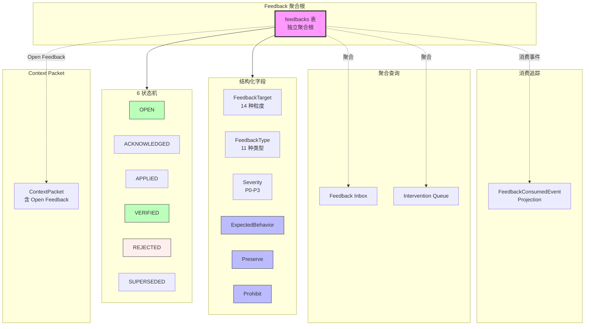

# RFC-023: Structured Feedback Model

> **状态**: Proposed
> **作者**: Mavis(Star 架构师)
> **创建日期**: 2026-08-25
> **最后更新**: 2026-08-25
> **相关 ADR**: ADR-023
> **相关 Requirement**: REQ-FBK-001, REQ-FBK-002, REQ-COLLAB-004
> **相关 upstream**:
> - 《Basic Design》§4.3 domain-feedback, §10 ADR-023, §25 全章
> - 《Requirements》§25 Feedback, §10 Collaboration
> - 《AI Agent Design》ai-agent-design.md 第 3 章 Feedback Compiler
> - 《Module Spec》domain-feedback-spec.md
> - 《PoC Spec》poc-021-structured-feedback-agent-instruction.md

---

## 摘要

本 RFC 提议将 Feedback 提升为 Star 平台的独立聚合根(而非 Comment 字段扩展),承载结构化人类修正指令,含 `Expected / Preserve / Prohibit` 三个核心字段,支持全粒度 Target 绑定(WorkItem → Diff Hunk)。Feedback 状态机含 6 个状态(OPEN / ACKNOWLEDGED / APPLIED / VERIFIED / REJECTED / SUPERSEDED),Feedback Inbox 与 Intervention Queue 支撑用户高效管理。本决策是 §25 精准反馈(§25.2 Precise Feedback)的基础,通过结构化字段降低 Agent 误读风险,缓解 RISK-026 Feedback Misinterpretation。

## 动机

### 背景

Vibe Coding 平台中,用户对 AI 输出的修正指令(Feedback)是高频操作(《Basic Design》§25.1)。传统 Coding Agent 的 Feedback 模式存在严重问题:

- **信息密度低**:"这里不对,重新做"无法指导 Agent 重新实现
- **目标模糊**:不明确指出修改哪个文件 / 哪行代码 / 哪个 Symbol
- **缺少约束**:不明确"必须保留什么" / "禁止修改什么"
- **消费追踪缺失**:Agent 不知道哪些 Feedback 已被消费,容易重复

### 现状

传统方案在 Vibe Coding 平台中通常采用以下简化模型:

- **方案 A 候选**:Comment 字段扩展(在 `work_item_comments` 表加 `feedback_type` 字段)
- **方案 B 候选**:独立 Feedback 聚合根,Target/Type/Expected/Preserve/Prohibit 结构化字段(本设计选定)

这些方案都不能满足以下需求:

1. **精准目标绑定**:Feedback 必须能定位到 WorkItem / Diff Hunk / Symbol / Acceptance Criterion 等任意粒度
2. **结构化字段**:Expected(预期行为)/ Preserve(必须保留)/ Prohibit(禁止修改)三个核心字段
3. **消费追踪**:Agent 拉取 Feedback 后,系统记录已消费,避免重复
4. **状态机**:Feedback 从 OPEN 到 VERIFIED 的完整生命周期
5. **Inbox / Intervention Queue**:用户高效管理多个 Feedback

### 解决目标

1. Feedback 作为独立聚合根,非 Comment 扩展
2. `FeedbackTarget` 枚举支持 14 种目标粒度(WorkItem / Requirement / AC / Worktree / AgentSession / File / Symbol / DiffHunk / Test / Build / RuntimeLog / ArchitectureDecision / PullRequest / ReviewFinding)
3. `FeedbackType` 枚举 11 种类型(Fix / Preserve / Refactor / Reject / Question / Constraint / Architecture / Security / Performance / Testing / Scope)
4. `Severity` 四级(P0-P3)
5. 结构化字段:`ExpectedBehavior / Preserve / Prohibit`
6. 6 状态机:OPEN / ACKNOWLEDGED / APPLIED / VERIFIED / REJECTED / SUPERSEDED
7. Feedback Inbox / Intervention Queue 聚合查询

## 详细设计

### 决策(Decision)

**采用方案 B**:Feedback 作为独立聚合根,Target/Type/Expected/Preserve/Prohibit 结构化字段,6 状态机(《Basic Design》§4.3,§25)。

### 替代方案(Alternatives Considered)

#### 方案 A: Comment 字段扩展

- 描述:在 `work_item_comments` 表加 `feedback_type` / `expected_behavior` / `preserve` / `prohibit` 字段,Feedback 是 Comment 的扩展
- 优点:
  - 实施简单,在 Comment 表上扩展字段
  - 无需新建表
- 缺点:
  - **目标粒度不足**:Comment 默认绑定 WorkItem,无法表达 Symbol / DiffHunk 等细粒度目标
  - **消费追踪缺失**:Comment 不跟踪 Agent 消费状态
  - **状态机复杂化**:Comment 状态 + Feedback 状态混淆
  - **聚合查询困难**:Feedback Inbox / Intervention Queue 在 Comment 上查询性能差
  - **违反 §4.3.1 "Feedback 是一级领域对象,禁止降级为 Comment"**
- 拒绝理由:目标粒度不足、聚合查询困难、违反一级领域对象定位

#### 方案 B: 独立 Feedback 聚合根,结构化字段(选定)

- 描述:`feedbacks` 表是独立聚合根,含 `FeedbackTarget` 枚举(14 种)/ `FeedbackType` 枚举(11 种)/ Severity(P0-P3)/ Expected/ Preserve/ Prohibit 字段,6 状态机
- 优点:
  - **目标粒度完整**:14 种 `FeedbackTarget` 枚举,覆盖 WorkItem → DiffHunk 任意粒度
  - **结构化字段**:Expected / Preserve / Prohibit 三个核心字段,信息密度高
  - **消费追踪**:`FeedbackConsumedEvent` Projection 记录 Agent 消费情况
  - **状态机清晰**:6 状态机(OPEN / ACKNOWLEDGED / APPLIED / VERIFIED / REJECTED / SUPERSEDED)
  - **聚合查询友好**:Feedback Inbox / Intervention Queue 直接基于聚合根
  - **UI 复杂但功能强**:Feedback 详情页可展示所有结构化字段
- 缺点:
  - UI 复杂度上升:Feedback 输入表单需支持结构化字段(不是简单文本框)
  - 状态机管理:6 状态机需严格转换规则
  - 全粒度 Target 绑定实现成本:Symbol / DiffHunk 等需要 Symbol Index 支撑
- **本设计选定**

## 后果

### 正面后果(Positive Consequences)

1. **高密度 Agent Instruction**:结构化字段(Expected / Preserve / Prohibit)提供精准指令,降低 Agent 误读风险
2. **全粒度 Target 绑定**(§25.1):14 种 `FeedbackTarget` 覆盖 WorkItem → DiffHunk,Symbol-level 反馈在 V1 完整支持
3. **Feedback Inbox / Intervention Queue 可行**:聚合查询直接基于 Feedback 聚合根
4. **消费追踪完整**:`FeedbackConsumedEvent` Projection 记录 Agent 消费
5. **状态机清晰**:6 状态机(OPEN / ACKNOWLEDGED / APPLIED / VERIFIED / REJECTED / SUPERSEDED)严格转换
6. **跨 Agent Handoff 友好**:HandoffContextPacket 包含 Open Feedback 列表(§24.5)
7. **PR Review Feedback Import**:PR Review Comment 可解析为 Structured Feedback(§25,V1)
8. **缓解 RISK-026 Feedback Misinterpretation**:结构化字段 + 状态机 + 消费追踪降低误读

### 负面后果(Negative Consequences / Trade-offs)

1. **UI 复杂度上升**:Feedback 输入表单需支持结构化字段,不是简单文本框
2. **全粒度 Target 实现成本**:Symbol / DiffHunk 等需要 Symbol Index 支撑(POC-025,V1)
3. **状态机管理**:6 状态机需严格转换规则,UI 需明确展示
4. **Consumed Event 投影**:`FeedbackConsumedEvent` Projection 表增长快
5. **Inbox 性能**:Feedback Inbox 聚合查询需精心设计索引

### 风险(Risks)

| ID | 风险 | 影响 | 缓解措施 |
|---|---|---|---|
| **RISK-A23-1** | Feedback Misinterpretation | Medium | 结构化字段(Expected/Preserve/Prohibit);状态机;Reopen Rate 监控(§28.1) |
| **RISK-A23-2** | UI 复杂度上升 | Medium | UI 渐进式披露(基础字段 → 高级字段);Feedback 模板 |
| **RISK-A23-3** | Symbol-level 反馈推迟 | Low | MVP 仅支持 File-level,V1 渐进到 Symbol-level(§30.3, POC-025) |
| **RISK-A23-4** | Consumed Event 投影膨胀 | Low | Lifecycle Policy(>30d 归档);聚合压缩 |
| **RISK-A23-5** | Inbox 性能 | Low | 索引优化(`target_type` + `target_id` + `status` 复合索引);分页 |

## 实施计划

### 依赖

- 上游:无(Feedback 是独立聚合根)
- 平级:ADR-024 Context Compiler(Feedback 编译为 Agent Instruction)
- 平级:ADR-025 Context Packet Persistence(Feedback 在 Context Packet 中)
- 下游:domain-feedback Module(§4.3 详细设计)
- PoC 验证:poc-021 Structured Feedback → Agent Instruction(必做)

### 阶段

1. **Phase 1(MVP)**:`feedbacks` 聚合根实现;14 种 `FeedbackTarget` 枚举(其中 Symbol / DiffHunk 部分支持);11 种 `FeedbackType`;6 状态机;结构化字段(Expected / Preserve / Prohibit);Feedback Inbox / Intervention Queue
2. **Phase 2(V1)**:全粒度 Symbol-level Feedback(POC-025 依赖 Symbol Index);PR Review Feedback Import(解析 Review Comment);AI Feedback 自动生成(AI 自己的修正建议)
3. **Phase 3(V2)**:Feedback 性能分析;Feedback 模板库;Multi-Agent Feedback 协调

### 回滚策略

如果 Structured Feedback Model 在 MVP 阶段遇到严重问题,降级方案:

1. **Phase 1 降级**:`FeedbackTarget` 简化为 5 种(WorkItem / Worktree / AgentSession / File / PR),其他目标推迟
2. **Phase 2 降级**:结构化字段简化为单 `Intent` 文本字段,推迟 Expected / Preserve / Prohibit
3. **Phase 3 降级**:推迟全粒度 Symbol-level Feedback

回滚触发条件:Feedback 状态机转换冲突率 > 5%,Feedback Inbox P95 > 500ms

## 待决问题(Open Questions)

1. **Feedback 输入 UI**:结构化字段(Expected / Preserve / Prohibit)是同时显示还是渐进式披露?
2. **AI 自生成 Feedback**:AI 自己的修正建议是否走相同 Feedback 聚合根?还是独立实体?
3. **Feedback 状态机转换权限**:谁可以 VERIFIED / REJECTED?用户 / Agent / 系统?
4. **Consumed Event 投影周期**:>30d 归档是否合适?需要 SRE 评估存储成本
5. **PR Review Comment 解析**:解析失败的 Review Comment 怎么办?(Fallback 为普通 Comment)

## 评审检查清单(Code Review Checklist)

1. [ ] `feedbacks` 表是否独立存在,非 `work_item_comments` 表扩展
2. [ ] `FeedbackTarget` 枚举是否覆盖 14 种目标粒度
3. [ ] `FeedbackType` 枚举是否覆盖 11 种类型
4. [ ] `Severity` 字段是否包含 P0-P3 四级
5. [ ] 结构化字段 `ExpectedBehavior` / `Preserve` / `Prohibit` 是否完整
6. [ ] 6 状态机(OPEN / ACKNOWLEDGED / APPLIED / VERIFIED / REJECTED / SUPERSEDED)是否严格转换
7. [ ] `FeedbackConsumedEvent` Projection 是否记录 Agent 消费
8. [ ] Feedback Inbox / Intervention Queue 聚合查询是否实现
9. [ ] PR Review Comment 解析为 Structured Feedback(§25,V1)是否预留扩展点
10. [ ] HandoffContextPacket 是否包含 Open Feedback 列表(§24.5)

## 替代方案 ADR 引用

- ADR-001~015(原文档,本仓库未提供)
- 本仓库内 ADR-023(本 RFC 提请)
- 相关 ADR:ADR-024(Context Compiler),ADR-025(Context Packet Persistence)

## 变更历史

| 日期 | 版本 | 变更 |
|---|---|---|
| 2026-08-25 | v0.1 | 初稿 |

## 附录 A:关键示意

**图示说明**:

- 实线箭头 = Feedback 聚合根的字段组成
- 虚线箭头 = 事件溯源 / 聚合关系
- 紫色 = Feedback 聚合根(本 RFC 核心)
- 蓝色 = 结构化字段(Expected / Preserve / Prohibit)
- 绿色 = 成功终态(VERIFIED)
- 红色 = 失败终态(REJECTED)
- **关键不变量**:Feedback 是一级领域对象,禁止降级为 Comment
