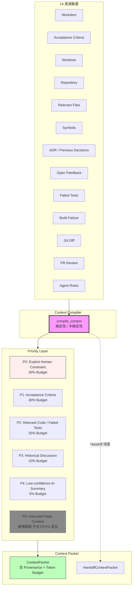

# RFC-024: Context Compiler

> **状态**: Proposed
> **作者**: Mavis(Star 架构师)
> **创建日期**: 2026-08-25
> **最后更新**: 2026-08-25
> **相关 ADR**: ADR-024
> **相关 Requirement**: REQ-CTX-001, REQ-CTX-002, REQ-CTX-003
> **相关 upstream**:
> - 《Basic Design》§4.4 domain-context, §10 ADR-024, §26.1 Context Compiler, §26.2 Token Budget
> - 《Requirements》§26 Context Compiler
> - 《AI Agent Design》ai-agent-design.md 第 2 章 compile_context
> - 《Module Spec》domain-context-spec.md
> - 《PoC Spec》poc-022-context-compiler.md, poc-023-context-packet-size-relevance.md

---

## 摘要

本 RFC 提议 Star 平台构建 Context Compiler 子系统,作为确定性 / 半确定性的 Context 组装系统(非 LLM),从 WorkItem / Acceptance / Worktree / Repository / Relevant Files / Symbols / ADR / Previous Decisions / Open Feedback / Failed Tests / Build Failure / Git Diff / PR Review / Agent Rules 等 14 类源数据中,按照 P0-P4 优先级 + Token Budget 约束 + Provenance 追踪,编译出 Minimum Sufficient Context Packet。本决策避免 Context Pollution / Repeated Prompt,实现 Decision 独立管理,是 Vibe Coding 平台 Context Engineering 的核心(§26)。

## 动机

### 背景

Vibe Coding 平台的 Agent 性能高度依赖 Context 质量(《Basic Design》§26.1)。如果 Context 不足,Agent 不知道项目约定 / 历史决策 / 当前进度,会重复犯错;如果 Context 过多,会触发 Token 超限,丢失关键信息,或产生幻觉。

传统方案在 Vibe Coding 平台中通常采用以下简化模型:

- **方案 A 候选**:简单 Prompt Template(把所有信息塞进 Prompt)
- **方案 B 候选**:Context Compiler 子系统(本设计选定)
- **方案 C 候选**:借助 LLM 自行选择(不可控)

这些方案都不能满足以下需求:

1. **Minimum Sufficient Context**:Context 必须足够支撑 Agent 决策,但不能过多
2. **Priority Layer**:不同 Context 源优先级不同,需 P0-P4 分层
3. **Token Budget**:受 Agent Provider 限制(4k / 8k / 32k / 128k),需严格控制
4. **Provenance 追踪**:每个 Context 片段需可追溯来源,便于 AI Audit
5. **Decision 独立管理**:历史决策(为什么选 PostgreSQL)独立于一般历史
6. **Prompt Injection 防护**:Untrusted Repo Content(P5)与 Trusted Human Policy(P0)严格分离

### 解决目标

1. Context Compiler 是确定性 / 半确定性系统,可单元测试
2. 14 类源数据(WorkItem / Acceptance / Worktree / Repository / Relevant Files / Symbols / ADR / Previous Decisions / Open Feedback / Failed Tests / Build Failure / Git Diff / PR Review / Agent Rules)结构化输入
3. P0-P4 优先级分层 + Token Budget 约束
4. Provenance 追踪(每个 Context 片段可追溯)
5. Decision 独立管理(为什么选 X 的决策独立于历史讨论)
6. Prompt Injection 防护(§4.10.7,P5 单独分类)

## 详细设计

### 决策(Decision)

**采用方案 B**:Context Compiler 子系统,确定性 / 半确定性,含 Token Budget / Provenance / Priority Layer(《Basic Design》§4.4,§26.1,§26.2)。

### 替代方案(Alternatives Considered)

#### 方案 A: 简单 Prompt Template

- 描述:用 Prompt Template 把所有信息塞进 Prompt,例如 `f"你正在开发 {work_item.title}。代码: {repo_files}. 请实现 ..."`
- 优点:
  - 实施简单,无需 Context Compiler 子系统
  - 直接可见 Prompt 内容
- 缺点:
  - **Context Pollution**:所有信息一视同仁,无法分层优先级
  - **Token 超限风险**:无法控制 Token Budget,容易超限
  - **无 Provenance**:无法追溯每个 Context 片段来源
  - **Prompt Injection 风险**:Untrusted Content 与 Trusted Policy 混合,可能被注入
  - **Decision 不可管理**:历史决策淹没在历史讨论中
- 拒绝理由:Context Pollution、Token 超限、Prompt Injection 风险

#### 方案 B: Context Compiler 子系统(选定)

- 描述:Context Compiler 是确定性 / 半确定性系统,从 14 类源数据编译 Context Packet,按 P0-P4 优先级 + Token Budget + Provenance 约束
- 优点:
  - **Minimum Sufficient Context**:Token Budget 严格控制,Context 足够但不冗余
  - **Priority Layer**:P0-P4 分层,P0(Explicit Human Constraint)优先于 P4(Low-confidence AI Summary)
  - **Provenance 完整**:每个 Context 片段可追溯来源(便于 AI Audit,§9)
  - **Decision 独立管理**:Active Decision 单独 Context,不被历史讨论淹没
  - **Prompt Injection 防护**:P5(Untrusted Repo Content)单独分类,不与 P0-P4 混合(§4.10.7)
  - **可单元测试**:确定性算法,可用 Mock 数据集测试
- 缺点:
  - 实现复杂度高:Token Budget 算法 / Provenance 追踪 / Priority Layer 实现成本
  - PoC 验证复杂:需要真实 WorkItem 数据校准(§11 POC-022,POC-023)
  - Token Budget 校准需多轮迭代
- **本设计选定**

#### 方案 C: 借助 LLM 自行选择(不可控)

- 描述:让 LLM 自行决定 Context 选择(例如让 GPT-4 选择哪些文件)
- 优点:
  - 看起来"智能",LLM 可以理解语义
- 缺点:
  - **不可控**:LLM 决策不可解释,无法 Provenance
  - **成本高**:每次编译都调用 LLM,Token 消耗大
  - **Context Pollution 风险**:LLM 可能选错文件
  - **不可测试**:LLM 输出不稳定,无法单元测试
  - 违反 §26.1"Context Compiler 必须是确定性 / 半确定性"
- 拒绝理由:不可控、不可测试、违反 §26.1 硬约束

## 后果

### 正面后果(Positive Consequences)

1. **Minimum Sufficient Context**:Token Budget 严格控制,Context 足够但不冗余(§26.2)
2. **避免 Context Pollution / Repeated Prompt**:Priority Layer 优先 P0(Explicit Human Constraint) > P1(AC) > P2(相关代码) > P3(历史) > P4(Low-confidence AI Summary)
3. **Decision 独立管理**(§4.4.4):Active Decision 单独 Context,不被历史讨论淹没
4. **Provenance 完整**:每个 Context 片段可追溯(REQ-AUDIT-002,§9)
5. **Prompt Injection 防护**(§4.10.7):P5(Untrusted Repo Content)单独分类,不与 P0-P4 混合
6. **可单元测试**:确定性算法,可用 Mock 数据集测试
7. **Handoff 可行**:HandoffContextPacket 由 Context Compiler 生成(§24.5)
8. **Context Cost Analysis 可行**(V1,§9):分析每次 Context 编译的成本与质量
9. **缓解 RISK-024 Context Explosion**:Token Budget 硬约束
10. **缓解 RISK-025 Low-quality Context Selection**:Relevant Context Ratio 监控 + Provenance 强制

### 负面后果(Negative Consequences / Trade-offs)

1. **实现复杂度高**:Token Budget 算法 / Provenance 追踪 / Priority Layer 实现成本
2. **PoC 验证复杂**:需真实 WorkItem 数据校准(POC-022,POC-023)
3. **Token Budget 校准需多轮迭代**:P0-P4 百分比需根据实际场景调整
4. **优先级冲突处理**:某些 Context 片段可能跨多个 Priority,需明确规则
5. **Decision 提取成本**:从历史中提取 Active Decision 需要 NLP 或人工标记

### 风险(Risks)

| ID | 风险 | 影响 | 缓解措施 |
|---|---|---|---|
| **RISK-A24-1** | Context Explosion | Medium | Token Budget + Priority Layer + Decision 优先于历史(§4.4.4);P95 Token 分布监控 |
| **RISK-A24-2** | Low-quality Context Selection | Medium | Relevant Context Ratio 监控;Provenance 强制(§4.4.5);First-pass Acceptance Rate 监控 |
| **RISK-A24-3** | Token Budget 校准偏差 | Medium | POC-023 真实数据校准;V1 持续监控;可调百分比(配置化) |
| **RISK-A24-4** | Priority Layer 冲突 | Low | 明确规则(同片段跨优先级取最高);单元测试覆盖 |
| **RISK-A24-5** | Decision 提取不准确 | Low | 人工标记 Decision 工具;V1 渐进 NLP 提取;Fallback 为人工标注 |

## 实施计划

### 依赖

- 上游:ADR-023 Structured Feedback Model(Feedback 编译为 Agent Instruction)
- 上游:ADR-025 Context Packet Persistence(Context Packet 持久化)
- 平级:ADR-027 ChangeSet Storage(ChangeSet 引用 Context Packet)
- 下游:domain-context Module(§4.4 详细设计)
- PoC 验证:poc-022 Context Compiler(必做),poc-023 Context Packet Size / Relevance(V1 候选)

### 阶段

1. **Phase 1(MVP)**:Context Compiler 核心算法实现;14 类源数据采集;P0-P4 Priority Layer;Token Budget 控制;Provenance 追踪;P5 Untrusted 单独分类;HandoffContextPacket 生成
2. **Phase 2(V1)**:Token Budget 校准(基于 POC-023 真实数据);Context Cost Analysis(§9);Advanced Context Selection(ML 辅助);Relevant Context Ratio 监控
3. **Phase 3(V2)**:Semantic Context Selection(基于 Embedding);Predictive Context Preloading;Multi-Agent Context Sharing

### 回滚策略

如果 Context Compiler 在 MVP 阶段遇到严重问题,降级方案:

1. **Phase 1 降级**:Priority Layer 简化为 P0-P2 三层(P3-P4 推迟);Token Budget 简化为硬限制(无优先级分配)
2. **Phase 2 降级**:仅支持 8 类源数据(推迟 Symbol / Build Failure / PR Review)
3. **Phase 3 降级**:推迟 HandoffContextPacket,Agent 之间不传递 Context

回滚触发条件:Context 编译 P95 > 500ms,Token Budget 经常超限(>10%)

## 待决问题(Open Questions)

1. **P0-P4 百分比默认值**:P0:30% / P1:30% / P2:25% / P3:10% / P4:5% 是否合理?需 POC-023 校准
2. **Token Budget 总限制**:不同 Agent Provider 不同(4k / 8k / 32k / 128k),Context Compiler 如何适配?
3. **Decision 提取**:从历史中提取 Active Decision 需 NLP 辅助,还是人工标记?
4. **Provenance 存储**:每个 Context 片段 Provenance 单独存储,还是聚合在 Context Packet 中?
5. **P5 Untrusted 隔离粒度**:整段隔离还是字符级隔离?(字符级实现复杂)

## 评审检查清单(Code Review Checklist)

1. [ ] Context Compiler 是否确定性 / 半确定性,可单元测试
2. [ ] 14 类源数据(WorkItem / Acceptance / Worktree / Repository / Relevant Files / Symbols / ADR / Previous Decisions / Open Feedback / Failed Tests / Build Failure / Git Diff / PR Review / Agent Rules)是否结构化输入
3. [ ] P0-P4 Priority Layer 是否严格分桶(P0 Explicit Human Constraint / P1 AC / P2 相关代码 / P3 历史 / P4 Low-confidence AI Summary)
4. [ ] P5 Untrusted Repo Content 是否单独分类,不与 P0-P4 混合
5. [ ] Token Budget 是否硬约束,超限时按优先级截断
6. [ ] Provenance 追踪是否完整(每个 Context 片段可追溯)
7. [ ] HandoffContextPacket 是否由 Context Compiler 生成
8. [ ] Context Cost Analysis(§9)是否实现 Token 分布监控
9. [ ] Relevant Context Ratio 监控是否实现
10. [ ] Token Budget 校准(基于 POC-023 真实数据)是否在 V1 持续迭代

## 替代方案 ADR 引用

- ADR-001~015(原文档,本仓库未提供)
- 本仓库内 ADR-024(本 RFC 提请)
- 相关 ADR:ADR-023(Structured Feedback),ADR-025(Context Packet Persistence),ADR-027(ChangeSet Storage)

## 变更历史

| 日期 | 版本 | 变更 |
|---|---|---|
| 2026-08-25 | v0.1 | 初稿 |

## 附录 A:关键示意

**图示说明**:

- 实线箭头 = Context 编译流程
- 虚线箭头 = Handoff 场景
- 紫色 = Context Compiler(本 RFC 核心)
- 红色 = P0 Explicit Human Constraint(最高优先级)
- 灰色虚线 = P5 Untrusted Repo Content(单独隔离)
- 绿色 = Context Packet 输出
- **关键不变量**:P5 永不与 P0-P4 混合,Token Budget 硬约束
