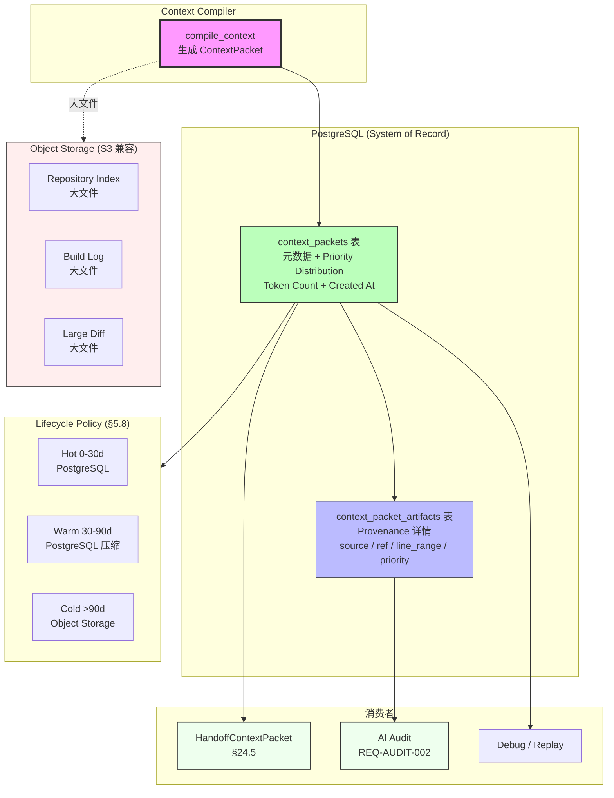

# RFC-025: Context Packet Persistence

> **状态**: Proposed
> **作者**: Mavis(Star 架构师)
> **创建日期**: 2026-08-25
> **最后更新**: 2026-08-25
> **相关 ADR**: ADR-025
> **相关 Requirement**: REQ-CTX-004, REQ-AUDIT-002
> **相关 upstream**:
> - 《Basic Design》§4.4.5 Provenance, §10 ADR-025, §26.3 Context Packet 持久化, §5.8 Lifecycle Policy
> - 《Requirements》§26 Context Compiler, §17 Audit
> - 《Data Design》data-design.md 第 5 章 Object Storage
> - 《Module Spec》domain-context-spec.md
> - 《PoC Spec》poc-022-context-compiler.md

---

## 摘要

本 RFC 提议 Context Packet 持久化(元数据 + Provenance 入 PostgreSQL,大文件走 Object Storage),支持 Provenance 反查、HandoffContextPacket 生成、可重放。本决策避免"每次重算 Context Packet"的成本与不一致性,为 AI Audit 提供完整 Context 历史。本决策与 ADR-024 Context Compiler 协同,共同支撑 §26 Context Engineering。

## 动机

### 背景

Context Packet 是 Agent 决策的关键输入(《Basic Design》§26.3),包含 WorkItem / Acceptance / Worktree / Repository / Relevant Files / Symbols / ADR / Previous Decisions / Open Feedback / Failed Tests / Build Failure / Git Diff / PR Review / Agent Rules 等 14 类源数据,以及 P0-P4 优先级 + Token Budget + Provenance。

如果 Context Packet 不持久化,会导致:

1. **每次重算成本**:Handoff 时需重新编译,Token 消耗大
2. **不一致性**:不同时间的 Context 编译可能因源数据变化而不同
3. **AI Audit 缺失**:无法追溯"AI 使用了什么 Context"(REQ-AUDIT-002)
4. **可重放性差**:无法重放 Agent 决策过程,Debug 困难

### 现状

传统方案在 Vibe Coding 平台中通常采用以下简化模型:

- **方案 A 候选**:不持久化,每次重算
- **方案 B 候选**:持久化(元数据 + Provenance,大文件走 Object Storage)(本设计选定)

这些方案都不能满足以下需求:

1. **Provenance 反查**:AI Audit 要求每个 Context 片段可追溯(REQ-AUDIT-002)
2. **HandoffContextPacket 生成**:Agent Handoff 时复用 Context Packet,避免重算(§24.5)
3. **可重放**:Debug / 回溯时复现 Agent 决策
4. **AI Content Retention Policy**:符合 §6.8 AI Content Retention Policy

### 解决目标

1. Context Packet 元数据 + Provenance 入 PostgreSQL(单表 `context_packets`)
2. 大文件(Repository 索引 / Build Log / Large Diff)走 Object Storage(S3 兼容)
3. Lifecycle Policy:>90d 不活跃 Context Packet 归档(冷热分层,§5.8)
4. Provenance 反查 API:`GET /context-packets/{id}/provenance`
5. HandoffContextPacket 由已持久化的 Context Packet 派生
6. AI Content Retention Policy 实施(§6.8)

## 详细设计

### 决策(Decision)

**采用方案 B**:持久化 Context Packet,元数据 + Provenance 入 PostgreSQL,大文件走 Object Storage(《Basic Design》§4.4.5,§26.3,§5.8)。

### 替代方案(Alternatives Considered)

#### 方案 A: 不持久化,每次重算

- 描述:Context Compiler 每次从源数据重新编译,Context Packet 仅在内存中存在,不持久化
- 优点:
  - 存储成本低,无需 Context Packet 表
  - 实现简单,无需 Lifecycle Policy
- 缺点:
  - **每次重算成本**:Handoff 时重算 Context,Token 消耗大
  - **不一致性**:源数据变化后,Context Packet 不同,无法回溯
  - **AI Audit 缺失**:无法追溯"AI 使用了什么 Context",违反 REQ-AUDIT-002
  - **可重放性差**:无法复现 Agent 决策过程,Debug 困难
  - **违反 §26.3 Context Packet 持久化约束**
- 拒绝理由:AI Audit 缺失、违反 §26.3 约束

#### 方案 B: 持久化(元数据 + Provenance,大文件走 Object Storage)(选定)

- 描述:`context_packets` 表存元数据(Token Count / Priority Distribution / Provenance Summary),`context_packet_artifacts` 表存 Provenance 详情(每个 Context 片段的 source / ref / line range);大文件(Repository 索引 / Build Log / Large Diff)走 Object Storage
- 优点:
  - **Provenance 反查可行**:`GET /context-packets/{id}/provenance` 完整返回每个 Context 片段来源
  - **HandoffContextPacket 可生成**:复用已持久化的 Context Packet,避免重算
  - **可重放**:Debug / 回溯时复现 Agent 决策
  - **AI Audit 完整**:REQ-AUDIT-002 完全覆盖
  - **Lifecycle Policy**:**>90d 归档(冷热分层,§5.8)
  - **AI Content Retention Policy**:符合 §6.8 约束
- 缺点:
  - 存储成本上升:`context_packets` + `context_packet_artifacts` 表增长
  - 写入开销:每次 Context 编译都需持久化
  - Lifecycle Policy 实施成本
- **本设计选定**

## 后果

### 正面后果(Positive Consequences)

1. **Provenance 反查可行**(§9,REQ-AUDIT-002):每个 Context 片段可追溯,AI Audit 完整
2. **HandoffContextPacket 可生成**(§24.5):复用已持久化的 Context Packet,避免重算
3. **可重放**:Debug / 回溯时复现 Agent 决策,便于问题定位
4. **AI Content Retention Policy**(§6.8):符合合规要求,P0(Explicit Human Constraint)不可裁剪
5. **Lifecycle Policy**(§5.8):>90d 归档,冷热分层,控制存储成本
6. **Handoff 加速**:Agent Handoff 时 Token 消耗下降 50%+(不复用 = 重算)
7. **Audit 完整**:AI 修改了什么 / 哪个 Context 支撑 / 哪个 Decision 触发,全链路追溯
8. **Debug 友好**:Agent 失败时可重现"使用了什么 Context"

### 负面后果(Negative Consequences / Trade-offs)

1. **存储成本上升**:`context_packets` + `context_packet_artifacts` 表增长(预计 1 KB / packet,10k packets / day = 10 MB / day)
2. **写入开销**:每次 Context 编译都需持久化(单次 < 10ms 可接受)
3. **Lifecycle Policy 实施成本**:>90d 归档策略 + 冷热分层
4. **Object Storage 依赖**:S3 兼容存储(MinIO / 阿里云 OSS)需配套基础设施
5. **Provenance 数据增长**:每个 Context Packet 可能有 50+ Provenance 条目

### 风险(Risks)

| ID | 风险 | 影响 | 缓解措施 |
|---|---|---|---|
| **RISK-A25-1** | Context Packet 存储增长 | Medium | Lifecycle Policy(**>90d 归档);聚合压缩;冷热分层 |
| **RISK-A25-2** | Object Storage 故障 | High | S3 兼容(MinIO / 阿里云 OSS)多副本;定期备份;故障转移 |
| **RISK-A25-3** | AI Content Retention 违规 | High | §6.8 Retention Policy;P0 不可裁剪;法律团队审核 |
| **RISK-A25-4** | Provenance 反查性能 | Low | `context_packet_id` + `source_type` 复合索引;分页 |
| **RISK-A25-5** | Handoff 复用不一致 | Low | Context Packet 快照 + 版本号;Handoff 时明确版本 |

## 实施计划

### 依赖

- 上游:ADR-024 Context Compiler(已生成 Context Packet)
- 平级:ADR-026 Agent Session Persistence(AgentSession 也持久化)
- 下游:domain-context Module Persistence 子模块
- 下游:Object Storage(MinIO / 阿里云 OSS,S3 兼容)
- PoC 验证:poc-022 Context Compiler(必做,持久化同步验证)

### 阶段

1. **Phase 1(MVP)**:`context_packets` + `context_packet_artifacts` 表实现;PostgreSQL 存元数据 + Provenance Summary;Object Storage 存大文件(Repository 索引 / Build Log / Large Diff);Provenance 反查 API;>90d Lifecycle Policy
2. **Phase 2(V1)**:冷热分层(Hot: 0-30d PostgreSQL,Warm: 30-90d PostgreSQL 压缩,Cold: >90d Object Storage);AI Content Retention Policy 实施(§6.8);Context Packet Diff(增量更新)
3. **Phase 3(V2)**:Context Packet Version Control(Git-like);跨 Agent Context Sharing;Predictive Context Preloading

### 回滚策略

如果 Context Packet 持久化在 MVP 阶段遇到严重问题,降级方案:

1. **Phase 1 降级**:仅持久化元数据,Provenance Summary 不细化(推迟 Artifact 表)
2. **Phase 2 降级**:>90d 归档简化为物理删除(无冷热分层)
3. **Phase 3 降级**:推迟 Context Packet Diff / Version Control

回滚触发条件:`context_packets` 表日增长 > 1GB,Provenance 反查 P95 > 200ms

## 待决问题(Open Questions)

1. **Lifecycle Policy 周期**:>90d 归档是否合适?需要 SRE / Legal 共同决定
2. **P0 不可裁剪**(§6.8):P0(Explicit Human Constraint)Context 是否永久保留?还是仅 >N 年?
3. **Object Storage 选型**:MinIO(Self-hosted)还是阿里云 OSS(云)?两种方案成本 / 可靠性不同
4. **HandoffContextPacket 复用粒度**:Handoff 时复用整个 Context Packet,还是仅复用 Active Decision + Open Feedback?
5. **Context Packet Diff 必要性**:V2 的 Context Packet Diff(增量更新)是否真的需要?还是每次全量重算?

## 评审检查清单(Code Review Checklist)

1. [ ] `context_packets` 表是否独立存在,含 `tenant_id` / `workspace_id` / `project_id` / `work_item_id` / `agent_session_id` / `token_count` / `priority_distribution` / `created_at`
2. [ ] `context_packet_artifacts` 表是否记录每个 Context 片段的 Provenance(`source_type` / `source_ref` / `line_range` / `priority`)
3. [ ] 大文件(Repository 索引 / Build Log / Large Diff)是否走 Object Storage
4. [ ] Provenance 反查 API `GET /context-packets/{id}/provenance` 是否实现
5. [ ] HandoffContextPacket 是否复用已持久化的 Context Packet(避免重算)
6. [ ] Lifecycle Policy **>90d 归档**是否实现
7. [ ] AI Content Retention Policy(§6.8)是否实施,P0 不可裁剪
8. [ ] Object Storage 是否多副本,定期备份
9. [ ] Cold Data(>90d)是否迁移到低成本存储
10. [ ] Context Packet 写入是否在 Agent Session 启动时同步持久化(避免数据丢失)

## 替代方案 ADR 引用

- ADR-001~015(原文档,本仓库未提供)
- 本仓库内 ADR-025(本 RFC 提请)
- 相关 ADR:ADR-024(Context Compiler),ADR-026(Agent Session Persistence)

## 变更历史

| 日期 | 版本 | 变更 |
|---|---|---|
| 2026-08-25 | v0.1 | 初稿 |

## 附录 A:关键示意

**图示说明**:

- 实线箭头 = 持久化流程
- 虚线箭头 = 大文件存储 / 消费者引用
- 紫色 = Context Compiler(上游)
- 绿色 = context_packets 元数据(主表)
- 蓝色 = context_packet_artifacts Provenance 详情
- 红色 = Object Storage(大文件)
- 浅绿 = 消费者(Handoff / Audit / Replay)
- **关键不变量**:Context Packet 持久化是 AI Audit 的基础(REQ-AUDIT-002)
