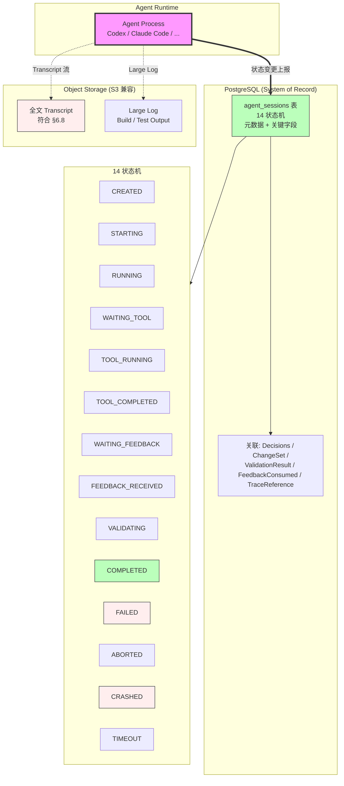

# RFC-026: Agent Session Persistence

> **状态**: Proposed
> **作者**: Mavis(Star 架构师)
> **创建日期**: 2026-08-25
> **最后更新**: 2026-08-25
> **相关 ADR**: ADR-026
> **相关 Requirement**: REQ-AGT-001, REQ-AGT-002, REQ-AUDIT-002, REQ-SEC-003
> **相关 upstream**:
> - 《Basic Design》§4.2.2 AgentSession 实体, §10 ADR-026, §24.1 AgentSession 字段, §6.8 AI Content Retention
> - 《Requirements》§24 Agent Session, §17 Audit
> - 《Data Design》data-design.md 第 4 章 AgentSession
> - 《Module Spec》domain-agent-spec.md
> - 《PoC Spec》poc-020-agent-session-tracking.md

---

## 摘要

本 RFC 提议 AgentSession 持久化(元数据 + 关键字段入 PostgreSQL,全文 Transcript 走 Object Storage),支持 14 状态机(《Basic Design》§4.2.3) + Plan / Decisions / ChangeSet / ValidationResult / FeedbackConsumed / TraceReference 等关键字段。本决策避免"仅内存 AgentSession"导致 AI Audit 不可查、跨 Session 状态不可追踪的问题,符合 §6.8 AI Content Retention Policy,缓解 RISK-023 Agent Session State Divergence。

## 动机

### 背景

AgentSession 是 Vibe Coding 平台的核心执行单元(《Basic Design》§24.1),记录一次 Agent 在某 Worktree 上的执行会话,包含 14 个状态(`CREATED / STARTING / RUNNING / WAITING_TOOL / TOOL_RUNNING / TOOL_COMPLETED / WAITING_FEEDBACK / FEEDBACK_RECEIVED / VALIDATING / COMPLETED / FAILED / ABORTED / CRASHED / TIMEOUT`)、Plan / Decisions / ChangeSet / ValidationResult / FeedbackConsumed / TraceReference 等关键字段。

如果 AgentSession 不持久化,会导致:

1. **AI Audit 不可查**:无法追溯"哪个 Agent 做了什么"(REQ-AUDIT-002)
2. **跨 Session 状态不可追踪**:Agent 重启 / Handoff 时状态丢失
3. **可重放性差**:无法复现 Agent 决策过程
4. **AI Content Retention 违规**:Agent Transcript 未保留,违反 §6.8

### 现状

传统方案在 Vibe Coding 平台中通常采用以下简化模型:

- **方案 A 候选**:仅内存 AgentSession(Agent 关闭后状态丢失)
- **方案 B 候选**:持久化(元数据 + 关键字段,大文件走 Object Storage)(本设计选定)

这些方案都不能满足以下需求:

1. **AI Audit 完整**:每个 AgentSession 可追溯(REQ-AUDIT-002)
2. **跨 Session 状态可追踪**:Agent 重启 / Handoff 时状态保留
3. **全文 Transcript 留存**:符合 §6.8 AI Content Retention Policy
4. **Decision / ChangeSet 关联**:AgentSession 关联到 Decision / ChangeSet / ValidationResult

### 解决目标

1. AgentSession 元数据 + 关键字段入 PostgreSQL(单表 `agent_sessions`)
2. 全文 Transcript 走 Object Storage(S3 兼容,符合 §6.8)
3. 14 状态机完整实现(《Basic Design》§4.2.3)
4. Plan / Decisions / ChangeSet / ValidationResult / FeedbackConsumed / TraceReference 关联
5. Lifecycle Policy:>90d 归档,符合 §5.8

## 详细设计

### 决策(Decision)

**采用方案 B**:持久化 AgentSession,元数据 + 关键字段入 PostgreSQL,全文 Transcript 走 Object Storage(《Basic Design》§4.2,§24.1,§6.8)。

### 替代方案(Alternatives Considered)

#### 方案 A: 仅内存 AgentSession

- 描述:AgentSession 仅在内存中存在,Agent 关闭后状态丢失
- 优点:
  - 实施简单,无需数据库
  - 性能高,无序列化开销
- 缺点:
  - **AI Audit 不可查**:Agent 关闭后无任何记录,违反 REQ-AUDIT-002
  - **跨 Session 状态不可追踪**:Agent 重启 / Handoff 时状态丢失
  - **可重放性差**:无法复现 Agent 决策
  - **AI Content Retention 违规**:Agent Transcript 未保留,违反 §6.8
- 拒绝理由:AI Audit 缺失、违反 REQ-AUDIT-002 和 §6.8

#### 方案 B: 持久化(元数据 + 关键字段,大文件走 Object Storage)(选定)

- 描述:`agent_sessions` 表存元数据 + 关键字段(14 状态 / Plan / Decisions / ChangeSet / ValidationResult / FeedbackConsumed / TraceReference);全文 Transcript / 大 Log 走 Object Storage
- 优点:
  - **AI Audit 完整**:REQ-AUDIT-002 完全覆盖
  - **跨 Session 状态可追踪**:Agent 重启 / Handoff 时状态保留
  - **全文 Transcript 留存**:符合 §6.8
  - **Decision / ChangeSet 关联完整**:AgentSession 是审计的核心
  - **可重放**:Debug / 回溯时复现 Agent 决策
- 缺点:
  - 存储成本上升:AgentSession 表 + Transcript 文件
  - 写入开销:每次状态变更都需持久化
  - Lifecycle Policy 实施成本
- **本设计选定**

## 后果

### 正面后果(Positive Consequences)

1. **AI Audit 可查**(REQ-AUDIT-002):每个 AgentSession 可追溯到 Plan / Decisions / ChangeSet / ValidationResult / FeedbackConsumed
2. **跨 Session 状态可追踪**:Agent 重启 / Handoff 时状态保留
3. **全文 Transcript 留存**(§6.8):符合 AI Content Retention Policy
4. **Decision / ChangeSet 关联完整**:AgentSession 是 DevelopmentExecution 的核心组件
5. **可重放**:Debug / 回溯时复现 Agent 决策
6. **缓解 RISK-023 Agent Session State Divergence**:持久化保证状态一致
7. **AI Audit 维度统一**:通过 AgentSessionId + ExecutionId + TraceId 联合索引

### 负面后果(Negative Consequences / Trade-offs)

1. **存储成本上升**:AgentSession 表 + Transcript 文件(预计 1 KB / session 元数据,10 KB~1 MB / session Transcript)
2. **写入开销**:每次状态变更都需持久化(单次 < 5ms 可接受)
3. **Lifecycle Policy 实施成本**:>90d 归档
4. **Object Storage 依赖**:S3 兼容存储需配套基础设施
5. **AI Content Retention 合规成本**:P0(Explicit Human Constraint)Transcript 不可裁剪,需长期保留

### 风险(Risks)

| ID | 风险 | 影响 | 缓解措施 |
|---|---|---|---|
| **RISK-A26-1** | Agent Session State Divergence | Medium | 持久化 + Reconciliation(§4.2);Local Runtime 上报机制(§4.6.5) |
| **RISK-A26-2** | Transcript 存储增长 | Medium | Lifecycle Policy(**>90d 归档);Transcript 压缩;分片存储 |
| **RISK-A26-3** | AI Content Retention 违规 | High | §6.8 Retention Policy;P0 不可裁剪;法律团队审核 |
| **RISK-A26-4** | Object Storage 故障 | High | S3 兼容多副本;定期备份;故障转移 |
| **RISK-A26-5** | 写入开销影响 Agent 性能 | Low | 异步批量持久化;Throttle(每 1s 批量) |

## 实施计划

### 依赖

- 上游:ADR-021 Agent Adapter Model(Agent 抽象)
- 平级:ADR-017 Development Execution Domain(Execution 聚合)
- 平级:ADR-025 Context Packet Persistence(类似持久化模式)
- 下游:domain-agent Module Persistence 子模块
- 下游:Object Storage(MinIO / 阿里云 OSS,S3 兼容)
- PoC 验证:poc-020 Agent Session Tracking(必做)

### 阶段

1. **Phase 1(MVP)**:`agent_sessions` 表实现,14 状态机;PostgreSQL 存元数据 + 关键字段;Object Storage 存全文 Transcript;状态变更走 Outbox 模式
2. **Phase 2(V1)**:Lifecycle Policy(**>90d 归档);Transcript 压缩;AI Content Retention Policy 实施(§6.8);HandoffContextPacket 跨 Session 传递
3. **Phase 3(V2)**:Agent Session 性能分析;Transcript 全文搜索(Projection);AI 异常行为检测

### 回滚策略

如果 AgentSession 持久化在 MVP 阶段遇到严重问题,降级方案:

1. **Phase 1 降级**:仅持久化核心状态(status / started_at / ended_at),其他字段推迟
2. **Phase 2 降级**:Transcript 不持久化(仅状态变更事件)
3. **Phase 3 降级**:推迟 Lifecycle Policy,AgentSession 永久保留

回滚触发条件:`agent_sessions` 表日增长 > 1GB,AgentSession 状态变更持久化 P95 > 50ms

## 待决问题(Open Questions)

1. **Transcript 留存周期**:>90d 归档是否合适?还是需按 Agent 类型区分(Codex 30d,Local 7d)?
2. **P0 不可裁剪**(§6.8):P0(Explicit Human Constraint)Transcript 永久保留?还是 >N 年?
3. **Object Storage 选型**:MinIO(Self-hosted)还是阿里云 OSS(云)?
4. **Handoff 状态保留**:Handoff 时源 AgentSession 状态是 ARCHIVED 还是保留为 ACTIVE?
5. **Transcript 全文搜索**:V2 的 Transcript 全文搜索是否需要?还是仅按 AgentSessionId 查询?

## 评审检查清单(Code Review Checklist)

1. [ ] `agent_sessions` 表是否独立存在,含 `tenant_id` / `workspace_id` / `project_id` / `worktree_id` / `work_item_id` / `agent_id` / `agent_type` / `agent_provider` / `agent_version` / `status` / `started_at` / `ended_at`
2. [ ] 14 状态机(CREATED / STARTING / RUNNING / WAITING_TOOL / TOOL_RUNNING / TOOL_COMPLETED / WAITING_FEEDBACK / FEEDBACK_RECEIVED / VALIDATING / COMPLETED / FAILED / ABORTED / CRASHED / TIMEOUT)是否完整实现
3. [ ] Plan / Decisions / ChangeSet / ValidationResult / FeedbackConsumed / TraceReference 关联是否完整
4. [ ] 全文 Transcript 是否走 Object Storage
5. [ ] 状态变更是否走 Outbox 模式,保证事件最终一致
6. [ ] Lifecycle Policy **>90d 归档**是否实现
7. [ ] AI Content Retention Policy(§6.8)是否实施,P0 不可裁剪
8. [ ] Agent Handoff 时源 AgentSession 状态是否正确迁移(§24.5)
9. [ ] AI Audit 是否通过 AgentSessionId + ExecutionId + TraceId 联合索引
10. [ ] Object Storage 是否多副本,定期备份

## 替代方案 ADR 引用

- ADR-001~015(原文档,本仓库未提供)
- 本仓库内 ADR-026(本 RFC 提请)
- 相关 ADR:ADR-021(Agent Adapter),ADR-017(Development Execution),ADR-025(Context Packet Persistence)

## 变更历史

| 日期 | 版本 | 变更 |
|---|---|---|
| 2026-08-25 | v0.1 | 初稿 |

## 附录 A:关键示意

**图示说明**:

- 双线箭头 = Agent 状态变更上报(高频,需 Throttle)
- 虚线箭头 = 大文件 / Transcript 流
- 紫色 = Agent Runtime(本 RFC 上游)
- 绿色 = agent_sessions 元数据(主表)
- 红色 = Object Storage(全文 Transcript)
- 绿色 = 成功终态(COMPLETED)
- 红色 = 失败终态(FAILED / CRASHED)
- **关键不变量**:AgentSession 持久化是 AI Audit 的基础(REQ-AUDIT-002)
