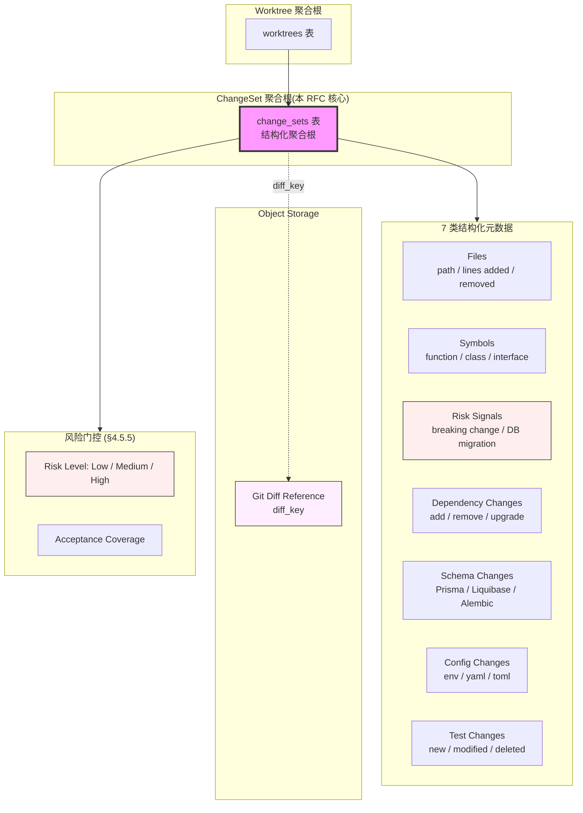

# RFC-027: ChangeSet Storage

> **状态**: Proposed
> **作者**: Mavis(Star 架构师)
> **创建日期**: 2026-08-25
> **最后更新**: 2026-08-25
> **相关 ADR**: ADR-027
> **相关 Requirement**: REQ-DEV-004, REQ-DEV-005
> **相关 upstream**:
> - 《Basic Design》§4.8.1 ChangeSet 实体, §10 ADR-027, §21.1 ChangeSet 字段
> - 《Requirements》§21 Development Execution, §20 Development Context
> - 《Data Design》data-design.md 第 6 章 ChangeSet
> - 《Module Spec》domain-development-spec.md
> - 《PoC Spec》poc-021-structured-feedback-agent-instruction.md

---

## 摘要

本 RFC 提议 ChangeSet 作为结构化聚合根,不仅存 Git Diff,还承载 Files / Symbols / Risk Signals / Dependency / Schema / Config / Test Changes 等结构化元数据,Git Diff Reference 走 Object Storage。本决策支撑风险门控(§4.5.5)、Symbol-level Feedback 关联(§25.1)、Acceptance Coverage 验证(§4.5.5)。

## 动机

### 背景

Vibe Coding 平台中,Agent 修改代码后产生的 Change Set 不只是 Git Diff(《Basic Design》§21.1),还需承载:

1. **Files**:修改的文件列表(path / lines added / lines removed)
2. **Symbols**:修改的 Symbol 列表(function / class / interface)
3. **Risk Signals**:风险信号(breaking change / database migration / public API change)
4. **Dependency**:依赖变更(新增 / 删除 / 升级)
5. **Schema**:数据库 Schema 变更
6. **Config**:配置文件变更(可能影响生产)
7. **Test Changes**:测试变更(新增 / 修改 / 删除)

如果 ChangeSet 仅存 Git Diff,会导致:

1. **风险门控缺失**:无法识别 breaking change / 数据库迁移风险
2. **Symbol-level Feedback 关联困难**:Feedback 定位不到具体 Symbol
3. **Acceptance Coverage 验证缺失**:无法判断 AC 是否被代码修改覆盖
4. **依赖审计困难**:无法识别依赖变更风险
5. **配置变更追溯困难**:无法追溯 Config 变更(可能影响生产)

### 现状

传统方案在 Vibe Coding 平台中通常采用以下简化模型:

- **方案 A 候选**:仅 Git Diff(把 ChangeSet 当作 Git Commit 的简单镜像)
- **方案 B 候选**:结构化 ChangeSet 聚合根 + Diff Reference 走 Object Storage(本设计选定)

这些方案都不能满足以下需求:

1. **风险门控**:识别 breaking change / 数据库迁移 / public API change
2. **Symbol-level Feedback**:Feedback 关联到具体 Symbol
3. **Acceptance Coverage**:AC 覆盖率验证
4. **依赖审计**:识别依赖变更
5. **配置追溯**:Config 变更追溯

### 解决目标

1. ChangeSet 作为结构化聚合根,含 7 类元数据
2. Git Diff Reference 走 Object Storage(避免 PostgreSQL 膨胀)
3. 风险门控:ChangeSet 提交时自动识别风险等级
4. Symbol-level Feedback 关联(§25.1,V1)
5. Acceptance Coverage 验证(§4.5.5)
6. Storage Lifecycle Policy(§5.1)

## 详细设计

### 决策(Decision)

**采用方案 B**:结构化 ChangeSet 聚合根 + Diff Reference 走 Object Storage(《Basic Design》§4.8.1,§21.1)。

### 替代方案(Alternatives Considered)

#### 方案 A: 仅 Git Diff

- 描述:ChangeSet 仅存 Git Diff(commit_id / diff_content),其他元数据通过解析 Git Diff 临时计算
- 优点:
  - 实施简单,直接复用 Git Diff
  - 存储成本低
- 缺点:
  - **风险门控缺失**:每次提交都需重新解析 Git Diff,无法预先标记风险
  - **Symbol-level Feedback 关联困难**:Feedback 需运行时解析 Git Diff 找 Symbol
  - **Acceptance Coverage 验证缺失**:无法直接判断 AC 覆盖
  - **依赖审计困难**:依赖变更需解析 package.json / Cargo.toml 等
  - **配置追溯困难**:Config 变更无结构化标记
- 拒绝理由:风险门控 / Symbol-level Feedback / Acceptance Coverage 缺失

#### 方案 B: 结构化 ChangeSet 聚合根 + Diff Reference 走 Object Storage(选定)

- 描述:`change_sets` 表存 7 类结构化元数据(Files / Symbols / Risk Signals / Dependency / Schema / Config / Test Changes),`change_set_diff_objects` 表存 Object Storage 引用(diff_key)
- 优点:
  - **风险门控可行**:ChangeSet 提交时自动识别风险等级(breaking change / 数据库迁移)
  - **Symbol-level Feedback 关联**:`change_set.symbols[]` 可直接关联 Feedback
  - **Acceptance Coverage 验证**:`change_set.acceptance_coverage` 字段记录 AC 覆盖
  - **依赖审计**:`change_set.dependency_changes` 记录依赖变更
  - **配置追溯**:`change_set.config_changes` 记录 Config 变更
  - **Git Diff 走 Object Storage**:避免 PostgreSQL 膨胀
- 缺点:
  - ChangeSet 表复杂度上升
  - 元数据提取成本(Symbol / Dependency / Schema 需专门工具)
  - 实施成本(§11 POC-021)
- **本设计选定**

## 后果

### 正面后果(Positive Consequences)

1. **风险门控可行**(§4.5.5):ChangeSet 提交时自动识别风险等级
2. **Symbol-level Feedback 关联**(§25.1):Feedback 可定位到 Symbol
3. **Acceptance Coverage 验证**(§4.5.5):AC 覆盖率直接计算
4. **依赖审计**:依赖变更可追溯
5. **配置追溯**:Config 变更可追溯
6. **Git Diff 走 Object Storage**:PostgreSQL 不膨胀
7. **缓解 RISK-A27-1 风险门控缺失**:ChangeSet 结构化是风险门控的前提

### 负面后果(Negative Consequences / Trade-offs)

1. **ChangeSet 表复杂度上升**:7 类元数据需独立字段
2. **元数据提取成本**:Symbol / Dependency / Schema 需专门工具(MVP 简化)
3. **实施成本**(§11 POC-021):POC 验证复杂
4. **Storage 增长**(§5.1):Object Storage 存储 Diff 文件
5. **元数据一致性**:Git Diff 与结构化元数据可能不一致(需 Validation 步骤)

### 风险(Risks)

| ID | 风险 | 影响 | 缓解措施 |
|---|---|---|---|
| **RISK-A27-1** | 元数据提取失败 | Medium | Fallback 为仅 Git Diff;Validation 步骤强制元数据 |
| **RISK-A27-2** | Storage 增长 | Medium | Lifecycle Policy(**>90d 归档);Diff 压缩 |
| **RISK-A27-3** | 元数据不一致 | High | Validation 步骤强制校验(ChangeSet 提交时 Validation) |
| **RISK-A27-4** | Symbol 提取不准确 | Low | MVP 仅 File-level,V1 渐进到 Symbol-level(§30.3,POC-025) |
| **RISK-A27-5** | 依赖审计覆盖不足 | Low | MVP 仅识别主要依赖(package.json / Cargo.toml),V1 扩展 |

## 实施计划

### 依赖

- 上游:ADR-016 Worktree First-class(Worktree 聚合)
- 上游:ADR-022 SCM Adapter Model(Git Diff 来源)
- 上游:ADR-028 Symbol Analysis Strategy(Symbol 提取)
- 平级:ADR-017 Development Execution Domain(ChangeSet 关联)
- 下游:domain-development Module(§4.8 详细设计)
- PoC 验证:poc-021 Structured Feedback(必做,ChangeSet 关联验证)

### 阶段

1. **Phase 1(MVP)**:ChangeSet 聚合根实现,7 类元数据(Files / Symbols 简化版 / Risk Signals / Dependency 简化 / Schema 简化 / Config / Test Changes);Git Diff 走 Object Storage;风险门控基础版(识别 breaking change / 数据库迁移)
2. **Phase 2(V1)**:Symbol-level ChangeSet 完整实现(依赖 POC-025);Acceptance Coverage 验证;依赖审计扩展;Risk Signal 细化
3. **Phase 3(V2)**:ChangeSet Diff 增量(只存差异);AI 风险预测(基于历史 ChangeSet);ChangeSet 性能分析

### 回滚策略

如果 ChangeSet Storage 在 MVP 阶段遇到严重问题,降级方案:

1. **Phase 1 降级**:元数据简化为 3 类(Files / Risk Signals / Test Changes),其他推迟
2. **Phase 2 降级**:Git Diff 仍存 PostgreSQL(推迟 Object Storage)
3. **Phase 3 降级**:推迟 Symbol-level ChangeSet,仅 File-level

回滚触发条件:ChangeSet 写入 P95 > 200ms,Object Storage 故障率 > 1%

## 待决问题(Open Questions)

1. **元数据提取时机**:ChangeSet 提交时同步提取,还是异步提取?
2. **Risk Signal 等级**:Low / Medium / High 三级,还是更细粒度?
3. **Schema 变更识别**:如何识别 Prisma / Liquibase / Flyway / Alembic 等 ORM/Migration 工具的 Schema 变更?
4. **Config 变更追溯粒度**:整文件 diff,还是仅变更的 key?
5. **Acceptance Coverage 计算**:基于 AC 文本与 ChangeSet Symbols 匹配,还是人工标注?

## 评审检查清单(Code Review Checklist)

1. [ ] `change_sets` 表是否独立存在,含 `tenant_id` / `workspace_id` / `project_id` / `worktree_id` / `agent_session_id` / `commit_id` / `files[]` / `symbols[]` / `risk_signals[]` / `dependency_changes[]` / `schema_changes[]` / `config_changes[]` / `test_changes[]`
2. [ ] Git Diff Reference 是否走 Object Storage(`change_set_diff_objects.diff_key`)
3. [ ] 风险门控是否在 ChangeSet 提交时自动识别(breaking change / 数据库迁移)
4. [ ] Symbol-level Feedback 是否可关联(V1,依赖 Symbol Index)
5. [ ] Acceptance Coverage 字段是否实现
6. [ ] Lifecycle Policy **>90d 归档**是否实现(§5.1)
7. [ ] Validation 步骤是否强制校验 Git Diff 与元数据一致
8. [ ] Storage 配额监控是否设置(Object Storage 增长)
9. [ ] 依赖审计是否覆盖 package.json / Cargo.toml 等主要格式
10. [ ] Risk Signal 等级(Low / Medium / High)是否明确分类规则

## 替代方案 ADR 引用

- ADR-001~015(原文档,本仓库未提供)
- 本仓库内 ADR-027(本 RFC 提请)
- 相关 ADR:ADR-016(Worktree First-class),ADR-022(SCM Adapter),ADR-028(Symbol Analysis)

## 变更历史

| 日期 | 版本 | 变更 |
|---|---|---|
| 2026-08-25 | v0.1 | 初稿 |

## 附录 A:关键示意

**图示说明**:

- 实线箭头 = 聚合根关联 / 元数据组成
- 虚线箭头 = Object Storage 引用
- 紫色 = ChangeSet 聚合根(本 RFC 核心)
- 红色 = Risk Signals(风险门控关键)
- 浅红 = Object Storage(Git Diff 大文件)
- **关键不变量**:ChangeSet 是结构化聚合根,不仅是 Git Diff
