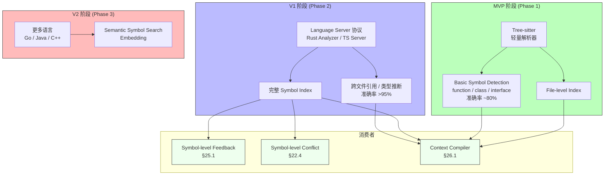

# RFC-028: Symbol Analysis Strategy

> **状态**: Proposed
> **作者**: Mavis(Star 架构师)
> **创建日期**: 2026-08-25
> **最后更新**: 2026-08-25
> **相关 ADR**: ADR-028
> **相关 Requirement**: REQ-DEV-006, REQ-FBK-002
> **相关 upstream**:
> - 《Basic Design》§4.8.2 Symbol 索引, §10 ADR-028, §21.2 Symbol Index, §30.3 V1 Should Have, §15 Open Issue J.2
> - 《Requirements》§20 Development Context, §21 Development Execution
> - 《Module Spec》domain-development-spec.md
> - 《PoC Spec》poc-025-symbol-level-feedback.md

---

## 摘要

本 RFC 提议 Symbol Analysis 采用"第一阶段 File-level + Basic Symbol Detection,V1 渐进到 Symbol-level"的渐进策略,避免 MVP 阶段完整 IDE Compiler Database 的成本爆炸。本决策支持 §30.3 V1 Should Have 的 Symbol-level Feedback 与 Symbol-level Conflict Detection,符合 §30.6 Non-Goals"不在 MVP/V1/V2 任何阶段实现 Graph Database"约束。

## 动机

### 背景

Vibe Coding 平台中,Symbol-level Context(精确到 function / class / interface)是 V1 阶段的关键能力(《Basic Design》§21.2),支撑:

1. **Symbol-level Feedback**:用户选中具体 Symbol 提交 Feedback(§25.1)
2. **Symbol-level Conflict Detection**:跨 Worktree 冲突检测精确到 Symbol(§22.4)
3. **Context Compiler 精准化**:Context Packet 包含具体 Symbol 而非整文件(§26.1)

然而,完整 IDE Compiler Database(类似 Rust Analyzer / TypeScript Language Server)成本极高,需深度集成每种语言的 Compiler 协议。MVP 阶段不应承担这一成本。

### 现状

传统方案在 Vibe Coding 平台中通常采用以下简化模型:

- **方案 A 候选**:完整 IDE Compiler Database(Rust Analyzer / TS Server / Python Language Server)
- **方案 B 候选**:第一阶段 File-level + Basic Symbol Detection,V1 渐进到 Symbol-level(本设计选定)
- **方案 C 候选**:引入 Graph Database(§30.6 Non-Goals 排除)

这些方案都不能满足以下需求:

1. **MVP 可行**:完整 IDE Compiler Database 实施成本爆炸
2. **避免 Graph DB 早期投资**:§30.6 明确排除
3. **渐进式演进**:MVP File-level,V1 Symbol-level
4. **多语言支持**:Rust / TypeScript / Python / Go / Java 等

### 解决目标

1. MVP 阶段:File-level + Basic Symbol Detection(基于 Tree-sitter 等轻量解析器)
2. V1 阶段:Symbol-level Index(基于 Tree-sitter / Language Server 协议)
3. 多语言支持:MVP 至少 3 种语言(Rust / TypeScript / Python)
4. 性能:POC-025 验证 Symbol 识别准确率 > 95%
5. 避免 Graph Database(§30.6)

## 详细设计

### 决策(Decision)

**采用方案 B**:第一阶段 File-level + Basic Symbol Detection(MVP),V1 渐进到 Symbol-level Index(《Basic Design》§4.8.2,§21.2,§30.3)。

### 替代方案(Alternatives Considered)

#### 方案 A: 完整 IDE Compiler Database

- 描述:MVP 直接集成完整 IDE Compiler Database(Rust Analyzer / TS Server / Python Language Server)
- 优点:
  - Symbol 识别准确率最高(>99%)
  - 类型推断 / 跨文件引用完整
- 缺点:
  - **实施成本爆炸**:每种语言需独立集成,工作量 10x+
  - **维护成本高**:IDE 协议变化需同步更新
  - **MVP 不现实**:无法在 MVP 周期内完成
  - **资源开销大**:Language Server 内存 / CPU 消耗大
- 拒绝理由:实施成本爆炸、MVP 不现实

#### 方案 B: 第一阶段 File-level + Basic Symbol Detection,V1 渐进到 Symbol-level(选定)

- 描述:MVP 使用 Tree-sitter 等轻量解析器,做 File-level + Basic Symbol Detection(function / class / interface 识别);V1 集成 Language Server 协议,做完整 Symbol Index
- 优点:
  - **MVP 可行**:Tree-sitter 实施成本低,1 周内可集成
  - **避免 Graph DB 早期投资**:符合 §30.6
  - **渐进式演进**:MVP File-level,V1 Symbol-level
  - **多语言支持**:Tree-sitter 支持 100+ 语言 grammar,MVP 选 3 种(Rust / TypeScript / Python)
  - **Symbol 识别准确率**:MVP 约 80%(基于 AST 模式匹配),V1 提升至 >95%(基于 Language Server)
- 缺点:
  - MVP Symbol 识别准确率有限(80% vs 99%)
  - V1 仍需集成 Language Server,实施成本不低
  - 跨文件引用 / 类型推断 MVP 不支持
- **本设计选定**

#### 方案 C: 引入 Graph Database(§30.6 Non-Goals 排除)

- 描述:引入 Neo4j / ArangoDB 等 Graph Database,用 Graph 表达 Symbol 之间的复杂关系(调用图 / 类型层次)
- 优点:
  - 关系查询性能极高
  - 灵活的关系表达
- 缺点:
  - 违反 §30.6 Explicit Non-Goals "Graph Database 不在 MVP/V1/V2 任何阶段实现"
  - 增加运维成本
  - 与 PostgreSQL Single Source of Truth 冲突
  - 团队 Graph DB 经验不足
- 拒绝理由:违反 §30.6 Non-Goals 约束

## 后果

### 正面后果(Positive Consequences)

1. **MVP 可行**:Tree-sitter 轻量解析器,1 周内可集成
2. **避免 Graph DB 早期投资**:符合 §30.6 约束
3. **渐进式演进**:MVP File-level,V1 Symbol-level,符合 §30.3
4. **多语言支持**:Tree-sitter 支持 100+ 语言 grammar
5. **Symbol 识别准确率**:MVP 80%,V1 >95%(POC-025 验证)
6. **Context Compiler 精准化**:V1 阶段 Context Packet 包含具体 Symbol
7. **Symbol-level Feedback 可行**(V1):用户选中 Symbol 提交 Feedback
8. **Symbol-level Conflict Detection 可行**(V1,§22.4):跨 Worktree 冲突精确到 Symbol

### 负面后果(Negative Consequences / Trade-offs)

1. **MVP Symbol 识别准确率有限**:80% vs Language Server 的 99%
2. **V1 仍需集成 Language Server**:实施成本不低
3. **跨文件引用 / 类型推断 MVP 不支持**:需 V1 完整 Symbol Index
4. **Tree-sitter Grammar 维护成本**:每种语言 Grammar 需独立维护
5. **§15 Open Issue J.2**:Symbol-level Conflict Detection 推迟到 V1

### 风险(Risks)

| ID | 风险 | 影响 | 缓解措施 |
|---|---|---|---|
| **RISK-A28-1** | Symbol 识别准确率不足 | Medium | POC-025 验证;Fallback 为 File-level;UI 提示"可能不准确" |
| **RISK-A28-2** | Tree-sitter Grammar 缺失 | Low | MVP 选 3 种主流语言(Rust / TypeScript / Python);V1 扩展 |
| **RISK-A28-3** | Language Server 集成成本 | Medium | V1 POC 提前验证;选 1-2 种语言试点(避免一上来全覆盖) |
| **RISK-A28-4** | 跨文件引用不准确 | Low | MVP 不支持跨文件;V1 Language Server 完整支持 |
| **RISK-A28-5** | Symbol Index 存储增长 | Low | Lifecycle Policy(**>90d 归档);按需重建 |

## 实施计划

### 依赖

- 上游:无(Symbol Analysis 是基础设施层)
- 平级:ADR-027 ChangeSet Storage(Symbol 提取)
- 平级:ADR-029 Worktree Conflict Detection(基于 Symbol)
- 下游:domain-development Module Symbol 子模块
- PoC 验证:poc-025 Symbol-level Feedback(V1 候选)

### 阶段

1. **Phase 1(MVP)**:Tree-sitter 集成(3 种语言:Rust / TypeScript / Python);File-level Index;Basic Symbol Detection(function / class / interface 识别);Symbol 识别准确率约 80%
2. **Phase 2(V1)**:Language Server 协议集成(Rust Analyzer / TS Server / Python Language Server);完整 Symbol Index;跨文件引用 / 类型推断;Symbol-level Feedback;Symbol-level Conflict Detection(§22.4)
3. **Phase 3(V2)**:更多语言支持(Go / Java / C++ / Kotlin);Semantic Symbol Search(基于 Embedding);AI 辅助 Symbol 识别

### 回滚策略

如果 Symbol Analysis 在 MVP 阶段遇到严重问题,降级方案:

1. **Phase 1 降级**:Tree-sitter 仅支持 1-2 种语言(Rust + TypeScript),其他语言推迟
2. **Phase 2 降级**:Basic Symbol Detection 仅识别 function(不识别 class / interface)
3. **Phase 3 降级**:推迟 Language Server 集成,MVP 维持 Tree-sitter

回滚触发条件:Symbol 索引构建 P95 > 1s(1k files),Symbol 识别准确率 < 70%

## 待决问题(Open Questions)

1. **MVP 语言选型**:Rust / TypeScript / Python 是否合适?是否需要 Go / Java?
2. **Symbol 识别准确率目标**:MVP 80% 是否可接受?还是要求 >90%?
3. **Tree-sitter vs 其他解析器**:是否考虑用其他轻量解析器(例如 swc / oxc for TS)?
4. **V1 Language Server 选型**:Rust Analyzer / TS Server / Pyright / Pylance 哪个更稳定?
5. **Symbol Index 存储**:PostgreSQL 单表,还是独立 ES / Vector DB?(MVP 选 PostgreSQL,V1 评估)

## 评审检查清单(Code Review Checklist)

1. [ ] MVP 阶段是否集成 Tree-sitter 或类似轻量解析器
2. [ ] MVP 阶段至少支持 3 种语言(Rust / TypeScript / Python)
3. [ ] File-level Index 是否在 MVP 实现
4. [ ] Basic Symbol Detection(function / class / interface)是否在 MVP 实现
5. [ ] Symbol 识别准确率是否在 POC-025 验证(目标 > 80% MVP,> 95% V1)
6. [ ] V1 阶段是否集成 Language Server 协议(Rust Analyzer / TS Server)
7. [ ] V1 阶段是否实现 Symbol-level Feedback(§25.1)
8. [ ] V1 阶段是否实现 Symbol-level Conflict Detection(§22.4)
9. [ ] 是否避免 Graph Database(§30.6)
10. [ ] Symbol Index 是否有 Lifecycle Policy(§5.8)

## 替代方案 ADR 引用

- ADR-001~015(原文档,本仓库未提供)
- 本仓库内 ADR-028(本 RFC 提请)
- 相关 ADR:ADR-027(ChangeSet Storage),ADR-029(Worktree Conflict Detection)

## 变更历史

| 日期 | 版本 | 变更 |
|---|---|---|
| 2026-08-25 | v0.1 | 初稿 |

## 附录 A:关键示意

**图示说明**:

- 绿色 = MVP 阶段(File-level + Basic Symbol)
- 蓝色 = V1 阶段(完整 Symbol Index)
- 红色 = V2 阶段(更多语言 + Semantic Search)
- 浅绿 = 消费者(Symbol-level Feedback / Conflict / Context Compiler)
- **关键不变量**:MVP 不引入 Graph Database(§30.6),V1 渐进到 Symbol-level
