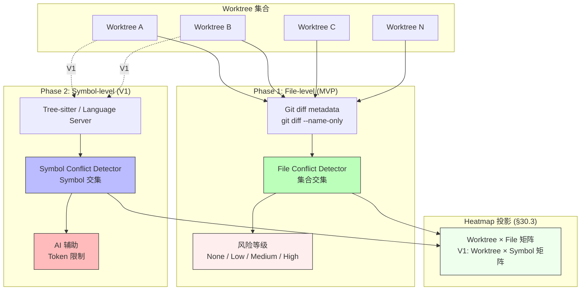

# RFC-029: Worktree Conflict Detection

> **状态**: Proposed
> **作者**: Mavis(Star 架构师)
> **创建日期**: 2026-08-25
> **最后更新**: 2026-08-25
> **相关 ADR**: ADR-029
> **相关 Requirement**: REQ-WT-004, REQ-COLLAB-002
> **相关 upstream**:
> - 《Basic Design》§4.1.6 Conflict Intelligence, §10 ADR-029, §22.4 Conflict Detection
> - 《Requirements》§22 Worktree Orchestration, §10 Collaboration
> - 《Module Spec》domain-worktree-spec.md
> - 《PoC Spec》poc-024-file-level-conflict.md, poc-025-symbol-level-feedback.md

---

## 摘要

本 RFC 提议 Worktree Conflict Detection 采用"第一阶段 File-level,第二阶段 Symbol-level"的渐进策略:File-level 通过 Git diff metadata 实现(快速、低成本),Symbol-level 通过本地解析器 + AI 辅助实现(精准、高成本)。本决策支撑 §30.2 MVP Must Have 的 Basic Conflict Detection 与 §30.3 V1 Should Have 的 Symbol-level Conflict,缓解 RISK-028 Worktree Conflict Explosion。

## 动机

### 背景

Vibe Coding 平台中,多 Worktree 并行执行时,跨 Worktree 冲突检测是关键能力(《Basic Design》§22.4):

1. **File-level Conflict**:Worktree A 修改了文件 X,Worktree B 也修改了文件 X,合并时可能冲突
2. **Symbol-level Conflict**:Worktree A 修改了 function foo(),Worktree B 修改了 function bar(),可能无冲突(不同 Symbol)

如果冲突检测不准确:

1. **过度告警**:不同 Symbol 误判为冲突,用户困扰
2. **漏报**:真正冲突未检测,合并失败
3. **性能问题**:冲突检测慢,影响 UI 体验
4. **成本问题**:全文 AI 分析成本爆炸

### 现状

传统方案在 Vibe Coding 平台中通常采用以下简化模型:

- **方案 A 候选**:全文 AI 分析(把所有文件交给 LLM 判断冲突)
- **方案 B 候选**:File-level 通过 Git diff metadata,Symbol-level 通过本地解析器 + AI 辅助(本设计选定)
- **方案 C 候选**:推迟到 V2

这些方案都不能满足以下需求:

1. **第一阶段可行**:MVP 必须有 Basic Conflict Detection(§30.2)
2. **第二阶段精准**:V1 Symbol-level Conflict(§30.3)
3. **成本控制**:全文 AI 分析成本爆炸
4. **缓解 RISK-028 Conflict Explosion**

### 解决目标

1. MVP 阶段:File-level Conflict Detection(基于 Git diff metadata)
2. V1 阶段:Symbol-level Conflict Detection(基于 Tree-sitter / Language Server + AI 辅助)
3. Heatmap 投影:跨 Worktree 修改文件矩阵
4. 风险等级:None / Low(1-2 file) / Medium(3-5) / High(>5 或核心文件)
5. 性能:100 Worktree / 10k File 下,Conflict 检测 < 1s

## 详细设计

### 决策(Decision)

**采用方案 B**:File-level 通过 Git diff metadata,Symbol-level 通过本地解析器 + AI 辅助(《Basic Design》§4.1.6,§22.4)。

### 替代方案(Alternatives Considered)

#### 方案 A: 全文 AI 分析

- 描述:把 Worktree A / B 的所有修改文件交给 LLM,LLM 判断是否冲突
- 优点:
  - 简单,直接 LLM 判断
  - 看起来"智能"
- 缺点:
  - **成本爆炸**:每次 Conflict Detection 调用 LLM,Token 消耗大
  - **延迟高**:LLM 推理慢(>5s),UI 体验差
  - **不可控**:LLM 决策不可解释
  - **不可测试**:LLM 输出不稳定
  - **违反 §26.1"Context Compiler 必须是确定性"**
- 拒绝理由:成本爆炸、延迟高、不可控

#### 方案 B: File-level 通过 Git diff metadata,Symbol-level 通过本地解析器 + AI 辅助(选定)

- 描述:MVP 阶段 File-level 通过 `git diff --name-only` 等 Git 命令获取修改文件列表,做集合交集判断;V1 阶段 Symbol-level 通过 Tree-sitter / Language Server 提取 Symbol 列表,做 Symbol 级别交集判断(AI 仅辅助决策)
- 优点:
  - **MVP 可行**:Git diff 命令快速(< 100ms),无 AI 成本
  - **第二阶段精准**:V1 Symbol-level 基于本地解析器,AI 仅辅助
  - **成本可控**:本地解析器 + 有限 AI 辅助
  - **可测试**:File-level 算法确定性,可单元测试
  - **可重放**:Git diff metadata 可复现
- 缺点:
  - File-level 可能过度告警(不同 Symbol 误判)
  - Symbol-level 依赖 Language Server 集成
- **本设计选定**

#### 方案 C: 推迟到 V2

- 描述:Worktree Conflict Detection 整体推迟到 V2 阶段
- 优点:
  - 避免早期实施成本
- 缺点:
  - **违反 §30.2 MVP Must Have "Basic Conflict Detection"**
  - 多 Worktree 并行场景无冲突预警,合并风险高
- 拒绝理由:违反 §30.2 MVP Must Have

## 后果

### 正面后果(Positive Consequences)

1. **MVP 可行**:File-level 基于 Git diff,实施成本低
2. **第二阶段精准**:V1 Symbol-level 基于本地解析器 + AI 辅助
3. **成本可控**:本地解析器 + 有限 AI 辅助
4. **Heatmap 投影**(§30.3 V1):跨 Worktree 修改文件矩阵
5. **风险等级分类**:None / Low / Medium / High
6. **性能可控**:100 Worktree / 10k File 下 < 1s
7. **缓解 RISK-028 Worktree Conflict Explosion**

### 负面后果(Negative Consequences / Trade-offs)

1. **File-level 可能过度告警**:不同 Symbol 误判为冲突
2. **Symbol-level 依赖 Language Server 集成**(V1)
3. **AI 辅助决策成本**:Symbol 级别需要 AI 二次确认时,Token 消耗
4. **Heatmap 投影复杂度**:跨 Worktree 聚合查询

### 风险(Risks)

| ID | 风险 | 影响 | 缓解措施 |
|---|---|---|---|
| **RISK-A29-1** | Worktree Conflict Explosion | Medium | File-level 第一阶段(§4.1.6);Heatmap 投影;Symbol-level 推迟 V1 |
| **RISK-A29-2** | File-level 过度告警 | Medium | UI 明确"File-level 告警,可能不同 Symbol";V1 Symbol-level 精确化 |
| **RISK-A29-3** | Conflict Detection 性能 | Low | Git diff 缓存;Heatmap 预计算;增量更新 |
| **RISK-A29-4** | AI 辅助成本 | Low | AI 仅在 File-level 告警后调用;Token 限制;Fallback 为 File-level |
| **RISK-A29-5** | Language Server 集成成本(V1) | Medium | POC-025 提前验证;选 1-2 种语言试点 |

## 实施计划

### 依赖

- 上游:ADR-016 Worktree First-class(Worktree 聚合)
- 上游:ADR-027 ChangeSet Storage(修改文件列表)
- 上游:ADR-028 Symbol Analysis Strategy(V1 依赖 Symbol Index)
- 平级:ADR-024 Context Compiler(Conflict 信息进 Context Packet)
- 下游:domain-worktree Module Conflict 子模块
- PoC 验证:poc-024 File-level Conflict(必做),poc-025 Symbol-level Feedback(V1 候选)

### 阶段

1. **Phase 1(MVP)**:File-level Conflict Detection(基于 `git diff --name-only`);Heatmap 投影基础版;风险等级分类;100 Worktree / 10k File 下 < 1s
2. **Phase 2(V1)**:Symbol-level Conflict Detection(基于 Tree-sitter / Language Server + AI 辅助);Heatmap 完整版(包含 Symbol 维度);Saved Worktree Views 个性化
3. **Phase 3(V2)**:Semantic Conflict Detection(AI 辅助,基于 Embedding);Cross-Worktree Dependency Graph;Conflict Resolution Recommendations

### 回滚策略

如果 Worktree Conflict Detection 在 MVP 阶段遇到严重问题,降级方案:

1. **Phase 1 降级**:风险等级简化为 2 级(无冲突 / 有冲突),无 Low/Medium/High 细分
2. **Phase 2 降级**:Heatmap 推迟到 V1,MVP 仅做 Conflict Detection
3. **Phase 3 降级**:推迟 Symbol-level Conflict,MVP 维持 File-level

回滚触发条件:Conflict Detection P95 > 1s,过度告警率 > 30%

## 待决问题(Open Questions)

1. **核心文件定义**:哪些文件算"核心文件"?(`package.json` / `Cargo.toml` / 配置文件?)
2. **Heatmap 实时性**:Heatmap 触发式(Worktree 状态变更)还是定时计算?
3. **Conflict Resolution 建议**:Worktree Conflict 出现时,是否给出 Merge 建议?MVP 不做
4. **AI 辅助触发条件**:何时调用 AI 二次确认?所有 File-level 冲突,还是仅核心文件?
5. **跨 Project 冲突**:同 Repository 跨 Project Worktree 是否算冲突?(应该算,但 tenant_id 隔离)

## 评审检查清单(Code Review Checklist)

1. [ ] File-level Conflict Detection 是否基于 Git diff metadata(`git diff --name-only`)
2. [ ] Heatmap 投影是否实现(跨 Worktree 修改文件矩阵)
3. [ ] 风险等级是否分类(None / Low(1-2 file) / Medium(3-5) / High(>5 或核心文件))
4. [ ] 100 Worktree / 10k File 下,Conflict Detection P95 < 1s
5. [ ] 过度告警时是否提示"File-level 告警,可能不同 Symbol"
6. [ ] Symbol-level Conflict Detection 是否在 V1 实现(基于 Tree-sitter / Language Server)
7. [ ] AI 辅助是否仅在 File-level 告警后调用,Token 限制
8. [ ] tenant_id / workspace_id / project_id 三级隔离是否生效
9. [ ] Conflict 信息是否进入 Context Packet(§24,§26)
10. [ ] 核心文件定义是否明确(`package.json` / `Cargo.toml` / 配置文件)

## 替代方案 ADR 引用

- ADR-001~015(原文档,本仓库未提供)
- 本仓库内 ADR-029(本 RFC 提请)
- 相关 ADR:ADR-016(Worktree First-class),ADR-027(ChangeSet Storage),ADR-028(Symbol Analysis)

## 变更历史

| 日期 | 版本 | 变更 |
|---|---|---|
| 2026-08-25 | v0.1 | 初稿 |

## 附录 A:关键示意

**图示说明**:

- 实线箭头 = MVP 阶段流程
- 虚线箭头 = V1 阶段流程
- 绿色 = File-level Conflict Detector(MVP)
- 蓝色 = Symbol-level Conflict Detector(V1)
- 红色 = AI 辅助(Token 限制)
- 浅绿 = Heatmap 投影
- 浅红 = 风险等级
- **关键不变量**:MVP File-level,V1 Symbol-level,符合 §30.2 MVP Must Have
