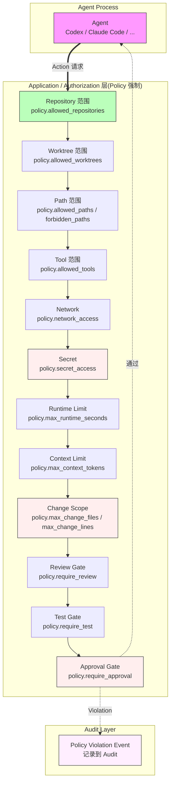

# RFC-030: Agent Policy Enforcement

> **状态**: Proposed
> **作者**: Mavis(Star 架构师)
> **创建日期**: 2026-08-25
> **最后更新**: 2026-08-25
> **相关 ADR**: ADR-030
> **相关 Requirement**: REQ-PERM-002, REQ-SEC-001, REQ-SEC-002, REQ-SEC-003
> **相关 upstream**:
> - 《Basic Design》§4.2.5 Policy 强制点, §10 ADR-030, §24.3 Policy 强制清单
> - 《Requirements》§16 Security & Tenant Isolation, §11 Permission & Automation
> - 《Security Design》security-design.md 第 3 章 Agent Policy
> - 《Module Spec》domain-agent-spec.md
> - 《PoC Spec》poc-029-agent-policy-enforcement.md

---

## 摘要

本 RFC 提议 Agent Policy 必须由 Application / Authorization 层强制执行(不能仅靠 Prompt),12 个强制点覆盖 Repository / Worktree / Path / Tool / Network / Secret / Runtime / Context / Change Scope / Review / Test / Approval 全维度。本决策是 RISK-017 Agent Escapes Worktree Scope 的核心缓解,符合 REQ-PERM-002 硬约束。

## 动机

### 背景

Vibe Coding 平台的 Agent Policy 是安全防御的最后一道闸门(《Basic Design》§24.3)。如果仅靠 Prompt 约束 Agent 行为,Agent 可能因以下原因越权:

1. **Prompt Injection**:Untrusted Content 覆盖 Prompt 指令(§4.10.7)
2. **Hallucination**:Agent 误判可执行范围
3. **Context Pollution**:Context 污染导致 Agent 误读 Policy
4. **Vendor SDK Bug**:Agent SDK 漏洞导致越权

如果 Policy 由 Application / Authorization 层强制执行,即使 Agent 越权,Application 层也会拦截,确保 Policy 不可绕过。

### 现状

传统方案在 Vibe Coding 平台中通常采用以下简化模型:

- **方案 A 候选**:Prompt 约束(在 Prompt 中告诉 Agent "不要修改 xxx")
- **方案 B 候选**:Application 层 Policy Enforcement(本设计选定)

这些方案都不能满足以下需求:

1. **多层防御**:不能仅靠 Prompt(可绕过)
2. **12 个强制点全覆盖**:Repository / Worktree / Path / Tool / Network / Secret / Runtime / Context / Change Scope / Review / Test / Approval
3. **缓解 RISK-017 Agent Escapes Worktree Scope**

### 解决目标

1. Policy 必须由 Application / Authorization 层强制执行
2. 12 个强制点(Repository / Worktree / Path / Tool / Network / Secret / Runtime / Context / Change Scope / Review / Test / Approval)全覆盖
3. Agent 越权时,Application 层立即拒绝,不依赖 Agent 自觉
4. Policy 误配置不影响合法 Agent 行为
5. 缓解 RISK-017 Agent Escapes Worktree Scope

## 详细设计

### 决策(Decision)

**采用方案 B**:Application 层 Policy Enforcement,12 个强制点全覆盖(《Basic Design》§4.2.5,§24.3,REQ-PERM-002)。

### 替代方案(Alternatives Considered)

#### 方案 A: Prompt 约束

- 描述:在 Prompt 中告诉 Agent "不要修改 xxx / 不要访问 yyy / 不要执行 zzz",依赖 Agent 自觉
- 优点:
  - 实施简单,无需 Application 层改造
  - 灵活,Prompt 可根据场景调整
- 缺点:
  - **可绕过**:Agent 可能因 Prompt Injection / Hallucination / Context Pollution 越权
  - **不可强制**:Agent 越权后,Application 层无法拦截
  - **违反 REQ-PERM-002 硬约束**
  - **违反 §24.3 "Policy 必须由 Application / Authorization 层强制"**
- 拒绝理由:违反 REQ-PERM-002、可绕过

#### 方案 B: Application 层 Policy Enforcement(选定)

- 描述:Policy 由 Application / Authorization 层强制执行,12 个强制点(Repository / Worktree / Path / Tool / Network / Secret / Runtime / Context / Change Scope / Review / Test / Approval)全覆盖
- 优点:
  - **多层防御**:即使 Agent 越权,Application 层拦截
  - **12 个强制点全覆盖**:全维度 Policy 强制
  - **不可绕过**:Policy 在 Application 层,与 Agent 解耦
  - **缓解 RISK-017 Agent Escapes Worktree Scope**
  - **符合 REQ-PERM-002 硬约束**
- 缺点:
  - 实施成本高:12 个强制点需独立实现
  - Policy 误配置可能影响合法 Agent 行为
- **本设计选定**

## 后果

### 正面后果(Positive Consequences)

1. **多层防御**:即使 Agent 越权,Application 层拦截
2. **12 个强制点全覆盖**:全维度 Policy 强制
3. **不可绕过**:Policy 在 Application 层,与 Agent 解耦
4. **缓解 RISK-017 Agent Escapes Worktree Scope**
5. **符合 REQ-PERM-002 硬约束**
6. **符合 §24.3 Policy 强制清单**
7. **AI Audit 完整**:Policy Violation 事件记录到 Audit

### 负面后果(Negative Consequences / Trade-offs)

1. **实施成本高**:12 个强制点需独立实现
2. **Policy 误配置风险**:可能影响合法 Agent 行为
3. **Performance Overhead**:Policy 检查增加延迟
4. **Policy 模板管理**:Project / Tenant Policy 模板需管理

### 风险(Risks)

| ID | 风险 | 影响 | 缓解措施 |
|---|---|---|---|
| **RISK-A30-1** | Policy 误配置 | High | Policy 模板;Dry-run 模式;变更审计;PoC 029 验证 |
| **RISK-A30-2** | Policy 检查性能开销 | Low | 静态规则预编译;批量检查;按需启用 |
| **RISK-A30-3** | Policy 模板不灵活 | Medium | Project Policy 自定义;Tenant Policy 继承;UI 模板编辑器 |
| **RISK-A30-4** | Agent 绕过 Application 层 | Low | Application 层是必经路径;Audit 强制 |
| **RISK-A30-5** | Policy Violation 处理复杂 | Medium | 明确分类(Warning / Block / Audit);Agent 反馈机制 |

## 实施计划

### 依赖

- 上游:ADR-018 Local Runtime Architecture(Policy 在 Local Runtime 强制)
- 上游:ADR-019 Local Runtime Security Model(Filesystem / Process Scope)
- 上游:ADR-021 Agent Adapter Model(Adapter 解析 Tool Call)
- 平级:ADR-016 Worktree First-class(Worktree Scope)
- 下游:domain-agent Module Policy 子模块
- 下游:domain-permission Module
- PoC 验证:poc-029 Agent Policy Enforcement(必做,12 个强制点全部验证)

### 阶段

1. **Phase 1(MVP)**:12 个强制点全部实现;AgentPolicy 值对象;Project Policy 模板;Policy Violation 事件;POC-029 验证
2. **Phase 2(V1)**:Agent Policy Templates 库;Tenant Policy 继承;Policy Dry-run 模式;Policy Performance Analysis
3. **Phase 3(V2)**:AI 辅助 Policy 推荐;Policy 异常行为检测;Cross-Agent Policy Sharing

### 回滚策略

如果 Agent Policy Enforcement 在 MVP 阶段遇到严重问题,降级方案:

1. **Phase 1 降级**:12 个强制点简化为 6 个(Repository / Worktree / Path / Tool / Network / Secret),其他推迟
2. **Phase 2 降级**:Policy 模板推迟,仅支持硬编码 Policy
3. **Phase 3 降级**:Policy Violation 事件简化为日志,不写入 Audit

回滚触发条件:Policy 检查 P95 > 50ms(每次 Agent Action),Policy 误配置导致合法 Agent 被拦截率 > 5%

## 待决问题(Open Questions)

1. **Policy 模板管理**:Project Policy 模板由 Project Owner 还是 Tenant Admin 管理?
2. **Tenant Policy 继承**:子 Project 是否继承 Tenant Policy?如何 override?
3. **Policy 误配置影响**:Policy 误配置时,是 Block 模式还是 Warning 模式?需要 Product / SRE 共同决定
4. **Policy Violation 反馈**:Agent 触发 Policy Violation 时,如何反馈给 Agent?是返回错误,还是静默拦截?
5. **Policy 性能开销**:12 个强制点同时检查,延迟是否可接受?需 POC-029 测量

## 评审检查清单(Code Review Checklist)

1. [ ] 12 个强制点是否全部实现(Repository / Worktree / Path / Tool / Network / Secret / Runtime / Context / Change Scope / Review / Test / Approval)
2. [ ] AgentPolicy 值对象是否包含 12 个强制点对应字段(allowed_repositories / allowed_worktrees / allowed_paths / forbidden_paths / allowed_tools / allowed_command_categories / network_access / secret_access / max_runtime_seconds / max_context_tokens / max_change_files / max_change_lines / require_review / require_test / require_approval)
3. [ ] Policy 是否由 Application / Authorization 层强制(非仅 Prompt)
4. [ ] Policy 误配置是否通过 Dry-run 模式验证
5. [ ] Policy Violation 事件是否记录到 Audit
6. [ ] POC-029 验证:越权 Path / Tool / Network / Secret 全部被拦截
7. [ ] Agent Policy Templates 库是否实现(V1)
8. [ ] Tenant Policy 继承是否实现(V1)
9. [ ] Policy 检查 P95 < 50ms(每次 Agent Action)
10. [ ] RISK-017 Agent Escapes Worktree Scope 监控指标是否设置

## 替代方案 ADR 引用

- ADR-001~015(原文档,本仓库未提供)
- 本仓库内 ADR-030(本 RFC 提请)
- 相关 ADR:ADR-018(Local Runtime Architecture),ADR-019(Local Runtime Security Model),ADR-021(Agent Adapter Model)

## 变更历史

| 日期 | 版本 | 变更 |
|---|---|---|
| 2026-08-25 | v0.1 | 初稿 |

## 附录 A:关键示意

**图示说明**:

- 双线箭头 = Agent Action 请求(必经路径)
- 虚线箭头 = 违反 / 通过结果
- 紫色 = Agent(被 Policy 强制约束)
- 绿色 = 前 6 个强制点(Repository / Worktree / Path / Tool / Network / Secret)
- 红色 = 后 6 个强制点(Runtime / Context / Change Scope / Review / Test / Approval)
- 浅红 = Audit 记录(Policy Violation 事件)
- **关键不变量**:Policy 强制在 Application 层,不依赖 Prompt 约束
