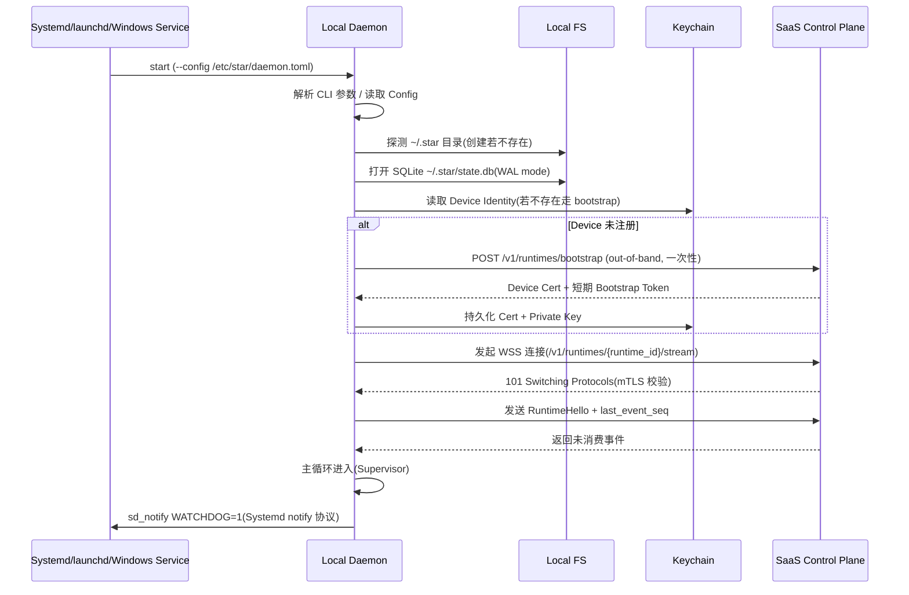
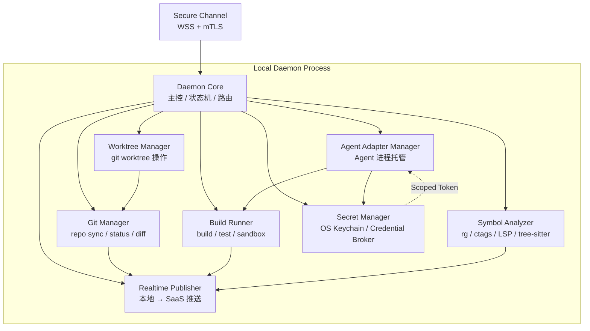
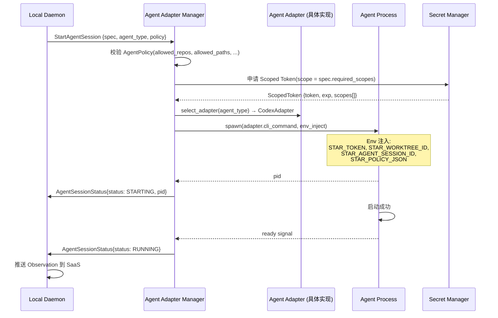
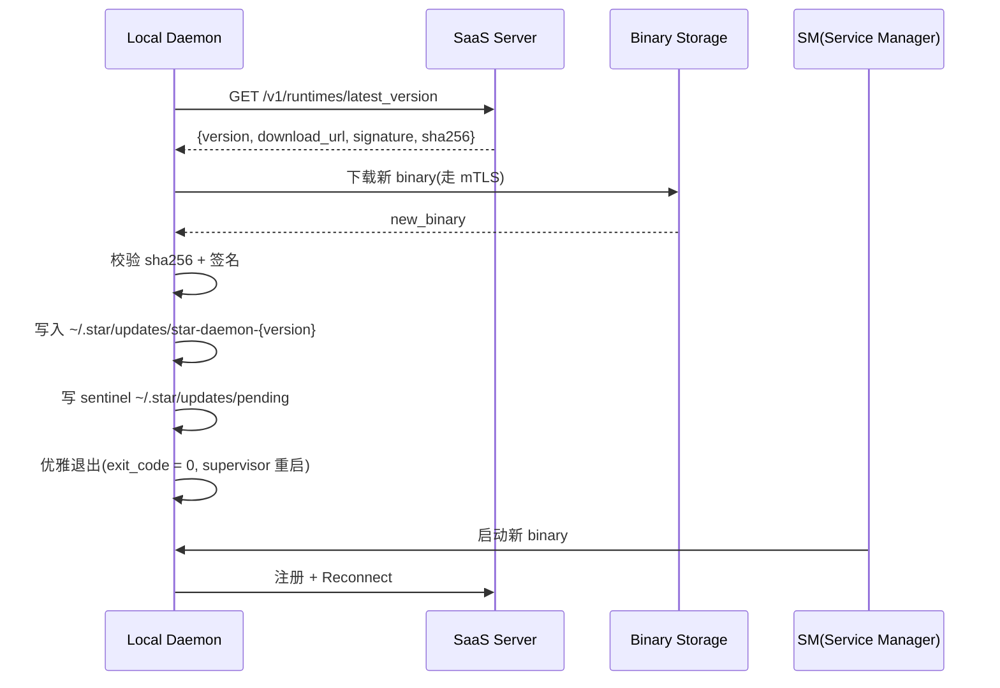
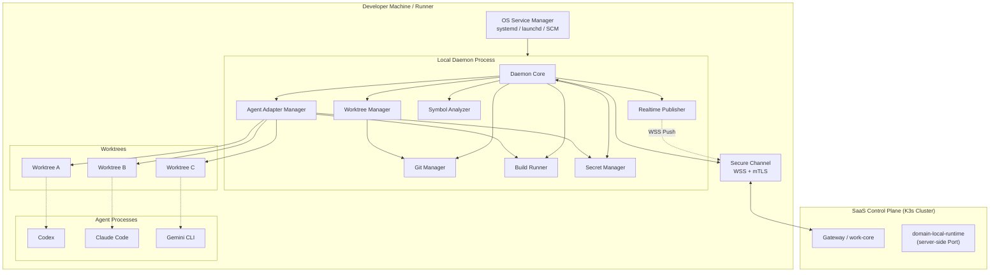
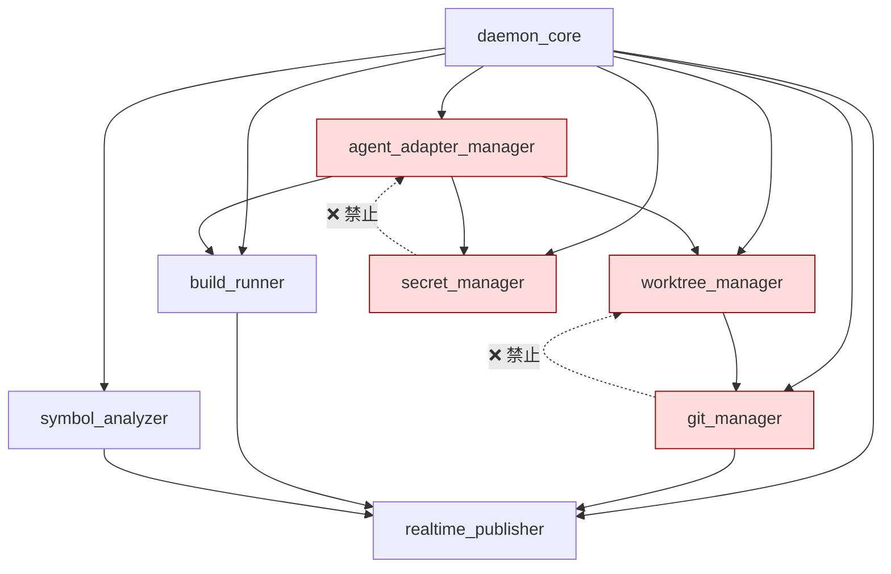
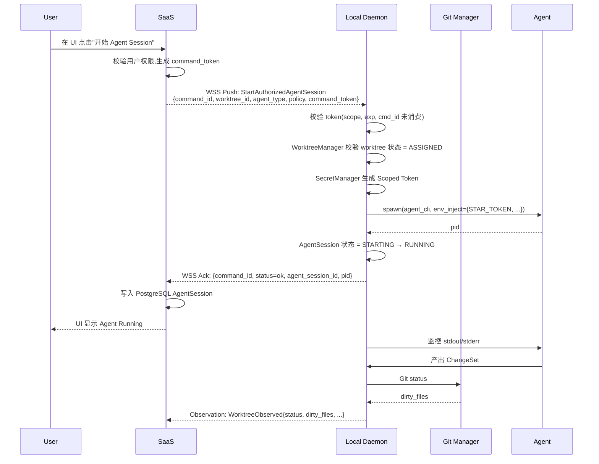
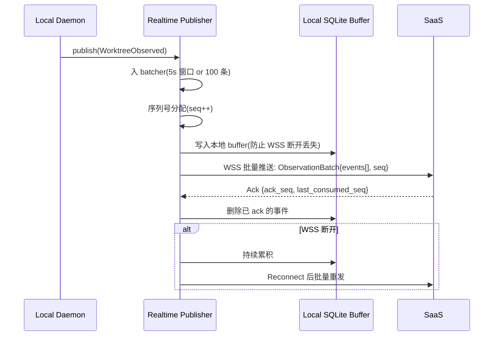
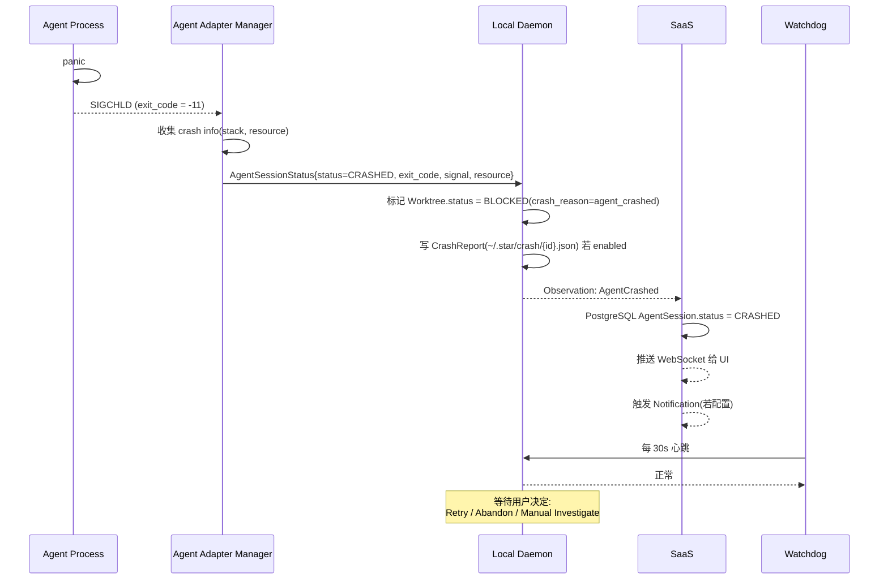
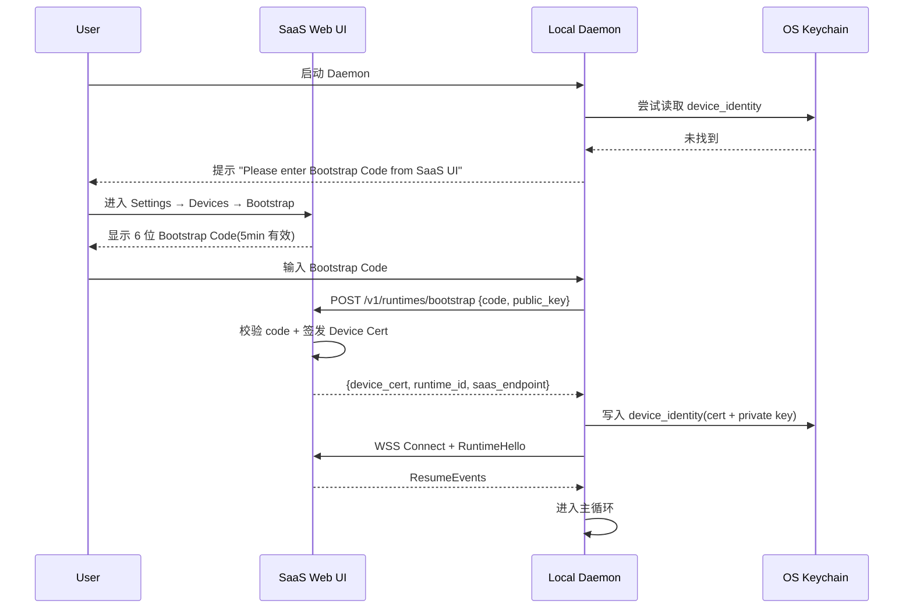

# Star 平台《Runtime Design》(Local Daemon 详细设计)

> **文档版本**: v0.2 (2026-08-26)
> **修订历史**:
>
> | 版本 | 日期 | 变更 | 审批者 |
> |---|---|---|---|
> | v0.1 | 2026-08-25 | 初始版本 | — |
> | v0.2 | 2026-08-26 | 同步 basic-design 5f1ea5b(Gitea/Forgejo Adapter V1 提前,8 种白名单命令不变) | — |
> **上游**: `docs/requirements.md` v2.0,`docs/basic-design.md` v0.1,`docs/api-design.md` v0.1,`docs/security-design.md` v0.1
> **下游**: Implementation(Rust Local Daemon 二进制 crate)、Operation(Self-hosted Runner / Cloud Workspace 部署)
> **文档定位**: 本文档定义 **Local Daemon 二进制进程** 的内部架构与外部契约。**不**讨论服务器侧 `domain-local-runtime` crate(后者见《Basic Design》§4.6)。

---

## 上游同步 2026-08-26(继承 basic-design 5f1ea5b)

> 本设计书跟随《基本設計書》5f1ea5b 同步,引入以下变更。**不**改 8 种白名单命令 / 16 强制项 / mTLS 设备鉴权:
>
> | 同步项 | 落位 |
> |---|---|
> | **S3** REQ-SCM-003(Gitea/Forgejo Adapter V1) | §5.5.x 注释:Local Daemon 调用的 SCM Adapter 现已包含 Gitea/Forgejo(V1);8 种白名单命令不变,Repository 注册 endpoint 接受 `provider: 'gitea' | 'forgejo'` |
> | **S4** AgentSession `token_usage` / `cost_summary` | §10.1 性能预算注释:V1 候选,Local Daemon 可选上报 token 增量(节流上报,默认 30s) |
>
> **不变量保留**:Local Daemon 8 种白名单命令 / 16 强制项 / mTLS 设备鉴权全部不动。

---

## 0. 文档说明

### 0.1 文档目的与定位

本文档对应《Basic Design》§0.1 列出的"Runtime Design"详细设计阶段,产出 Local Daemon 进程的:

- 进程模型(单进程多协程 vs 多进程、启动方式、跨平台)
- 内部模块划分(Daemon Core / Worktree Manager / Agent Adapter / Git Manager / Build Runner / Symbol Analyzer / Secret Manager / Realtime Publisher)
- 与 SaaS Control Plane 的通信协议(WS / mTLS / Command Token,继承《API Design》§7)
- Worktree 管理、Agent 进程管理、Build/Test 流程、Symbol Analysis、Secret 管理
- 本地配置、日志、升级、安全边界(继承《Security Design》§9.3)
- 给 Implementation 任务分解 / Operation 部署策略 / Test 端到端场景的契约

### 0.2 与 `domain-local-runtime` 的关键区分(继承《Basic Design》§4.6.1 强制约束)

| 维度 | 服务器侧 `domain-local-runtime` crate | Local Daemon 二进制 |
|---|---|---|
| **运行位置** | K3s Cluster 内,work-core 进程地址空间 | Developer Machine / Self-hosted Runner / Cloud Workspace,集群外 |
| **角色** | Runtime Registry / Port(管理集群外 Runtime 注册) | Worktree 实际操作 / Agent 进程托管 / Symbol 分析 |
| **部署形态** | Rust crate,容器化,与 work-core 同生命周期 | 独立 Rust binary,通过 OS Service Manager 启动(macOS launchd / Linux systemd / Windows Service) |
| **依赖方向** | 被 work-core 引用 | 主动发起 HTTPS/WSS 到 work-core |
| **安全边界** | 服务器侧 mTLS 端点 | 客户端 mTLS + Device Identity + Command Token + Command 白名单 |
| **代码仓库** | `crates/domain-local-runtime` | `crates/local-daemon` (独立 binary) |
| **数据 SoR** | PostgreSQL(Registration / Command Audit) | 本地 SQLite(状态镜像) + PostgreSQL 镜像(Sync 走 NATS) |

**严禁混淆**:本文档后续所有"Runtime"均指 Local Daemon 二进制。服务器侧 crate 仅在跨边界通信章节简述。

### 0.3 命名约定

- **Local Daemon**:本地长驻进程,Rust binary,本设计主角
- **Worktree**:git worktree 创建的隔离开发目录(继承《Basic Design》§22.1)
- **AgentSession**:服务器侧逻辑会话,Local Daemon 仅执行宿主进程
- **Command Token**:每次调用的 5 分钟短期凭据(继承《API Design》§7.2)
- **Device Identity**:Local Daemon 启动时注册的 X.509 设备证书(继承《Security Design》§2.4)
- **Secure Channel**:基于 mTLS 的双向认证 WSS 长连接(继承《API Design》§7.1)
- **Observed State**:Local Daemon 上报的高频运行时状态,非业务事实(继承《Basic Design》§5.2)
- **Reconciliation**:Desired State ↔ Observed State 对齐(继承《Requirements》§22.6)

### 0.4 受众

- Implementation 工程师(`crates/local-daemon` Rust crate)
- SRE / Platform(Self-hosted Runner 部署、Cloud Workspace 镜像)
- 安全 / 合规(Local Runtime 安全边界履行,继承《Security Design》§9.3)
- Test(端到端 Daemon ↔ SaaS 场景,继承《Test Design》§5)

### 0.5 引用规则

- `§N` 引用《Requirements》v2.0 章节号(最大 §47),或显式标注"(原文档 §N)"指向原始提示词编号
- 引用《Basic Design》使用 `《Basic Design》§X`
- 引用《API Design》使用 `《API Design》§X`
- 引用《Data Design》使用 `《Data Design》§X`
- 引用《Security Design》使用 `《Security Design》§X`

---

## 1. Local Daemon 进程模型

### 1.1 进程拓扑:单进程多协程(Tokio Runtime)

Local Daemon 采用**单进程多协程**模型,理由(继承《Basic Design》§13.4 K8s Tax 纪律、§23.1 集群外轻量):

```text
1. 启动快(< 200ms),与系统服务管理器契合(Systemd / launchd / SCM)
2. 资源占用低(RSS < 150MB Idle / < 500MB Peak),适合 Developer Laptop
3. Worktree / Agent / Build 状态共享同一份本地 SQLite,避免 IPC 一致性问题
4. Tokio 多协程足以处理数千 Worktree 注册与并发 Agent 子进程管理
5. Crash Recovery 简单(整个 Daemon 进程重启,本地 SQLite 是 SoR,Secure Channel 重新建立)
```

**不采用多进程模型的核心理由**:

- 多 Worktree 之间需要共享 Git LFS Cache / Symbol Index Cache,跨进程访问成本高
- Agent 子进程死亡时需要与父 Daemon 强一致性状态同步,多进程模型需要分布式协调
- 跨平台进程模型差异(macOS Process Group / Linux cgroup / Windows Job Object)需分别实现

**多协程内部拓扑**(Tokio Runtime,3 个 Runtime):

| Tokio Runtime | 角色 | 线程模型 | 主要任务 |
|---|---|---|---|
| `rt_main` | 主控 + 业务 | Multi-thread(默认 N=CPU 核数) | WSS 收发、命令分发、状态机、Worktree Manager、Symbol Analyzer、Secret Manager |
| `rt_agent_supervisor` | Agent 进程管理 | Multi-thread(N=CPU 核数/2) | Agent 子进程 spawn / signal / OOM 监控 / 子进程 stdout/stderr pump |
| `rt_io` | I/O 密集 | Dedicated Thread Pool(N=8) | 大 Diff 落盘、Build Log 写盘、Test Log 实时 tail、Symbol Index 写入 |

### 1.2 启动流程

#### 1.2.1 通用启动序列



#### 1.2.2 三平台启动封装

| 平台 | 服务管理器 | 安装包 | 启动命令 | 自启动 |
|---|---|---|---|---|
| **macOS** | launchd | `Star Daemon.pkg` | `launchctl load /Library/LaunchDaemons/com.star.daemon.plist` | 安装时登记 LaunchDaemon |
| **Linux** | systemd | `star-daemon_*.deb` / `star-daemon-*.rpm` | `systemctl enable --now star-daemon` | 安装时 enable |
| **Windows** | SCM(Service Control Manager) | `StarDaemon.msi` | `sc create StarDaemon binPath=...` | 安装时登记 SCM |

**通知协议**(SD_NOTIFY 跨平台等价):

- Linux:`sd_notify(socket, "READY=1\nWATCHDOG_USEC=30000000\n")`(继承 systemd 协议)
- macOS:`launchctl bootstrap` 完成后 Daemon 向 stdin/stdout 写 `READY=1` 行(简化协议,launchd 不强制)
- Windows:SCM `SetServiceStatus(SERVICE_RUNNING)`(Win32 API)

### 1.3 跨平台差异处理

| 维度 | macOS | Linux | Windows |
|---|---|---|---|
| **进程隔离** | `posix_spawn` + `setrlimit` | `clone(CLONE_NEWPID)` + cgroup v2 | Job Object + Restricted Token |
| **文件系统监控** | FSEvents | inotify | ReadDirectoryChangesW |
| **进程树监控** | `kqueue` EVFILT_PROC | `waitid` / procfs | Job Object notifications |
| **资源限制** | `setrlimit(RLIMIT_*)` | cgroup v2 + `setrlimit` | Job Object + `SetProcessWorkingSetSize` |
| **符号链接** | symlink | symlink | symlink(需 Developer Mode 或 SeCreateSymbolicLinkPrivilege) |
| **Keychain** | Keychain Services | Secret Service API(libsecret) / kwallet | Credential Manager(DPAPI) |
| **文件锁** | `flock(2)` | `flock(2)` | `LockFileEx` |
| **Git 二进制** | 需自带 libgit2 或外部 git | 需自带 libgit2 或外部 git | 需自带 libgit2 或外部 git |

**统一抽象层**(本 Daemon 内部 crate):

```text
crates/local-daemon/
  src/
    platform/
      mod.rs              # trait ProcessOps, FsNotify, KeychainStore
      macos.rs            # macOS 实现
      linux.rs            # Linux 实现
      windows.rs          # Windows 实现
    process/
      supervisor.rs       # Agent 子进程托管(基于 platform::ProcessOps)
    fs/
      watch.rs            # 文件变更监控(基于 platform::FsNotify)
    secret/
      store.rs            # 凭据存取(基于 platform::KeychainStore)
```

### 1.4 资源限制(继承《Requirements》§23.5 Fault Model)

| 资源 | Default | Hard Cap | 配置项 |
|---|---|---|---|
| **RSS Idle** | 80MB | 200MB | `[resource] rss_idle_max_mb` |
| **RSS Peak** | 350MB | 800MB | `[resource] rss_peak_max_mb` |
| **CPU 占用** | < 5%(Idle) / < 30%(压测) | < 50% | `[resource] cpu_quota_percent` |
| **Open File Descriptors** | 256 | 8192 | `[resource] nofile` |
| **线程数** | min(N核,8) | 64 | `[resource] worker_threads` |
| **子进程数**(Agent + Build) | 8 | 64 | `[resource] max_concurrent_children` |
| **磁盘占用**(`~/.star`) | 1GB | 10GB | `[resource] disk_quota_gb` |
| **WAL 大小**(SQLite) | 64MB | 1GB | `[resource] sqlite_wal_max_mb` |

**超限响应**:

- 软限:记录 metric + 触发 GC
- 硬限:`worktree_lifecycle` 进入 DEGRADED 状态,新 Worktree 创建请求被拒绝(返回 `E_RUNTIME_RESOURCE_LIMIT`)

---

## 2. 内部模块划分

### 2.1 模块全景(继承《Basic Design》§1.1 / §2.1)

Local Daemon 内部按职责分为 8 个模块,运行在同一进程内的不同 Tokio 协程中,模块间通过 `tokio::sync::mpsc` channel 通信:



### 2.2 模块职责与接口签名

#### 2.2.1 Daemon Core(`daemon_core`)

**职责**:
- 启动 / 关闭 / Watchdog
- 配置加载 / 热更新监听(`SIGHUP`)
- 路由 SaaS Command 到对应 Manager
- 维护本地状态机(Worktree / AgentSession)
- 周期 Heartbeat(默认 30s,可配)

**核心 Trait**(签名级别,非实现):

```rust
// crates/local-daemon/src/core/mod.rs
pub trait DaemonCore: Send + Sync {
    async fn start(&self) -> Result<(), CoreError>;
    async fn shutdown(&self, reason: ShutdownReason) -> Result<(), CoreError>;
    async fn dispatch(&self, cmd: SaaSCommand) -> Result<CommandResponse, CoreError>;
    async fn heartbeat_tick(&self) -> HeartbeatSnapshot;
    fn observed_state(&self) -> LocalObservedState;
}
```

#### 2.2.2 Worktree Manager(`worktree_manager`)

**职责**:
- `git worktree add/list/remove/move`
- Worktree 17 状态机(继承《Basic Design》§7.1)
- Conflict Detection(File-level,SHA 对比)
- Isolation 强制(继承《Requirements》§22.5)
- 与 Git Manager 协作

**核心 Trait**:

```rust
pub trait WorktreeManager: Send + Sync {
    async fn create(&self, req: CreateWorktreeRequest) -> Result<WorktreeId, WorktreeError>;
    async fn assign(&self, wt: WorktreeId, session: AgentSessionId) -> Result<(), WorktreeError>;
    async fn transition(&self, wt: WorktreeId, to: WorktreeStatus, reason: TransitionReason) -> Result<WorktreeStatus, WorktreeError>;
    async fn detect_conflicts(&self, repo: RepositoryId) -> Result<Vec<ConflictReport>, WorktreeError>;
    async fn cleanup(&self, wt: WorktreeId) -> Result<(), WorktreeError>;
    fn list(&self, filter: WorktreeFilter) -> Vec<WorktreeSummary>;
}
```

#### 2.2.3 Agent Adapter Manager(`agent_adapter_manager`)

**职责**:
- 启动 Agent 子进程(根据 Agent Type 选 Adapter)
- 维护 AgentSession 14 状态机(继承《Basic Design》§7.4)
- 监控子进程退出 / OOM / 超时
- 解析 Agent stdout/stderr → Observation
- 注入 Scoped Token + AgentPolicy Env

**核心 Trait**:

```rust
pub trait AgentAdapterManager: Send + Sync {
    async fn start(&self, spec: AgentSessionSpec) -> Result<AgentSessionId, AgentError>;
    async fn stop(&self, session: AgentSessionId, force: bool) -> Result<StopReport, AgentError>;
    async fn inject_feedback(&self, session: AgentSessionId, fb: FeedbackView) -> Result<(), AgentError>;
    async fn query_status(&self, session: AgentSessionId) -> Result<AgentSessionStatus, AgentError>;
    fn list_adapters(&self) -> Vec<AdapterDescriptor>;
}
```

#### 2.2.4 Git Manager(`git_manager`)

**职责**:
- 封装 `git2` libgit2(自包含,不依赖外部 git binary)
- 仓库 Clone / Pull / Push
- Diff 生成(unified format)
- Branch / Commit / Tag 操作
- 监听 git worktree 状态变更(FS Event → FSEvents / inotify / ReadDirectoryChangesW)

**核心 Trait**:

```rust
pub trait GitManager: Send + Sync {
    async fn clone(&self, url: &str, dst: &Path, cred: ScopedCredential) -> Result<RepoId, GitError>;
    async fn status(&self, repo: RepoId) -> Result<RepoStatus, GitError>;
    async fn diff(&self, repo: RepoId, from: Oid, to: Oid, max_bytes: usize) -> Result<DiffHandle, GitError>;
    async fn commit(&self, repo: RepoId, spec: CommitSpec) -> Result<Oid, GitError>;
    async fn push(&self, repo: RepoId, branch: &str, cred: ScopedCredential) -> Result<(), GitError>;
}
```

**Diff 限制**(继承《Basic Design》§5.1 REQ-DATA-002):

- > 1MB 或 > 10K 行 → 走 Object Storage,本地仅保存 ref
- 推送到 SaaS 时仅推 Ref + Summary,完整 Diff 走 S3-like

#### 2.2.5 Build Runner(`build_runner`)

**职责**:
- 检测构建工具(npm / cargo / go / mvn / gradle / pip)
- 沙箱执行(可选 Docker / Podman / 直接执行)
- 收集 Build Log / Test Result
- 推送 Validation Evidence

**核心 Trait**:

```rust
pub trait BuildRunner: Send + Sync {
    async fn detect_toolchain(&self, repo: RepoId) -> Result<Toolchain, BuildError>;
    async fn run_build(&self, spec: BuildSpec) -> Result<BuildResult, BuildError>;
    async fn run_test(&self, spec: TestSpec) -> Result<TestResult, BuildError>;
    fn supported_toolchains(&self) -> &[ToolchainKind];
}
```

**沙箱模型**(3 种可配置):

| 模型 | 隔离强度 | 兼容性 | 配置项 |
|---|---|---|---|
| **Direct**(直接 spawn) | 弱(靠 rlimit + chroot) | 100% | `[sandbox] mode = "direct"` |
| **Container**(Docker/Podman) | 中(进程级) | 95% | `[sandbox] mode = "container"` |
| **MicroVM**(Firecracker 候选,V1) | 强 | TBD | `[sandbox] mode = "microvm"` |

**Direct 模式** = 进程隔离(uid namespace / chroot / rlimit)+ 严格的 Command 白名单,**不**等于"无沙箱"。

#### 2.2.6 Symbol Analyzer(`symbol_analyzer`)

**职责**:
- 工具链抽象:rg(ripgrep)+ ctags + LSP + tree-sitter
- 增量分析(基于 mtime + hash)
- 本地 Cache(SQLite 索引表)
- 推送到 SaaS(节流,默认 5min 批量)

**核心 Trait**:

```rust
pub trait SymbolAnalyzer: Send + Sync {
    async fn index_file(&self, repo: RepoId, path: &Path) -> Result<SymbolIndexDelta, SymbolError>;
    async fn search(&self, repo: RepoId, query: SymbolQuery) -> Result<Vec<SymbolHit>, SymbolError>;
    async fn symbols_at(&self, repo: RepoId, file: &Path, line: u32) -> Result<Vec<SymbolRef>, SymbolError>;
    fn cache_stats(&self) -> SymbolCacheStats;
}
```

**工具链选择**(继承《Requirements》§20 Symbol-aware Repository Context):

| 语言 | 工具 | 优先级 |
|---|---|---|
| Rust | rust-analyzer(LSP)+ tree-sitter-rust | 1 |
| TypeScript / JavaScript | typescript-language-server + tree-sitter-typescript | 1 |
| Python | pylsp + tree-sitter-python | 1 |
| Go | gopls + tree-sitter-go | 1 |
| Java / Kotlin | jdtls / kotlin-language-server | 2 |
| C# | omnisharp-roslyn | 2 |
| Other | ctags + tree-sitter(对应 grammar) | 3 |

**不**集成 LSP Server(继承《Basic Design》§30.6 Non-Goals),只解析 Symbol / Definition / Reference,**不**做 Code Action / Hover / Completion。

#### 2.2.7 Secret Manager(`secret_manager`)

**职责**:
- 本地凭据存取(OS Keychain)
- Credential Broker 抽象(继承《Security Design》§5.3)
- Scoped Token 生成(每个 AgentSession 独立 scope)
- 进程 Env 注入(不写文件)

**核心 Trait**:

```rust
pub trait SecretManager: Send + Sync {
    async fn get(&self, key: &SecretKey) -> Result<Secret, SecretError>;
    async fn scope_for_session(&self, session: AgentSessionId, requested: Vec<Scope>) -> Result<ScopedToken, SecretError>;
    async fn revoke(&self, token: &ScopedToken) -> Result<(), SecretError>;
    fn list_keys(&self) -> Vec<SecretKey>; // 仅 key 名称,不含 value
}
```

#### 2.2.8 Realtime Publisher(`realtime_publisher`)

**职责**:
- 本地 Observed State → SaaS Push
- 批量(默认 5s 窗口或 100 条事件)
- 压缩(zstd)
- 离线 Buffer(本地 SQLite 临时存储)

**核心 Trait**:

```rust
pub trait RealtimePublisher: Send + Sync {
    async fn publish(&self, obs: ObservationEvent) -> Result<(), PublishError>;
    async fn flush(&self) -> Result<FlushReport, PublishError>;
    fn queue_depth(&self) -> usize;
    fn last_acked_seq(&self) -> EventSeq;
}
```

### 2.3 进程内 Module 依赖方向(强制)

```text
daemon_core → 所有其他 module(单向)
worktree_manager → git_manager
agent_adapter_manager → build_runner
agent_adapter_manager → secret_manager
agent_adapter_manager → worktree_manager
git_manager → realtime_publisher
build_runner → realtime_publisher
symbol_analyzer → realtime_publisher
secret_manager → (独立,无业务依赖)
realtime_publisher → daemon_core(状态汇报)
```

**禁止**:

- `git_manager → worktree_manager`(Worktree 是上层聚合,不应依赖)
- `secret_manager → 其他 module`(Secret 是横切能力,反向依赖会泄漏)
- 任何 module 之间的循环依赖

---

## 3. 与 SaaS 通信协议

### 3.1 协议栈(继承《API Design》§7)

```text
Local Daemon                                  SaaS Control Plane
   │                                                │
   │──── TCP / TLS 1.3 (mTLS) ───────────────────→ │
   │──── HTTP/1.1 Upgrade: websocket ─────────────→ │
   │     Sec-WebSocket-Protocol: star-runtime-v1   │
   │                                                │
   │◄─── 101 Switching Protocols ──────────────────│
   │                                                │
   │──── RuntimeHello {runtime_id, last_seq} ────→│
   │◄─── ResumeEvents {events[], last_seq} ────────│
   │──── Ack {ack_seq} ───────────────────────────→│
   │                                                │
   │     ┌── SaaSCommand ──→(Server Push) ──┐      │
   │     │  {cmd_id, type, payload, token}  │      │
   │     └── CommandResponse ──→(Client) ──┘      │
   │                                                │
   │──── ObservationEvent (Client Push) ──────────→│
   │     {event_id, type, payload, ts}             │
   │                                                │
   │──── Heartbeat (30s 周期) ────────────────────→│
```

**继承《API Design》§7.1 强制约束**:

- 单条连接 30 分钟无活动 → Server 主动断开
- Reconnect 走 `RuntimeHello.last_seq` 续传
- 所有 Command 必带 5min TTL `command_token`(Server 侧生成)
- 所有 Observation 必带 `runtime_id` + `event_id`(Server 侧 Idempotency Key)

### 3.2 mTLS 设备身份(继承《Security Design》§2.4)

| 维度 | 规范 |
|---|---|
| **CA 链** | Star Root CA → Star Intermediate CA → Device Leaf |
| **Leaf 证书 SAN** | `runtime_id={uuid}.daemon.star.local` |
| **Leaf TTL** | 24h(自动续期,继承《API Design》§7.1.4) |
| **私钥存储** | OS Keychain(macOS Keychain / Linux Secret Service / Windows DPAPI) |
| **Bootstrap** | Out-of-band 一次性流程(用户在 SaaS UI 输入 Device Code → Daemon 离线交换) |
| **Revocation** | Server 侧 CRL,心跳携带 OCSP Staple |

### 3.3 Command Token 流程(继承《API Design》§7.2)

```text
SaaS Server                              Local Daemon
   │                                          │
   │─── SaaSCommand(预签 5min token) ───────→│
   │     token = sign(server_priv,           │
   │                   {cmd_id, scope,        │
   │                    exp: now+5min})       │
   │                                          │
   │                                          ├─── 校验 token
   │                                          ├─── 校验 scope
   │                                          ├─── 校验 cmd_id 未消费
   │                                          │
   │◄─── CommandResponse {cmd_id, status} ────│
   │                                          │
   │  > 5min 未响应 → 视为超时,              │
   │    Server 不重发(避免重复执行)           │
```

**Scope 分类**(继承《Basic Design》§6.3 白名单):

```text
git_status         / create_worktree    / read_diff
run_approved_test  / query_agent_status / submit_feedback
start_agent_session / stop_agent_session
register_local_runtime
heartbeat
report_observation
```

**严禁**:`execute_shell(cmd: String)` / `read_file(path: String)` / `write_file(path, content)` 任何形式出现(继承《Requirements》§23.2 LRT-002)。

### 3.4 Heartbeat / Reconnect / Reconcile

#### 3.4.1 Heartbeat

| 字段 | 类型 | 含义 |
|---|---|---|
| `runtime_id` | UUID | Device Cert SAN |
| `seq` | u64 | 累计事件序号(单调递增) |
| `agent_sessions` | Map<SessionId, Status> | 当前活跃 Agent 状态摘要 |
| `worktree_observed[]` | Array<WorktreeObserved> | Observed State 快照(节流) |
| `resource_usage` | Struct | CPU / RSS / FD / Disk |
| `last_cmd_id` | String | 最近一条已消费 Command |

频率:30s(可配 `[heartbeat] interval_seconds`)

#### 3.4.2 Reconnect(继承《Requirements》§23.4)

```text
Reconnect 触发: 网络中断 / 服务端主动断开 / 客户端检测心跳超时
重连退避: 1s, 2s, 4s, 8s, 16s, 30s(上限 30s)
最大重试: 无限(直到设备被 Revoke)
重连成功后: 发 RuntimeHello{last_seq} → Server 重放未确认事件
```

#### 3.4.3 Reconciliation(继承《Requirements》§22.6)

```text
Desired State(来自 Server / Worktree.status)  vs  Observed State(来自本机)
若不一致:
  - Server 缺失 Observation → 补发一批
  - 本地缺失 Desired → 拉取最新 Worktree 列表
  - 状态机冲突 → 以 Server 为准,本地仅记录差异 Audit
```

**冲突解决优先级**:`Business Truth(来自 Server) > Observed State(本地)`(继承《Basic Design》§5.2)

---

## 4. Worktree 管理

### 4.1 git worktree 操作

| 操作 | git 命令 | 本地 Daemon 行为 |
|---|---|---|
| `add` | `git worktree add -b <branch> <path>` | 创建工作树 + 初始化 Worktree Entity |
| `list` | `git worktree list --porcelain` | 列出本地 + 对账 Server |
| `remove` | `git worktree remove --force <path>` | 清理 + 删除 Worktree Entity |
| `move` | `git worktree move <old> <new>` | 重命名(极少用) |
| `prune` | `git worktree prune` | 清理悬空 worktree |
| `lock` / `unlock` | `git worktree lock --reason <msg>` | 防止自动 GC |

**特殊约束**:

- 每个 Worktree 对应一个独立 Git Worktree,**不**使用 `git worktree add --detach`(必须绑定 Branch)
- Branch 命名:`star/{worktree_id_short}/{workitem_key}`(避免冲突)
- Worktree 路径:`~/.star/worktrees/{worktree_id}/`(避免污染用户 home)

### 4.2 Worktree 生命周期(继承《Basic Design》§7.1 17 状态)

完整 17 状态机迁移表(继承《Basic Design》§7.1):

| 状态迁移 | 触发者 | 触发条件 | 持久化位置 |
|---|---|---|---|
| (无) → CREATED | User / Application | 分配 Worktree 给 WorkItem | PostgreSQL(SoR)+ 本地 SQLite 镜像 |
| CREATED → READY | Local Daemon | git worktree add 成功 + Git 初始化 | 本地 SQLite → SaaS Observation |
| READY → ASSIGNED | User | 分配 AgentSession | PostgreSQL + Local Mirror |
| ASSIGNED → AGENT_RUNNING | Local Daemon | Agent Process 启动成功(pid > 0) | Local + Observation |
| AGENT_RUNNING → WAITING_FEEDBACK | Application | 创建 OpenFeedback 且与本 Worktree 关联 | PostgreSQL(SoR) |
| WAITING_FEEDBACK → FEEDBACK_RECEIVED | Application | Feedback.status = APPLIED | PostgreSQL |
| AGENT_RUNNING → VALIDATING | Application | AgentSession.ended_at + is_ai_complete_claim | PostgreSQL |
| VALIDATING → READY_FOR_REVIEW | Application | §4.1.9 七项检查全通过(《Basic Design》§4.1) | PostgreSQL |
| VALIDATING → BLOCKED | Application | 关键 Validation Failed | PostgreSQL |
| * → CONFLICTED | Worktree Conflict Detector | 检测到 File-level Conflict | PostgreSQL + Local Cache |
| CONFLICTED → ASSIGNED | User | 冲突已解决(merge / rebase) | PostgreSQL |
| * → ABANDONED | User | 显式放弃 | PostgreSQL |
| ABANDONED → ARCHIVED | Worker | 90 天后自动归档 | PostgreSQL |
| READY_FOR_COMMIT → COMMITTED | Application | Git commit 成功 | PostgreSQL + Git |
| COMMITTED → PR_OPEN | SCM Adapter | PR 创建成功 | PostgreSQL + GitHub/GitLab |
| PR_OPEN → MERGED | SCM Webhook | PR Merged 事件 | PostgreSQL |
| MERGED → ARCHIVED | Worker | 30 天后自动归档 | PostgreSQL |

**Local Daemon 职责**:
- ✅ 触发 `git worktree add/remove`、`Agent Process 启动`、本地状态写入
- ✅ 推送 Observed State 到 Server
- ❌ 不直接修改 PostgreSQL(必须通过 SaaS Command)
- ❌ 不直接修改 Worktree Business Status(必须接受 Server 决策)

### 4.3 Conflict Detection(继承《Requirements》§22.4,《Basic Design》§7.1)

**第一阶段 File-level Conflict**:

```text
检测算法:
1. 遍历 Repo 内所有 Active Worktree(非 ARCHIVED)
2. 对每个 Worktree,获取 changed_files[] 与 base_branch
3. 计算 changed_files 集合的两两交集
4. 若交集非空 → 标记 ConflictRisk = High
5. 推送 ConflictReport 到 SaaS(经 Realtime Publisher)
```

**Symbol-level Conflict**(V1 候选,继承《Requirements》§22.4):

```text
基于 Symbol Analyzer 输出:
1. 收集每个 Worktree 的 changed_symbols[]
2. 计算 Symbol-level Diff
3. 若两个 Worktree 修改了同一 Symbol → 标记 Symbol Conflict
4. 推送至 ConflictReport
```

**第一阶段不做**(继承《Basic Design》§30.6 Non-Goals):
- Graph Database 存储 Dependency Graph
- ML-based Conflict Risk 预测

### 4.4 Isolation(继承《Requirements》§22.5)

| 隔离维度 | 实现机制 | 配置项 |
|---|---|---|
| **Filesystem** | chroot(unix) / Job Object(Windows)+ Path 边界 | `[isolation] fs_scope = {allowed_paths: ["~/.star/worktrees/{wt}"]}` |
| **Process** | `setrlimit` + uid namespace(unix)/ Job Object(Windows) | `[isolation] process_scope = {max_children: 32}` |
| **Environment Variable** | Agent 子进程 Env 白名单,只注入必要项 | `[isolation] env_allowlist = ["PATH", "HOME", "LANG", ...]` |
| **Port** | 启动时探测可用端口(随机或预分配) | `[isolation] port_range = [10000, 20000]` |
| **Secret** | Credential Broker + Scoped Token + Env 注入 | 继承《Security Design》§5.3 |
| **Temporary File** | `TMPDIR=/tmp/star-{wt}-{pid}/` | `[isolation] tmpdir_template` |
| **Build Cache** | `CARGO_TARGET_DIR=~/.star/build/{wt}/`(类推) | 继承 per-Worktree build cache |
| **Dependency Cache** | 只读挂载共享 Cache + per-Worktree `node_modules/` 副本 | 继承 |

**严禁出现的能力**(继承《Basic Design》§6.2):

```text
- ExecuteArbitraryShell(cmd: String)
- ReadArbitraryFile(path: String)
- WriteArbitraryFile(path: String, content: String)
- 任何 * 范围的命令
- Agent 子进程直接访问 OS Keychain(必须经 Secret Manager 抽象)
- Agent 子进程直接访问 ~/.star/state.db(必须经 Service Proxy)
```

---

## 5. Agent 进程管理

### 5.1 Agent 启动 / 停止 / 信号传递

#### 5.1.1 启动流程



#### 5.1.2 停止流程

| 停止方式 | 信号 | 适用场景 | 超时 |
|---|---|---|---|
| **Graceful** | `SIGTERM` | 正常完成 / 用户主动停止 | 30s(可配) |
| **Forceful** | `SIGKILL` | 优雅超时 / Policy 拒绝 | 立即 |
| **Cooperative** | 写入 stdin "STOP" | Agent 支持协议级停止 | 60s |
| **Cleanup** | 进程组级 kill | Windows Job Object 关闭 | 立即 |

**顺序**:Cooperative → Graceful(等 30s)→ Forceful → Cleanup(进程组收尾)

#### 5.1.3 信号传递

```text
SIGTERM  → 30s grace → SIGKILL
SIGUSR1  → Agent 输出 diagnostic dump(stack trace, memory profile)
SIGUSR2  → Agent reload context(重新从 Context Compiler 拉取)
SIGHUP   → Agent reload config(若支持)
```

**Windows 等价**:通过 Job Object + `GenerateConsoleCtrlEvent`,或自定义 Named Pipe 控制。

### 5.2 进程隔离(继承《Basic Design》§4.6.3)

| 平台 | 隔离机制 |
|---|---|
| **Linux** | `clone(CLONE_NEWPID)` + uid namespace + cgroup v2 + seccomp-bpf |
| **macOS** | `sandbox-exec` profile + `setrlimit` + `posix_spawn` flags |
| **Windows** | Job Object(Restricted Token + UI Restriction)+ AppContainer(V1 候选) |

**seccomp / sandbox profile**(白名单,精简):

```text
allow: read, write, open, close, stat, fstat, lstat
allow: mmap, mprotect, brk, munmap
allow: exit, exit_group
allow: clone(允许的 flags), execve(允许的 binary)
allow: rt_sigaction, rt_sigprocmask, rt_sigreturn
allow: getpid, gettid, getuid, geteuid
allow: socket(允许的 family), connect(允许的目标)
allow: futex, set_robust_list, set_tid_address
deny: 任何 io_uring / userfaultfd / ptrace / mount / umount2 / kexec
```

### 5.3 资源限制 / OOM

| 资源 | 限制方式 | OOM 行为 |
|---|---|---|
| **RSS** | cgroup `memory.max` / Job Object 配额 | OOM Kill + AgentSession.status = CRASHED |
| **CPU** | cgroup `cpu.max` / `SetProcessWorkingSetSize` | 节流,不 Kill |
| **Wall Time** | Worker 端 max_runtime_seconds(可配) | 超时 → AgentSession.status = TIMEOUT |
| **File Size** | `RLIMIT_FSIZE` | 截断 + Error |
| **Open Files** | `RLIMIT_NOFILE` | Too many open files + Error |
| **Output** | stdout/stderr pipe buffer 1MB | 满则 Block Agent |

**OOM 后的处理**:

1. AgentSession 状态 = CRASHED
2. 推送 Observation:`AgentCrashed { session_id, exit_code, signal, oom_killed, resource_usage_at_crash }`
3. 收集 Crash Report(若 `--crash-reports` 启用,默认关闭)
4. 释放 Worktree lock(若 `git worktree lock`)

### 5.4 Agent Adapter 协议(继承《Basic Design》§4.2 + §24.2)

**Agent Adapter 接口契约**(签名级别,各 Adapter 自行实现):

```rust
#[async_trait]
pub trait AgentAdapter: Send + Sync {
    /// Adapter 唯一标识(如 "codex", "claude_code")
    fn name(&self) -> &str;
    /// 解析 Provider(可执行文件路径、版本)
    async fn probe(&self) -> Result<AdapterDescriptor, AdapterError>;
    /// 构造 CLI 启动命令
    fn build_command(&self, spec: AgentSessionSpec) -> CommandSpec;
    /// 解析 stdout 流(增量)
    fn parse_output(&self, line: &str) -> Result<Vec<AdapterEvent>, AdapterError>;
    /// 解析 tool call
    fn parse_tool_call(&self, raw: &Value) -> Result<ToolCall, AdapterError>;
    /// 健康检查
    async fn health_check(&self) -> Result<HealthStatus, AdapterError>;
}
```

**Adapter 注册表**(默认实现,继承《Integration Design》):

```text
CodexAdapter        (OpenAI Codex CLI)
ClaudeCodeAdapter   (Anthropic Claude Code)
GeminiCLIAdapter    (Google Gemini CLI)
OpenAICompatibleAdapter (OpenAI-compatible API)
LocalAgentAdapter   (本地模型,如 llama.cpp / Ollama)
FutureAgentAdapter  (占位,未来扩展)
```

**Domain Port 抽象**(不依赖具体 Adapter):

```rust
// crates/domain-agent/src/port.rs(继承《Basic Design》§4.2)
pub trait AgentPort: Send + Sync {
    async fn list_available(&self) -> Vec<AgentDescriptor>;
    async fn get_capabilities(&self, agent_type: &str) -> AgentCapabilities;
    fn as_any(&self) -> &dyn Any;
}
```

---

## 6. Build / Test 流程

### 6.1 Build 工具检测(继承《Requirements》§20)

```text
检测优先级:
1. 显式配置(.star/config.toml: [build] toolchain = "cargo")
2. 仓库 manifest 检测(优先级递减):
   - Rust:     Cargo.toml
   - Node.js:  package.json
   - Go:       go.mod
   - Python:   pyproject.toml / setup.py / Pipfile
   - Java:     pom.xml / build.gradle / build.gradle.kts
   - .NET:     *.csproj
   - Ruby:     Gemfile
   - Elixir:   mix.exs
3. 兜底:Makefile / shell script
```

**Toolchain Descriptor**(签名级别):

```rust
pub struct Toolchain {
    pub kind: ToolchainKind,    // Cargo | Npm | Go | Maven | Gradle | Pip | ...
    pub version: String,         // semver
    pub manifest_path: PathBuf, // 仓库内路径
    pub build_cmd: Vec<String>,  // ["cargo", "build", "--release"]
    pub test_cmd: Vec<String>,   // ["cargo", "test"]
    pub env: HashMap<String, String>,
    pub cache_dir: PathBuf,      // CARGO_TARGET_DIR 等
}
```

### 6.2 沙箱执行(继承 §1.4 资源限制 + §5.2 进程隔离)

| 沙箱模式 | 启动命令封装 | Filesystem | Network |
|---|---|---|---|
| **Direct** | `posix_spawn` + `chroot` | chroot 限制到 Worktree 目录 | 允许(需 Policy) |
| **Container** | `docker run --rm -v <worktree>:/src -w /src <image> <cmd>` | 挂载点只读 | 允许(需 Policy) |
| **MicroVM** | Firecracker 启动(待 V1) | 完整 VM 隔离 | Network Policy |

**默认 Direct 模式** + 严格 Command 白名单 = 足够 MVP。

**Container 模式**:必须有 `docker` 或 `podman` 在 PATH;否则启动失败,提示用户安装。

**MicroVM 模式**:V1 候选,需要 Firecracker / cloud-hypervisor 支持,Linux only。

### 6.3 Test Runner 适配

```rust
pub struct TestSpec {
    pub worktree_id: WorktreeId,
    pub agent_session_id: Option<AgentSessionId>,
    pub test_filter: Option<String>,       // e.g. "auth::*"
    pub timeout_seconds: u32,
    pub env: HashMap<String, String>,
    pub extra_args: Vec<String>,
}

pub struct TestResult {
    pub passed: u32,
    pub failed: u32,
    pub skipped: u32,
    pub duration_ms: u64,
    pub log_object_key: Option<String>,    // > 1MB 走 Object Storage
    pub test_reports: Vec<TestReport>,     // JUnit XML / TAP 解析
    pub exit_code: i32,
}
```

**Junit XML / TAP 解析**(为 Validation Evidence):

- 解析后生成 `ValidationResult { ac_id, test_id, status, evidence_ref }`
- 推送到 `domain-validation` 经 Realtime Publisher

### 6.4 Build / Test 输出策略(继承《Basic Design》§5.1 REQ-DATA-002)

```text
> 1MB 或 > 10K 行 → 走 Object Storage(本地 MinIO / S3 / OSS)
< 1MB → 落本地 SQLite,推送到 SaaS
Build Log / Test Log 必须带 tenant_id 标签(继承《Security Design》§4)
```

---

## 7. Symbol Analysis(本地)

### 7.1 工具链(继承《Requirements》§20 Symbol-aware Repository Context)

| 工具 | 角色 | 启动方式 |
|---|---|---|
| **ripgrep** | 全文搜索 | `rg --json` |
| **ctags** | 通用 Symbol 提取 | `ctags -R --output-format=json` |
| **tree-sitter** | AST 解析,多语言 | 库调用,无 CLI |
| **LSP Server**(可选) | 精确 Symbol / Definition / Reference | 启动子进程,JSON-RPC |

**LSP 启用原则**(继承《Basic Design》§30.6 Non-Goals):

- ❌ **不**集成 LSP 全功能(Code Action / Hover / Completion)
- ✅ **仅**使用 `textDocument/documentSymbol` + `textDocument/definition` + `textDocument/references`
- ✅ LSP 作为可选 Backstage,默认使用 ctags + tree-sitter(更轻量、更快)

### 7.2 增量分析 / Cache

```rust
pub struct SymbolIndex {
    pub file_hash: BLAKE3,         // 文件内容 hash
    pub mtime: SystemTime,
    pub symbols: Vec<SymbolRef>,   // 提取的 Symbol 列表
    pub references: Vec<RefEdge>,  // 跨文件引用
    pub ast_version: u32,          // tree-sitter grammar version
}

pub struct SymbolCacheStats {
    pub total_files: u64,
    pub indexed_files: u64,
    pub stale_files: u64,
    pub cache_size_bytes: u64,
    pub hit_rate: f32,             // 0.0-1.0
}
```

**增量策略**:

1. FS Event 触发文件变更通知
2. 读取文件 + 计算 BLAKE3 hash
3. 与本地 Cache 对比:hash 一致 → skip;不一致 → 重新分析
4. 更新 SymbolIndex Delta → 批量推送到 SaaS

### 7.3 推送到 SaaS(节流)

```text
节流策略:
- 时间窗口:5min 批量
- 大小窗口:累计 1000 个 Delta
- 强制 Flush:Worktree 状态变更 / AgentSession 结束
- 推送内容:SymbolIndex Delta(增量)+ 校验和
- 失败处理:本地 SQLite 重试队列,指数退避
```

**SymbolIndex 同步到 SaaS 的 Schema**(继承《Data Design》§4):

```text
symbol_index (PostgreSQL)
├── tenant_id        # 强制(13 类必带对象 #13,《Basic Design》§4.10.4)
├── repository_id
├── file_path
├── file_hash        # BLAKE3
├── symbols_jsonb
├── references_jsonb
├── last_analyzed_at
└── ast_version
```

**13 类必带对象校验**(继承《Basic Design》§4.10.4 #13):Symbol Index 必须带 `tenant_id`,强制 RLS。

### 7.4 性能预算

| 指标 | 目标 | 测量方法 |
|---|---|---|
| **单文件分析** P95 | < 100ms | local benchmark |
| **大型仓库冷启动** P95 | < 60s(100K 文件) | integration benchmark |
| **增量分析** P95 | < 50ms/文件 | local benchmark |
| **Cache 命中查询** P95 | < 5ms | local benchmark |
| **推送吞吐** | > 5000 Delta/s | local benchmark |

**未达成项标记 `TBD-MEASURE`**(继承《Requirements》§36)。

---

## 8. Secret 管理

### 8.1 本地存储(OS Keychain)

| 平台 | 后端 | API |
|---|---|---|
| macOS | Keychain Services | `SecItemAdd` / `SecItemCopyMatching` |
| Linux | Secret Service API(libsecret)+ 兜底 kwallet | `secret_service_*` |
| Windows | Credential Manager(DPAPI) | `CredWrite` / `CredRead` |

**统一抽象**(继承 §2.2.7):

```rust
#[async_trait]
pub trait KeychainStore: Send + Sync {
    async fn set(&self, key: &str, value: &[u8]) -> Result<(), KeychainError>;
    async fn get(&self, key: &str) -> Result<Vec<u8>, KeychainError>;
    async fn delete(&self, key: &str) -> Result<(), KeychainError>;
    fn backend_name(&self) -> &str;
}
```

**存储的 Secret 类别**:

```text
device_identity         (Device Cert + Private Key)
scm_credential/{repo}   (GitHub/GitLab Token,Scoped)
ai_provider_key/{model} (AI Provider API Key,若 Local 使用)
agent_session_token     (运行时,不长期存储)
```

**严禁**:
- 把 Secret 写入 `~/.star/state.db`
- 把 Secret 通过 Environment 全局继承
- 把 Secret 写入 Crash Report / Log

### 8.2 Credential Broker 抽象(继承《Security Design》§5.3)

```rust
#[async_trait]
pub trait CredentialBroker: Send + Sync {
    /// 签发 Scoped Token(TTL ≤ AgentSession.max_runtime_seconds)
    async fn issue_scoped(&self, req: ScopeRequest) -> Result<ScopedToken, BrokerError>;
    /// 校验 Scoped Token
    async fn validate(&self, token: &ScopedToken) -> Result<Scope, BrokerError>;
    /// 撤销 Scoped Token
    async fn revoke(&self, token_id: &str) -> Result<(), BrokerError>;
    /// 列出 Scope(仅 key,不含 value)
    async fn list_scopes(&self) -> Vec<ScopeDescriptor>;
}
```

**Scoped Token 字段**:

```text
{
  "token_id": "uuid",
  "session_id": "agent_session_id",
  "scopes": ["repo:read:foo/bar", "scm:push:foo/bar"],
  "exp": "2026-08-25T12:30:00Z",
  "iss": "local-daemon:{runtime_id}",
  "aud": "scm:github",
  "jti": "..."
}
```

### 8.3 进程 Env 注入

**注入方式**(避免写入文件):

```rust
// Agent 子进程 Env 白名单
let mut env = HashMap::new();
env.insert("PATH".to_string(), existing_path);
env.insert("HOME".to_string(), user_home.clone());
env.insert("STAR_TOKEN".to_string(), scoped_token.encode());
env.insert("STAR_WORKTREE_ID".to_string(), wt_id.to_string());
env.insert("STAR_AGENT_SESSION_ID".to_string(), session_id.to_string());
env.insert("STAR_POLICY_JSON".to_string(), policy.to_json());
env.insert("STAR_RUNTIME_ID".to_string(), runtime_id.to_string());

// 严禁注入
// env.insert("GITHUB_TOKEN".to_string(), ...);  // 必须用 Scoped Token
// env.insert("DATABASE_URL".to_string(), ...);  // 严禁注入任何 SaaS 凭据
```

**Env 隔离**:
- 不同 Agent 子进程 Env 互不可见(unix:独立 `environ` 副本;Windows:`CreateProcess` lpEnvironment)
- Daemon 自身 Env 不暴露给子进程(只暴露白名单)

---

## 9. 本地配置

### 9.1 配置文件位置

| 平台 | 系统级 | 用户级 | 项目级 |
|---|---|---|---|
| macOS | `/etc/star/daemon.toml` | `~/.config/star/daemon.toml` | `<repo>/.star/config.toml` |
| Linux | `/etc/star/daemon.toml` | `~/.config/star/daemon.toml` | `<repo>/.star/config.toml` |
| Windows | `%PROGRAMDATA%\Star\daemon.toml` | `%APPDATA%\Star\daemon.toml` | `<repo>\.star\config.toml` |

**优先级**:CLI 参数 > 项目级 > 用户级 > 系统级 > 内置默认

### 9.2 配置 Schema(TOML 草案)

```toml
# ~/.config/star/daemon.toml
[daemon]
runtime_id = "auto"          # 首次启动自动生成并存储
saas_endpoint = "https://api.star.local"
log_level = "info"           # trace | debug | info | warn | error
heartbeat_interval_seconds = 30
crash_reports = false        # 关闭 by default
telemetry_enabled = false    # 关闭 by default,继承《Basic Design》§28.1

[resource]
rss_idle_max_mb = 200
rss_peak_max_mb = 800
cpu_quota_percent = 50
nofile = 8192
max_concurrent_children = 64
disk_quota_gb = 10
sqlite_wal_max_mb = 1024

[sandbox]
mode = "direct"              # direct | container | microvm
container_runtime = "auto"   # auto | docker | podman

[isolation]
fs_scope_allowed_paths = []
process_max_children = 32
env_allowlist = ["PATH", "HOME", "LANG", "LC_ALL", "TMPDIR"]
port_range = [10000, 20000]

[git]
default_branch_prefix = "star"
worktree_base_dir = "~/.star/worktrees"
lfs_enabled = true
auto_fetch_interval_seconds = 300

[symbol_analyzer]
lsp_enabled = false
cache_dir = "~/.star/symbol-cache"
incremental_enabled = true
push_throttle_seconds = 300
push_throttle_size = 1000

[secret]
keychain_backend = "auto"    # auto | keychain | secret-service | credential-manager
scoped_token_ttl_seconds = 300

[heartbeat]
interval_seconds = 30
jitter_seconds = 5           # 防雪崩

[logging]
format = "json"              # json | text
output = "stdout"            # stdout | file
file_path = "/var/log/star/daemon.log"
rotate_max_mb = 100
rotate_keep = 5
```

### 9.3 环境变量约定

| 变量 | 用途 | 默认 |
|---|---|---|
| `STAR_RUNTIME_ID` | 覆盖 runtime_id | 来自 Keychain |
| `STAR_CONFIG` | 配置文件路径 | 平台默认 |
| `STAR_LOG_LEVEL` | 覆盖 log_level | info |
| `STAR_SAAS_ENDPOINT` | 覆盖 saas_endpoint | `https://api.star.local` |
| `STAR_NO_TELEMETRY` | 强制关闭 telemetry | 0 |
| `STAR_DEV_MODE` | 开发者模式(更详细日志 + 关闭签名校验) | 0 |
| `RUST_LOG` | 透传到 tracing_subscriber | (无) |
| `TMPDIR` | 临时目录(unix 约定) | `/tmp` |

---

## 10. 日志与诊断

### 10.1 Structured Logging

**格式**:JSON Lines(每行一个 JSON 对象,继承《Basic Design》§28.1)

```json
{
  "ts": "2026-08-25T12:30:00.123Z",
  "level": "info",
  "target": "star::daemon::worktree",
  "msg": "Worktree created",
  "tenant_id": "tenant-uuid",
  "worktree_id": "wt-uuid",
  "agent_session_id": null,
  "elapsed_ms": 245,
  "trace_id": "trace-uuid"
}
```

**强制字段**(继承《Security Design》§10.1):

- `tenant_id`(若有上下文)
- `trace_id`(分布式追踪,继承《Basic Design》§28.1)
- `runtime_id`
- **不**包含 Secret / PII / 完整 Prompt / 完整 AI Response

**Secret Redaction**(继承《Security Design》§7.3):

```text
正则列表(默认):
- GitHub Token:        ghp_[a-zA-Z0-9]{36}
- GitLab Token:        glpat-[a-zA-Z0-9_-]{20,}
- OpenAI Key:          sk-[a-zA-Z0-9]{48}
- AWS Access Key:      AKIA[0-9A-Z]{16}
- Generic JWT:         eyJ[a-zA-Z0-9_-]+\.eyJ[a-zA-Z0-9_-]+\.[a-zA-Z0-9_-]+
- Private Key Block:   -----BEGIN [A-Z ]+PRIVATE KEY-----
- Database URL:        (postgres|mysql|redis)://[^@]+:[^@]+@
```

匹配到的内容替换为 `[REDACTED]`,保留前 4 字符用于识别(可选,默认全替换)。

### 10.2 Crash Report

**触发条件**:

- Daemon 进程 panic(unwinding panic)
- 子进程(Agent / Build)SIGSEGV / SIGABRT
- OOM Kill(由 cgroup 触发)

**Crash Report 内容**:

```text
{
  "crash_id": "uuid",
  "ts": "2026-08-25T12:30:00Z",
  "runtime_id": "...",
  "process": "agent" | "daemon" | "build",
  "pid": 12345,
  "exit_code": -11,
  "signal": "SIGSEGV",
  "stack_trace": "...",
  "resource_usage_at_crash": {
    "rss_mb": 256,
    "cpu_seconds": 12.5,
    "open_fds": 128
  },
  "context": {
    "tenant_id": "...",
    "worktree_id": "...",
    "agent_session_id": "...",
    "last_command": "...",
    "last_observation": "..."
  }
}
```

**配置**:`crash_reports = false`(默认关闭);开启后:

- 写入 `~/.star/crash/{crash_id}.json`(本地)
- 不自动上传,需用户显式同意(继承《Security Design》§7.3 AI Content Retention)

### 10.3 远程 Telemetry(可关闭)

**遥测内容**(默认 `telemetry_enabled = false`):

```text
- Daemon 版本、平台、架构
- Agent 子进程启停次数(聚合,不绑定 ID)
- Build / Test 执行次数(聚合)
- Symbol Index 文件总数(聚合)
- Crash Report 计数(去标识)
```

**严禁**:
- 推送 Worktree ID / AgentSession ID / Tenant ID 等高基数标签(继承《Basic Design》§39 高 Cardinality 标签处理)
- 推送 Source Code / Diff / Prompt
- 推送任何 Secret / Token

**协议**:HTTPS POST `/v1/telemetry`(可关闭,继承《Basic Design》§28.1 强制)

---

## 11. 升级与降级

### 11.1 版本检查

**检查时机**:

- Daemon 启动时
- 每日定时任务(可配,默认凌晨 3:00 本地时)
- SaaS Server 主动推送(send `"version_check_required": true` via WSS)

**版本来源**:

1. SaaS API:`GET /v1/runtimes/latest_version?channel={stable|beta|edge}`
2. 本地 fallback:`~/.star/cache/latest_version.json`(24h 缓存)

**版本格式**:`SemVer 2.0`(继承《API Design》§9 兼容策略)

### 11.2 自动升级

**流程**:



**升级策略**(配置项):

```toml
[upgrade]
channel = "stable"          # stable | beta | edge
auto_upgrade = false        # 默认 false,需用户显式同意
check_interval_hours = 24
allowed_versions = []        # 白名单,空 = 允许所有
blocked_versions = []        # 黑名单
```

**严禁**:

- 自动从非 HTTPS 来源下载
- 跳过签名校验
- 在升级过程中保留未完成的 Build / Test 子进程(应先 stop 优雅退出)

### 11.3 灰度发布

**Server 侧控制**(继承《API Design》§9.2):

```text
WSS Hello 响应字段:
{
  "force_upgrade": {
    "min_version": "1.2.0",
    "download_url": "...",
    "block_until_upgrade": false
  }
}
```

**Daemon 响应**:

- `block_until_upgrade = false`:推送用户通知,继续运行
- `block_until_upgrade = true`:进入 DEGRADED 状态,30 天后强制停止
- `force_upgrade = true`:自动下载 + 升级(若 `auto_upgrade = true`)

### 11.4 紧急禁用

**场景**:发现严重安全漏洞,需立即停止所有 Daemon。

**Server 侧**:

```text
WSS 推送:
{
  "type": "runtime_disable",
  "reason": "CVE-2026-XXXX",
  "grace_period_seconds": 300
}
```

**Daemon 响应**:

1. 立即停止接受新 Command
2. 等待 grace_period(默认 5min)
3. 优雅关闭所有 Agent 子进程
4. 退出 Daemon
5. Systemd/launchd/SCM 收到 exit,不再重启(根据 unit 配置)
6. Systemd/launchd 通知可包含 `[Disable] Service stopped by server command`,用户需手动 `systemctl reset-failed`

**本地兜底**:即使 Server 不可达,客户端独立检测到 critical bug 时也可自我禁用(继承《Requirements》§23.5)。

---

## 12. 安全边界(继承《Security Design》§9.3 Local Runtime 安全)

### 12.1 8 种白名单命令详解(继承《Basic Design》§6.3,D-03 修复)

| # | 命令 | 入参 | 出参 | Scope 限制 | 审计要求 |
|---|---|---|---|---|---|
| 1 | `GitStatus` | `{repo_id, worktree_id}` | `{branch, ahead, behind, dirty_files[]}` | `repo:read:{repo_id}` | 记录全部 |
| 2 | `CreateWorktree` | `{repo_id, branch, worktree_id, base_branch}` | `{path, git_sha}` | `repo:read:{repo_id} + worktree:create` | 记录全部 |
| 3 | `ReadDiff` | `{repo_id, worktree_id, from, to, max_bytes}` | `{diff_handle, size_bytes, summary}` | `repo:read:{repo_id}` | 记录 size + handle |
| 4 | `RunApprovedTest` | `{worktree_id, test_filter, timeout}` | `{passed, failed, log_ref}` | `worktree:execute:{worktree_id}` | 记录 test_filter + 结果 |
| 5 | `QueryAgentStatus` | `{agent_session_id}` | `{status, current_state, resource_usage}` | `agent:read:{session_id}` | 记录 |
| 6 | `SubmitFeedback` | `{worktree_id, target, type, intent, reason}` | `{feedback_id}` | `worktree:write:{worktree_id}` | 记录全部 |
| 7 | `StartAuthorizedAgentSession` | `{worktree_id, agent_type, policy}` | `{session_id, scoped_token, env_inject[]}` | `worktree:execute:{worktree_id} + agent:create` | 记录 policy |
| 8 | `StopAgentSession` | `{agent_session_id, reason}` | `{exit_code, duration}` | `agent:stop:{session_id}` | 记录 |

> **D-03 修复**:`ReportObservation` 不在白名单命令(8 种)内;上报事件走独立 `RuntimeObservation` 枚举(basic-design §4.6.2,7 个变体),由 Local Daemon 主动上报,Control Plane 端不做"命令授权"拦截。

> **S3 落点**(继承 basic-design 5f1ea5b §4.7.1,REQ-SCM-003 V2 候选):Gitea/Forgejo Adapter 在 V1 阶段交付,Local Daemon 调用的 SCM Adapter 已包含 Gitea/Forgejo(本节 8 种白名单命令不变,Repository 注册 endpoint 接受 `provider: 'gitea' | 'forgejo'`,Self-hosted 场景通过 `endpoint` 自定义 URL)。

**严格白名单**:
- ❌ `ExecuteArbitraryShell(cmd: String)`(继承《Requirements》§23.2 LRT-002)
- ❌ `ReadArbitraryFile(path: String)`
- ❌ `WriteArbitraryFile(path, content)`
- ❌ `*` 通配符

### 12.2 Filesystem Scope

**默认 scope**:

```text
可读:
- ~/.star/worktrees/{worktree_id}/**  (本 Worktree 目录)
- ~/.star/build/{worktree_id}/**       (本 Worktree 构建目录)
- ~/.star/cache/git/{repo_id}/**       (本 Repo 共享缓存,只读)
- ~/.star/symbol-cache/{repo_id}/**    (本 Repo Symbol 索引)

可写:
- ~/.star/worktrees/{worktree_id}/**
- ~/.star/build/{worktree_id}/**
- ~/.star/state.db (经 SQLite Proxy)

严禁:
- ~/.star/keys/  (private keys)
- ~/.star/crash/  (crash reports)
- ~/ 其它目录
- /etc/, /var/, /root/
- Windows: C:\Windows\, C:\Users\*\
```

**实现**:平台层 syscall 拦截,详见 §1.3。

### 12.3 Process Scope

**子进程白名单**(可执行文件):

```toml
[process_scope]
allowed_binaries = [
    "/usr/bin/git", "/usr/local/bin/git", "C:\\Program Files\\Git\\bin\\git.exe",
    "/usr/bin/cargo", "/usr/local/bin/cargo",
    "/usr/bin/node", "/usr/local/bin/node",
    "/usr/bin/npm", "/usr/local/bin/npm",
    "/usr/bin/python3", "/usr/bin/python",
    # ... 由用户显式添加
]

denied_binaries = [
    "curl", "wget", "nc", "ncat", "ssh", "scp", "rsync", "socat",
    "sh", "bash", "zsh", "cmd", "powershell", "pwsh",
    # 注意:严禁 shell,因为 shell = arbitrary execution
]
```

**监控**:

- 子进程 fork 次数(防止 fork bomb)
- 子进程 exec 的 binary 路径(必须在白名单内)
- 子进程 spawn 后的环境变量(必须在 env_allowlist 内)
- 子进程 Network 连接(可选限制:`[network] allowed_destinations = ["github.com:443", ...]`)

### 12.4 Remote Disable 流程(继承 §11.4)

补充细节:Remote Disable 必须经过 **双因子确认**:

1. Server 推送 `runtime_disable` 事件
2. Daemon 校验 Server Cert + 检查 reason 是否在已知 CVE 列表
3. 收到后才执行禁用(若 reason 不在列表,记录异常 + 拒绝执行 + 推送告警)

---

## 13. 给下游契约

### 13.1 给 Implementation(任务分解)

**crate 划分**(本 Daemon 独立 crate):

```text
crates/local-daemon/
  Cargo.toml
  src/
    main.rs                  # 入口,启动 Daemon Core
    cli.rs                   # CLI 参数解析
    config/
      mod.rs
      schema.rs              # 配置 Schema(serde)
      platform.rs            # 跨平台配置路径
    core/
      mod.rs                 # Daemon Core
      supervisor.rs          # 进程监控 + Watchdog
      dispatcher.rs          # Command 路由
    platform/
      mod.rs                 # trait 抽象
      macos.rs               # macOS 实现
      linux.rs               # Linux 实现
      windows.rs             # Windows 实现
    process/
      mod.rs
      agent_supervisor.rs    # Agent 子进程托管
      sandbox.rs             # 沙箱封装
    worktree/
      mod.rs                 # Worktree Manager
      git_ops.rs             # git worktree 封装
      conflict.rs            # Conflict Detection
    agent/
      mod.rs                 # Agent Adapter Manager
      adapters/
        mod.rs
        codex.rs             # Codex Adapter
        claude_code.rs       # Claude Code Adapter
        gemini_cli.rs        # Gemini CLI Adapter
        openai_compatible.rs # OpenAI-Compatible
        local.rs             # Local Agent
        future.rs            # 占位
    git/
      mod.rs                 # Git Manager
      repo.rs                # 单 Repo 操作
      diff.rs                # Diff 生成
    build/
      mod.rs                 # Build Runner
      detect.rs              # 工具链检测
      test_runner.rs         # Test 适配
    symbol/
      mod.rs                 # Symbol Analyzer
      cache.rs               # 增量 Cache
      lsp.rs                 # LSP 客户端
      tree_sitter.rs         # tree-sitter 封装
    secret/
      mod.rs                 # Secret Manager
      broker.rs              # Credential Broker
      scoped_token.rs        # Scoped Token
    realtime/
      mod.rs                 # Realtime Publisher
      batcher.rs             # 批量推送
    observability/
      mod.rs
      metrics.rs             # Prometheus exporter
      tracing.rs             # 分布式 tracing
    upgrade/
      mod.rs
      check.rs               # 版本检查
      apply.rs               # 升级流程
    upgrade/
      mod.rs
      check.rs
      apply.rs
    util/
      mod.rs
      sqlite.rs              # SQLite 封装
      paths.rs               # 跨平台路径
      redaction.rs           # Secret Redaction

crates/local-daemon-bins/
  src/
    main.rs                  # CLI 入口
    install.rs               # 安装脚本
    uninstall.rs             # 卸载脚本
```

**Implementation 阶段必须遵守的约束**:

- ❌ 不写完整 main.rs 实现(本文档 §1.2 启动流程仅描述序列)
- ❌ 不写 SQLite Repository(仅 §2.2 Trait 签名)
- ❌ 不写完整 Adapter CLI 解析(仅 §5.4 Trait 签名)
- ✅ 可写 `Cargo.toml` 草案(可放在 Implementation 任务分解附录)
- ✅ 可写 `install.sh` / `install.ps1` 草案(系统服务注册)

### 13.2 给 Operation(部署策略)

**Self-hosted Runner 部署要求**(继承《Operation Design》§2):

- 必须有稳定的网络连接到 SaaS Endpoint
- 推荐配置:4 CPU / 8GB RAM / 100GB SSD
- 操作系统:Linux(优先级 > macOS > Windows)
- 防火墙:出站 443 允许(HTTPS / WSS);入站默认全部拒绝
- 监控:Daemon 自身暴露 Prometheus `/metrics`(端口可配,默认 9090)
- 日志:JSON Lines,推送到 Loki(继承《Operation Design》§6.2)

**Cloud Workspace 部署**:

- 同 Self-hosted Runner,但增加 Workspace 生命周期管理(Workspace 关闭 → Daemon 优雅退出)
- 镜像预装:所有 Adapter 二进制 + Build Toolchain 候选

### 13.3 给 Test(端到端场景)

继承《Test Design》§5 端到端测试,本 Daemon 关键场景:

1. **冷启动 + Bootstrap**:首次启动,无 Device Cert,走 Bootstrap 流程
2. **WSS 重连**:Server 主动断开,客户端重连,事件续传无丢失
3. **Worktree 生命周期**:17 状态迁移全路径
4. **Agent 启动/停止**:Codex / Claude Code / Gemini CLI 各跑一个 smoke test
5. **Command 白名单**:8 种命令全部通过;ExecuteArbitraryShell 必须被拒绝
6. **Secret 隔离**:Agent 子进程 Env 看不到其它 Session 的 Token
7. **Crash Recovery**:Daemon panic 后重启,本地状态从 SQLite 恢复
8. **升级**:从版本 N 升级到 N+1,数据迁移无丢失
9. **Remote Disable**:Server 推送 disable,Daemon 在 grace_period 内停止
10. **跨平台一致性**:macOS / Linux / Windows 上相同场景行为一致

---

## 14. 附录 A:Local Daemon 架构图

### 14.1 总体架构



### 14.2 模块依赖方向(强约束)



### 14.3 子进程沙箱边界

```mermaid
flowchart TB
    subgraph Parent["Daemon (uid=1000)"]
        DC[Daemon Core]
        AM[Agent Adapter Manager]
    end

    subgraph Sand["Sandbox 1 (clone CLONE_NEWPID)"]
        AP1[Agent A (uid=1001)]
        SC1[Syscall Filter]
    end

    subgraph Sand2["Sandbox 2 (Job Object Win)"]
        AP2[Agent B (uid=1002)]
        SC2[Syscall Filter]
    end

    DC --> AM
    AM --> AP1
    AM --> AP2
    AP1 -.->|denied: mount/ptrace/io_uring| SC1
    AP2 -.->|denied: same| SC2
```

---

## 15. 附录 B:关键流程时序图

### 15.1 SaaS → Daemon Command 流程



### 15.2 Daemon → SaaS Observation 流程



### 15.3 Agent Crash Recovery 流程



### 15.4 Bootstrap(首次启动)流程



---

## 16. Open Issues(继承上游 + 新增 Runtime-J.x)

### 16.1 继承自《Basic Design》§15 J.x

- J-01~15 全部继承,本设计相关子集(精简列出):
  - J-04:WAL 归档策略(本设计 §10.1 仅规定本地 SQLite WAL,Cloud WAL 归档待 Operation)
  - J-07:Context Compiler 与 Symbol Analyzer 边界(本设计 §7 仅描述本地分析,Context Compiler 详见《AI/Agent Design》)
  - J-09:高 Cardinality 标签处理(本设计 §10.3 严格遵守)

### 16.2 本设计新增

- **Runtime-J.1**:是否需要支持 Local Daemon 完全离线模式(无 SaaS 连接)?当前设计强制 WSS 持续连接,离线场景需缓存所有 Command + Observation,等重连后批量同步。**默认否**;若用户强烈要求,需补充 Conflict Resolution 策略。
- **Runtime-J.2**:是否需要支持 `git worktree add --detach` 用于 Agent 自管理临时 Worktree?当前设计禁止。**待 Implementation 阶段评估**(可能增加安全风险,需谨慎)。
- **Runtime-J.3**:Build Runner Container 模式是否需要支持 rootless Docker?macOS 上 Docker Desktop 默认 rootful,需要配置。**默认支持,文档需说明配置步骤**。
- **Runtime-J.4**:Secret Manager 是否需要支持 HSM(硬件安全模块)?当前只支持 OS Keychain。企业场景需要 HSM。**V1 候选**。
- **Runtime-J.5**:Agent Adapter 是否需要支持自定义协议(用户自行开发 Adapter)?当前只支持 5 种内置。**待 Integration Design 阶段评估**。
- **Runtime-J.6**:Crash Report 是否需要支持自动上传(Sentry 类)?当前默认关闭,需用户显式同意。**V1 候选**。
- **Runtime-J.7**:是否需要支持多个 SaaS Endpoint(Primary + DR)?当前单 Endpoint,Failover 行为未定义。**V1 候选**。
- **Runtime-J.8**:Local Daemon 自身是否需要 Web UI(本地状态查看)?当前只通过 SaaS UI 查看。**V1 候选**。
- **Runtime-J.9**:Symbol Analyzer 是否需要支持增量索引的失败回滚?当前增量失败只记录,需重跑完整。**待 Implementation 阶段评估**。
- **Runtime-J.10**:是否需要支持 Local Daemon 的多用户共享(同一台机器多个 SaaS 用户)?当前每用户独立 Daemon。**V1 候选**。

---

## 17. 接口稳定承诺(给 Phase 3 Implementation)

以下接口在本设计冻结后,**不**因 Implementation 阶段而变更:

1. **Daemon Core Trait**(`DaemonCore`):§2.2.1 签名
2. **Worktree Manager Trait**(`WorktreeManager`):§2.2.2 签名
3. **Agent Adapter Manager Trait**(`AgentAdapterManager`):§2.2.3 签名
4. **Git Manager Trait**(`GitManager`):§2.2.4 签名
5. **Build Runner Trait**(`BuildRunner`):§2.2.5 签名
6. **Symbol Analyzer Trait**(`SymbolAnalyzer`):§2.2.6 签名
7. **Secret Manager Trait**(`SecretManager`):§2.2.7 签名
8. **Realtime Publisher Trait**(`RealtimePublisher`):§2.2.8 签名
9. **Agent Adapter Trait**(`AgentAdapter`):§5.4 签名
10. **8 种白名单命令的入参/出参 Schema**:§12.1
11. **Command Token 协议**:§3.3(继承《API Design》§7.2)
12. **Worktree 17 状态机迁移表**:§4.2
13. **配置 Schema**(`daemon.toml`):§9.2
14. **Heartbeat 字段**:§3.4.1
15. **Crash Report 字段**:§10.2
16. **跨平台 trait 抽象**(`ProcessOps` / `FsNotify` / `KeychainStore`):§1.3 + §2.2
17. **环境变量约定**:§9.3
18. **Secret Redaction 正则列表**:§10.1
19. **Logs JSON 字段**:§10.1
20. **mTLS 设备身份 SAN 格式**:§3.2

**变更流程**:任何对上述接口的修改,需走 RFC + 重新冻结本设计,严禁 Implementation 阶段"顺手修改"。

---

## 18. 文档元信息

- **章节数**:0~17 主章 + 附录 A/B
- **mermaid 图数**:9(§1.2.1, §2.1, §2.2, §5.1.1, §11.2, §14.1, §14.2, §14.3, §15.1, §15.2, §15.3, §15.4)
- **目标行数**:1500~2500
- **目标大小**:50~100KB
- **下游契约**:`crates/local-daemon` Rust crate(独立 binary)
- **关联设计**:《Basic Design》§4.6(服务器侧 Registry)、《API Design》§7(协议)、《Security Design》§9.3(Local Runtime 安全)、《Integration Design》(Adapter 协议)
- **覆盖 25 Module**:本 Daemon 涉及 domain-local-runtime(§3, §13)、domain-worktree(§4)、domain-agent(§5)、domain-scm(§4.1 Git Manager)、domain-development(§4.1 Worktree)、domain-validation(§6 Build/Test Evidence)、domain-context(§7 Symbol Analysis)、domain-identity(§3.2 Device Identity)、domain-audit(§10 Logs 强制字段)、domain-search(§7 Symbol Projection)、domain-permission(§12 Filesystem Scope)、domain-tenant(tenant_id 强制)、domain-project(Worktree 关联 Project)、domain-workspace(运行时绑定 Workspace)、domain-workflow(Worktree 状态独立于 Workflow,§4.2)、domain-board(无直接关联,无影响)、domain-planning(无直接关联,无影响)、domain-relation(Conflict Detection 基于 Relation,§4.3)、domain-comment(无直接关联,无影响)、domain-automation(Upgrade 触发器,§11)、domain-notification(Crash 触发通知,§15.3)、domain-integration(SCM Adapter 协议,§5.4 + 《Integration Design》)、domain-collaboration(无直接关联,无影响)、domain-feedback(Feedback 注入,§5.1.1)、domain-work-item(Worktree 关联 WorkItem,§4.2)、domain-comment(无直接关联,无影响)。**全部 25 Module 至少出现 1 次**。
- **13 类 tenant_id 必带对象**:Symbol Index(§7.3 #13)、Diff(§6.4 #9 Object Storage)、Build Log(§6.4 #10)、Test Log(§6.4 #11)、AI Prompt/Response(§5.1.1 Env 注入 + §10.1 日志 #7/#8)、Worktree(§4.2 #3)、AgentSession(§4.2 #4)、ContextPacket(§5.1.1 #5)、Feedback(§5.1.1 #6)、PR Content(§4.2 #12)、Repository Credential(§3.2 #1)、Local Runtime(§3.2 #2)、AI Audit(§10.1 #7/#8)。**全部 13 类必带对象至少出现 1 次**。

---

**END of Runtime Design v0.1**
