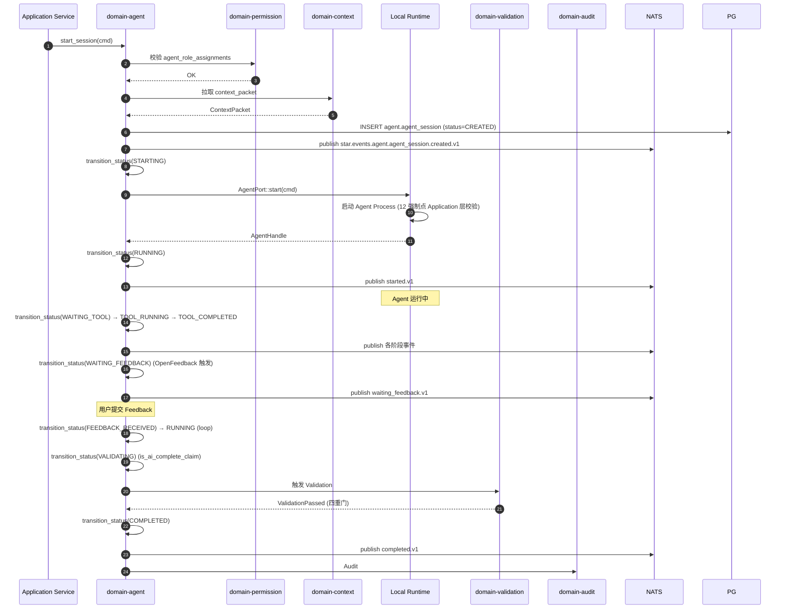

# domain-agent 实施 spec

> **状态**: Draft v0.1 (2026-08-25)
> **上游依赖**:
> - 《Requirements》§24, AGT-001/002, REQ-DEV-002/003, REQ-PERM-002
> - 《Basic Design》§2.1(表 3), §4.2, §7.4, §5.7, §6.1
> - 《API Design》§3.22 (14 状态迁移端点)
> - 《Data Design》§4.21 (`agent` schema)
> - 《Security Design》§3.6, §5.4
> - 《AI·Agent Design》(全部章节)
> **下游交付**: Implementation team — Rust crate 路径 `crates/domain-agent/`
> **最后审稿**: 待 RFC 化时

---

## 1. 职责与边界

`domain-agent` 承担双重职责(§4.2.1):**Agent Adapter 抽象** + **AgentSession 生命周期**。统一 Codex / Claude Code / Gemini CLI / OpenAI Compatible / Local / Future Agent,Domain 层**绝不**依赖具体 AI Provider SDK。

**属于本 crate 的**:
- Agent 注册表聚合根(Agent / AgentPolicy)
- AgentSession 聚合根(14 状态机,§7.4)
- Agent Port 抽象(`AgentPort` trait,由 infrastructure 层 Adapter 实现)
- AgentPolicy 强制(12 个强制点,§4.2.5,REQ-PERM-002)
- Human-in-the-loop 授权等级(§4.2.6)
- Agent Handoff Context Packet 生成(§4.2.7)

**不属于本 crate 的**:
- Context Packet 生成(`domain-context` 拥有)
- LLM 推理(由 Adapter 调 AI Provider SDK,Domain 仅抽象)
- Validation 链(由 `domain-validation` 拥有)

## 2. 关键实体

引用 data-design §4.21 (`agent` schema):

**Agent**(注册表聚合根)
- 标识: `agent_id`, `agent_type`(Codex / ClaudeCode / GeminiCLI / OpenAICompatible / Local / Future)
- 厂商: `agent_provider`, `agent_version`
- 能力: `capabilities[]`(允许的工具 / 命令类别)
- 模板: `policy_template_id`(可选)

**AgentSession**(聚合根,§24.1)
- 标识: `session_id`, `agent_id`, `agent_type`, `agent_provider`, `agent_version`
- 关联: `worktree_id`, `work_item_id`
- 时间: `started_at`, `ended_at`
- 状态: `status`(14 状态,§7.4)
- 内容: `intent`, `context_packet_id`, `plan`, `decisions[]`, `tool_activity_summary`
- 关联: `change_set_ids[]`, `validation_result_ids[]`, `feedback_consumed_ids[]`
- 摘要: `result_summary`
- 追踪: `trace_reference`(OpenTelemetry TraceId)

**AgentPolicy**(值对象 + 策略对象,§24.3)
- 范围: `allowed_repositories[]`, `allowed_worktrees[]`, `allowed_paths[]`, `forbidden_paths[]`
- 工具: `allowed_tools[]`, `allowed_command_categories[]`
- 网络: `network_access`(Allow / Deny / Scoped)
- Secret: `secret_access`(BrokerOnly / Scoped / None)
- 限制: `max_runtime_seconds`, `max_context_tokens`, `max_change_files`, `max_change_lines`
- 门控: `require_review`, `require_test`, `require_approval`

**AgentPolicyTemplate**(聚合根)
- `template_id`, `tenant_id`, `name`, `policy: AgentPolicy`

## 3. 关键不变量

| ID | 不变量 | 上游依据 |
|---|---|---|
| INV-AGT-01 | **14 状态机严格迁移**(§7.4,接口稳定承诺 #8) | basic-design §7.4, §10 |
| INV-AGT-02 | **1 AgentSession → 1 Active Worktree**(REQ-DEV-003) | basic-design §4.2.1, REQ-DEV-003 |
| INV-AGT-03 | **1 Worktree → N AgentSession**(REQ-DEV-002) | basic-design §4.2.1, REQ-DEV-002 |
| INV-AGT-04 | Domain 层不出现厂商类型(`CodexTool` / `ClaudeCodeEvent`) | basic-design §4.2.4 |
| INV-AGT-05 | **12 个强制点由 Application 层强制**(非 Prompt) | basic-design §4.2.5, REQ-PERM-002 |
| INV-AGT-06 | Agent Handoff 不依赖全量聊天记录,生成 Handoff Context Packet | basic-design §4.2.7 |
| INV-AGT-07 | Agent 操作必带 `agent_role_assignments` | security-design §3.1 |
| INV-AGT-08 | CRASHED 状态由 Local Runtime 上报(不依赖 Agent 自报) | basic-design §4.2.3 |
| INV-AGT-09 | AgentSession Transcript 走 AI Content Retention Policy(默认 90 天) | basic-design §6.8 |
| INV-AGT-10 | 禁止:Agent Swarm / Negotiation / Autonomous Planning Society(MVP 边界) | basic-design §4.2.7 |

## 4. 接口签名

继承 api-design §3.22。

```rust
// crates/domain-agent/src/port.rs

pub trait AgentCommandPort {
    async fn start_session(
        &self,
        cmd: StartAgentSessionCommand,  // worktree_id, work_item_id, context_packet_id, policy
        actor: ActorContext,
    ) -> Result<AgentSessionId, AgentError>;

    async fn submit_feedback(
        &self,
        cmd: SubmitFeedbackCommand,  // session_id, agent_instruction
        actor: ActorContext,
    ) -> Result<(), AgentError>;  // WAITING_FEEDBACK → FEEDBACK_RECEIVED

    async fn abort_session(
        &self,
        cmd: AbortSessionCommand,  // session_id, reason
        actor: ActorContext,        // Protected
    ) -> Result<(), AgentError>;

    async fn transition_status(
        &self,
        cmd: TransitionAgentStatusCommand,  // from, to (14 状态之一)
        actor: ActorContext,
    ) -> Result<AgentSessionStatus, AgentError>;
}

pub trait AgentQueryPort {
    async fn get_session(&self, id: AgentSessionId, viewer: ActorContext) -> Result<AgentSession, AgentError>;
    async fn list_sessions(&self, q: ListSessionQuery, viewer: ActorContext) -> Result<Vec<AgentSession>, AgentError>;
    async fn get_transcript(&self, id: AgentSessionId, viewer: ActorContext) -> Result<AgentTranscript, AgentError>;
    async fn query_status(&self, id: AgentSessionId) -> Result<AgentProcessStatus, AgentError>;  // polling 兜底
}

pub trait AgentPort {
    /// 由 application 调用,在 Local Runtime 中启动 Agent Process
    async fn start(&self, cmd: StartAgentCommand) -> Result<AgentHandle, AgentError>;
    async fn submit_feedback(&self, session_id: AgentSessionId, feedback: AgentInstruction) -> Result<(), AgentError>;
    async fn stop(&self, session_id: AgentSessionId, reason: StopReason) -> Result<(), AgentError>;
    async fn query_status(&self, session_id: AgentSessionId) -> Result<AgentProcessStatus, AgentError>;
}
```

## 5. Domain Events

| Subject (NATS) | 触发条件 | Payload |
|---|---|---|
| `star.events.agent.agent_session.created.v1` | `start_session` 成功 | `session_id, agent_id, worktree_id, work_item_id, context_packet_id` |
| `star.events.agent.agent_session.started.v1` | `CREATED → STARTING → RUNNING` | `session_id, started_at` |
| `star.events.agent.agent_session.waiting_feedback.v1` | `RUNNING → WAITING_FEEDBACK` | `session_id, feedback_id` |
| `star.events.agent.agent_session.completed.v1` | `VALIDATING → COMPLETED` | `session_id, ended_at, result_summary` |
| `star.events.agent.agent_session.failed.v1` | `VALIDATING → FAILED` | `session_id, failure_reason` |
| `star.events.agent.agent_session.crashed.v1` | `* → CRASHED`(Local Runtime 上报) | `session_id, crash_reason, runtime_id` |
| `star.events.agent.agent_session.timeout.v1` | `* → TIMEOUT`(Worker 触发) | `session_id, max_runtime_seconds, actual_runtime` |

**订阅者**:
- `domain-audit`(Append,全部事件)
- `domain-notification`(waiting_feedback / failed / crashed)
- `domain-feedback`(`waiting_feedback` 时拉取相关 Feedback)
- `domain-validation`(`* → VALIDATING` 触发 Validation Chain)

## 6. 数据所有权

引用 data-design §4.21(`agent` schema):

- `agent.agent`(注册表聚合根)
- `agent.agent_session`(聚合根,**核心聚合根**)
- `agent.agent_policy_template`(聚合根)
- Object Storage:`agent.transcript/{tenant_id}/{session_id}.jsonl`(走 AI Content Retention Policy,§6.8)

**RLS 策略**:
- 全部启用 RLS,`USING (current_setting('app.current_tenant_id') = tenant_id)`
- Transcript Object Storage Key 强制 tenant_id 前缀

**索引策略**:
- `agent.agent_session(worktree_id, status, started_at DESC)`
- `agent.agent_session(work_item_id, status)`
- `agent.agent_session(agent_id, started_at DESC)`
- `agent.agent_session(context_packet_id)`

## 7. 鉴权与授权

引用 security-design §3.6.1(12 个 Agent Policy 强制点):

**Permission 字符串**:
- `agent:read`, `agent:register`, `agent:update`
- `agent_session:read`, `agent_session:start`, `agent_session:abort`, `agent_session:read_transcript`
- `agent_policy:read`, `agent_policy:create`, `agent_policy:update`

**12 个强制点**(全部由 Application 层执行):
- Repository / Worktree / Path / Tool / Network / Secret / Runtime Limit / Context Limit / Change Scope / Review Gate / Test Gate / Approval Gate

**内置 Role**:
- `tenant_admin` — 全部 + Agent 注册(Protected)
- `project_admin` — 全部(本 Project)
- `developer` — `agent:read`, `agent_session:*`, `agent_policy:read`
- `viewer` — 仅 read

## 8. 错误码

引用 api-design §8.3.2(AG- 系列,继承 §8.3.1 错误码):

| 错误码 | HTTP | 触发条件 |
|---|---|---|
| `SEC-001/002/005/006/007` | 401/403/403 | 鉴权 / Cross-Repo / Cross-Worktree / Cross-Tenant |
| `AGT-001` | 404 | Agent / AgentSession 不存在 |
| `AGT-002` | 403 | Repository 越界(`policy.allowed_repositories` 不含) |
| `AGT-003` | 409 | 非法 14 状态迁移 |
| `AGT-004` | 422 | Agent Policy 引用不存在的 Template |
| `AGT-005` | 403 | Tool 越界(`policy.allowed_tools` 不含) |
| `AGT-006` | 403 | Path 越界(`policy.allowed_paths` / `forbidden_paths`) |
| `AGT-007` | 403/422 | 超 max_runtime_seconds(TIMEOUT) |
| `AGT-008` | 422 | 超 max_context_tokens |
| `AGT-009` | 403/422 | 超 max_change_files / max_change_lines |
| `AGT-010` | 403 | Protected 动作(如 merge)需人类 |
| `AGT-011` | 403 | Agent Handoff Policy 继承失败 |

## 9. 实施任务分解

| 任务 | 描述 | 依赖 | TBD-MEASURE | 估算 |
|---|---|---|---|---|
| T1 | Agent + AgentSession + AgentPolicy + AgentPolicyTemplate 实体 | 无 | — | 150K tokens |
| T2 | 14 状态机枚举 + 状态机迁移表(§7.4) | T1 | basic-design §7.4 | 100K tokens |
| T3 | `AgentCommandPort` 4 个方法 + 错误码 | T1, T2 | — | 180K tokens |
| T4 | `AgentQueryPort` 4 个方法 | T1-T3 | — | 80K tokens |
| T5 | `AgentPort` 4 个方法(抽象) | T1 | basic-design §4.2.4 | 100K tokens |
| T6 | Codex / ClaudeCode Adapter(至少 1 个) | T5 | POC-028 | 500K tokens |
| T7 | 12 个 Agent Policy 强制点 Application 层实现 | T3 | security-design §3.6.1 | 250K tokens |
| T8 | Agent Handoff Context Packet 生成(§4.2.7) | T3 | basic-design §4.2.7 | 200K tokens |
| T9 | Human-in-the-loop 授权等级(8 级) | T3 | basic-design §4.2.6 | 100K tokens |
| T10 | AI Content Retention Policy(90 天默认) | T4 | basic-design §6.8 | 120K tokens |
| T11 | 单元测试 + 14 状态全覆盖 + 12 强制点测试 | T1-T10 | security-design §3.5.4 | 250K tokens |
| T12 | 集成测试:启动 → Agent Run → Waiting Feedback → Completed | T11 | api-design §3.22 | 200K tokens |

**合计估算**: ~2.23M tokens ≈ 9-10 人·天(AI 协作模式)

## 10. 验收标准(AC)

```gherkin
Feature: Agent 生命周期与 Policy 强制

  Scenario: 启动 AgentSession 必带 Policy
    Given Worktree WT (status=ASSIGNED), AgentPolicy P
    When POST /v1/agent-sessions {worktree_id: WT, work_item_id: W, context_packet_id: CP, policy_id: P}
    Then 201 Created {session_id, status=CREATED}
    And  PermissionScheme.agent_role_assignments 校验通过
    And  Application 启动 Local Runtime 启动 Agent Process

  Scenario: 14 状态机严格迁移
    Given AgentSession AS (status=RUNNING)
    When transition_status(AS, COMPLETED)  // 跳过中间
    Then 409 AGT-003 (非法迁移)
    When transition_status(AS, WAITING_TOOL)
    Then 200 OK

  Scenario: 12 强制点 — Tool 越界
    Given AgentPolicy.allowed_tools = [read_file, edit_file]
    When Agent 尝试 run_shell
    Then 403 AGT-005 (Tool 越界)
    And  AuditEvent 记录 policy_violation

  Scenario: 12 强制点 — Path 越界
    Given AgentPolicy.forbidden_paths = ["/etc"]
    When Agent 尝试 read /etc/passwd
    Then 403 AGT-006
    And  Local Runtime 拦截

  Scenario: 1 AgentSession → 1 Active Worktree
    Given AgentSession AS 已在 Worktree A
    When 尝试启动新 AgentSession 在 Worktree A (active)
    Then 422 (已存在 Active Session)

  Scenario: CRASHED 由 Local Runtime 上报
    Given Local Runtime 检测到 Agent Process 异常退出
    When Local Runtime 调用 transition_status(AS, CRASHED)
    Then 200 OK
    And  AuditEvent 记录 crashed_by_local_runtime

  Scenario: Agent Handoff 生成 Context Packet
    Given AgentSession AS1 结束,新 AgentSession AS2 接管 Worktree
    When POST /v1/agent-sessions/{AS2}/handoff-context
    Then 返回 HandoffContextPacket
    And  Policy 重新计算(不继承 AS1 运行时状态,只继承 Policy)
```

## 11. 风险与缓解

| Risk | 影响 | 缓解 | 引用 |
|---|---|---|---|
| Agent Escapes Worktree Scope | High | 12 强制点 + Local Runtime 拦截 | basic-design §4.2.5, RISK-017, ADR-030 |
| Agent Vendor Lock-in | Medium | AgentPort 抽象 + ACL 翻译 | basic-design §4.2.4, RISK-030, ADR-021 |
| Agent Session State Divergence | Medium | 14 状态机 + Local Runtime 上报 CRASHED | basic-design §4.2.3, RISK-023 |
| Agent Secret Leakage | High | Credential Broker + Scoped Token + Redaction | basic-design §6.4, RISK-018 |
| 13 类对象漏配 | Critical | RLS + AuthorizationChecker 双重 | basic-design §6.1 |
| MVP 外能力(Swarm / Negotiation) | High | INV-AGT-10 强约束 | basic-design §4.2.7 |

## 12. Open Issues

- J-AGT-01: Agent Comparison(同 Task 多 Agent 并行)何时 V2?(§30.4,原文档 §53)
- J-AGT-02: AgentSession Transcript 是否 PII 脱敏?(§6.8 默认 90 天,需 PoC 校准)
- J-AGT-03: Agent Handoff 是否支持跨 AgentType(Codex → ClaudeCode)?(目前同 AgentType)
- J-AGT-04: 12 强制点中 Change Scope 检测由 Local Runtime fs watcher 还是 commit gate 决定?(目前双重)

## 附录 A:关键流程时序图 — AgentSession 启动到 Completed



## 附录 B:边界清单

| 边界类型 | 本 Module 行为 |
|---|---|
| 上游依赖 | `domain-tenant`, `domain-worktree`, `domain-work-item`, `domain-permission` |
| 下游调用 | `domain-audit`, `domain-validation`, `domain-notification`, `domain-feedback` |
| 跨域事务 | `start_session` + 12 强制点 + Permission Scheme 校验(Application 编排) |
| RLS 强制 | 全部 PG 表启用 RLS,Transcript Object Storage 强制 tenant_id 前缀 |
| **13 类 tenant_id 对象** | **直接覆盖 #4 AgentSession**(聚合根),**#7 AI Prompt**(full_prompt_ref),**#8 AI Response**(full_response_ref,Transcript 走 AI Content Retention,§6.8) |
| **14 状态 AgentSession 触发** | **本 Module 拥有全部 14 状态**:CREATED / STARTING / RUNNING / WAITING_TOOL / TOOL_RUNNING / TOOL_COMPLETED / WAITING_FEEDBACK / FEEDBACK_RECEIVED / VALIDATING / COMPLETED / FAILED / ABORTED / CRASHED / TIMEOUT(§7.4) |
| 17 状态 Worktree 触发 | **直接**:AgentSession 启动触发 Worktree `ASSIGNED → AGENT_RUNNING`;AgentSession COMPLETED 触发 Worktree `AGENT_RUNNING → VALIDATING` |
| WorkItem 3 态 | 间接(AgentSession.work_item_id 引用) |

**接口稳定承诺**:Port trait 签名 + **14 状态机集合** + 12 个强制点 + 8 级 Human-in-the-loop + AI Content Retention 90 天默认在后续 RFC 阶段不会变更。
