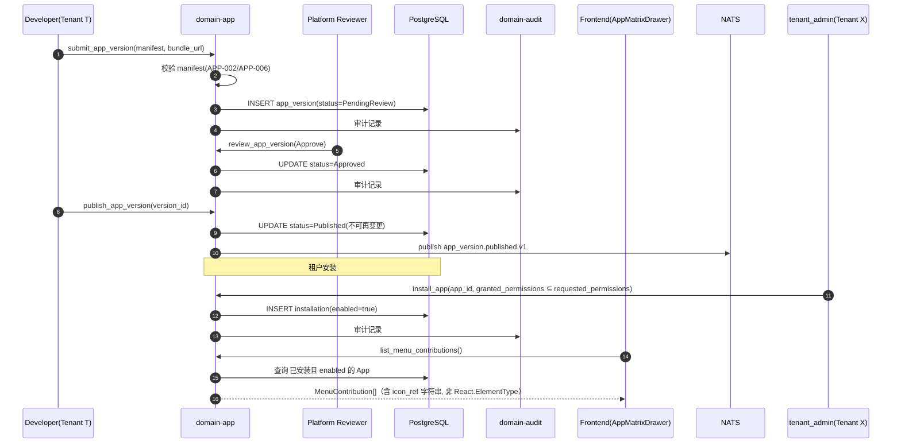

# domain-app 实施 spec

> **状态**: Draft v0.1 (2026-09-03) — **未纳入 `basic-design.md` §2.1 25-Module 表**(该表 domain 计数本身存在矛盾, 见 `docs/refactor/AUDIT-001-requirements-basicdesign-specs.md` F9; 本 spec 不在计数被人工核实/拍板前抢占任何行号或域序号)
> **上游依赖**:
> - `docs/refactor/RF-001-spec.md` §1.2 非目标 `:48`("事件驱动 app 集群 + 上传界面"新子系统, per 2026-09-02 讨论的拆分决定) — 本 spec 是该决定指向的独立子项目
> - 《API Design》(`docs/api-design.md`) — 上传 App 的**唯一**服务端交互路径(§7 见下)
> - 《Data Design》(`docs/data-design.md`) — 逻辑不下沉到 DB 的既有原则, 本 spec 继承并加强为 INV-APP-01
> - 《Security Design》(`docs/security-design.md`) — tenant_id RLS / Port trait 鉴权基线
> - `docs/specs/domain-automation-spec.md`(`J-AU-01`) — 关联但不同的扩展性机制, 见 §1 范围边界
> **下游交付**: Implementation team — Rust crate 路径 `crates/domain-app/`(暂定), 前端 `frontend/src/lib/nav/registry.ts` 及 `AppMatrixDrawer.tsx` 改造
> **最后审稿**: 待 RFC 化时
> **实施 Gate（阻塞项）**: 本 spec 的**编写**不受阻塞；**实施**（T1 任务分解见 §9）依赖 `RF-001-spec.md` T1（根目录归档/散件清理/`star-vcs` 孤儿 crate 处理/`cargo machete`/lint deny）先完成。截至本 spec 起草时（2026-09-03）核实：根目录仍有 98 个 `PHASE-*/STAR-*` 报告文件 + 约 100 个 `_*.log/_*.sh` 散件未清理，`star-vcs` 仍不在 `Cargo.toml` workspace.members —— T1 尚未开始。下游 AI 执行本 spec 任一 T 任务前，先确认 RF-001 T1 状态。

---

## 0. 现状与动机（为何需要这个 crate）

**今天"新增一个 app"的实际成本**（已实测，非推测）:

后端**完全没有 app/plugin 注册的概念**——`crates/` 下 grep `AppDefinition`/`app_registry`/`PluginManifest` 零匹配。"app"目前仅存在于前端一个硬编码数组：`frontend/src/lib/nav/registry.ts` 的 `ALL_MODULES: ModuleDefinition[]`。新增一个 app 需要同时改动：

| 文件 | 问题 |
|---|---|
| `registry.ts` — `ModuleCategory` | **封闭 5 值联合类型**(`core/work/agent/integration/system`)，新分类需改类型定义本身 |
| `registry.ts` — `ModuleDefinition.icon` | 类型是 `React.ElementType`（编译期导入的组件引用），**不可序列化**，无法由运行时下发的数据填充 |
| `dictionary.ts` / `en.ts` / `ja.ts` / `zh-CN.ts` / `useModuleTranslation.ts` | 5 个 i18n 文件需同步 `categoryLabel`/模块文案（参见 `6af1482` commit 的同类改动） |
| `AppMatrixDrawer.tsx` | 直接 `import { ALL_MODULES } from "@/lib/nav/registry"`，是渲染 app 启动器网格的现有 UI，需要改造为读取动态数据源而非静态导入 |

即：新增/升级一个 app = 改 ≥6 个静态文件 + 前端全量重新构建 + 发版。"独立升级"（本 spec 要解决的运维诉求）在当前架构下不可能实现。

## 1. 职责与边界

`domain-app` 承载 **App 的注册、清单(Manifest)校验、生命周期管理、租户级安装/授权状态、菜单贡献(Menu Contribution)的下发**。这是 RF-001 `:48` 所指"事件驱动 app 集群 + 上传界面"新子系统的核心 domain crate。

**属于本 crate 的**:
- App / AppVersion 聚合根（清单、菜单贡献声明、生命周期状态）
- 上传物（manifest + 前端 bundle 引用）的接收、静态校验、审核流转
- 租户级 AppInstallation（安装/启用/禁用/授权范围）
- 向前端下发动态菜单数据（替代 `ALL_MODULES` 静态数组）

**不属于本 crate 的**（显式排除，避免与相邻机制混淆）:
- **服务端任意代码执行** — 见 §3 INV-APP-01。上传的 App **没有**服务端可执行代码这个概念，只有前端 bundle + manifest。这不是暂缓，是本 spec V1 的结构性边界（Q4=A 拍板结论，见下）。
- **规则/动作脚本化**（`domain-automation-spec.md` 的 `J-AU-01`，事件触发的小段声明式/未来可能脚本化逻辑）——这是**另一套机制**，服务于"事件发生时自动做什么"，与"App 作为可安装单元"是两个不同的信任边界，**互不继承对方已获得的许可**：`J-AU-01` 即便未来解成支持 Lua/JS 脚本，也不代表本 crate 管理的上传 App 因此获得脚本执行权；反之亦然。
- **数据库存储过程** — 已评估并拒绝，理由见 §3 INV-APP-01 和 §11 风险表的"拒绝备选方案"记录。
- App 的实际部署/构建流水线细节（CI/CD 具体实现，属 `operation-design.md` / infra 范畴，本 crate 只定义"App 有独立版本号"这一领域概念）

## 2. 关键实体

**App**（聚合根）
- 标识: `app_id`, `tenant_id`（发布者所属租户，若平台内置则为 system tenant）
- 元数据: `name`, `description`, `publisher`, `icon_ref`（**字符串引用**，非 `React.ElementType`——见 §0 现状问题，本 crate 强制可序列化）
- 分类: `category`（**开放字符串 + 平台侧受控词表**，替代前端封闭 5 值联合类型；新增分类走审核，不改代码类型定义）
- 生命周期状态: `Draft → PendingReview → Approved → Published → Deprecated → Removed`
- 当前激活版本: `active_version_id`

**AppVersion**（实体，App 的子实体）
- 标识: `version_id`, `app_id`, `semver`
- Manifest: `manifest: AppManifest`(见下)
- 前端 bundle 引用: `bundle_url`（Object Storage Key，含 tenant_id），**不含服务端可执行产物**
- 审核记录: `reviewed_by`, `reviewed_at`, `review_notes`
- 发布时间: `published_at`

**AppManifest**（值对象，随 AppVersion 提交）
- `menu_contribution: MenuContribution`（label, category, route, i18n key 引用，不含 icon 组件本身，仅 icon_ref 字符串）
- `requested_permissions: Vec<PermissionScope>`（App 申请调用哪些既有 `api-design.md` 端点范围，需人工/自动审核批准）
- `api_version: String`（声明基于哪个 `api-design.md` 契约版本构建，供兼容性校验）

**AppInstallation**（实体，租户级）
- 标识: `installation_id`, `tenant_id`, `app_id`, `installed_version_id`
- 状态: `enabled: bool`, `granted_permissions: Vec<PermissionScope>`（租户管理员实际授予的权限，可能窄于 `requested_permissions`）
- 时间: `installed_at`, `updated_at`

## 3. 关键不变量

| ID | 不变量 | 上游依据 |
|---|---|---|
| INV-APP-01 | 上传的 App **无数据库直连路径**；一切服务端副作用只能通过 `api-design.md` 已发布的公开 API 契约发起（该契约已强制 tenant_id RLS + Port trait 鉴权）。App 没有独立的服务端可执行代码这个概念 | Q4=A 拍板；`data-design.md`"逻辑不下沉到 DB"；对应否决存储过程方案 |
| INV-APP-02 | App 必带 tenant_id（发布者租户），跨 tenant 拒绝；AppInstallation 必带安装租户的 tenant_id，与 App 发布租户分离校验 | security-design §3.x, REQ-SEC-001 |
| INV-APP-03 | AppVersion 一旦 `Published` 不可变更 manifest/bundle_url（发新版本号，不改旧版本内容） | 独立升级/可回滚的前提 |
| INV-APP-04 | `requested_permissions` 与租户实际 `granted_permissions` 分离，安装时租户管理员可裁剪但不可扩大 | 最小权限原则 |
| INV-APP-05 | App 审核状态机（`PendingReview→Approved`/`Rejected`）变更 100% 写审计（复用 `domain-audit`） | security-design |
| INV-APP-06 | `category` 新增走审核流程（平台侧受控词表），不允许 App 自由声明任意字符串直接生效 | 替代前端封闭 5 值联合类型的同时防止分类污染 |

## 4. 接口签名

继承 `api-design.md`（本 crate 待补录 §N，见 §12 Open Issues J-APP-04）。

```rust
// crates/domain-app/src/port.rs

pub trait AppCommandPort {
    async fn submit_app_version(
        &self,
        cmd: SubmitAppVersionCommand,  // app_id(新建则为 None), semver, manifest, bundle_url
        actor: ActorContext,
    ) -> Result<AppVersionId, AppError>;

    async fn review_app_version(
        &self,
        cmd: ReviewAppVersionCommand,  // version_id, decision: Approve/Reject, notes
        actor: ActorContext,  // 需 platform reviewer 权限
    ) -> Result<(), AppError>;

    async fn publish_app_version(
        &self,
        version_id: AppVersionId,
        actor: ActorContext,
    ) -> Result<(), AppError>;

    async fn install_app(
        &self,
        cmd: InstallAppCommand,  // app_id, granted_permissions
        actor: ActorContext,  // 需 tenant_admin
    ) -> Result<InstallationId, AppError>;

    async fn set_installation_enabled(
        &self,
        cmd: SetInstallationEnabledCommand,
        actor: ActorContext,
    ) -> Result<(), AppError>;
}

pub trait AppQueryPort {
    async fn list_apps(&self, q: ListAppQuery, viewer: ActorContext) -> Result<Vec<App>, AppError>;
    async fn get_app(&self, id: AppId, viewer: ActorContext) -> Result<App, AppError>;
    /// 前端 AppMatrixDrawer / 动态菜单的数据源，替代 ALL_MODULES 静态数组
    async fn list_menu_contributions(&self, viewer: ActorContext) -> Result<Vec<MenuContribution>, AppError>;
    async fn list_installations(&self, viewer: ActorContext) -> Result<Vec<AppInstallation>, AppError>;
}
```

## 5. Domain Events

**发布**:
- `star.events.app.app_version.submitted.v1`
- `star.events.app.app_version.reviewed.v1`
- `star.events.app.app_version.published.v1`
- `star.events.app.installation.created.v1` / `.enabled.v1` / `.disabled.v1`

**订阅**: 无（本 Module 不订阅业务 Domain Event；与 `domain-automation` 的订阅者角色不同，见 §1 范围边界）

## 6. 数据所有权

- `app.app`（聚合根）
- `app.app_version`（实体）
- `app.installation`（实体，租户级）

**RLS 策略**:
- `app.app` / `app.app_version`：按发布者 `tenant_id` 隔离（平台内置 App 为 system tenant，对所有租户只读可见）
- `app.installation`：按安装 `tenant_id` 隔离，`USING (current_setting('app.current_tenant_id') = tenant_id)`

## 7. 鉴权与授权

**Permission 字符串**:
- `app:submit`, `app:review`（平台侧角色专属）, `app:install`, `app:manage_installation`, `app:read`

**内置 Role**:
- Platform Reviewer（新角色，跨租户）— `app:review`
- `tenant_admin` — `app:install`, `app:manage_installation`, `app:read`
- `developer` — `app:submit`（提交需审核，不代表自动发布）, `app:read`
- `viewer` — `app:read`

## 8. 错误码

| 错误码 | HTTP | 触发条件 |
|---|---|---|
| `SEC-001/002/007` | 401/403/403 | 鉴权类 |
| `APP-001` | 404 | App/AppVersion 不存在 |
| `APP-002` | 422 | Manifest 校验失败（如 `requested_permissions` 引用不存在的 API scope） |
| `APP-003` | 409 | 已 `Published` 的 AppVersion 尝试修改 |
| `APP-004` | 403 | `granted_permissions` 尝试超出 `requested_permissions` 范围 |
| `APP-005` | 422 | `category` 不在受控词表且未走审核新增流程 |
| `APP-006` | 403 | Manifest 声明服务端可执行产物（结构性拒绝，对应 INV-APP-01） |

## 9. 实施任务分解

**前置条件（阻塞）**: RF-001 T1 完成（见文首状态头 Gate 说明）

| 任务 | 描述 | 依赖 | TBD-MEASURE | 估算 |
|---|---|---|---|---|
| T1 | App / AppVersion / AppManifest / AppInstallation 实体 | RF-001 T1 完成 | — | 100K tokens |
| T2 | `AppCommandPort` 5 个方法 + 错误码 | T1 | — | 120K tokens |
| T3 | `AppQueryPort` 4 个方法（含 `list_menu_contributions`） | T1, T2 | — | 80K tokens |
| T4 | 审核流转状态机 + Platform Reviewer 角色 | T1 | security-design | 80K tokens |
| T5 | 前端改造：`registry.ts` 从静态数组改为消费 `list_menu_contributions`；`icon_ref` 字符串→图标映射表 | T3 | 需前端团队协作 | 100K tokens |
| T6 | 前端改造：`AppMatrixDrawer.tsx` 数据源切换 | T5 | — | 40K tokens |
| T7 | 上传界面（提交 AppVersion 的 UI） | T2 | 待补 external-design.md 落位 | 100K tokens |
| T8 | 单元测试 + RLS + 权限收窄校验（INV-APP-04） | T1-T4 | — | 100K tokens |
| T9 | 集成测试：提交→审核→发布→安装→菜单出现 全流程 | T1-T8 | — | 100K tokens |

**合计估算**: ~820K tokens ≈ 4 人·天(AI 协作模式)

## 10. 验收标准(AC)

```gherkin
Feature: App 上传与安装

  Scenario: 提交新 App 版本
    Given Tenant T 的 Developer D
    When POST /v1/apps/versions {app_id: null, semver: "1.0.0", manifest: {...}, bundle_url}
    Then 201 Created {version_id}, App 状态 = Draft, AppVersion 状态 = PendingReview

  Scenario: Manifest 声明服务端可执行产物 — 结构性拒绝
    Given AppVersion 提交 manifest 包含 server_executable 字段
    When 提交
    Then 422 APP-006（无论内容为何，字段存在即拒绝）

  Scenario: 审核通过并发布
    Given AppVersion V (PendingReview)
    When Platform Reviewer 调用 review_app_version(Approve)
    And  调用 publish_app_version
    Then AppVersion 状态 = Published，不可再修改（APP-003 保护）

  Scenario: 已发布版本不可变更
    Given AppVersion V (Published)
    When 尝试修改 manifest
    Then 409 APP-003

  Scenario: 租户安装并裁剪权限
    Given App A 的 requested_permissions = [work-item:read, work-item:write]
    When Tenant T 的 tenant_admin install_app(A, granted_permissions=[work-item:read])
    Then 201 Created，AppInstallation.granted_permissions = [work-item:read]

  Scenario: 授权超出申请范围 — 拒绝
    Given App A 的 requested_permissions = [work-item:read]
    When install_app(A, granted_permissions=[work-item:read, work-item:write])
    Then 403 APP-004

  Scenario: 菜单动态下发
    Given App A 已安装并 enabled
    When 前端调用 list_menu_contributions
    Then 返回列表包含 A 的 MenuContribution
    And  未安装/禁用的 App 不出现
```

## 11. 风险与缓解

| Risk | 影响 | 缓解 | 引用 |
|---|---|---|---|
| 恶意 App 通过前端 bundle 发起过量 API 调用 | Medium | `requested_permissions` 审核 + 复用既有 API 层限流 | api-design.md |
| 审核流程成为瓶颈 | Medium | V1 允许平台内置 App 跳过审核（system tenant 直接 Published）；第三方 App 走审核 | — |
| `category` 受控词表膨胀失控 | Low | INV-APP-06 审核新增分类 | — |

**已评估并拒绝的备选方案**（记录理由，避免未来被重新提出而无据可查）:
- **数据库存储过程直连**：绕开 `domain-*` crate 的 tenant_id RLS 强制、Port trait 鉴权、`domain-audit` 审计埋点；违反 `data-design.md`"逻辑不下沉到 DB"原则；`INV-AU-05`/`AU-005`(Rule 不得执行 Protected 动作) 类不变量在 DB 层无对应机制。**结论：不做**，对应本 spec INV-APP-01。
- **服务端可执行 App**（Q4=B）：需要 per-app 隔离（WASM/容器/进程）、资源配额、更重的审核流水线。**非拒绝，是延后**——V1（本 spec）范围是声明式 + 前端沙箱；若未来确有需求，需另立 spec 走独立评估（不是本 spec 的自然扩展，因为信任边界模型整体不同）。

## 12. Open Issues

- J-APP-01: 前端 bundle 的沙箱机制选型（iframe postMessage / Module Federation + CSP / 其他）？本 spec 只定义"服务端无可执行路径"这一约束，客户端沙箱具体技术未选型。
- J-APP-02: 审核流程是人工还是自动化静态扫描 + 人工复核？平台 Reviewer 角色的具体准入未定义。
- J-APP-03: AppVersion 是否支持回滚（租户可主动选择安装旧版本）？当前 §2 只定义 `active_version_id` 单一激活版本。
- J-APP-04: `api-design.md` 需要补录本 crate 的端点章节（当前无 §N 对应）——待与 API Design 文档维护者同步。
- J-APP-05: 与 `J-AU-01`（`domain-automation-spec.md`）未来若真的走向脚本化 Action，是否需要在本 spec 补一条"即便如此也不隐式扩大 App 权限"的交叉引用不变量？目前靠 §1 范围边界的文字约束，未做机制强制。

## 附录 A：关键流程时序图 — 提交 → 审核 → 发布 → 安装 → 菜单出现



## 附录 B：边界清单

| 边界类型 | 本 Module 行为 |
|---|---|
| 上游依赖 | `domain-tenant`, `domain-permission`（角色/权限校验）, `domain-audit`（审计） |
| 下游调用 | `domain-audit`（审计写入）；**不**调用任何业务 domain crate 的内部逻辑，App 的服务端交互一律走 `api-design.md` 公开契约（即：本 crate 自身对外只暴露"App 元数据/菜单/安装状态"，不代理 App 的业务调用） |
| 跨域事务 | 无 |
| RLS 强制 | `app.app_version` / `app.installation` 全部启用 RLS |
| 与 `domain-automation` 的关系 | 平级、不重叠：本 crate 管理"可安装单元"，`domain-automation` 管理"事件触发的规则动作"，见 §1 |
| 服务端代码执行面 | **零**（INV-APP-01，结构性约束，非策略） |

**接口稳定承诺**：Port trait 签名 + INV-APP-01（无服务端执行面）在后续 RFC 阶段不会变更；`category` 受控词表、审核流程细节（J-APP-02）可能调整。
