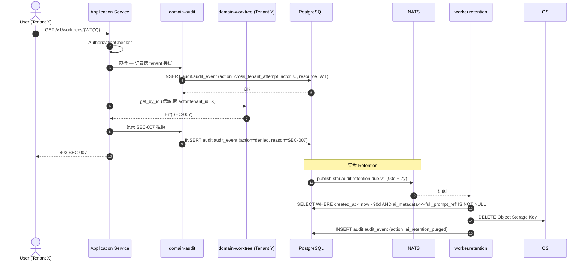

# domain-audit 实施 spec

> **状态**: Draft v0.1 (2026-08-25)
> **上游依赖**:
> - 《Requirements》§17, REQ-AUDIT-001/002
> - 《Basic Design》§2.1(表 15), §5.7, §6.7, §9 (Traceability & AI Audit)
> - 《API Design》§3.12 (AI Audit 端点)
> - 《Data Design》§4.11 (`audit` schema)
> - 《Security Design》§10 (审计与合规)
> **下游交付**: Implementation team — Rust crate 路径 `crates/domain-audit/`
> **最后审稿**: 待 RFC 化时

---

## 1. 职责与边界

`domain-audit` 是**唯一 Append-only 横切 Domain**,所有其他 Domain 写审计时调用本 Module 的 `AuditRecorder` Port。负责审计日志、AI Audit Metadata、合规导出。

**属于本 crate 的**:
- AuditEvent 实体(Append-only,不可改 / 不可删)
- AIAuditMetadata(§6.7,9 个必答问题)
- 跨租户访问尝试 100% 记录
- 审计导出(CSV / Parquet)

**不属于本 crate 的**:
- 任何业务聚合根(本 Module 是横切,不拥有业务事实)
- Tenant / Workspace / Project(本 Module 仅引用 tenant_id)
- 业务事件触发(由其他 Domain 发布 NATS,本 Module 订阅)

## 2. 关键实体

引用 data-design §4.11 (`audit` schema):

**AuditEvent**(聚合根,Append-only)
- 标识: `audit_id`, `tenant_id`
- 触发者: `actor`(user_id / agent_id / system)
- 动作: `action`(字符串,如 `worktree:create` / `feedback:verify` / `cross_tenant_attempt`)
- 资源: `resource_type`, `resource_id`
- 状态: `before_state?`(可选), `after_state?`(可选)
- 上下文: `context_refs[]`(Provenance 引用)
- 元数据: `ai_metadata?: AIAuditMetadata`
- 追踪: `trace_id`(OpenTelemetry)
- 时间: `created_at`(精确到 ms)

**AIAuditMetadata**(嵌套值对象,§6.7,9 个必答问题)
- `agent_session_id`
- `context_packet_id`
- `change_set_id`
- `validation_result_ids[]`
- `feedback_consumed_ids[]`
- `approver_user_id`(Commit / PR / Merge 时)
- `data_categories_sent[]`(Prompt / Code / Diff 等)
- `provider_boundary_ref`(ProviderDataBoundary 引用)
- `risk_signals[]`(从 ChangeSet 复制摘要)

**AuditExportJob**(实体)
- `job_id`, `tenant_id`, `format`(CSV / Parquet), `filter[]`, `requested_by`, `status`, `download_url`

## 3. 关键不变量

| ID | 不变量 | 上游依据 |
|---|---|---|
| INV-AU-01 | **Append-only**:AuditEvent 不可 UPDATE / DELETE(由 DB 角色强制) | basic-design §5.7, §2.1 |
| INV-AU-02 | **9 个 AI Audit 必答问题必填**(agent_session / context_packet / change_set / validation / feedback / approver / 等) | basic-design §6.7, §9.3, REQ-AUDIT-002 |
| INV-AU-03 | **跨租户访问尝试 100% 记录**(由 Trigger 或 Application 层强制) | basic-design §6.1, security-design §3.5.1 |
| INV-AU-04 | **敏感 Prompt/Code 不默认进入普通 Audit Log**,走 AIAuditMetadata + Object Storage | basic-design §6.7, §6.8 |
| INV-AU-05 | Audit 保留 7 年(企业级),月级别 Partition | basic-design §5.8 |
| INV-AU-06 | AI Content Retention Policy:Full Prompt/Response 90 天默认,Summary 1 年,Metadata 永久 | basic-design §6.8 |
| INV-AU-07 | 导出仅 Tenant Admin / Compliance 角色(Protected) | security-design §3.3 |

## 4. 接口签名

继承 api-design §3.12。

```rust
// crates/domain-audit/src/port.rs

/// Append-only 接口,由 application 编排调用
pub trait AuditRecorder {
    /// 记录普通 AuditEvent
    async fn record(&self, event: AuditEventInput) -> Result<AuditId, AuditError>;
    /// 记录 AI Audit 事件(含 AIAuditMetadata)
    async fn record_ai(&self, event: AIAuditEventInput) -> Result<AuditId, AuditError>;
    /// 记录跨租户访问尝试(SEC-007 触发)
    async fn record_cross_tenant_attempt(
        &self,
        actor: ActorContext,
        resource_type: String,
        resource_id: String,
    ) -> Result<AuditId, AuditError>;
}

pub trait AuditQueryPort {
    /// 列出审计事件(仅 Tenant Admin / Compliance)
    async fn list_events(&self, q: AuditListQuery, viewer: ActorContext) -> Result<Vec<AuditEvent>, AuditError>;
    /// 详情
    async fn get_event(&self, id: AuditId, viewer: ActorContext) -> Result<AuditEvent, AuditError>;
    /// AI Audit 列表
    async fn list_ai_audit(&self, q: AIAuditListQuery, viewer: ActorContext) -> Result<Vec<AIAuditMetadata>, AuditError>;
    /// AI Audit Report(回答 9 个必答问题)
    async fn get_ai_audit_report(&self, agent_session_id: AgentSessionId, viewer: ActorContext) -> Result<AIAuditReport, AuditError>;
    /// 导出 Audit(异步 Job)
    async fn export(&self, cmd: AuditExportRequest, viewer: ActorContext) -> Result<JobResponse, AuditError>;
}
```

## 5. Domain Events

**本 Module 自身不发布业务 Domain Event**,仅作为**订阅者**接收所有 Domain Event 并 Append 到审计表。

**订阅者**(全部 Domain Event):
- 全部 `star.events.*.v1` 主题
- 特殊:`star.audit.cross_tenant_attempt.v1`(由 Application 显式触发,见 INV-AU-03)

**发布**(由 Worker 异步):
- `star.events.audit.export.completed.v1`(导出完成,Notification 通知 Tenant Admin)
- `star.events.audit.ai_retention.purged.v1`(Retention 物理删除,Audit 自身记录)

## 6. 数据所有权

引用 data-design §4.11(`audit` schema):

- `audit.audit_event`(聚合根,Append-only)
- `audit.ai_audit_metadata`(嵌套 JSONB)
- `audit.audit_export_job`(实体)

**RLS 策略**:
- `audit.audit_event`:`USING (current_setting('app.current_tenant_id') = tenant_id)`,但跨租户访问尝试**例外**(该 AuditEvent 本身记录违规,需在 OWN tenant 中可读)
- Application 层强制:跨 tenant AuditEvent 写入时,`tenant_id` 用违规 actor 的 tenant(便于追溯)

**索引策略**:
- `audit.audit_event(tenant_id, created_at DESC)` — 时间范围
- `audit.audit_event(actor, action)` — 行为者
- `audit.audit_event(resource_type, resource_id)` — 资源
- `audit.audit_event(ai_metadata->>'agent_session_id')` GIN — AI 检索
- 月级别 Partition(data-design §9)

**保留与归档**:
- 7 年热数据(企业级)
- 月级别 Partition
- 30 天前的 Partition 压缩

## 7. 鉴权与授权

**Permission 字符串**:
- `audit:read`(Protected,仅 Tenant Admin / Compliance)
- `audit:export`(Protected)
- `audit:ai_audit_read`(Protected)

**内置 Role**:
- `tenant_admin` — 全部(security-design §3.2 标注 `audit:read` 受限,需 Compliance 角色)
- `project_admin` / `developer` / `viewer` — 全部不可(本 Module 严格 Protected)

**特殊角色**:
- `compliance_officer`(可由 Tenant Admin 显式授予)— `audit:read` / `audit:export`

## 8. 错误码

引用 api-design §8.3.7(SEC- 系列,本 Module 是 SEC- 触发源之一):

| 错误码 | HTTP | 触发条件 |
|---|---|---|
| `SEC-001` | 401 | 未认证尝试读 Audit |
| `SEC-007` | 403 | 跨 Tenant 读 Audit(被本 Module 自身 Audit) |
| `AU-001` | 404 | AuditEvent 不存在 |
| `AU-002` | 403 | 非 Tenant Admin / Compliance 尝试读 |
| `AU-003` | 422 | 导出 Filter 无效 |
| `AU-004` | 409 | 导出 Job 已存在(同 filter) |

## 9. 实施任务分解

| 任务 | 描述 | 依赖 | TBD-MEASURE | 估算 |
|---|---|---|---|---|
| T1 | AuditEvent + AIAuditMetadata + AuditExportJob 实体 | 无 | — | 100K tokens |
| T2 | `AuditRecorder` 3 个方法(普通 / AI / 跨 tenant) | T1 | — | 100K tokens |
| T3 | `AuditQueryPort` 5 个方法(包含 AI Audit Report) | T1, T2 | — | 150K tokens |
| T4 | **9 个 AI Audit 必答问题字段定义 + 完整性校验** | T1 | basic-design §6.7, §9.3 | 120K tokens |
| T5 | Append-only DB 角色强制(无 UPDATE / DELETE 权限) | T1 | data-design §4.11 | 50K tokens |
| T6 | 月级别 Partition + 7 年保留 + 压缩 | T1 | data-design §9, basic-design §5.8 | 100K tokens |
| T7 | AI Content Retention Policy(Full Prompt 90 天,Sensitive Code 0 天) | T1 | basic-design §6.8 | 100K tokens |
| T8 | 跨 Tenant 访问自动 Audit 触发(Application 层集成) | T2 | security-design §3.5.1 | 80K tokens |
| T9 | 导出 Job 异步执行(Worker) | T3 | data-design §11 | 100K tokens |
| T10 | 单元测试 + 9 问题完整性测试 + Append-only 测试 | T1-T9 | security-design §10 | 200K tokens |
| T11 | 集成测试:完整 AI 行为 → 9 问题可回答 → 导出 | T10 | api-design §3.12 | 150K tokens |

**合计估算**: ~1.25M tokens ≈ 5 人·天(AI 协作模式)

## 10. 验收标准(AC)

```gherkin
Feature: AI Audit Metadata 与合规

  Scenario: 9 个 AI Audit 必答问题
    Given AgentSession AS 完成 ChangeSet
    When 提交 AIAuditEvent
    Then 9 个必答问题全部可回答:
      | 问题 | 字段 |
      | 谁要求 AI 做什么? | actor + context_refs |
      | AI 使用了什么 Context? | context_packet_id → provenance |
      | AI 修改了什么? | change_set_id → files |
      | 哪个 Agent 执行? | agent_session.agent_type |
      | 在哪个 Worktree? | agent_session.worktree_id |
      | 什么时间? | created_at + started_at/ended_at |
      | 哪些验证通过? | validation_result_ids |
      | 哪些 Feedback 被消费? | feedback_consumed_ids |
      | 谁批准 Commit? | approver_user_id |

  Scenario: Append-only 强制
    Given AuditEvent AE 写入
    When 尝试 UPDATE 或 DELETE
    Then DB 角色拒绝(无权限)

  Scenario: 跨 Tenant 访问尝试自动 Audit
    Given User U (Tenant X) 访问 Resource R (Tenant Y)
    When SEC-007 触发
    Then AuditEvent 写入(actor=U, action=cross_tenant_attempt, resource=R)
    And  写入 actor 的 tenant_id=X(便于追溯)

  Scenario: 导出 Job 异步
    Given Tenant Admin 请求导出 Audit (filter: 7d range)
    When POST /v1/audit-events/export
    Then 202 Accepted (Job ID)
    And  Job 完成后 Notification + Download URL

  Scenario: AI Content Retention 物理删除
    Given Full Prompt 存储 90 天
    When 超过 90 天
    Then Worker 自动物理删除(非软删除)
    And  AuditEvent 记录 ai_retention_purged

  Scenario: 非 Compliance 角色读 Audit 拒绝
    Given User U 是 developer
    When GET /v1/audit-events
    Then 403 AU-002 (Protected)
```

## 11. 风险与缓解

| Risk | 影响 | 缓解 | 引用 |
|---|---|---|---|
| 敏感 Prompt/Code 泄漏到 Audit | High | INV-AU-04 + AI Content Retention + Redaction | basic-design §6.7, §6.8 |
| Append-only 被绕过 | Critical | DB 角色无 UPDATE/DELETE 权限 + Application 层防御 | basic-design §5.7 |
| 7 年保留成本 | Medium | 月级别 Partition + 压缩 + 冷数据归档 | basic-design §5.8 |
| 跨 Tenant 漏审计 | Critical | INV-AU-03 + Application 层强制 100% | security-design §3.5.1 |
| 导出 Job 越权 | High | Protected 鉴权 + 异步 + Audit 自身记录 | security-design §10 |

## 12. Open Issues

- J-AU-01: Audit 导出是否支持 Incremental(增量)?目前全量 + filter
- J-AU-02: AIAuditMetadata 9 个字段是否支持自定义(由 Tenant Policy 添加)?目前固定
- J-AU-03: 7 年保留是否由 Tenant Policy 可调(短保留)?(目前固定)
- J-AU-04: AuditEvent 与 S3 兼容对象存储集成是否需要(审计对象存储访问)?(目前 PG 为主)

## 附录 A:关键流程时序图 — AI Audit 9 必答问题 + 跨 Tenant 尝试



## 附录 B:边界清单

| 边界类型 | 本 Module 行为 |
|---|---|
| 上游依赖 | 无核心依赖(本 Module 是横切) |
| 下游调用 | 无(本 Module 是终态,无下游调用) |
| 跨域事务 | `record` 是 Append-only,与其他 Domain 事务**同事务**(由 Application 编排保证原子性) |
| RLS 强制 | `audit.audit_event` 启用 RLS,跨 tenant 尝试自身 Audit 写入时按 actor tenant |
| **13 类 tenant_id 对象** | 间接覆盖(本 Module 记录 13 类对象访问,自身非 13 类),但通过 **AIAuditMetadata.full_prompt_ref / full_response_ref** 强制携带 **#7 AI Prompt / #8 AI Response** 的 Retention 引用(§6.8 锁定) |
| 14 状态 AgentSession 触发 | **直接**:AIAuditMetadata.agent_session_id 必带 |
| 17 状态 Worktree 触发 | **直接**:AIAuditMetadata 记录 Worktree 状态变更 |
| WorkItem 3 态 | **直接**:AIAuditMetadata 记录 WorkItem 状态变更 |

**接口稳定承诺**:Port trait 签名 + **9 个必答问题字段** + Append-only DB 强制 + 7 年保留 + AI Content Retention 90 天默认在后续 RFC 阶段不会变更。
