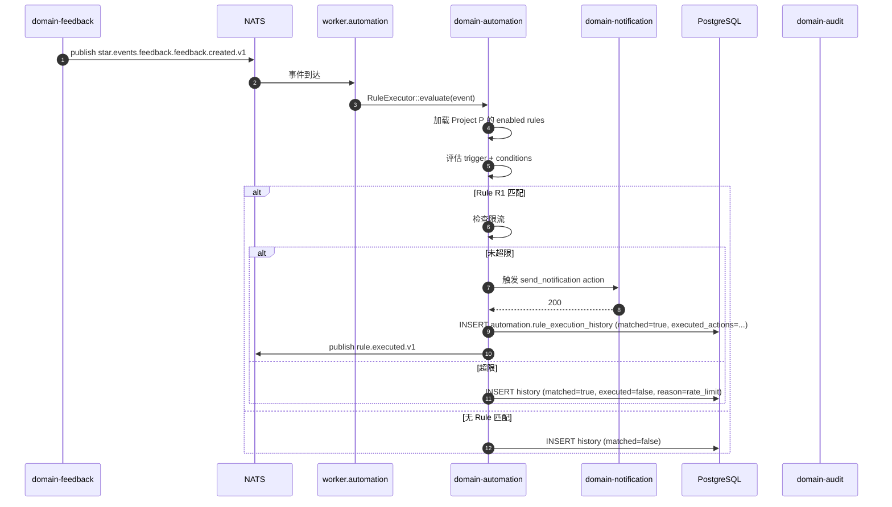

# domain-automation 实施 spec

> **状态**: Draft v0.1 (2026-08-25)
> **上游依赖**:
> - 《Requirements》§11, REQ-AUTO-001
> - 《Basic Design》§2.1(表 17), §5.7
> - 《API Design》§3.14
> - 《Data Design》§4.13 (`automation` schema)
> - 《Security Design》§3.1-3.4
> **下游交付**: Implementation team — Rust crate 路径 `crates/domain-automation/`
> **最后审稿**: 待 RFC 化时

---

## 1. 职责与边界

`domain-automation` 承载**触发器-条件-动作规则**(§11,REQ-AUTO-001)。MVP 不强制可视化配置器,API + Form 已足够(§2.1 表 17 注 5)。

**属于本 crate 的**:
- Rule 聚合根(Trigger + Conditions + Actions)
- 规则执行历史(Append-only)
- 规则测试 / 模拟

**不属于本 crate 的**:
- 触发事件的产生(本 Module 是订阅者,接收各 Domain Event)
- 通知发送(由 `domain-notification` 拥有)
- 业务变更执行(本 Module 仅触发,不直接改业务聚合)

## 2. 关键实体

引用 data-design §4.13 (`automation` schema):

**Rule**(聚合根)
- 标识: `rule_id`, `tenant_id`, `project_id`
- 元数据: `name`, `description`, `enabled`
- 触发: `trigger: Trigger`(event_type + filter)
- 条件: `conditions: Vec<Condition>`(表达式)
- 动作: `actions: Vec<Action>`(create_feedback / send_notification / assign_agent / etc.)
- 优先级: `priority`(规则评估顺序)
- 时间: `created_at`, `updated_at`, `last_executed_at`

**Trigger**(值对象)
- `event_type`(如 `feedback:created`, `validation:failed`, `worktree:status_changed`)
- `filter: HashMap<String, Value>`(resource_type, project_id, severity, ...)

**Condition**(值对象)
- `field`, `operator`(equals / not_equals / contains / greater_than / ...), `value`

**Action**(值对象)
- `action_type`:send_notification / create_feedback / assign_agent / update_status / invoke_webhook
- `params: HashMap<String, Value>`

**RuleExecutionHistory**(实体,Append-only)
- `history_id`, `rule_id`, `event_id`, `matched: bool`, `executed_actions: Vec<Action>`, `executed_at`, `result: ExecutionResult`

## 3. 关键不变量

| ID | 不变量 | 上游依据 |
|---|---|---|
| INV-AU-01 | 必带 tenant_id,跨 tenant 拒绝 | basic-design §6.1, REQ-SEC-001 |
| INV-AU-02 | 规则执行是异步的(Worker 订阅,Not 阻塞业务事务) | basic-design §2.1 |
| INV-AU-03 | 规则可独立启用 / 禁用,不影响其他规则 | data-design §4.13 |
| INV-AU-04 | 规则执行历史 100% 写(成功 / 失败 / 跳过) | data-design §4.13 |
| INV-AU-05 | 规则不得直接执行 Protected 动作(如 `pr:merge`) | security-design §3.3 |
| INV-AU-06 | 规则执行频率可限流(防循环) | basic-design §11 |

## 4. 接口签名

继承 api-design §3.14。

```rust
// crates/domain-automation/src/port.rs

pub trait AutomationCommandPort {
    async fn create_rule(
        &self,
        cmd: CreateRuleCommand,  // name, trigger, conditions, actions
        actor: ActorContext,
    ) -> Result<RuleId, AutomationError>;

    async fn update_rule(
        &self,
        cmd: UpdateRuleCommand,
        actor: ActorContext,
    ) -> Result<Rule, AutomationError>;

    async fn delete_rule(
        &self,
        id: RuleId,
        actor: ActorContext,
    ) -> Result<(), AutomationError>;

    async fn test_rule(
        &self,
        cmd: RuleTestRequest,  // rule_id, sample_event
        actor: ActorContext,
    ) -> Result<RuleTestResult, AutomationError>;
}

pub trait AutomationQueryPort {
    async fn list_rules(&self, q: ListRuleQuery, viewer: ActorContext) -> Result<Vec<Rule>, AutomationError>;
    async fn get_rule(&self, id: RuleId, viewer: ActorContext) -> Result<Rule, AutomationError>;
    async fn list_executions(&self, rule_id: RuleId, viewer: ActorContext) -> Result<Vec<RuleExecutionHistory>, AutomationError>;
}

/// Worker 调用,执行规则
pub trait RuleExecutor {
    async fn evaluate(&self, event: DomainEvent) -> Result<Vec<RuleExecution>, AutomationError>;
}
```

## 5. Domain Events

**本 Module 不发布业务 Domain Event**(仅规则执行结果),作为**订阅者**接收各 Domain Event。

**订阅者**:
- 全部 `star.events.*.v1`(按 Rule.trigger.event_type 过滤)

**发布**:
- `star.events.automation.rule.executed.v1`(规则执行成功)
- `star.events.automation.rule.failed.v1`(规则执行失败)

## 6. 数据所有权

引用 data-design §4.13(`automation` schema):

- `automation.rule`(聚合根)
- `automation.rule_execution_history`(实体,Append-only)

**RLS 策略**:
- 全部启用 RLS,`USING (current_setting('app.current_tenant_id') = tenant_id)`

**索引策略**:
- `automation.rule(project_id, enabled, priority DESC)` — 评估顺序
- `automation.rule_execution_history(rule_id, executed_at DESC)`

## 7. 鉴权与授权

**Permission 字符串**:
- `automation:read`, `automation:create`, `automation:update`, `automation:delete`

**内置 Role**:
- `tenant_admin` / `project_admin` — 全部
- `developer` — 全部(除 `delete` 需 Protected)
- `viewer` — 仅 `automation:read`

## 8. 错误码

| 错误码 | HTTP | 触发条件 |
|---|---|---|
| `SEC-001/002/007` | 401/403/403 | 鉴权类 |
| `AU-001` | 404 | Rule 不存在 |
| `AU-002` | 422 | Trigger event_type 不在已知列表 |
| `AU-003` | 422 | Action 引用不存在的资源(如 notification_channel) |
| `AU-004` | 409 | 循环规则(A 触发 B,B 触发 A) |
| `AU-005` | 403 | Rule 尝试 Protected 动作(如 `pr:merge`) |

## 9. 实施任务分解

| 任务 | 描述 | 依赖 | TBD-MEASURE | 估算 |
|---|---|---|---|---|
| T1 | Rule + Trigger + Condition + Action + History 实体 | 无 | — | 80K tokens |
| T2 | `AutomationCommandPort` 4 个方法 + 错误码 | T1 | — | 100K tokens |
| T3 | `AutomationQueryPort` 3 个方法 | T1, T2 | — | 60K tokens |
| T4 | `RuleExecutor` 1 个方法(Worker 异步) | T1 | data-design §4.13 | 80K tokens |
| T5 | 条件表达式评估器(field + operator + value) | T4 | data-design §4.13 | 100K tokens |
| T6 | 限流防循环(规则执行频率) | T4 | basic-design §11 | 60K tokens |
| T7 | 单元测试 + RLS + 循环检测 + 限流 | T1-T6 | security-design §3.5.4 | 120K tokens |
| T8 | 集成测试:Event → Rule 匹配 → Action 触发 | T7 | api-design §3.14 | 80K tokens |

**合计估算**: ~680K tokens ≈ 3 人·天(AI 协作模式)

## 10. 验收标准(AC)

```gherkin
Feature: 自动化规则

  Scenario: 创建规则
    Given Project P
    When POST /v1/automations/rules {name, trigger: feedback:created, conditions: [{severity=P0}], actions: [send_notification]}
    Then 201 Created {rule_id}

  Scenario: 规则匹配
    Given Rule R (trigger: feedback:created, condition: severity=P0)
    When Feedback F1 (severity=P0) 创建
    Then Worker 评估 → R 匹配
    And  Action (send_notification) 执行
    And  RuleExecutionHistory 记录 matched=true

  Scenario: 循环检测
    Given Rule A (trigger: B.executed, action: ...) 
    And Rule B (trigger: A.executed, action: ...)
    When 创建 Rule A
    Then 422 AU-004 (循环检测)

  Scenario: Rule 尝试 Protected 动作
    Given Rule R 包含 action: merge_pr
    When 创建
    Then 403 AU-005 (Protected 动作禁止 Rule)

  Scenario: 限流防循环
    Given Rule R 每 1s 触发 100 次
    When 执行
    Then 限流到每分钟 10 次
    And  超限执行跳过
```

## 11. 风险与缓解

| Risk | 影响 | 缓解 | 引用 |
|---|---|---|---|
| 规则循环触发 | High | T6 限流 + 循环检测 | basic-design §11 |
| Rule 越权执行 | High | T4 Protected 动作禁止 | security-design §3.3 |
| 规则执行阻塞业务 | High | 异步 Worker | basic-design §2.1 |

## 12. Open Issues

- J-AU-01: 规则表达式是否支持脚本(Lua / JavaScript)?(目前声明式)
- J-AU-02: Rule Marketplace(平台预置模板)是否支持?(目前仅 Tenant 自定义)
- J-AU-03: 规则执行历史保留期?(目前永久,需 ADR)
- J-AU-04: 规则是否支持 dry-run?(目前 `test_rule` 模拟)

## 附录 A:关键流程时序图 — 规则匹配 + 执行



## 附录 B:边界清单

| 边界类型 | 本 Module 行为 |
|---|---|
| 上游依赖 | `domain-tenant`, `domain-project`, 全部 Domain Event(订阅) |
| 下游调用 | `domain-audit`, `domain-notification` (Action 触发) |
| 跨域事务 | 无(异步 Worker) |
| RLS 强制 | 全部 PG 表启用 RLS |
| 13 类 tenant_id 对象 | 间接覆盖(规则触发涉及 13 类对象事件) |
| 14 状态 AgentSession 触发 | 间接(规则可触发 AgentSession 状态变更) |
| 17 状态 Worktree 触发 | 间接 |
| WorkItem 3 态 | 间接 |

**接口稳定承诺**:Port trait 签名 + 限流策略 + 5 条错误码在后续 RFC 阶段不会变更。
