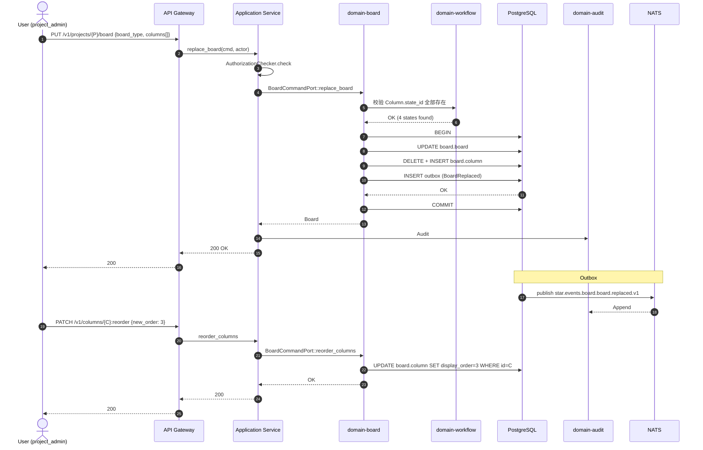

# domain-board 实施 spec

> **状态**: Draft v0.1 (2026-08-25)
> **上游依赖**:
> - 《Requirements》§9, REQ-PLAN-003
> - 《Basic Design》§2.1(表 10), §4.9.2
> - 《API Design》§3.7
> - 《Data Design》§4.6 (`board` schema)
> - 《Security Design》§3.1-3.4
> **下游交付**: Implementation team — Rust crate 路径 `crates/domain-board/`
> **最后审稿**: 待 RFC 化时

---

## 1. 职责与边界

`domain-board` 承载 Kanban / Scrum 板视图配置(§9,REQ-PLAN-003),Board 与 Sprint / Gantt 共享数据模型(§9.4,REQ-PLAN-004),不创建独立子系统。

**属于本 crate 的**:
- Board 聚合根(Board / Column / Swimlane)
- Board 与 Workflow 状态列的映射
- Board 视图渲染配置(列顺序、Swimlane 分组)

**不属于本 crate 的**:
- WorkItem 实体本身(`domain-work-item` 拥有)
- Sprint / Backlog(`domain-planning` 拥有)
- Burndown / Velocity / CFD 报表(由 worker 异步计算)

## 2. 关键实体

引用 data-design §4.6 (`board` schema):

**Board**(聚合根)
- 标识: `board_id`, `tenant_id`, `project_id`
- 类型: `board_type`(Kanban / Scrum)
- 列: `column_ids[]`(按 display_order 排序)
- Swimlane: `swimlanes[]`(group_by 字段)
- 过滤器: `filter_assignee`, `filter_label`(可空)

**Column**(实体)
- 标识: `column_id`, `board_id`, `name`
- Workflow 状态映射: `state_id`(引用 domain-workflow)
- `display_order`, `wip_limit`(可空)

**Swimlane**(实体)
- 标识: `swimlane_id`, `board_id`, `group_by_field`(assignee / label / epic)
- `display_order`

## 3. 关键不变量

| ID | 不变量 | 上游依据 |
|---|---|---|
| INV-B-01 | Board 必须属一个 Project(必带 tenant_id + project_id) | basic-design §6.1 |
| INV-B-02 | Column.state_id 必引用存在的 Workflow State,删除 State 时检查 | data-design §4.5 |
| INV-B-03 | Column 在同一 Board 内 display_order UNIQUE | data-design §4.6 |
| INV-B-04 | Board 视图不存业务事实(WorkItem.status 由 domain-work-item 拥有) | basic-design §5.7 |
| INV-B-05 | WIP 限制是软告警(超 WIP 通知,不阻止 WorkItem 流转) | basic-design §4.9.4 |

## 4. 接口签名

继承 api-design §3.7。

```rust
// crates/domain-board/src/port.rs

pub trait BoardCommandPort {
    async fn replace_board(
        &self,
        cmd: ReplaceBoardCommand,  // 整体替换 (columns + swimlanes)
        actor: ActorContext,
    ) -> Result<Board, BoardError>;

    async fn patch_board(
        &self,
        cmd: PatchBoardCommand,    // 部分更新
        actor: ActorContext,
    ) -> Result<Board, BoardError>;

    async fn reorder_columns(
        &self,
        cmd: ColumnOrderUpdate,     // column_ids 顺序数组
        actor: ActorContext,
    ) -> Result<Vec<Column>, BoardError>;
}

pub trait BoardQueryPort {
    async fn get_by_project(&self, project_id: ProjectId, actor: ActorContext) -> Result<Board, BoardError>;
    async fn list_columns(&self, board_id: BoardId, actor: ActorContext) -> Result<Vec<Column>, BoardError>;
    async fn list_swimlanes(&self, board_id: BoardId, actor: ActorContext) -> Result<Vec<Swimlane>, BoardError>;
}
```

## 5. Domain Events

| Subject (NATS) | 触发条件 | Payload |
|---|---|---|
| `star.events.board.board.replaced.v1` | `replace_board` 成功 | `board_id, project_id, version` |
| `star.events.board.board.patched.v1` | `patch_board` 成功 | `board_id, patched_fields[]` |
| `star.events.board.column.reordered.v1` | `reorder_columns` 成功 | `board_id, new_order[]` |

**订阅者**:
- `domain-audit`(Append)
- `domain-search`(投影 Project Board 配置)

## 6. 数据所有权

引用 data-design §4.6(`board` schema):

- `board.board`(聚合根)
- `board.column`(实体)
- `board.swimlane`(实体)

**RLS 策略**:
- 全部启用 RLS,`USING (current_setting('app.current_tenant_id') = tenant_id)`

**索引策略**:
- `board.board(project_id)` UNIQUE(同 Project 一个 Board)
- `board.column(board_id, display_order)` UNIQUE
- `board.swimlane(board_id, display_order)` UNIQUE

## 7. 鉴权与授权

**Permission 字符串**:
- `board:read`, `board:update`(创建/删除走 Project 级)

**内置 Role**:
- `tenant_admin` / `project_admin` — 全部
- `developer` / `viewer` — 仅 `board:read`

## 8. 错误码

| 错误码 | HTTP | 触发条件 |
|---|---|---|
| `SEC-001/002/007` | 401/403/403 | 鉴权类 |
| `B-001` | 404 | Board 不存在 |
| `B-002` | 422 | Column.state_id 引用不存在 |
| `B-003` | 409 | Column display_order 冲突 |
| `B-004` | 422 | Swimlane group_by_field 不支持(目前仅 assignee / label / epic) |
| `B-005` | 409 | Project 已有 Board(同 Project 一对一) |

## 9. 实施任务分解

| 任务 | 描述 | 依赖 | TBD-MEASURE | 估算 |
|---|---|---|---|---|
| T1 | Board + Column + Swimlane 实体 | 无 | — | 60K tokens |
| T2 | `BoardCommandPort` 3 个方法 + 错误码 | T1 | — | 80K tokens |
| T3 | `BoardQueryPort` 3 个方法 | T1, T2 | — | 60K tokens |
| T4 | Column.state_id 引用完整性校验 | T2 | data-design §4.5 | 50K tokens |
| T5 | 单元测试 + RLS 测试 + 列顺序唯一性测试 | T1-T4 | security-design §3.5.4 | 100K tokens |
| T6 | 集成测试:创建 Project → 创建 Board → 关联 WorkItem | T5 | api-design §3.7 | 80K tokens |

**合计估算**: ~430K tokens ≈ 2 人·天(AI 协作模式)

## 10. 验收标准(AC)

```gherkin
Feature: Board 配置

  Scenario: 创建 Board 与 Column 映射
    Given Project P 含 Workflow W (states: TODO, IN_PROGRESS, IN_REVIEW, DONE)
    When PUT /v1/projects/{P}/board {board_type: Kanban, columns: [TODO, IN_PROGRESS, IN_REVIEW, DONE]}
    Then 200 OK
    And  4 个 Column 全部 state_id 指向 W 的对应 State

  Scenario: Column state_id 引用不存在
    Given 用户尝试 Column 引用 state_id="non_existent"
    When replace_board
    Then 422 B-002

  Scenario: 列顺序唯一性
    Given Board B 已含 Column C1 (order=1), C2 (order=2)
    When 尝试 reorder 让 C1 与 C2 order 都为 1
    Then 409 B-003

  Scenario: WIP 限制软告警
    Given Column C WIP limit=3
    And 已含 3 个 WorkItem
    When 第 4 个 WorkItem 流转到 C
    Then 200 OK (允许,但 Notification 通知)
```

## 11. 风险与缓解

| Risk | 影响 | 缓解 | 引用 |
|---|---|---|---|
| Board 视图数据与 WorkItem 实际状态不一致 | Medium | Board 不存 WorkItem 状态,仅作视图;WorkItem.status 由 domain-work-item 拥有 | basic-design §5.7 |
| Column state_id 悬空 | High | T4 引用完整性校验 | data-design §4.5 |
| WIP 限制误用 | Low | 软告警,不强制 | basic-design §4.9.4 |

## 12. Open Issues

- J-B-01: Board 是否支持多 Board per Project?(目前一对一)
- J-B-02: Swimlane group_by_field 是否支持 custom 字段?(目前枚举 assignee / label / epic)
- J-B-03: WIP 限制是否需要硬阻止?(目前软告警)

## 附录 A:关键流程时序图 — Board 替换与 Column 顺序调整



## 附录 B:边界清单

| 边界类型 | 本 Module 行为 |
|---|---|
| 上游依赖 | `domain-project`, `domain-workflow` (state 引用) |
| 下游调用 | `domain-audit`, `domain-search` |
| 跨域事务 | `replace_board` 时跨域读 `domain-workflow`(同事务) |
| RLS 强制 | 3 个表全部启用 RLS |
| 13 类 tenant_id 对象 | 间接覆盖 |
| 14 状态 AgentSession 触发 | 无 |
| 17 状态 Worktree 触发 | 无 |
| WorkItem 3 态 | 间接(Board Column 映射 WorkItem Status,但不拥有状态机本身) |

**接口稳定承诺**:Port trait 签名 + 5 条错误码 + 5 条不变量在后续 RFC 阶段不会变更。

## 15. 与其他 domain 协作 (v0.16 协作细化新增)

per [basic-design v0.16 §3.2.9 22 domain contact face 表](../../basic-design.md) + [ADR-0039 §D26-D32 Worktree Orchestration 跨域协作](../../architecture/2026-08-26-upgrade/adr/0039-worktree-orchestration-cross-domain.md) + [spec/saga/01 v0.2 SagaCoordinationRole](../../architecture/2026-08-26-upgrade/spec/saga/01-saga-coordination-spec.md),本节定义 `board` 与 22 domain 中 4 个 domain 的显式接触面。

| 源 Domain | 目标 Domain | 接触方式 | 接触点 |
|---|---|---|---|
| project | board | Customer-Supplier | Project.board_configuration_id 引用 |
| board | work-item | Customer-Supplier | BoardConfiguration.project_id 投影 WorkItem 列表 |
| board | planning | Shared Kernel | Board 列定义与 Sprint 状态映射 (Kanban/Scrum 共享) |
| planning | board | Customer-Supplier | Board 视图从 Planning.Sprint 投影 (per REQ-PLAN-003) |

**接触面统计**: 4 条 (v0.16 新增,本 spec 由 `scripts/inter_collab_refine.py` 批量生成)

**dual-use 警告** (per AGENTS.md §5 v0.6 + Q1-D 拍板): 5 域 (player/economy/match/social/admin) 是 RGS 仓历史治理命名,Star 仓不建立业务子域↔DDD 映射。本 spec 协作基于 22 domain crate,不通过 5 域绑定推导。
