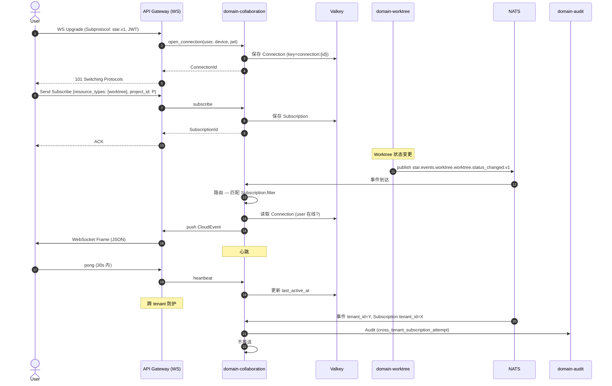

# domain-collaboration 实施 spec

> **状态**: Draft v0.1 (2026-08-25)
> **上游依赖**:
> - 《Requirements》§15, REQ-RT-001~003
> - 《Basic Design》§2.1(表 24), §5.7
> - 《API Design》§4 (WebSocket / Realtime 通道)
> - 《Data Design》§4.17 (`collaboration` schema)
> - 《Security Design》§3.1-3.4
> **下游交付**: Implementation team — Rust crate 路径 `crates/domain-collaboration/`
> **最后审稿**: 待 RFC 化时

---

## 1. 职责与边界

`domain-collaboration` 承载**协作(实时状态、Presence)**(§15,REQ-RT-001~003)。高频 Token Stream 可不入 SaaS(§15,REQ-RT-003),MVP 阶段复用 work-core 进程。

**属于本 crate 的**:
- Presence 实体(用户在线状态)
- RealtimeSubscription(WS 订阅管理)
- Realtime 推送事件路由

**不属于本 crate 的**:
- WebSocket 协议实现(由 API Gateway / work-core 提供,本 Module 提供事件路由)
- Comment 实体(`domain-comment` 拥有)
- Notification 发送(`domain-notification` 拥有)

## 2. 关键实体

引用 data-design §4.17 (`collaboration` schema):

**Presence**(实体,短期)
- 标识: `presence_id`, `tenant_id`, `user_id`
- 状态: `status`(Online / Away / Offline)
- 时间: `last_active_at`, `expires_at`(心跳 60s 过期)
- 范围: `resource_type`, `resource_id`(当前正在查看的资源)

**RealtimeSubscription**(实体,短期)
- 标识: `subscription_id`, `tenant_id`, `user_id`, `connection_id`
- 过滤: `filter: SubscriptionFilter`(resource_types, project_id, work_item_id, worktree_id, event_types)
- 状态: `last_event_id`(续传用)
- 时间: `created_at`, `last_ping_at`

**RealtimeEventPayload**(值对象,CloudEvents 1.0)
- `event_id`, `source`, `type`, `subject`, `time`
- `tenant_id`, `data: JSON`

## 3. 关键不变量

| ID | 不变量 | 上游依据 |
|---|---|---|
| INV-CB-01 | 必带 tenant_id,跨 tenant 拒绝 | basic-design §6.1, REQ-SEC-001 |
| INV-CB-02 | WebSocket 单一连接 + 多 Subscription(每 Connection ≤ 100 Subscription) | api-design §4.2 |
| INV-CB-03 | Presence 60s 心跳过期(last_active_at + 60s < now → Offline) | basic-design §23.4 |
| INV-CB-04 | Realtime Event 必带 tenant_id 且 AuthorizationChecker 校验一致 | api-design §4.4, security-design §3.5 |
| INV-CB-05 | 高频 Token Stream 可不入 SaaS(REQ-RT-003) | basic-design §15 |
| INV-CB-06 | MVP 阶段不拆 `realtime-service`(§8.2,§13.1) | basic-design §13.1, §30.3 |

## 4. 接口签名

继承 api-design §4。

```rust
// crates/domain-collaboration/src/port.rs

pub trait CollaborationCommandPort {
    /// WebSocket 连接建立
    async fn open_connection(
        &self,
        cmd: OpenConnectionCommand,  // user_id, device_id, jwt
        actor: ActorContext,
    ) -> Result<ConnectionId, CollaborationError>;

    /// 订阅资源
    async fn subscribe(
        &self,
        cmd: SubscribeCommand,  // connection_id, filter
        actor: ActorContext,
    ) -> Result<SubscriptionId, CollaborationError>;

    /// 取消订阅
    async fn unsubscribe(
        &self,
        cmd: UnsubscribeCommand,
        actor: ActorContext,
    ) -> Result<(), CollaborationError>;

    /// 心跳
    async fn heartbeat(
        &self,
        connection_id: ConnectionId,
    ) -> Result<(), CollaborationError>;

    /// 关闭连接
    async fn close_connection(
        &self,
        connection_id: ConnectionId,
    ) -> Result<(), CollaborationError>;

    /// 更新 Presence
    async fn update_presence(
        &self,
        cmd: UpdatePresenceCommand,  // status, resource_type, resource_id
        actor: ActorContext,
    ) -> Result<(), CollaborationError>;
}

pub trait CollaborationQueryPort {
    /// 列出当前订阅
    async fn list_presence(&self, q: ListPresenceQuery, viewer: ActorContext) -> Result<Vec<Presence>, CollaborationError>;
}

/// 内部事件路由(NATS → WebSocket)
pub trait RealtimeEventRouter {
    async fn route(&self, event: DomainEvent) -> Result<usize /* delivery count */, CollaborationError>;
}
```

## 5. Domain Events

**本 Module 不发布业务 Domain Event**,仅作为**事件路由器**将各 Domain Event 推送给匹配的 WebSocket Subscription。

**订阅者**:
- 全部 `star.events.*.v1`(按 Subscription.filter 路由)

**发布**:
- `star.events.collaboration.connection.opened.v1`
- `star.events.collaboration.connection.closed.v1`

## 6. 数据所有权

引用 data-design §4.17(`collaboration` schema):

- `collaboration.presence`(实体,短期,Valkey 缓存为主,PG 备份)
- `collaboration.subscription`(实体,短期,Valkey 为主)
- `collaboration.realtime_event_delivery_log`(Append-only,记录推送)

**RLS 策略**:
- 全部启用 RLS,`USING (current_setting('app.current_tenant_id') = tenant_id)`

**索引策略**:
- `collaboration.presence(user_id, last_active_at DESC)` — 在线状态
- `collaboration.subscription(connection_id)` — Connection 订阅查询
- `collaboration.realtime_event_delivery_log(subscription_id, delivered_at)` — 推送历史

## 7. 鉴权与授权

**Permission 字符串**:
- `realtime:subscribe`
- `presence:read`

**内置 Role**:
- `tenant_admin` / `project_admin` / `developer` / `viewer` — 全部 `realtime:subscribe`, `presence:read`

## 8. 错误码

| 错误码 | HTTP / WS | 触发条件 |
|---|---|---|
| `SEC-001/002/007` | 401/403/403 | 鉴权类 |
| `CB-001` | 1008 (WS Policy Violation) | WebSocket subprotocol 不支持 |
| `CB-002` | 429 | Subscription 超过 100/Connection |
| `CB-003` | 422 | Subscription filter 非法 |
| `CB-004` | 1008 | WebSocket ping 60s 内未回 pong |

## 9. 实施任务分解

| 任务 | 描述 | 依赖 | TBD-MEASURE | 估算 |
|---|---|---|---|---|
| T1 | Presence + Subscription + EventPayload 实体 | 无 | — | 60K tokens |
| T2 | `CollaborationCommandPort` 6 个方法 + 错误码 | T1 | — | 100K tokens |
| T3 | `CollaborationQueryPort` 1 个方法 | T1, T2 | — | 40K tokens |
| T4 | `RealtimeEventRouter` 1 个方法(订阅 + 路由) | T1 | api-design §4.4 | 150K tokens |
| T5 | WebSocket 协议支持(star.v1 subprotocol) | T4 | api-design §4.2 | 120K tokens |
| T6 | Subscription 过滤逻辑(filter 评估) | T4 | api-design §4.3 | 100K tokens |
| T7 | Presence 60s 心跳过期 | T1 | basic-design §23.4 | 50K tokens |
| T8 | Valkey 缓存 Presence / Subscription(主存储) | T1 | data-design §4.17 | 80K tokens |
| T9 | 单元测试 + 路由测试 + 心跳测试 | T1-T8 | security-design §3.5.4 | 120K tokens |
| T10 | 集成测试:WS Connect → Subscribe → Event 推送 | T9 | api-design §4 | 100K tokens |

**合计估算**: ~920K tokens ≈ 4 人·天(AI 协作模式)

## 10. 验收标准(AC)

```gherkin
Feature: 实时协作与 Presence

  Scenario: WebSocket 连接与订阅
    Given User U 认证
    When WS wss://api/v1/realtime/subscribe (Subprotocol: star.v1, Authorization: Bearer)
    Then 连接成功
    When Send Subscribe {resource_types: [worktree], project_id: P}
    Then SubscriptionId 返回
    And  后续 Worktree 状态变更推送

  Scenario: 单 Connection ≤ 100 Subscription
    Given WS Connection C
    When 第 101 个 Subscribe 发送
    Then 429 CB-002

  Scenario: 事件路由 — Cross-Tenant 拒绝
    Given Subscription 订阅 tenant_id=X
    When 事件 tenant_id=Y 发布
    Then 跨 tenant,不推送
    And  Audit 记录 cross_tenant_subscription_attempt

  Scenario: 心跳过期
    Given Presence P (last_active_at = 5 min ago)
    When UI 读取
    Then 标记 Offline(≥ 300s 区间)

  Scenario: 子协议不匹配
    Given WS Subprotocol: other.v1
    When 握手
    Then 1008 CB-001 (Policy Violation)
```

## 11. 风险与缓解

| Risk | 影响 | 缓解 | 引用 |
|---|---|---|---|
| Cross-Tenant 推送 | Critical | INV-CB-04 + AuthorizationChecker 强制 | security-design §3.5.1 |
| Subscription 风暴 | High | 100/Connection 限流 | api-design §4.2 |
| Presence 不准确 | Low | 60s 心跳 + Stale Display | basic-design §23.4 |
| 长连接扩展性 | Medium | MVP 复用 work-core,V1 评估拆 service | basic-design §13.1, §30.3 |

## 12. Open Issues

- J-CB-01: 高频 Token Stream(IDE autocomplete)是否走 SaaS?(§15,REQ-RT-003 由 Local Runtime 直接)
- J-CB-02: Presence 是否暴露给其他 User(可见名单)?(目前本人可见自己)
- J-CB-03: Subscription 持久化(断线恢复)?(目前 last_event_id 续传)
- J-CB-04: Realtime 事件是否压缩?(目前 JSON UTF-8)

## 附录 A:关键流程时序图 — WebSocket 订阅 + 事件推送



## 附录 B:边界清单

| 边界类型 | 本 Module 行为 |
|---|---|
| 上游依赖 | 无核心依赖(订阅所有 NATS Event) |
| 下游调用 | `domain-audit`(跨 tenant 推送尝试) |
| 跨域事务 | 无(异步事件路由) |
| RLS 强制 | 全部启用 RLS,Valkey Key 强制 tenant_id 前缀 |
| 13 类 tenant_id 对象 | 间接覆盖(本 Module 推送 13 类对象事件) |
| 14 状态 AgentSession 触发 | **直接**:AgentSession 状态变更通过本 Module 推送 |
| 17 状态 Worktree 触发 | **直接**:Worktree 状态变更通过本 Module 推送 |
| WorkItem 3 态 | **直接**:WorkItem 状态变更通过本 Module 推送 |

**接口稳定承诺**:Port trait 签名 + WebSocket subprotocol `star.v1` + 100/Connection 限流 + 4 条错误码在后续 RFC 阶段不会变更。

## 15. 与其他 domain 协作 (v0.16 协作细化新增)

per [basic-design v0.16 §3.2.9 22 domain contact face 表](../../basic-design.md) + [ADR-0039 §D26-D32 Worktree Orchestration 跨域协作](../../architecture/2026-08-26-upgrade/adr/0039-worktree-orchestration-cross-domain.md) + [spec/saga/01 v0.2 SagaCoordinationRole](../../architecture/2026-08-26-upgrade/spec/saga/01-saga-coordination-spec.md),本节定义 `collaboration` 与 22 domain 中 4 个 domain 的显式接触面。

| 源 Domain | 目标 Domain | 接触方式 | 接触点 |
|---|---|---|---|
| collaboration | work-item | Customer-Supplier | Realtime 状态推送 (per requirements §15) |
| collaboration | comment | Customer-Supplier | Realtime 推送 Comment / @mention |
| collaboration | star-sse | Shared Kernel | 通过 star-sse crate WebSocket 通道 (per star-sse/src/lib.rs) |

**接触面统计**: 3 条 (v0.16 新增,本 spec 由 `scripts/inter_collab_refine.py` 批量生成)

**dual-use 警告** (per AGENTS.md §5 v0.6 + Q1-D 拍板): 5 域 (player/economy/match/social/admin) 是 RGS 仓历史治理命名,Star 仓不建立业务子域↔DDD 映射。本 spec 协作基于 22 domain crate,不通过 5 域绑定推导。
