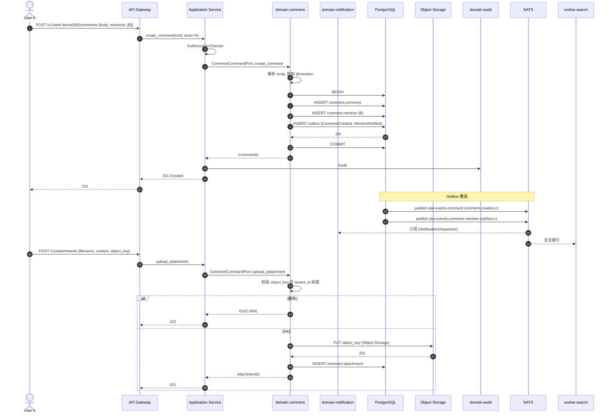

# domain-comment 实施 spec

> **状态**: Draft v0.1 (2026-08-25)
> **上游依赖**:
> - 《Requirements》§10
> - 《Basic Design》§2.1(表 13), §3.2.1
> - 《API Design》§3.10
> - 《Data Design》§4.9 (`comment` schema)
> - 《Security Design》§3.1-3.4
> **下游交付**: Implementation team — Rust crate 路径 `crates/domain-comment/`
> **最后审稿**: 待 RFC 化时

---

## 1. 职责与边界

`domain-comment` 承载 WorkItem / PR / Discussion 上的评论 / @ 提及 / 附件(§10)。**不替代** Feedback(§25.1,REQ-FBK-001)——Feedback 是结构化人类修正指令,Comment 是普通协作对话。

**属于本 crate 的**:
- Comment 聚合根(纯文本 / @mention / 附件)
- Reaction(emoji 反应)
- 附件 Object Storage 引用

**不属于本 crate 的**:
- Feedback(结构化,`domain-feedback` 拥有)
- 实时 Presence(`domain-collaboration` 拥有)
- AI Audit(Audit 由 `domain-audit` 独立 Append)

## 2. 关键实体

引用 data-design §4.9 (`comment` schema):

**Comment**(聚合根)
- 标识: `comment_id`, `tenant_id`, `project_id`
- 父: `parent_type`(WorkItem / PullRequest / Discussion)
- 父 ID: `parent_id`
- 内容: `body`(纯文本 + @mention + 引用)
- 作者: `author_user_id`, `author_agent_id`(AI 提的也要记录)
- 提及: `mentions: Vec<UserId>`
- 附件: `attachment_ids: Vec<AttachmentId>`
- 状态: `status`(Open / Edited / Deleted)
- 时间: `created_at`, `updated_at`, `deleted_at`(软删除)

**Mention**(实体)
- `mention_id`, `comment_id`, `user_id`, `notified_at`

**Attachment**(实体)
- 标识: `attachment_id`, `tenant_id`, `uploader_user_id`
- 文件: `filename`, `content_type`, `size_bytes`
- Object Storage: `object_key`(强制 tenant_id 前缀,§4.3 security-design)
- 时间: `uploaded_at`

**Reaction**(实体)
- `reaction_id`, `comment_id`, `user_id`, `emoji`, `created_at`

## 3. 关键不变量

| ID | 不变量 | 上游依据 |
|---|---|---|
| INV-C-01 | Comment 必带 tenant_id,跨 tenant 拒绝 | basic-design §6.1 |
| INV-C-02 | Comment ≠ Feedback(语义独立,Feedback 有 Expected/Preserve/Prohibit 字段) | basic-design §4.3.1 |
| INV-C-03 | Attachment Object Storage Key 必带 tenant_id 前缀 | security-design §4.3 |
| INV-C-04 | 删除 Comment 是软删除(deleted_at 标记),保留历史 | data-design §4.9 |
| INV-C-05 | AI 提的 Comment(AgentSession 触发) author_agent_id 必带 | basic-design §9.3 AI Audit |
| INV-C-06 | @mention 自动触发 Notification(由 domain-notification 订阅) | basic-design §10 |

## 4. 接口签名

继承 api-design §3.10。

```rust
// crates/domain-comment/src/port.rs

pub trait CommentCommandPort {
    async fn create_comment(
        &self,
        cmd: CreateCommentCommand,  // parent_type, parent_id, body, mentions[]
        actor: ActorContext,
    ) -> Result<CommentId, CommentError>;

    async fn update_comment(
        &self,
        cmd: UpdateCommentCommand,  // body 修改(仅作者 / admin)
        actor: ActorContext,
    ) -> Result<Comment, CommentError>;

    async fn delete_comment(
        &self,
        id: CommentId,
        actor: ActorContext,
    ) -> Result<(), CommentError>;  // 软删除

    async fn add_reaction(
        &self,
        cmd: AddReactionCommand,  // comment_id, emoji
        actor: ActorContext,
    ) -> Result<Reaction, CommentError>;

    async fn remove_reaction(
        &self,
        id: ReactionId,
        actor: ActorContext,
    ) -> Result<(), CommentError>;

    async fn upload_attachment(
        &self,
        cmd: UploadAttachmentCommand,  // filename, content_type, size, object_key
        actor: ActorContext,
    ) -> Result<AttachmentId, CommentError>;
}

pub trait CommentQueryPort {
    async fn list_by_parent(&self, q: ListCommentQuery, viewer: ActorContext) -> Result<Vec<Comment>, CommentError>;
    async fn get_by_id(&self, id: CommentId, viewer: ActorContext) -> Result<Comment, CommentError>;
    async fn get_attachment_url(&self, id: AttachmentId, viewer: ActorContext) -> Result<AttachmentDownloadURL, CommentError>;
}
```

## 5. Domain Events

| Subject (NATS) | 触发条件 | Payload |
|---|---|---|
| `star.events.comment.comment.created.v1` | `create_comment` 成功 | `comment_id, parent_type, parent_id, author, mentions[]` |
| `star.events.comment.comment.updated.v1` | `update_comment` 成功 | `comment_id, updated_at, diff_summary` |
| `star.events.comment.comment.deleted.v1` | `delete_comment` 成功(软删除) | `comment_id, deleted_at` |
| `star.events.comment.attachment.uploaded.v1` | `upload_attachment` 成功 | `attachment_id, filename, size, object_key` |
| `star.events.comment.mention.notified.v1` | @mention 通知触发(由 domain-notification 订阅后发) | `mention_id, user_id, comment_id` |

**订阅者**:
- `domain-audit`(Append)
- `domain-notification`(`created` + `mention.notified`)
- `domain-search`(Comment 全文检索)
- `domain-collaboration`(Realtime 推送)

## 6. 数据所有权

引用 data-design §4.9(`comment` schema):

- `comment.comment`(聚合根)
- `comment.mention`(实体)
- `comment.attachment`(实体)
- `comment.reaction`(实体)

**RLS 策略**:
- 全部启用 RLS,`USING (current_setting('app.current_tenant_id') = tenant_id)`

**索引策略**:
- `comment.comment(parent_type, parent_id, created_at DESC)` — 列表主索引
- `comment.mention(user_id, notified_at)` — 用户通知列表
- `comment.attachment(tenant_id, uploader_user_id)` — 用户附件管理
- `comment.reaction(comment_id, user_id, emoji)` UNIQUE — 防重复反应

## 7. 鉴权与授权

**Permission 字符串**:
- `comment:read`, `comment:create`, `comment:update`(作者 / admin), `comment:delete`(作者 / admin)
- `attachment:upload`, `attachment:download`

**内置 Role**:
- `tenant_admin` / `project_admin` — 全部
- `developer` — 全部
- `viewer` — 仅 read

## 8. 错误码

| 错误码 | HTTP | 触发条件 |
|---|---|---|
| `SEC-001/002/007` | 401/403/403 | 鉴权类 |
| `C-001` | 404 | Comment 不存在 |
| `C-002` | 403 | 非作者尝试 update / delete |
| `C-003` | 422 | body 超过长度限制(默认 10K 字符) |
| `C-004` | 404 | Attachment 不存在 |
| `C-005` | 422 | 附件超过大小限制(默认 50MB) |
| `C-006` | 409 | 重复 reaction(同一 user + emoji) |

## 9. 实施任务分解

| 任务 | 描述 | 依赖 | TBD-MEASURE | 估算 |
|---|---|---|---|---|
| T1 | Comment + Mention + Attachment + Reaction 实体 | 无 | — | 80K tokens |
| T2 | `CommentCommandPort` 6 个方法 + 错误码 | T1 | — | 120K tokens |
| T3 | `CommentQueryPort` 3 个方法 | T1, T2 | — | 60K tokens |
| T4 | Attachment Object Storage Key 强制 tenant_id 前缀 | T2 | security-design §4.3 | 50K tokens |
| T5 | @mention 自动触发 Notification(NATS 发布) | T2 | basic-design §10 | 40K tokens |
| T6 | 软删除 + 历史保留 | T2 | data-design §4.9 | 30K tokens |
| T7 | 单元测试 + RLS 测试 + 重复 reaction 唯一性 | T1-T6 | security-design §3.5.4 | 100K tokens |
| T8 | 集成测试:创建 → @mention → Notification → Reaction | T7 | api-design §3.10 | 80K tokens |

**合计估算**: ~560K tokens ≈ 2.5 人·天(AI 协作模式)

## 10. 验收标准(AC)

```gherkin
Feature: Comment 管理

  Scenario: 创建 Comment 与 @mention
    Given User A 在 WorkItem W 上
    When A POST /v1/work-items/{W}/comments {body: "@B 请看一下", mentions: [B]}
    Then 201 Created {comment_id}
    And  Mention 表写入 (comment_id, user_id=B)
    And  Notification 发送给 B
    And  AuditEvent 记录 comment_created

  Scenario: 非作者修改 Comment 拒绝
    Given User A 创建了 Comment C
    When User B 尝试 PATCH /v1/comments/{C}
    Then 403 C-002 (非作者)

  Scenario: 跨 Tenant 访问 Comment
    Given User U (Tenant X) 访问 Comment C (Tenant Y)
    When GET /v1/comments/{C}
    Then 403 SEC-007

  Scenario: 附件 Object Storage Key 强制
    Given User U 上传 Attachment A 到 Comment C
    When 写入时 object_key 缺少 tenant_id 前缀
    Then 422 C-004 (tenant_id 前缀缺失)

  Scenario: 删除 Comment 软删除
    Given User A 是 Comment C 作者
    When DELETE /v1/comments/{C}
    Then 204 No Content
    And  comment.status=Deleted, deleted_at 写入
    And  历史保留(列表仍可见,标记 [deleted])

  Scenario: AI Agent 提的 Comment
    Given AgentSession AS 提交 Comment C
    When 创建 Comment
    Then author_agent_id=AS.agent_id 写入
    And  AuditEvent 记录 agent_comment_created
```

## 11. 风险与缓解

| Risk | 影响 | 缓解 | 引用 |
|---|---|---|---|
| Comment 与 Feedback 混淆 | Medium | INV-C-02 语义独立,UI 显式区分"评论"vs"结构化反馈" | basic-design §25.1 |
| 附件越权读取 | High | Object Storage Key 强制 tenant_id 前缀 + 短期预签名 URL | security-design §4.3 |
| AI 提的 Comment 越权 | Medium | author_agent_id 必带,Audit 强制记录 | basic-design §9.3 |
| @mention Notification 风暴 | Low | 异步 NATS 推送,不阻塞事务 | basic-design §10 |

## 12. Open Issues

- J-C-01: Comment 是否支持 Markdown 渲染?(目前纯文本,需 XSS 防护)
- J-C-02: Attachment 是否支持图片 inline 预览?(V1 候选)
- J-C-03: Comment 是否支持线程(nested reply)?(目前扁平)
- J-C-04: Reaction 是否需要 audit?(目前不)

## 附录 A:关键流程时序图 — 创建 Comment + @mention + Notification



## 附录 B:边界清单

| 边界类型 | 本 Module 行为 |
|---|---|
| 上游依赖 | `domain-tenant`, `domain-work-item` / `domain-scm` (parent 引用) |
| 下游调用 | `domain-audit`, `domain-notification`, `domain-search`, `domain-collaboration` |
| 跨域事务 | 无 |
| RLS 强制 | 4 个表全部启用 RLS |
| 13 类 tenant_id 对象 | 间接覆盖(Comment 必带 tenant_id + Attachment Object Key 前缀) |
| 14 状态 AgentSession 触发 | AI 提的 Comment author_agent_id 必带 |
| 17 状态 Worktree 触发 | 无 |
| WorkItem 3 态 | 间接(Comment 父 = WorkItem) |

**接口稳定承诺**:Port trait 签名 + 6 条错误码 + 6 条不变量在后续 RFC 阶段不会变更。

## 15. 与其他 domain 协作 (v0.16 协作细化新增)

per [basic-design v0.16 §3.2.9 22 domain contact face 表](../../basic-design.md) + [ADR-0039 §D26-D32 Worktree Orchestration 跨域协作](../../architecture/2026-08-26-upgrade/adr/0039-worktree-orchestration-cross-domain.md) + [spec/saga/01 v0.2 SagaCoordinationRole](../../architecture/2026-08-26-upgrade/spec/saga/01-saga-coordination-spec.md),本节定义 `comment` 与 22 domain 中 7 个 domain 的显式接触面。

| 源 Domain | 目标 Domain | 接触方式 | 接触点 |
|---|---|---|---|
| comment | work-item | Customer-Supplier | Comment.parent = WorkItem (per REQ-COLLAB-001) |
| comment | identity | Shared Kernel | @UserId 引用 |
| comment | attachment | ACL | Attachment.StorageKey (S3 兼容 Object Storage) |
| comment | audit | Separate Ways | Comment Created/Updated/Deleted 全量审计 |
| collaboration | comment | Customer-Supplier | Realtime 推送 Comment / @mention |
| search | comment | Published Language | 投影 Comment → Search Index |

**接触面统计**: 6 条 (v0.16 新增,本 spec 由 `scripts/inter_collab_refine.py` 批量生成)

**dual-use 警告** (per AGENTS.md §5 v0.6 + Q1-D 拍板): 5 域 (player/economy/match/social/admin) 是 RGS 仓历史治理命名,Star 仓不建立业务子域↔DDD 映射。本 spec 协作基于 22 domain crate,不通过 5 域绑定推导。
