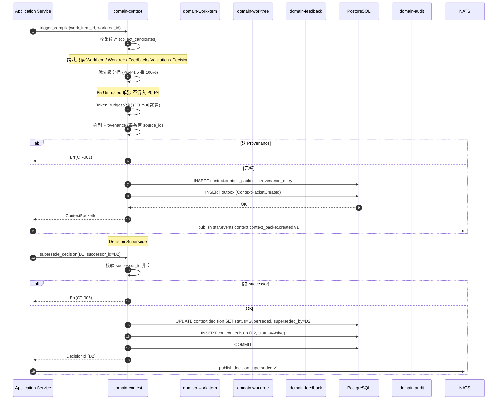

# domain-context 实施 spec

> **状态**: Draft v0.1 (2026-08-25)
> **上游依赖**:
> - 《Requirements》§26 (Context Compiler), §32 ADR-024
> - 《Basic Design》§2.1(表 5), §4.4, §4.10.7, §5.7, §6.1
> - 《API Design》§3.24
> - 《Data Design》§4.23 (`context` schema)
> - 《Security Design》§8 (AI 数据边界)
> - 《AI·Agent Design》§2.2 (compile_context 算法,修复 D-02 后)
> **下游交付**: Implementation team — Rust crate 路径 `crates/domain-context/`
> **最后审稿**: 待 RFC 化时

---

## 1. 职责与边界

`domain-context` 承载 **Context Compiler**(§26.1)+ **Decision Memory**。Context Compiler **不是 LLM**,而是"根据当前任务、代码状态、历史决策和反馈,为 Coding Agent 生成最小必要 Context Packet 的确定性/半确定性系统能力"。

**属于本 crate 的**:
- ContextPacket 聚合根(§26.2)
- ProvenanceEntry 值对象(§26.3,强制可追溯)
- Decision 聚合根(§26.5,Decision Memory)
- Token Budget 与 P0-P4 五层优先级(§4.4.4)
- FeedbackToInstructionCompiler(从结构化 Feedback 编译 Agent Instruction,§4.4.7)

**不属于本 crate 的**:
- SymbolIndex 实体本身(由 `domain-development` 拥有,本 Module 仅消费)
- AgentSession(由 `domain-agent` 拥有,本 Module 输出 Context Packet 给其消费)
- LLM 推理

## 2. 关键实体

引用 data-design §4.23 (`context` schema):

**ContextPacket**(聚合根,§26.2)
- 标识: `packet_id`, `tenant_id`, `project_id`
- 关联: `work_item_id`, `worktree_id`, `agent_session_id`(消费方)
- 内容: `intent`, `objective`, `scope`(含 allowed_paths / forbidden_paths)
- 输入: `relevant_requirements[]`, `acceptance_criteria[]`, `relevant_files[]`, `relevant_symbols[]`
- 决策: `architecture_constraints[]`, `existing_decisions[]`
- 现状: `current_change_set_id`, `open_feedback[]`, `failed_validation[]`
- 约束: `preserve_rules[]`, `prohibited_changes[]`
- 输出: `expected_output`, `verification_instructions[]`
- 容量: `token_budget`, `actual_tokens`
- 优先级: `priority_layers`(P0 / P1 / P2 / P3 / P4)
- Provenance: `provenance: Vec<ProvenanceEntry>`(每条引用源)
- 元数据: `created_at`, `created_by`(user_id 或 system:context-compiler)

**ProvenanceEntry**(值对象,§26.3)
- `source_type`:Requirement / AcceptanceCriterion / Decision / Feedback / File / Symbol / Test / ADR / FailedValidation / OpenFeedback
- `source_id`, `version`(追踪被取代的版本)
- `included_at_layer`:Priority(P0 / P1 / P2 / P3 / P4)

**Decision**(聚合根,§26.5)
- 标识: `decision_id`, `tenant_id`, `project_id`
- 内容: `statement`, `reason`, `scope`
- 来源: `source`(ConversationId / RequirementId / ArchitectureReviewId)
- 状态: `status`(Active / Superseded / Invalidated,§A.7 3 状态)
- 关系: `superseded_by`, `invalidated_by`
- 时间: `created_at`, `created_by`

## 3. 关键不变量

| ID | 不变量 | 上游依据 |
|---|---|---|
| INV-CT-01 | **Context Packet 必带 Provenance**,不可生成无 provenance 的 packet | basic-design §4.4.5, §26.3, §10 接口稳定承诺 #2 |
| INV-CT-02 | **P0-P4 五层结构**(5 桶,非 P5) | basic-design §4.4.4, §10 接口稳定承诺 #3, **D-02 修复后** |
| INV-CT-03 | P0 不可被裁剪,只可被新的 P0 取代 | basic-design §4.4.4 |
| INV-CT-04 | Decision 优先于聊天历史(Active Decision 优先) | basic-design §4.4.4, §26.5 |
| INV-CT-05 | Decision 状态机 3 状态(Active / Superseded / Invalidated) | basic-design §A.7, §10 接口稳定承诺 #9 |
| INV-CT-06 | **Superseded 必带 successor**,Invalidated 仅标记无效(不取代) | basic-design §4.4.6 |
| INV-CT-07 | Context Compiler **不是 LLM**(确定性 / 半确定性) | basic-design §4.4.1, §26.1 |
| INV-CT-08 | **不跨 Repository 加载**(同 Repo 内可跨 Module) | basic-design §6.6, security-design §3.5.2 |
| INV-CT-09 | **不跨 Worktree 加载**(除非显式 Aggregate) | basic-design §6.6, security-design §3.5.3 |
| INV-CT-10 | Untrusted Content(P5)与 Trusted Human Policy(P0)优先级分离(防 Prompt Injection) | basic-design §4.10.7, RISK-021 |

## 4. 接口签名

继承 api-design §3.24。

```rust
// crates/domain-context/src/port.rs

pub trait ContextCommandPort {
    async fn trigger_compile(
        &self,
        cmd: TriggerCompileCommand,  // work_item_id, worktree_id, agent_session_id
        actor: ActorContext,
    ) -> Result<ContextPacketId, ContextError>;  // 异步 Job

    async fn create_decision(
        &self,
        cmd: CreateDecisionCommand,
        actor: ActorContext,
    ) -> Result<DecisionId, ContextError>;

    async fn supersede_decision(
        &self,
        cmd: SupersedeDecisionCommand,  // 必带 successor_id
        actor: ActorContext,
    ) -> Result<DecisionId, ContextError>;

    async fn invalidate_decision(
        &self,
        cmd: InvalidateDecisionCommand,  // 不取代,仅标记
        actor: ActorContext,
    ) -> Result<(), ContextError>;
}

pub trait ContextQueryPort {
    async fn get_packet(&self, id: ContextPacketId, viewer: ActorContext) -> Result<ContextPacket, ContextError>;
    async fn list_provenance(&self, id: ContextPacketId, viewer: ActorContext) -> Result<Vec<ProvenanceEntry>, ContextError>;
    async fn list_decisions(&self, q: ListDecisionQuery, viewer: ActorContext) -> Result<Vec<Decision>, ContextError>;
    async fn get_decision(&self, id: DecisionId, viewer: ActorContext) -> Result<Decision, ContextError>;
    async fn trace_decision(&self, id: DecisionId, viewer: ActorContext) -> Result<DecisionTrace, ContextError>;
    async fn generate_handoff_packet(
        &self,
        cmd: HandoffRequest,  // from_session_id, to_session_id
        actor: ActorContext,
    ) -> Result<HandoffContextPacket, ContextError>;
}

pub trait FeedbackToInstructionCompiler {
    fn compile(
        &self,
        feedback: &Feedback,
        target: &ResolvedTarget,
        project_policy: &ProjectPolicy,
    ) -> Result<AgentInstruction, CompilerError>;
}
```

## 5. Domain Events

| Subject (NATS) | 触发条件 | Payload |
|---|---|---|
| `star.events.context.context_packet.created.v1` | Context Compiler 完成 | `packet_id, work_item_id, worktree_id, agent_session_id, token_actual, layer_distribution` |
| `star.events.context.decision.created.v1` | `create_decision` 成功 | `decision_id, statement, status=Active` |
| `star.events.context.decision.superseded.v1` | `supersede_decision` 成功 | `decision_id, successor_id` |
| `star.events.context.decision.invalidated.v1` | `invalidate_decision` 成功 | `decision_id, reason` |

**订阅者**:
- `domain-audit`(Append)
- `domain-notification`(Decision 变更)
- `domain-agent`(Context Packet 创建后,AgentSession 启动消费)

## 6. 数据所有权

引用 data-design §4.23(`context` schema):

- `context.context_packet`(聚合根,**核心聚合根**)
- `context.provenance_entry`(实体,内嵌通常,但独立索引)
- `context.decision`(聚合根,**核心聚合根**)
- Object Storage:`context.symbol_snapshot/{tenant_id}/{repository_id}.json`(Symbol 引用)

**RLS 策略**:
- 全部启用 RLS,`USING (current_setting('app.current_tenant_id') = tenant_id)`
- Symbol Snapshot Object Storage Key 强制 tenant_id 前缀

**索引策略**:
- `context.context_packet(work_item_id, created_at DESC)`
- `context.context_packet(worktree_id, agent_session_id)`
- `context.decision(project_id, status)` — Active Decision 查询
- `context.decision(superseded_by)` — 反向 Supersede 链

## 7. 鉴权与授权

**Permission 字符串**:
- `context:read`, `context:trigger`
- `decision:read`, `decision:create`, `decision:supersede`, `decision:invalidate`

**内置 Role**:
- `tenant_admin` / `project_admin` — 全部
- `developer` — 全部
- `viewer` — 仅 read

**Service-Internal**:`generate_handoff_packet` 由新 AgentSession 启动时触发(Service-Internal)

## 8. 错误码

引用 api-design §8.3.4(CT- 系列):

| 错误码 | HTTP | 触发条件 |
|---|---|---|
| `SEC-001/002/007` | 401/403/403 | 鉴权类 |
| `CT-001` | 422 | 缺 Provenance 的 Packet(VAL-001 拒绝) |
| `CT-002` | 422 | Token Budget 超过 max_context_tokens |
| `CT-003` | 404 | ContextPacket / Decision 不存在 |
| `CT-004` | 409 | 非法 Decision 状态迁移(已 Superseded) |
| `CT-005` | 422 | Supersede 缺 successor_id |
| `CT-006` | 422 | 跨 Repository / Worktree 加载(P5 隔离失败) |
| `CT-007` | 422 | Untrusted-as-Instruct 检测(SEC-015) |

## 9. 实施任务分解

| 任务 | 描述 | 依赖 | TBD-MEASURE | 估算 |
|---|---|---|---|---|
| T1 | ContextPacket + ProvenanceEntry + Decision 实体 | 无 | — | 150K tokens |
| T2 | 3 状态 Decision 状态机(§A.7) | T1 | basic-design §A.7 | 60K tokens |
| T3 | `ContextCommandPort` 4 个方法 + 错误码 | T1, T2 | — | 150K tokens |
| T4 | `ContextQueryPort` 6 个方法 | T1-T3 | — | 120K tokens |
| T5 | **P0-P4 五层 Token Budget 分配**(D-02 修复后,5 桶 100%) | T1 | basic-design §4.4.4 | 200K tokens |
| T6 | **P5 Untrusted 隔离逻辑**(D-02 修复后,Step 6 单独,不入 P0-P4) | T5 | basic-design §4.10.7, **D-02 修复** | 150K tokens |
| T7 | Provenance 强制校验(每个 relevant_* 必带 ProvenanceEntry) | T1 | basic-design §4.4.5 | 100K tokens |
| T8 | Decision 优先于聊天历史(Active Decision 优先) | T4 | basic-design §4.4.4, §26.5 | 80K tokens |
| T9 | FeedbackToInstructionCompiler(结构化 Feedback → AgentInstruction) | T1 | basic-design §4.4.7 | 150K tokens |
| T10 | Handoff Context Packet 生成(§4.2.7) | T4 | basic-design §4.2.7 | 100K tokens |
| T11 | 单元测试 + Provenance 强制 + 5 桶分配测试 + P5 隔离测试 | T1-T10 | **D-02 修复要点** | 250K tokens |
| T12 | 集成测试:WorkItem → Compile → Decision Supersede → Handoff | T11 | api-design §3.24 | 150K tokens |

**合计估算**: ~1.66M tokens ≈ 7 人·天(AI 协作模式)

## 10. 验收标准(AC)

```gherkin
Feature: Context Compiler 与 Decision Memory

  Scenario: 触发 Context 编译
    Given WorkItem W (AITask), Worktree WT, Feedback F1
    When POST /v1/context-packets:trigger {work_item_id: W, worktree_id: WT}
    Then 202 Accepted (异步 Job)
    And  Job 完成 → ContextPacket 含 P0-P4 五层
    And  Provenance 全部非空

  Scenario: P0-P4 五层 + P5 隔离(D-02 修复后)
    Given ContextPacket P 含 P0-P4 5 桶,total=128K
    When 校验 token 分配
    Then P0 不可裁剪
    And  P5 Untrusted 单独段(不与 P0-P4 混合)
    And  P4 (Low-confidence AI Summary) 桶存在(非空)

  Scenario: Provenance 强制
    Given ContextPacket 缺 provenance
    When 提交
    Then 422 CT-001 (Provenance 必带,VAL-001)

  Scenario: Decision Supersede 必带 successor
    Given Decision D1 (status=Active)
    When POST /v1/decisions/{D1}:supersede {successor_id: null}
    Then 422 CT-005

  Scenario: 跨 Repository 加载拒绝
    Given Context Compiler 尝试加载 Repository A + B
    When 编译
    Then 422 CT-006 (Cross-Repository Forbidden)

  Scenario: Untrusted-as-Instruct 检测
    Given README 内容被作为 P5 加入
    When LLM 检测发现内容试图修改 Agent 行为
    Then 422 CT-007 + 标记可疑
    And  P0 不可被 P5 覆盖

  Scenario: Handoff Context Packet
    Given AgentSession AS1 结束,AS2 接管 Worktree
    When POST /v1/agent-sessions/{AS2}/handoff-context
    Then 返回 HandoffContextPacket
    And  含 objective, current_state, completed_work, open_work, decisions, open_feedback
```

## 11. 风险与缓解

| Risk | 影响 | 缓解 | 引用 |
|---|---|---|---|
| Context Explosion | Medium | Token Budget + P0-P4 + Decision 优先 | basic-design §4.4.4, RISK-024 |
| Low-quality Context Selection | Medium | Provenance 强制 + Relevant Context Ratio 监控 | basic-design §4.4.5, RISK-025 |
| **Prompt Injection (D-02 修复)** | Critical | **P5 单独隔离,绝不与 P0-P4 混合**(D-02 修复) | basic-design §4.10.7, RISK-021, D-02 |
| **AI Agent Memory Blob**(无来源) | High | Provenance 强制 + 重放能力 | basic-design §26.3 |
| Cross-Repository Context Leakage | High | INV-CT-08 + CT-006 拒绝 | basic-design §6.6, RISK-020 |

## 12. Open Issues

- J-CT-01: Token Budget 具体值(P0/P1/P2/P3/P4 分配 %)TBD-MEASURE 校准(§15 J.3)
- J-CT-02: Decision 是否支持自动 Supersede(LLM 检测冲突)?(目前人工)
- J-CT-03: Symbol Snapshot 增量刷新策略(实时 vs 周期)?(目前周期,§21.2)
- J-CT-04: Handoff 是否支持跨 AgentType(Codex → ClaudeCode)?(目前同 AgentType)

## 附录 A:关键流程时序图 — Context 编译 + Decision Supersede



## 附录 B:边界清单

| 边界类型 | 本 Module 行为 |
|---|---|
| 上游依赖 | `domain-tenant`, `domain-work-item`, `domain-worktree`, `domain-feedback`, `domain-validation`, `domain-development` (SymbolIndex), `domain-agent` |
| 下游调用 | `domain-audit`, `domain-notification`, `domain-agent` |
| 跨域事务 | `trigger_compile` 跨域只读(Application 编排) |
| RLS 强制 | 全部 PG 表启用 RLS,Symbol Snapshot 强制 tenant_id 前缀 |
| **13 类 tenant_id 对象** | **直接覆盖 #5 ContextPacket**(聚合根),#13 Symbol Index(消费 `domain-development` SymbolIndex,**D-02 修复** Symbol 隔离) |
| 14 状态 AgentSession 触发 | **直接**:ContextPacket 触发 AgentSession 启动(`* → STARTING`),Feedback 消费触发 `WAITING_FEEDBACK` |
| 17 状态 Worktree 触发 | 间接(Context Packet 含 Worktree.current_change_set_id) |
| WorkItem 3 态 | 间接 |

**接口稳定承诺**:Port trait 签名 + **P0-P4 五层结构** + 3 状态 Decision 状态机 + Provenance 强制 + Handoff Context Packet 结构 + 7 条错误码在后续 RFC 阶段不会变更(除非 D-02 修复再次被反演)。
