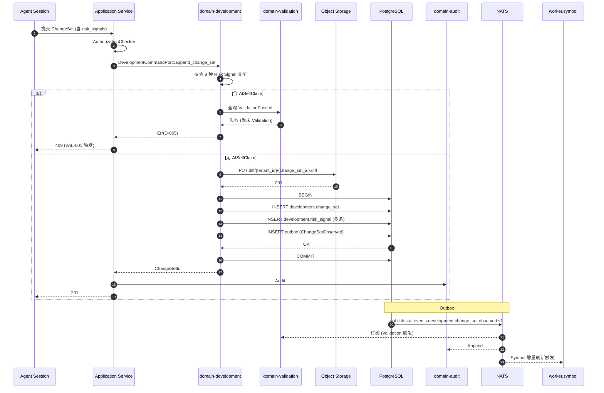

# domain-development 实施 spec

> **状态**: Draft v0.1 (2026-08-25)
> **上游依赖**:
> - 《Requirements》§20 (Development Context), §21 (Development Execution)
> - 《Basic Design》§2.1(表 8), §4.8, §4.10.7, §5.7
> - 《API Design》§3.20
> - 《Data Design》§4.19 (`development` schema)
> - 《Security Design》§3.1-3.4, §8 (AI 数据边界)
> **下游交付**: Implementation team — Rust crate 路径 `crates/domain-development/`
> **最后审稿**: 待 RFC 化时

---

## 1. 职责与边界

`domain-development` 是 **Development Execution 聚合层** + **Repository Indexing**(§20 合并入,§2.1 表 8 注 2)。承载 DevelopmentExecution / ChangeSet / SymbolIndex / RepositoryContext / DevelopmentContext 5 个聚合根,负责 WorkItem 在真实代码环境中的一次或多次执行的结构化记录。

**属于本 crate 的**:
- DevelopmentExecution 聚合根(WorkItem → 多个 Worktree / AgentSession / ChangeSet / Validation / Feedback / Commit / PR 的汇总)
- ChangeSet 聚合根(不只存 Git Diff,需承载 Files / Symbols / Diff / Risk Signals 等结构化信息,§21.1)
- SymbolIndex / RepositoryContext / DevelopmentContext 投影(由 worker 异步刷新)
- Diff 全文(Object Storage 引用,§21.1)

**不属于本 crate 的**:
- WorkItem / Worktree / AgentSession 实体本身
- Git Diff 原始数据(由 SCM Adapter 拉取,本 crate 仅结构化)
- LLM 推理(`domain-agent` 与 `domain-context` 拥有)

## 2. 关键实体

引用 data-design §4.19 (`development` schema):

**DevelopmentExecution**(聚合根,§21)
- 标识: `execution_id`, `tenant_id`, `project_id`
- 关联: `work_item_id`, `repository_id`
- 子集: `worktree_ids[]`(1..N), `agent_session_ids[]`, `change_set_ids[]`
- 汇总: `validation_result_ids[]`, `feedback_ids[]`, `commit_ids[]`, `pull_request_ids[]`
- 时间: `started_at`, `ended_at`, `execution_state`

**ChangeSet**(聚合根,§21.1)
- 标识: `change_set_id`, `tenant_id`, `project_id`
- 关联: `worktree_id`, `agent_session_id`, `commit_id`
- 文件: `files[]`(path, status: Added/Modified/Deleted/Renamed/Generated, old_path, lines_added, lines_deleted)
- 符号: `symbols[]`(symbol_ref, status, old_signature)
- Diff: `diff_reference`(指向 Object Storage)
- 计数: `added_lines`, `deleted_lines`, `renamed_files`, `generated_files`
- 依赖: `dependency_changes[]`, `schema_changes[]`, `config_changes[]`, `test_changes[]`
- 风险: `risk_signals[]`(8 种类型,§4.8.5)
- 时间: `created_at`

**SymbolIndex**(Projection,§20 合并入)
- 标识: `symbol_index_id`, `tenant_id`, `repository_id`
- 符号集: `symbols[]`(symbol_ref, kind, signature, file_path, line_range)
- 刷新: `last_refresh_at`, `version`

**RepositoryContext**(Projection)
- 仓库元数据: `repository_id`, `tenant_id`, `primary_language`, `framework`, `build_system`, `test_framework`
- 容量: `total_files`, `total_lines`, `last_indexed_at`

**DevelopmentContext**(Projection)
- 标识: `development_context_id`, `tenant_id`, `work_item_id`, `execution_id`
- 关联: `relevant_symbols[]`, `relevant_files[]`, `architecture_constraints[]`
- 缓存: `last_compiled_at`, `version`

**RiskSignal**(值对象)
- `kind`:LargeChange / GeneratedFile / SchemaChange / DependencyUpgrade / SecurityHint / TestCoverageDrop / ConflictRisk / AISelfClaim
- `severity`:Info / Low / Medium / High / Critical
- `source`:StaticAnalysis / Lint / AIClassifier / Human / Heuristic
- `evidence`, `suggested_action`

## 3. 关键不变量

| ID | 不变量 | 上游依据 |
|---|---|---|
| INV-D-01 | ChangeSet ≠ Git Diff(必须结构化) | basic-design §21.1, §4.8.3 |
| INV-D-02 | 1 ChangeSet 关联 1 Commit,1 Commit 可被 0..1 PR 引用 | basic-design §4.8.4 |
| INV-D-03 | Diff 全文不存 PostgreSQL,仅 `diff_reference` 引用 Object Storage | basic-design §4.8.3, REQ-DATA-002 |
| INV-D-04 | 8 种 Risk Signal 类型(基本设计锁定) | basic-design §4.8.5, §10 接口稳定承诺 #4 |
| INV-D-05 | Diff / Build Log / Test Log 的 Object Storage Key 必带 tenant_id 前缀 | basic-design §6.1, security-design §4.3 |
| INV-D-06 | SymbolIndex 跨 Repository 不合并(独立 Project) | basic-design §6.6 Cross-Repository 防护 |
| INV-D-07 | AISelfClaim RiskSignal 必走 Validation Chain(VAL-001 强约束) | basic-design §4.8.5, VAL-001 |
| INV-D-08 | Symbol-aware Context 第一阶段 File-level + Basic Symbol Detection,V1 渐进 | basic-design §4.8.6, ADR-028 |

## 4. 接口签名

继承 api-design §3.20。

```rust
// crates/domain-development/src/port.rs

pub trait DevelopmentCommandPort {
    async fn create_execution(
        &self,
        cmd: CreateExecutionCommand,  // work_item_id, repository_id
        actor: ActorContext,
    ) -> Result<ExecutionId, DevelopmentError>;

    async fn append_change_set(
        &self,
        cmd: AppendChangeSetCommand,  // execution_id, worktree_id, agent_session_id, commit_id
        actor: ActorContext,
    ) -> Result<ChangeSetId, DevelopmentError>;

    async fn attach_risk_signal(
        &self,
        cmd: AttachRiskSignalCommand,  // change_set_id, kind, severity, evidence
        actor: ActorContext,
    ) -> Result<RiskSignal, DevelopmentError>;

    async fn close_execution(
        &self,
        cmd: CloseExecutionCommand,
        actor: ActorContext,
    ) -> Result<DevelopmentExecution, DevelopmentError>;
}

pub trait DevelopmentQueryPort {
    async fn get_execution(&self, id: ExecutionId, viewer: ActorContext) -> Result<DevelopmentExecution, DevelopmentError>;
    async fn list_change_sets(&self, q: ListChangeSetQuery, viewer: ActorContext) -> Result<Vec<ChangeSet>, DevelopmentError>;
    async fn get_change_set(&self, id: ChangeSetId, viewer: ActorContext) -> Result<ChangeSet, DevelopmentError>;
    async fn get_diff_url(&self, id: ChangeSetId, viewer: ActorContext) -> Result<DiffDownloadURL, DevelopmentError>;  // 短期预签名
    async fn get_symbol_index(&self, repository_id: RepositoryId, viewer: ActorContext) -> Result<SymbolIndex, DevelopmentError>;
    async fn get_repository_context(&self, repository_id: RepositoryId, viewer: ActorContext) -> Result<RepositoryContext, DevelopmentError>;
    async fn get_development_context(&self, execution_id: ExecutionId, viewer: ActorContext) -> Result<DevelopmentContext, DevelopmentError>;
}
```

## 5. Domain Events

| Subject (NATS) | 触发条件 | Payload |
|---|---|---|
| `star.events.development.execution.created.v1` | `create_execution` 成功 | `execution_id, work_item_id, repository_id` |
| `star.events.development.change_set.observed.v1` | `append_change_set` 成功 | `change_set_id, worktree_id, agent_session_id, commit_id, risk_signal_count` |
| `star.events.development.risk_signal.detected.v1` | `attach_risk_signal` 成功且 severity >= High | `change_set_id, kind, severity, evidence` |
| `star.events.development.execution.closed.v1` | `close_execution` 成功 | `execution_id, ended_at, change_set_count` |
| `star.events.development.symbol_index.refreshed.v1` | Worker 刷新 SymbolIndex | `repository_id, version, symbol_count` |

**订阅者**:
- `domain-audit`(Append)
- `domain-validation`(ChangeSet 触发 Validation)
- `domain-notification`(Risk Signal 严重)
- `domain-search`(投影)

## 6. 数据所有权

引用 data-design §4.19(`development` schema),本 Module 拥有的表 / 视图:

- `development.development_execution`(聚合根,**核心聚合根**)
- `development.change_set`(聚合根,**核心聚合根**)
- `development.symbol_index`(Projection,§20 合并入)
- `development.repository_context`(Projection)
- `development.development_context`(Projection,业务聚合也持有)
- Object Storage:`development.diff/{tenant_id}/{change_set_id}.diff`(强制 tenant_id 前缀)

**RLS 策略**:
- 全部启用 RLS,`USING (current_setting('app.current_tenant_id') = tenant_id)`
- Object Storage Key 第一段 = `tenant_id`

**索引策略**(data-design §8):
- `development.change_set(worktree_id, created_at DESC)` — Worktree 历史
- `development.change_set(commit_id)` UNIQUE
- `development.development_execution(work_item_id, started_at DESC)`
- `development.symbol_index(repository_id, last_refresh_at DESC)`

## 7. 鉴权与授权

引用 security-design §3.4:

**Permission 字符串**:
- `development_execution:read`, `development_execution:create`
- `change_set:read`, `change_set:append`, `change_set:read_diff`
- `symbol_index:read`, `repository_context:read`
- `risk_signal:create`

**内置 Role**:
- `tenant_admin` / `project_admin` — 全部
- `developer` — 全部
- `viewer` — 仅 read 类

**特殊**:`change_set:read_diff` 是受控权限(避免敏感 Diff 泄漏),由 `tenant_admin` 严格审批。

## 8. 错误码

| 错误码 | HTTP | 触发条件 |
|---|---|---|
| `SEC-001/002/007` | 401/403/403 | 鉴权类 |
| `D-001` | 404 | Execution / ChangeSet 不存在 |
| `D-002` | 409 | ChangeSet 已 commit,不可修改 |
| `D-003` | 422 | Risk Signal kind 不在 8 种类型中 |
| `D-004` | 422 | Object Storage Key 缺 tenant_id 前缀 |
| `D-005` | 409 | AISelfClaim 未走 Validation Chain(VAL-001) |
| `D-006` | 422 | Symbol refresh 与 Repository 不属同 Tenant |

## 9. 实施任务分解

| 任务 | 描述 | 依赖 | TBD-MEASURE | 估算 |
|---|---|---|---|---|
| T1 | DevelopmentExecution + ChangeSet + RiskSignal 实体 | 无 | — | 120K tokens |
| T2 | SymbolIndex + RepositoryContext + DevelopmentContext 实体(§20 合并) | T1 | — | 100K tokens |
| T3 | `DevelopmentCommandPort` 4 个方法 + 错误码 | T1, T2 | — | 150K tokens |
| T4 | `DevelopmentQueryPort` 7 个方法 | T1-T3 | — | 120K tokens |
| T5 | Diff 全文 Object Storage 上传 / 短期预签名 URL 生成 | T3 | security-design §4.3 | 80K tokens |
| T6 | 8 种 RiskSignal 类型 seed(§4.8.5) | T1 | basic-design §4.8.5 | 50K tokens |
| T7 | SymbolIndex 异步刷新(worker,§21.2) | T2 | basic-design §21.2, ADR-028 | 200K tokens |
| T8 | AISelfClaim 强制走 Validation Chain(VAL-001) | T3 | VAL-001, basic-design §4.5.5 | 100K tokens |
| T9 | 单元测试 + RLS + 13 类对象覆盖(Object Storage Key 前缀) | T1-T8 | security-design §3.5.4 | 200K tokens |
| T10 | 集成测试:Execution → ChangeSet → Risk Signal → Symbol 刷新 | T9 | api-design §3.20 | 150K tokens |

**合计估算**: ~1.27M tokens ≈ 5 人·天(AI 协作模式)

## 10. 验收标准(AC)

```gherkin
Feature: Development Execution 与 ChangeSet

  Scenario: 创建 DevelopmentExecution
    Given WorkItem W (AITask), Repository R
    When POST /v1/development-executions {work_item_id: W, repository_id: R}
    Then 201 Created {execution_id}
    And  execution_state=Running
    And  SymbolIndex 触发异步刷新

  Scenario: 提交 ChangeSet 关联 1 Commit
    Given Execution E 在 Worktree WT 上完成 Commit C
    When POST /v1/change-sets {execution_id: E, worktree_id: WT, commit_id: C, files[], risk_signals[]}
    Then 201 Created {change_set_id}
    And  diff_reference 写入 Object Storage Key (含 tenant_id 前缀)
    And  AuditEvent 记录 change_set_observed

  Scenario: AISelfClaim 风险必走 Validation
    Given ChangeSet 包含 AISelfClaim Risk Signal
    When 提交 ChangeSet
    Then D-005 拒绝,提示必须先 Validation Passed
    And  ChangeSet 未被创建

  Scenario: 8 种 Risk Signal 完整覆盖
    Given ChangeSet 包含 LargeChange, SchemaChange, GeneratedFile 等
    When 查询
    Then 全部识别,severity 正确映射

  Scenario: Symbol 刷新跨 Tenant 拒绝
    Given Repository R (Tenant Y)
    When User (Tenant X) 尝试 GET /v1/symbol-index/{R}
    Then 403 SEC-007

  Scenario: Diff 全文不可直接读 PG
    Given ChangeSet C 含 diff_reference
    When 直接 SELECT body FROM change_set
    Then 字段不存在,仅 diff_reference (S3 Key)
```

## 11. 风险与缓解

| Risk | 影响 | 缓解 | 引用 |
|---|---|---|---|
| ChangeSet 退化为 Git Diff | High | INV-D-01 + DDL 强制 8 种 Risk Signal 必带 | basic-design §21.1, §4.8.5 |
| Diff 全文入 PG(性能) | High | INV-D-03 + Object Storage 强制 | basic-design §4.8.3, REQ-DATA-002 |
| AISelfClaim 绕过 Validation | Critical | INV-D-07 + VAL-001 + D-005 拒绝 | VAL-001 |
| Symbol-level 误用(Graph DB) | Medium | ADR-028 推迟 V1 | basic-design §30.6 |
| Object Storage Key 越权 | Critical | INV-D-05 + 短期预签名 URL | security-design §4.3 |

## 12. Open Issues

- J-DEV-01: SymbolIndex 刷新是否走实时(每 commit)还是周期?目前周期(§21.2)
- J-DEV-02: Risk Signal 是否支持自定义(由 Project Policy 添加)?目前 8 种基本类型
- J-DEV-03: ChangeSet 是否支持 atomic merge(多 ChangeSet 合并)?V1 评估
- J-DEV-04: DevelopmentContext 是否持久化还是按需编译?目前持久化(§26 ADR-025)

## 附录 A:关键流程时序图 — ChangeSet 提交与 Risk Signal 门控



## 附录 B:边界清单

| 边界类型 | 本 Module 行为 |
|---|---|
| 上游依赖 | `domain-tenant`, `domain-project`, `domain-work-item`, `domain-scm`, `domain-worktree`, `domain-agent` |
| 下游调用 | `domain-audit`, `domain-validation`, `domain-notification`, `domain-search` |
| 跨域事务 | `append_change_set` 触发 Validation Chain(Application 编排) |
| RLS 强制 | 全部 PG 表启用 RLS,Object Storage Key 强制 tenant_id 前缀 |
| **13 类 tenant_id 对象** | **直接覆盖 #9 Diff**(Object Storage Key)、#13 Symbol Index(SymbolIndex 表 + Object Storage Snapshot),**间接覆盖 #7 AI Prompt / #8 AI Response**(ChangeSet 关联,ChangeSetSymbol 引用 AIAuditMetadata) |
| 14 状态 AgentSession 触发 | **直接**:ChangeSet.agent_session_id 必带,AgentSession 状态变更触发 ChangeSet 提交 |
| 17 状态 Worktree 触发 | **直接**:ChangeSet.worktree_id 必带,Worktree 状态变更(VALIDATING)触发 ChangeSet 提交 |
| WorkItem 3 态 | 间接(Execution.work_item_id 引用) |

**接口稳定承诺**:Port trait 签名 + 8 种 Risk Signal 类型 + 6 条错误码 + 8 条不变量 + Object Storage Key 强制 tenant_id 前缀在后续 RFC 阶段不会变更。
