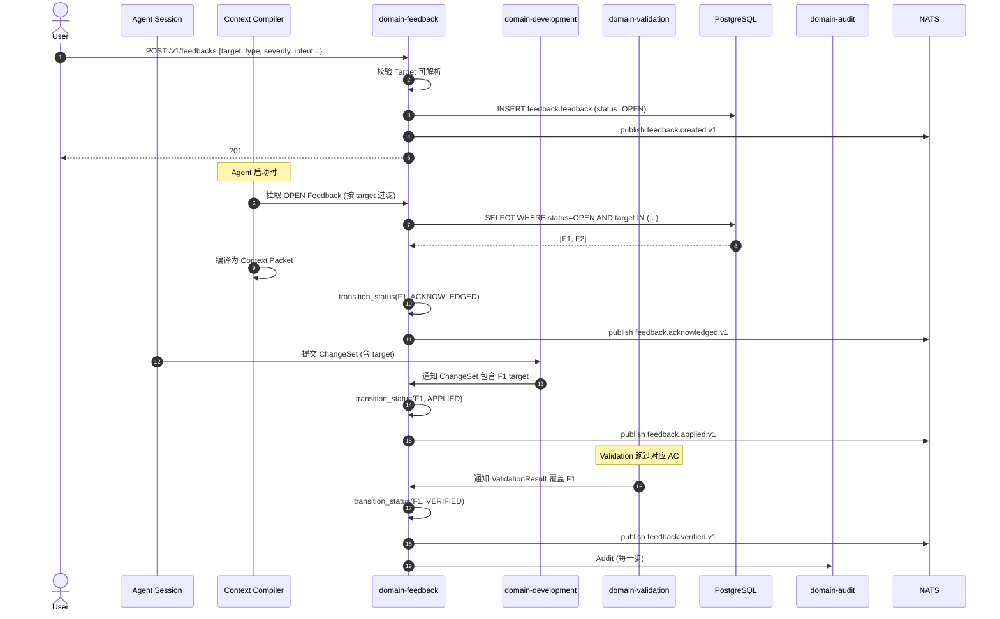

# domain-feedback 实施 spec

> **状态**: Draft v0.1 (2026-08-25)
> **上游依赖**:
> - 《Requirements》§25, REQ-FBK-001/002
> - 《Basic Design》§2.1(表 4), §4.3, §7.3, §5.7, §6.1
> - 《API Design》§3.23 (6 状态迁移端点)
> - 《Data Design》§4.22 (`feedback` schema)
> - 《Security Design》§3.1-3.4
> **下游交付**: Implementation team — Rust crate 路径 `crates/domain-feedback/`
> **最后审稿**: 待 RFC 化时

---

## 1. 职责与边界

`domain-feedback` 承载**结构化 Feedback 一级领域对象**(§25.1,REQ-FBK-001/002),**禁止**降级为 Comment。需支持精准目标绑定(WorkItem → Diff Hunk)、结构化字段(Expected / Preserve / Prohibit)、消费追踪(VERIFIED / REJECTED / SUPERSEDED)。

**属于本 crate 的**:
- Feedback 聚合根(6 状态机,§7.3)
- FeedbackTarget 全粒度(13 种,§4.3.3)
- FeedbackConsumedEvent Projection
- Feedback Inbox / Intervention Queue(§4.3.6)

**不属于本 crate 的**:
- Comment / Mention(`domain-comment` 拥有,Feedback ≠ Comment)
- Context Packet 生成(由 `domain-context` 消费 Feedback)
- Validation 链(由 `domain-validation` 写 VERIFIED 状态)

## 2. 关键实体

引用 data-design §4.22 (`feedback` schema):

**Feedback**(聚合根)
- 标识: `feedback_id`, `tenant_id`, `project_id`
- 目标: `target`(FeedbackTarget 枚举,13 种)
- 类型: `type`(Fix / Preserve / Refactor / Reject / Question / Constraint / Architecture / Security / Performance / Testing / Scope)
- 严重: `severity`(P0 / P1 / P2 / P3)
- 内容: `intent`(短句), `expected_behavior`, `preserve`, `prohibit`
- 关联: `acceptance_criteria_id`(可选)
- 作者: `author_user_id`, `author_agent_id`(AI 自己提的也要记录)
- 状态: `status`(OPEN / ACKNOWLEDGED / APPLIED / VERIFIED / REJECTED / SUPERSEDED,§7.3)
- 时间: `created_at`, `resolved_at`, `resolution_evidence[]`

**FeedbackTarget**(枚举,13 种,§4.3.3)
- WorkItem / Requirement / AcceptanceCriterion / Worktree / AgentSession
- File { repository_id, path, line_range }
- Symbol { repository_id, symbol_ref }
- DiffHunk { commit_id, hunk_index }
- Test / Build / RuntimeLog / ArchitectureDecision / PullRequest / ReviewFinding

**FeedbackConsumedEvent**(Projection,§4.3.2)
- `event_id`, `feedback_id`, `consumed_by`(AgentSession / ContextPacket / ChangeSet), `consumed_at`

## 3. 关键不变量

| ID | 不变量 | 上游依据 |
|---|---|---|
| INV-FB-01 | **6 状态机严格迁移**(OPEN / ACKNOWLEDGED / APPLIED / VERIFIED / REJECTED / SUPERSEDED,§7.3) | basic-design §7.3, §10 接口稳定承诺 #7 |
| INV-FB-02 | **Target 必可解析**:创建时 target_ref 必须能解析到当前存在的对象 | basic-design §4.3.7, §25.1 |
| INV-FB-03 | **Status 转换必审计**:每次状态迁移写 AuditEvent | basic-design §4.3.7 |
| INV-FB-04 | **Supersede 必有 successor**:新 Feedback 必显式引用 predecessor_id | basic-design §4.3.7 |
| INV-FB-05 | **Cross-Worktree 禁止**:Feedback 不得自动修改未经授权的 Worktree | basic-design §4.3.7, §37 AC 示例 2 |
| INV-FB-06 | Feedback 必带 tenant_id,跨 tenant 拒绝 | basic-design §6.1, REQ-SEC-001 |
| INV-FB-07 | **AI 自己提的 Feedback 也记录**(`author_agent_id` 必带) | basic-design §4.3.2 |
| INV-FB-08 | Feedback ≠ Comment(语义独立,UI 显式区分) | basic-design §25.1 |

## 4. 接口签名

继承 api-design §3.23。

```rust
// crates/domain-feedback/src/port.rs

pub trait FeedbackCommandPort {
    async fn create_feedback(
        &self,
        cmd: CreateFeedbackCommand,  // target, type, severity, intent, expected_behavior, preserve, prohibit
        actor: ActorContext,
    ) -> Result<FeedbackId, FeedbackError>;

    async fn update_feedback(
        &self,
        cmd: UpdateFeedbackCommand,  // 仅在 APPLIED 之前可改
        actor: ActorContext,
    ) -> Result<Feedback, FeedbackError>;

    async fn delete_feedback(
        &self,
        id: FeedbackId,
        actor: ActorContext,         // Protected,仅 OPEN 状态
    ) -> Result<(), FeedbackError>;

    async fn transition_status(
        &self,
        cmd: TransitionFeedbackStatusCommand,  // from, to, reason
        actor: ActorContext,
    ) -> Result<Feedback, FeedbackError>;  // 6 状态之一

    async fn submit_resolution(
        &self,
        cmd: SubmitResolutionCommand,  // feedback_id, evidence[]
        actor: ActorContext,
    ) -> Result<FeedbackResolution, FeedbackError>;
}

pub trait FeedbackQueryPort {
    async fn list_by_project(&self, q: ListFeedbackQuery, viewer: ActorContext) -> Result<Vec<Feedback>, FeedbackError>;
    async fn get_by_id(&self, id: FeedbackId, viewer: ActorContext) -> Result<Feedback, FeedbackError>;
    async fn inbox(&self, q: FeedbackInboxQuery, viewer: ActorContext) -> Result<Vec<FeedbackInboxItem>, FeedbackError>;
    async fn list_consumed_events(&self, feedback_id: FeedbackId, viewer: ActorContext) -> Result<Vec<FeedbackConsumedEvent>, FeedbackError>;
}
```

## 5. Domain Events

| Subject (NATS) | 触发条件 | Payload |
|---|---|---|
| `star.events.feedback.feedback.created.v1` | `create_feedback` 成功 | `feedback_id, target, type, severity, author_user_id, author_agent_id` |
| `star.events.feedback.feedback.acknowledged.v1` | `OPEN → ACKNOWLEDGED`(Agent 拉取) | `feedback_id, consumed_by_agent_session_id` |
| `star.events.feedback.feedback.applied.v1` | `ACKNOWLEDGED → APPLIED`(ChangeSet 提交) | `feedback_id, change_set_id` |
| `star.events.feedback.feedback.verified.v1` | `APPLIED → VERIFIED`(Validation 通过) | `feedback_id, validation_result_id` |
| `star.events.feedback.feedback.rejected.v1` | `任意 → REJECTED` | `feedback_id, reason` |
| `star.events.feedback.feedback.superseded.v1` | `任意 → SUPERSEDED` | `feedback_id, successor_feedback_id` |

**订阅者**:
- `domain-audit`(Append,全部事件)
- `domain-context`(`created` 触发 Context Compiler 拉取)
- `domain-notification`(高 severity P0/P1)
- `domain-collaboration`(Realtime 推送)

## 6. 数据所有权

引用 data-design §4.22(`feedback` schema):

- `feedback.feedback`(聚合根,**核心聚合根**)
- `feedback.feedback_consumed_event`(Projection)

**RLS 策略**:
- 全部启用 RLS,`USING (current_setting('app.current_tenant_id') = tenant_id)`

**索引策略**:
- `feedback.feedback(project_id, status, severity, created_at DESC)` — 列表
- `feedback.feedback(target_type, target_id)` — 反向查询(找 WorkItem 的 Feedback)
- `feedback.feedback(severity, status)` — Intervention Queue
- `feedback.feedback_consumed_event(feedback_id, consumed_at)` — 消费追踪

## 7. 鉴权与授权

**Permission 字符串**:
- `feedback:read`, `feedback:create`, `feedback:update`, `feedback:delete`
- `feedback:reject`, `feedback:resolve`, `feedback:supersede`

**内置 Role**:
- `tenant_admin` / `project_admin` — 全部
- `developer` — `feedback:read`, `feedback:create`, `feedback:update`
- `viewer` — 仅 `feedback:read`

**Service-Internal 触发**:
- `transition_status` 多数迁移(Service-Internal):Agent 拉取(OPEN→ACKNOWLEDGED)、ChangeSet 提交(ACK→APPLIED)、Validation 通过(APPLIED→VERIFIED)

## 8. 错误码

引用 api-design §8.3.3(FB- 系列):

| 错误码 | HTTP | 触发条件 |
|---|---|---|
| `SEC-001/002/007` | 401/403/403 | 鉴权类 |
| `FB-001` | 404 | Feedback 不存在 |
| `FB-002` | 409 | 非法 6 状态迁移 |
| `FB-003` | 422 | Target 不可解析(对象不存在) |
| `FB-004` | 422 | APPLIED 之后尝试 update |
| `FB-005` | 409 | 删除非 OPEN 状态 Feedback |
| `FB-006` | 422 | Supersede 缺少 successor_id |
| `FB-007` | 422 | Feedback Target 跨 Worktree(无权修改) |

## 9. 实施任务分解

| 任务 | 描述 | 依赖 | TBD-MEASURE | 估算 |
|---|---|---|---|---|
| T1 | Feedback + FeedbackTarget(13 种枚举) + FeedbackConsumedEvent 实体 | 无 | — | 120K tokens |
| T2 | 6 状态机迁移表(§7.3) | T1 | basic-design §7.3 | 60K tokens |
| T3 | `FeedbackCommandPort` 5 个方法 + 错误码 | T1, T2 | — | 150K tokens |
| T4 | `FeedbackQueryPort` 4 个方法(包含 inbox) | T1-T3 | — | 120K tokens |
| T5 | Target 可解析性校验(13 种类型逐一实现) | T3 | basic-design §4.3.3 | 150K tokens |
| T6 | Intervention Queue 优先级(P0-P3,§4.3.6) | T4 | basic-design §4.3.6 | 80K tokens |
| T7 | FeedbackConsumedEvent Projection(Agent / Context / ChangeSet 拉取时) | T3 | basic-design §4.3.2 | 80K tokens |
| T8 | 单元测试 + 6 状态全覆盖 + 13 种 Target 测试 | T1-T7 | security-design §3.5.4 | 200K tokens |
| T9 | 集成测试:Create → Agent Acknowledge → ChangeSet Apply → Validation Verify | T8 | api-design §3.23 | 150K tokens |

**合计估算**: ~1.11M tokens ≈ 4.5 人·天(AI 协作模式)

## 10. 验收标准(AC)

```gherkin
Feature: Feedback 结构化与状态机

  Scenario: 创建结构化 Feedback
    Given User U 在 WorkItem W 上
    When POST /v1/feedbacks {target: W, type: Architecture, severity: P1, intent: "重构为 AuthProvider", expected_behavior, preserve, prohibit}
    Then 201 Created {feedback_id, status=OPEN}
    And  AuditEvent 记录 feedback_created

  Scenario: Target 不可解析
    Given target.worktree_id = "non_existent"
    When POST /v1/feedbacks
    Then 422 FB-003 (Target 不可解析)

  Scenario: 6 状态机迁移 — 完整链
    Given Feedback F (status=OPEN)
    When AgentSession AS 拉取
    Then 200 OK, status=ACKNOWLEDGED (consumed_by=AS)
    When ChangeSet 包含 target
    Then 200 OK, status=APPLIED
    When ValidationResult 通过 AC
    Then 200 OK, status=VERIFIED

  Scenario: 6 状态机 — 任意 → REJECTED
    Given Feedback F (status=OPEN)
    When User 标记 REJECTED
    Then 200 OK, status=REJECTED

  Scenario: Supersede 必带 successor
    Given User 创建新 Feedback F2 引用 F1
    When POST /v1/feedbacks/{F1}:supersede
    And F2 缺少 predecessor_id
    Then 422 FB-006

  Scenario: APPLIED 之后不可改
    Given Feedback F (status=APPLIED)
    When PATCH /v1/feedbacks/{F}
    Then 422 FB-004 (APPLIED 后只读)

  Scenario: Intervention Queue P0
    Given Feedback F (severity=P0, type=Security)
    When GET /v1/feedbacks/inbox
    Then 排第一(Security Decision,§4.3.6)
```

## 11. 风险与缓解

| Risk | 影响 | 缓解 | 引用 |
|---|---|---|---|
| Feedback Misinterpretation | Medium | 结构化字段(Expected/Preserve/Prohibit)+ 状态机 | basic-design §25.2, RISK-026 |
| Cross-Worktree 误修改 | High | INV-FB-05 + FB-007 拒绝 | basic-design §4.3.7 |
| Target 悬空 | High | INV-FB-02 + FB-003 拒绝创建 | basic-design §4.3.7 |
| AI 自己提的 Feedback 越权 | Medium | author_agent_id 必带 + Audit | basic-design §4.3.2 |
| 13 类对象漏配 | Critical | RLS + AuthorizationChecker 双重 | basic-design §6.1 |

## 12. Open Issues

- J-FB-01: Feedback 是否支持批量创建(Multi-target)?(目前单 target)
- J-FB-02: 13 种 Target 是否全部 MVP 支持?(目前 13 种均支持,Symbol/DiffHunk 需 SymbolIndex)
- J-FB-03: Feedback Inbox 是否支持 SLA 自动升级?(P0 未响应 24h 升级)
- J-FB-04: Feedback 与 Comment 是否可互相引用?(目前独立,UI 显式区分)

## 附录 A:关键流程时序图 — Feedback 完整生命周期



## 附录 B:边界清单

| 边界类型 | 本 Module 行为 |
|---|---|
| 上游依赖 | `domain-tenant`, `domain-project`, 全部 Target 类型 Module(`domain-work-item` / `domain-worktree` / `domain-agent` 等) |
| 下游调用 | `domain-audit`, `domain-context`(拉取 Open Feedback), `domain-notification`, `domain-collaboration` |
| 跨域事务 | Target 可解析性跨域读(同事务) |
| RLS 强制 | 全部 PG 表启用 RLS |
| **13 类 tenant_id 对象** | **直接覆盖 #6 Feedback**(聚合根) |
| 14 状态 AgentSession 触发 | **直接**:Agent 拉取 Feedback 触发 `OPEN → ACKNOWLEDGED`;Validation 通过触发 `APPLIED → VERIFIED` |
| 17 状态 Worktree 触发 | **直接**:Feedback target = Worktree 时,Worktree 状态受 Feedback 阻塞 |
| WorkItem 3 态 | **直接**:Feedback target = WorkItem,WorkItem 状态可被 P0 Feedback 阻塞 |

**接口稳定承诺**:Port trait 签名 + **6 状态机集合** + 13 种 FeedbackTarget 类型 + Intervention Queue 优先级(P0-P3)+ 7 条错误码在后续 RFC 阶段不会变更。
