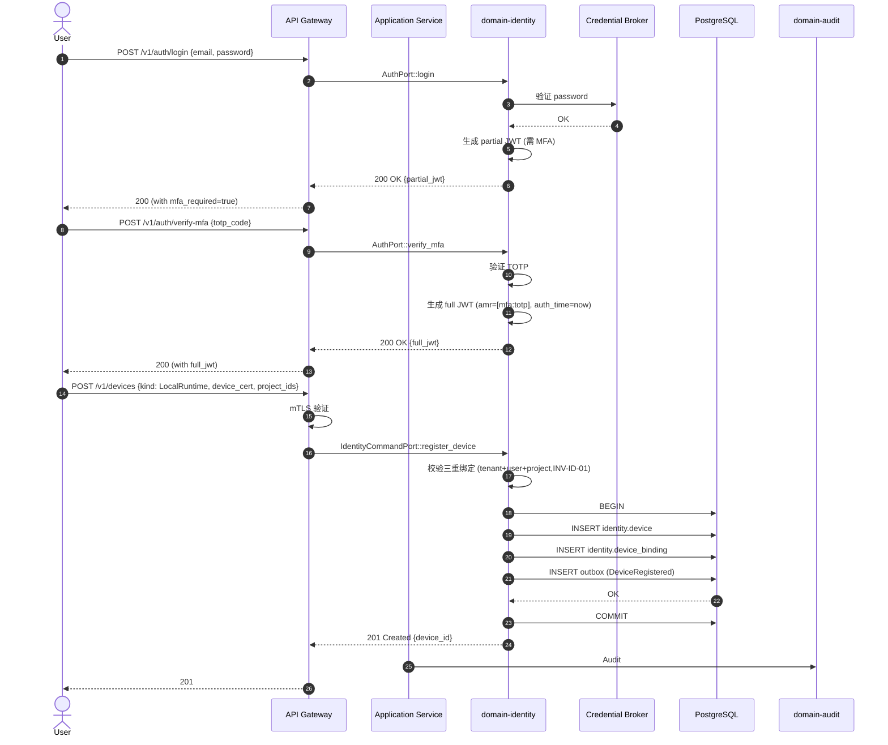

# domain-identity 实施 spec

> **状态**: Draft v0.1 (2026-08-25)
> **上游依赖**:
> - 《Requirements》§23, §R-ID-001/002
> - 《Basic Design》§2.1(表 22), §4.10, §5.7, §23.2 (LRT-001/002)
> - 《API Design》§3.15
> - 《Data Design》§4.14 (`identity` schema)
> - 《Security Design》§2 (鉴权)
> **下游交付**: Implementation team — Rust crate 路径 `crates/domain-identity/`
> **最后审稿**: 待 RFC 化时

---

## 1. 职责与边界

`domain-identity` 承载**用户 / 设备身份**(§23),负责 User / Device / Credential / DeviceBinding 三重绑定(tenant+user+project,LRT-001/002)。

**属于本 crate 的**:
- User 聚合根
- Device 聚合根(Local Runtime / CLI / Web 三类)
- Credential(走 Credential Broker,§5.4 security-design)
- DeviceBinding(tenant + user + project 三重)
- JWT 颁发 / 刷新

**不属于本 crate 的**:
- Permission Scheme(`domain-permission` 拥有,本 Module 提供 ActorContext)
- 鉴权执行(由 `domain-permission` AuthorizationChecker 调用)
- Audit 写入(本 Module 触发事件,`domain-audit` 订阅)

## 2. 关键实体

引用 data-design §4.14 (`identity` schema):

**User**(聚合根)
- 标识: `user_id`, `tenant_id`
- 元数据: `email`, `display_name`, `status`(Active / Suspended / Invited)
- 凭据: `credential_ref`(走 Credential Broker)
- 角色: `tenant_role`(tenant_admin / project_admin / developer / viewer)
- MFA: `mfa_enabled`, `mfa_secret_ref`
- 时间: `created_at`, `last_login_at`

**Device**(聚合根)
- 标识: `device_id`, `tenant_id`
- 用户: `user_id`
- 类型: `kind`(LocalRuntime / CLI / Web / Mobile)
- 证书: `device_cert_fingerprint`(mTLS)
- 状态: `status`(Active / Revoked / Pending)
- 三重绑定: `tenant_id + user_id + project_ids[]`
- 时间: `registered_at`, `last_seen_at`, `revoked_at?`

**Credential**(值对象,§5.4 security-design)
- `credential_id`, `user_id`, `kind`(Password / APIKey / OAuthToken)
- `secret_hash`(Argon2id 哈希,不存明文)
- `mfa_secret_ref`(TOTP)

**DeviceBinding**(值对象,LRT-001/002)
- `device_id`, `tenant_id`, `user_id`, `project_id`(必带)
- `binding_kind`(Owner / Contributor / ReadOnly)
- `bound_at`

**Session**(实体,短期)
- `session_id`, `user_id`, `device_id`, `jwt_token_hash`, `issued_at`, `expires_at`
- `auth_time`, `amr[]`(Authentication Methods References,for 2FA)

## 3. 关键不变量

| ID | 不变量 | 上游依据 |
|---|---|---|
| INV-ID-01 | Device 必带 `tenant_id + user_id + project_id` 三重绑定 | basic-design §23.2, LRT-001 |
| INV-ID-02 | Credential 不存明文,走 Credential Broker 或 Argon2id 哈希 | security-design §5.4 |
| INV-ID-03 | Device Revocation 立即生效(黑名单) | basic-design §23.2, §4.6.3 |
| INV-ID-04 | JWT 必带 `tenant_id` claim,且与 Header `X-Tenant-Id` 一致(SEC-002) | security-design §4.1 |
| INV-ID-05 | Protected 动作需 2FA 验证(`amr` 含 `mfa:*`,auth_time 在 N 分钟内) | security-design §3.3 |
| INV-ID-06 | 跨 tenant 访问 SEC-007 | security-design §3.5.1 |
| INV-ID-07 | 必带 tenant_id,跨 tenant 拒绝 | basic-design §6.1, REQ-SEC-001 |

## 4. 接口签名

继承 api-design §3.15。

```rust
// crates/domain-identity/src/port.rs

pub trait IdentityCommandPort {
    async fn invite_user(
        &self,
        cmd: InviteUserCommand,  // email, tenant_role
        actor: ActorContext,     // Platform Admin
    ) -> Result<UserId, IdentityError>;

    async fn update_user(
        &self,
        cmd: UpdateUserCommand,
        actor: ActorContext,
    ) -> Result<User, IdentityError>;

    async fn register_device(
        &self,
        cmd: RegisterDeviceCommand,  // kind, device_cert_fingerprint, project_ids
        actor: ActorContext,         // Protected,需 mTLS Cert
    ) -> Result<DeviceId, IdentityError>;

    async fn revoke_device(
        &self,
        id: DeviceId,
        actor: ActorContext,         // Protected
    ) -> Result<(), IdentityError>;  // 进入黑名单,§23.2
}

pub trait IdentityQueryPort {
    async fn get_current_user(&self, actor: ActorContext) -> Result<User, IdentityError>;
    async fn get_user(&self, id: UserId, viewer: ActorContext) -> Result<User, IdentityError>;
    async fn list_users(&self, q: ListUserQuery, viewer: ActorContext) -> Result<Vec<User>, IdentityError>;
    async fn list_my_devices(&self, actor: ActorContext) -> Result<Vec<Device>, IdentityError>;
    async fn get_device(&self, id: DeviceId, viewer: ActorContext) -> Result<Device, IdentityError>;
}

pub trait AuthPort {
    async fn login(&self, cmd: LoginCommand) -> Result<JWT, IdentityError>;
    async fn refresh(&self, cmd: RefreshCommand) -> Result<JWT, IdentityError>;
    async fn logout(&self, cmd: LogoutCommand) -> Result<(), IdentityError>;
    async fn verify_mfa(&self, cmd: VerifyMFACommand) -> Result<JWT, IdentityError>;
}
```

## 5. Domain Events

| Subject (NATS) | 触发条件 | Payload |
|---|---|---|
| `star.events.identity.user.invited.v1` | `invite_user` 成功 | `user_id, tenant_id, email, tenant_role` |
| `star.events.identity.user.updated.v1` | `update_user` 成功 | `user_id, updated_fields[]` |
| `star.events.identity.device.registered.v1` | `register_device` 成功 | `device_id, user_id, kind, project_ids[]` |
| `star.events.identity.device.revoked.v1` | `revoke_device` 成功(进入黑名单) | `device_id, revoked_at, reason` |
| `star.events.identity.user.login.v1` | `login` 成功 | `user_id, device_id, auth_time` |

**订阅者**:
- `domain-audit`(Append)
- `domain-notification`(`user.invited`,`device.revoked`)
- `domain-search`(投影)

## 6. 数据所有权

引用 data-design §4.14(`identity` schema):

- `identity.user`(聚合根)
- `identity.device`(聚合根)
- `identity.credential`(值对象,Credential Broker 引用)
- `identity.device_binding`(值对象,内嵌 device)
- `identity.session`(实体,短期)
- `identity.device_revocation`(实体,黑名单,Append-only)

**RLS 策略**:
- `identity.user`:`USING (current_setting('app.current_tenant_id') = tenant_id)`
- `identity.device`:`USING (current_setting('app.current_tenant_id') = tenant_id AND user_id = current_setting('app.current_user_id'))`(本人)

**索引策略**:
- `identity.user(tenant_id, email)` UNIQUE
- `identity.device(tenant_id, user_id, device_cert_fingerprint)` UNIQUE
- `identity.device_revocation(device_id, revoked_at DESC)`

## 7. 鉴权与授权

**Permission 字符串**:
- `user:read`(Tenant Admin), `user:invite`(Platform Admin), `user:update`
- `device:read`, `device:register`, `device:revoke`

**内置 Role**:
- `tenant_admin` — `user:read`
- `Platform Admin` — `user:invite`
- `tenant_admin` / `project_admin` — `device:read`(本 Tenant)
- `tenant_admin` — `device:revoke`

## 8. 错误码

| 错误码 | HTTP | 触发条件 |
|---|---|---|
| `SEC-001` | 401 | 未认证 |
| `SEC-002` | 403 | JWT tenant_id 与 Header 不一致 |
| `SEC-007` | 403 | 跨 Tenant 访问 |
| `ID-001` | 404 | User / Device 不存在 |
| `ID-002` | 422 | Device 缺三重绑定(tenant+user+project) |
| `ID-003` | 403 | Revoke 设备需 Protected 鉴权 |
| `ID-004` | 422 | 邮箱格式非法 |
| `ID-005` | 409 | 邮箱在 Tenant 内已存在 |
| `ID-006` | 422 | MFA 验证失败 |
| `ID-007` | 422 | JWT 过期 / 失效 |

## 9. 实施任务分解

| 任务 | 描述 | 依赖 | TBD-MEASURE | 估算 |
|---|---|---|---|---|
| T1 | User + Device + Credential + DeviceBinding + Session 实体 | 无 | — | 120K tokens |
| T2 | `IdentityCommandPort` 4 个方法 + 错误码 | T1 | — | 120K tokens |
| T3 | `IdentityQueryPort` 5 个方法 | T1, T2 | — | 80K tokens |
| T4 | `AuthPort` 4 个方法(login / refresh / logout / verify_mfa) | T1 | security-design §2 | 200K tokens |
| T5 | Device 三重绑定校验(tenant+user+project,INV-ID-01) | T2 | basic-design §23.2, LRT-001 | 100K tokens |
| T6 | JWT 颁发 / 验证 / tenant_id claim 强制 | T4 | security-design §2, §4.1 | 100K tokens |
| T7 | MFA 集成(TOTP) | T4 | security-design §2 | 100K tokens |
| T8 | Device Revocation 黑名单 + 即时生效 | T2 | basic-design §23.2 | 80K tokens |
| T9 | 单元测试 + RLS + 三重绑定测试 + Revocation 测试 | T1-T8 | security-design §3.5.4 | 200K tokens |
| T10 | 集成测试:Invite → Login → Register Device → MFA Verify | T9 | api-design §3.15 | 150K tokens |

**合计估算**: ~1.25M tokens ≈ 5 人·天(AI 协作模式)

## 10. 验收标准(AC)

```gherkin
Feature: 用户与设备身份

  Scenario: 邀请新 User
    Given Platform Admin
    When POST /v1/users {email, tenant_role: developer}
    Then 201 Created {user_id, status=Invited}
    And  Notification 发送邀请邮件

  Scenario: Device 三重绑定强制
    Given Device 注册请求缺 project_ids
    When POST /v1/devices
    Then 422 ID-002 (project_ids 必带,LRT-001)

  Scenario: 登录 + MFA
    Given User U + Password
    When POST /v1/auth/login {email, password}
    Then 返回 JWT (需 MFA)
    When POST /v1/auth/verify-mfa {totp_code}
    Then 返回完整 JWT, amr=[mfa:totp]

  Scenario: Protected 动作需 2FA
    Given User U 上次 MFA 30 min 前
    When U 尝试 POST /v1/worktrees/{W}:merge
    Then 403 SEC-008 (Protected 需 2FA 验证)

  Scenario: Device Revocation 即时生效
    Given Device D (active)
    When DELETE /v1/devices/{D}
    Then 204, status=Revoked, 加入黑名单
    And  D 后续 mTLS 连接立即拒绝

  Scenario: 跨 Tenant 访问
    Given User U (Tenant X)
    When U 访问 User U2 (Tenant Y)
    Then 403 SEC-007
```

## 11. 风险与缓解

| Risk | 影响 | 缓解 | 引用 |
|---|---|---|---|
| 凭据泄漏 | Critical | INV-ID-02 Credential Broker + Argon2id | security-design §5.4 |
| Device 越权 | Critical | INV-ID-01 三重绑定 + Revocation 黑名单 | basic-design §23.2, LRT-001 |
| JWT 伪造 | Critical | mTLS + RS256 签名 + tenant_id claim 强制 | security-design §2 |
| MFA 绕过 | High | INV-ID-05 amr 验证 + auth_time 限 | security-design §3.3 |
| 13 类对象漏配 | Critical | RLS + AuthorizationChecker 双重 | basic-design §6.1 |

## 12. Open Issues

- J-ID-01: OAuth 第三方登录(Google / GitHub)是否 MVP?(§30.3 V1 候选)
- J-ID-02: WebAuthn / PassKey 是否支持?(目前 TOTP)
- J-ID-03: Device 证书轮换策略?(目前 1h mTLS TTL)
- J-ID-04: Session 与 JWT 是否解耦?(目前 JWT stateless)

## 附录 A:关键流程时序图 — 用户登录 + MFA + Device 注册



## 附录 B:边界清单

| 边界类型 | 本 Module 行为 |
|---|---|
| 上游依赖 | 无核心依赖(Credential Broker 由 infrastructure 实现) |
| 下游调用 | `domain-audit`, `domain-notification`, `domain-search` |
| 跨域事务 | `register_device` + 三重绑定校验(同事务) |
| RLS 强制 | 全部 PG 表启用 RLS,Device 额外 user_id 强制 |
| **13 类 tenant_id 对象** | **直接覆盖 #2 Local Runtime**(Device 三重绑定),**间接覆盖全部 13 类**(User 身份) |
| 14 状态 AgentSession 触发 | 间接(Device.Session 启动 AgentSession) |
| 17 状态 Worktree 触发 | 间接(Device 触发 Worktree 创建) |
| WorkItem 3 态 | 间接(User 操作 WorkItem) |

**接口稳定承诺**:Port trait 签名 + 4 个 AuthPort 方法 + Device 三重绑定 + Revocation 黑名单 + 9 条错误码在后续 RFC 阶段不会变更。
