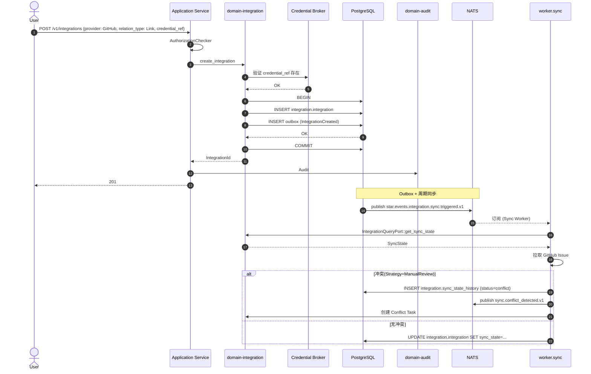

# domain-integration 实施 spec

> **状态**: Draft v0.1 (2026-08-25)
> **上游依赖**:
> - 《Requirements》§18
> - 《Basic Design》§2.1(表 16), §4.7.5
> - 《API Design》§3.13
> - 《Data Design》§4.12 (`integration` schema)
> - 《Security Design》§3.1-3.4
> - 《Integration Design》(全部章节)
> **下游交付**: Implementation team — Rust crate 路径 `crates/domain-integration/`
> **最后审稿**: 待 RFC 化时

---

## 1. 职责与边界

`domain-integration` 承载**第三方平台双向同步抽象**(§18)。区分 4 类关系:**Link** / **Mirror** / **Bidirectional Sync** / **Platform-owned**(§4.7.5)。

**属于本 crate 的**:
- Integration 聚合根(GitHub / GitLab / Jira 等平台)
- SyncState 同步状态
- 4 类关系分类 + 关系元数据(Source System / Ownership / Version / External ID / Sync Token / Last Synced / Conflict Strategy)

**不属于本 crate 的**:
- 厂商具体对象(由 `domain-scm` ACL 翻译)
- WorkItem / Comment 实体本身(本 Module 仅引用)
- 同步执行(由 worker 异步执行,本 Module 定义 Port)

## 2. 关键实体

引用 data-design §4.12 (`integration` schema):

**Integration**(聚合根)
- 标识: `integration_id`, `tenant_id`, `project_id`
- 提供方: `provider`(GitHub / GitLab / Jira / Future)
- 关系类型: `relation_type`(Link / Mirror / Bidirectional / Platform-owned)
- 映射: `mapping_config`(JSONB,provider-specific)
- 同步: `sync_state: SyncState`(sync_token, last_synced_at, conflict_strategy)
- 凭据: `credential_ref`(Credential Broker)
- 启用: `enabled`

**SyncState**(值对象,§18.1)
- `sync_token`(ETag / cursor)
- `last_synced_at`
- `conflict_strategy`:LatestWins / FirstWins / ManualReview / Bidirectional{platform_field, external_field}

## 3. 关键不变量

| ID | 不变量 | 上游依据 |
|---|---|---|
| INV-I-01 | 4 类关系分类必带(Link / Mirror / Bidirectional / Platform-owned) | basic-design §4.7.5 |
| INV-I-02 | Bidirectional Sync 必须有 Loop 防护(Idempotency Key + Sync Token) | basic-design §4.7.6, RISK-027 |
| INV-I-03 | 必带 tenant_id,跨 tenant 拒绝 | basic-design §6.1, REQ-SEC-001 |
| INV-I-04 | 凭据走 Credential Broker,不存明文 | security-design §5.4 |
| INV-I-05 | 每条关系定义 Source System / Ownership / Version / External ID / Sync Token / Last Synced / Conflict Strategy | basic-design §4.7.5 |
| INV-I-06 | 默认 Link(WorkItem ↔ GitHub Issue),不反向同步 | basic-design §4.7.5 |

## 4. 接口签名

继承 api-design §3.13。

```rust
// crates/domain-integration/src/port.rs

pub trait IntegrationCommandPort {
    async fn create_integration(
        &self,
        cmd: CreateIntegrationCommand,  // provider, relation_type, mapping_config
        actor: ActorContext,
    ) -> Result<IntegrationId, IntegrationError>;

    async fn update_integration(
        &self,
        cmd: UpdateIntegrationCommand,
        actor: ActorContext,
    ) -> Result<Integration, IntegrationError>;

    async fn delete_integration(
        &self,
        id: IntegrationId,
        actor: ActorContext,
    ) -> Result<(), IntegrationError>;

    async fn test_connection(
        &self,
        id: IntegrationId,
        actor: ActorContext,
    ) -> Result<IntegrationTestResult, IntegrationError>;

    async fn trigger_sync(
        &self,
        cmd: SyncRequest,  // integration_id
        actor: ActorContext,
    ) -> Result<JobResponse, IntegrationError>;
}

pub trait IntegrationQueryPort {
    async fn list_by_project(&self, project_id: ProjectId, viewer: ActorContext) -> Result<Vec<Integration>, IntegrationError>;
    async fn get_by_id(&self, id: IntegrationId, viewer: ActorContext) -> Result<Integration, IntegrationError>;
    async fn get_sync_state(&self, id: IntegrationId, viewer: ActorContext) -> Result<SyncState, IntegrationError>;
}
```

## 5. Domain Events

| Subject (NATS) | 触发条件 | Payload |
|---|---|---|
| `star.events.integration.integration.created.v1` | `create_integration` 成功 | `integration_id, provider, relation_type` |
| `star.events.integration.sync.triggered.v1` | `trigger_sync` 成功 | `integration_id, sync_type` |
| `star.events.integration.sync.completed.v1` | Worker 同步完成 | `integration_id, last_synced_at, conflict_count` |
| `star.events.integration.sync.conflict_detected.v1` | ConflictStrategy 触发 | `integration_id, conflict_summary` |

**订阅者**:
- `domain-audit`(Append)
- `domain-notification`(`sync.conflict_detected`)

## 6. 数据所有权

引用 data-design §4.12(`integration` schema):

- `integration.integration`(聚合根)
- `integration.sync_state_history`(实体,Append-only)

**RLS 策略**:
- 全部启用 RLS,`USING (current_setting('app.current_tenant_id') = tenant_id)`

**索引策略**:
- `integration.integration(project_id, provider)` — 项目集成列表
- `integration.integration(sync_state->>'last_synced_at' DESC)` — 最近同步

## 7. 鉴权与授权

**Permission 字符串**:
- `integration:read`, `integration:create`, `integration:update`, `integration:delete`
- `integration:sync`, `integration:test`

**内置 Role**:
- `tenant_admin` / `project_admin` — 全部
- `developer` — 全部(除 `delete` 需 Protected)
- `viewer` — 仅 `integration:read`

## 8. 错误码

| 错误码 | HTTP | 触发条件 |
|---|---|---|
| `SEC-001/002/007` | 401/403/403 | 鉴权类 |
| `I-001` | 404 | Integration 不存在 |
| `I-002` | 422 | provider 不可用 |
| `I-003` | 409 | Sync 冲突(ConflictStrategy 触发) |
| `I-004` | 422 | Bidirectional Sync 缺 Loop 防护 |
| `I-005` | 422 | 凭据缺失(走 Credential Broker) |

## 9. 实施任务分解

| 任务 | 描述 | 依赖 | TBD-MEASURE | 估算 |
|---|---|---|---|---|
| T1 | Integration + SyncState 实体 | 无 | — | 80K tokens |
| T2 | `IntegrationCommandPort` 5 个方法 + 错误码 | T1 | — | 100K tokens |
| T3 | `IntegrationQueryPort` 3 个方法 | T1, T2 | — | 60K tokens |
| T4 | 4 类关系分类(Link / Mirror / Bidirectional / Platform-owned) | T1 | basic-design §4.7.5 | 60K tokens |
| T5 | ConflictStrategy 实现(LatestWins / FirstWins / ManualReview / Bidirectional) | T2 | basic-design §4.7.6 | 100K tokens |
| T6 | Bidirectional Sync Loop 防护 | T2 | basic-design §4.7.6, RISK-027 | 80K tokens |
| T7 | 单元测试 + RLS + 4 类关系测试 | T1-T6 | security-design §3.5.4 | 100K tokens |
| T8 | 集成测试:Link WorkItem → GitHub Issue → 同步 | T7 | api-design §3.13 | 80K tokens |

**合计估算**: ~660K tokens ≈ 2.5 人·天(AI 协作模式)

## 10. 验收标准(AC)

```gherkin
Feature: 第三方集成与同步

  Scenario: 创建 Link 关系
    Given Project P
    When POST /v1/integrations {provider: GitHub, relation_type: Link, external_id: "issue/123"}
    Then 201 Created {integration_id}
    And  WorkItem ↔ GitHub Issue Link 建立(不反向同步)

  Scenario: Bidirectional Sync Loop 防护
    Given Integration I (relation_type: Bidirectional)
    When 缺 idempotency_key
    Then 422 I-004

  Scenario: ConflictStrategy 触发
    Given Integration I (conflict_strategy: ManualReview)
    And 同步发现 Conflict
    When 完成同步
    Then 创建 Conflict Task
    And  Notification 通知 Project Admin

  Scenario: 跨 Tenant 访问
    Given Integration I (Tenant Y)
    When User (Tenant X) 尝试访问
    Then 403 SEC-007

  Scenario: 凭据缺失拒绝
    Given Integration 创建时缺 credential_ref
    When 提交
    Then 422 I-005 (走 Credential Broker)
```

## 11. 风险与缓解

| Risk | 影响 | 缓解 | 引用 |
|---|---|---|---|
| SCM Sync Loop | High | INV-I-02 + Idempotency Key | basic-design §4.7.6, RISK-027 |
| Provider 锁定 | Medium | 4 类关系 + ACL 翻译 | basic-design §4.7.5 |
| 凭据泄漏 | High | INV-I-04 Credential Broker | security-design §5.4 |

## 12. Open Issues

- J-I-01: Bidirectional Sync 默认策略是 ManualReview 还是 LatestWins?(需 ADR)
- J-I-02: 4 类关系是否支持组合(WorkItem 既 Link GitHub Issue 又 Mirror Slack)?目前单一
- J-I-03: Sync 频率是否可调(实时 / 周期 / 手动)?(目前周期 + 手动触发)

## 附录 A:关键流程时序图 — Link 关系建立 + Conflict 处理



## 附录 B:边界清单

| 边界类型 | 本 Module 行为 |
|---|---|
| 上游依赖 | `domain-tenant`, `domain-project`, `domain-scm` (SCM 集成) |
| 下游调用 | `domain-audit`, `domain-notification` |
| 跨域事务 | `create_integration` 校验 credential_ref(同事务) |
| RLS 强制 | 全部 PG 表启用 RLS |
| 13 类 tenant_id 对象 | 间接覆盖(本 Module 集成 13 类对象,但自身非 13 类) |
| 14 状态 AgentSession 触发 | 无 |
| 17 状态 Worktree 触发 | 间接(SCM 同步触发 Worktree 状态) |
| WorkItem 3 态 | 间接(WorkItem ↔ GitHub Issue Link) |

**接口稳定承诺**:Port trait 签名 + 4 类关系分类 + 4 种 ConflictStrategy + 5 条错误码在后续 RFC 阶段不会变更。

## 15. 与其他 domain 协作 (v0.16 协作细化新增)

per [basic-design v0.16 §3.2.9 22 domain contact face 表](../../basic-design.md) + [ADR-0039 §D26-D32 Worktree Orchestration 跨域协作](../../architecture/2026-08-26-upgrade/adr/0039-worktree-orchestration-cross-domain.md) + [spec/saga/01 v0.2 SagaCoordinationRole](../../architecture/2026-08-26-upgrade/spec/saga/01-saga-coordination-spec.md),本节定义 `integration` 与 22 domain 中 4 个 domain 的显式接触面。

| 源 Domain | 目标 Domain | 接触方式 | 接触点 |
|---|---|---|---|
| integration | scm | ACL(隔离) | integration 消费 scm Port,提供 SCM Sync / Webhook Receiver |
| integration | notification | Customer-Supplier | integration 通过 notification 分发 GitHub/GitLab 事件 |
| integration | identity | Customer-Supplier | OIDC/SAML 通过 identity 完成 IdP 联邦 |

**接触面统计**: 3 条 (v0.16 新增,本 spec 由 `scripts/inter_collab_refine.py` 批量生成)

**dual-use 警告** (per AGENTS.md §5 v0.6 + Q1-D 拍板): 5 域 (player/economy/match/social/admin) 是 RGS 仓历史治理命名,Star 仓不建立业务子域↔DDD 映射。本 spec 协作基于 22 domain crate,不通过 5 域绑定推导。
