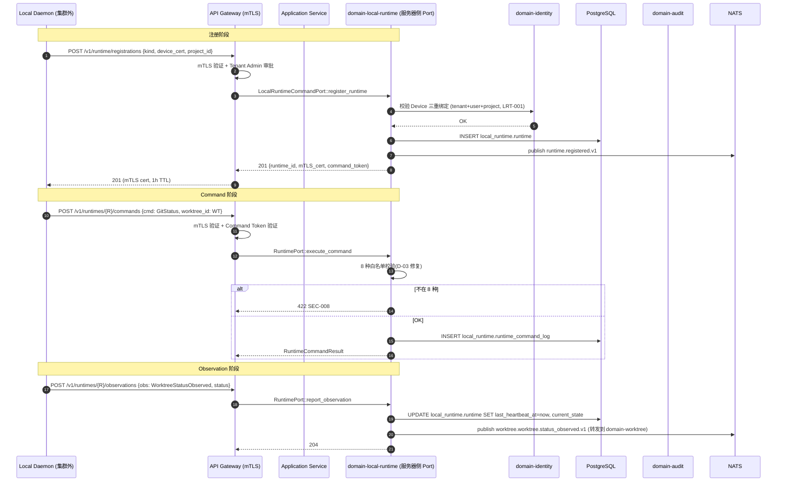

# domain-local-runtime 实施 spec

> **状态**: Draft v0.1 (2026-08-25)
> **上游依赖**:
> - 《Requirements》§23, LRT-001/002
> - 《Basic Design》§2.1(表 25), §4.6(重要:服务器侧 Port,**非 Local Daemon**), §5.7, §6.2, §23.1
> - 《API Design》§3.26 (明确区分本 crate 与 Local Daemon 二进制)
> - 《Data Design》§4.25 (`local_runtime` schema)
> - 《Security Design》§2, §3.6, §5.5
> - 《Runtime Design》(全部章节)
> - 《basic-design-feedback.md》F-03 / F-07(本 spec 必须显式区分)
> **下游交付**: Implementation team — Rust crate 路径 `crates/domain-local-runtime/`(服务器侧 Port,**非** Local Daemon 二进制)
> **最后审稿**: 待 RFC 化时

---

## 1. 职责与边界

> **关键区分**(F-03 / F-07 修复后):本 crate `domain-local-runtime` 是**服务器侧**的 Runtime Registry / Port,**不是** Local Daemon 二进制本身。Local Daemon 二进制是运行于 Developer Machine / Self-hosted Runner / Cloud Workspace 的**集群外进程**(§1.1 basic-design LocalRuntime 子图,**不**计入 K8s Workload,§8.5)。

**属于本 crate 的**:
- Runtime 注册表聚合根(Runtime / RuntimeCommand / RuntimeObservation)
- 服务器侧 Runtime Port(`RuntimePort` trait,由 work-core 暴露)
- 8 种白名单 RuntimeCommand 枚举(§4.6.2,**非** 9 种,D-03 修复后)
- 7 种 RuntimeObservation 枚举(独立方向,Daemon → Control Plane)
- Device Identity / mTLS / Command Token 颁发与校验
- Reconciliation Protocol(Desired ↔ Observed)

**不属于本 crate 的**:
- Local Daemon 二进制进程本身(`crates/local-daemon/`,独立制品)
- Filesystem Scope / Process Scope 强制(由 Daemon 强制,本 Module 仅定义 Port)
- Worktree 实体本身(`domain-worktree` 拥有,本 Module 仅运行时引用)

## 2. 关键实体

引用 data-design §4.25 (`local_runtime` schema):

**Runtime**(聚合根)
- 标识: `runtime_id`, `tenant_id`, `project_id`
- 类型: `kind`(LocalLaptop / SelfHostedRunner / CloudWorkspace / Future)
- Device 绑定: `device_id`(引用 `domain-identity`)
- 状态: `status`(Pending / Active / Revoked / Disabled)
- 元数据: `display_name`, `version`(Local Daemon 版本)
- 心跳: `last_heartbeat_at`, `current_state`(Current / Possibly Stale / Offline / Unknown,§23.4)
- 三重绑定: `tenant_id + user_id + project_id`(LRT-001)

**RuntimeCommand**(枚举,**8 种,§4.6.2 + D-03 修复**)
- `GitStatus(WorktreeId)` — 读 Worktree 状态
- `CreateWorktree(CreateWorktreeSpec)` — 创建 Worktree
- `ReadDiff(WorktreeId, CommitRef)` — 读 Diff
- `RunApprovedTest(WorktreeId, TestSpec)` — 跑白名单测试
- `QueryAgentStatus(AgentSessionId)` — 查 Agent 状态
- `SubmitFeedback(WorktreeId, Feedback)` — 提交 Feedback
- `StartAuthorizedAgentSession(StartSpec)` — 启动 Agent(必带 Policy)
- `StopAgentSession(AgentSessionId, StopReason)` — 停止 Agent

**RuntimeObservation**(枚举,**独立方向,7 种,§4.6.5**)
- `WorktreeStatusObserved(WorktreeId, StatusSnapshot)`
- `AgentSessionStateObserved(AgentSessionId, AgentState)`
- `BuildCompleted(WorktreeId, BuildResult)`
- `TestCompleted(WorktreeId, TestResult)`
- `DiffAvailable(WorktreeId, DiffRef)`
- `Heartbeat(RuntimeId, Sequence, Version)`
- `Disconnected(RuntimeId, DisconnectReason)`

**RuntimeCommandResult**(值对象)
- `command_id`, `result: CommandResult` (Success / Failure / Timeout)

**ReconciliationReport**(值对象,§22.6)
- `runtime_id`, `desired_state_version`, `observed_state_version`, `deviations: Vec<Deviation>`

## 3. 关键不变量

| ID | 不变量 | 上游依据 |
|---|---|---|
| INV-LR-01 | **Local Daemon 二进制不属于本 crate**(F-03 / F-07 强约束) | basic-design §4.6.1, §8.5 |
| INV-LR-02 | **RuntimeCommand 8 种**(D-03 修复后,**非** 9 种,`ReportObservation` 不在 Command 中) | basic-design §4.6.2, **D-03 修复** |
| INV-LR-03 | **禁止**:`ExecuteArbitraryShell` / `ReadArbitraryFile(*)` / `WriteArbitraryFile(*)` / `*` 范围命令 | basic-design §4.6.3, §6.3, LRT-002 |
| INV-LR-04 | **Device 三重绑定**:tenant+user+project(LRT-001) | basic-design §23.2 |
| INV-LR-05 | **RuntimeObservation 独立于 RuntimeCommand**(不同方向,不同语义,不可混淆) | basic-design §4.6.5, **D-03 修复** |
| INV-LR-06 | **mTLS 1h + Command Token 5min** 短时凭据 | basic-design §4.6.3, §6.2 |
| INV-LR-07 | **Runtime Revocation 即时生效** + Remote Disable(强制停机) | basic-design §4.6.3, §23.2 |
| INV-LR-08 | **必带 tenant_id**(13 类对象 #2 Local Runtime) | basic-design §6.1 |
| INV-LR-09 | **Reconciliation 偏差不静默合并**(强制 re-sync / 人工介入) | basic-design §4.1.8, §45 |
| INV-LR-10 | **UI 区分 Current / Possibly Stale / Offline / Unknown**(§23.4) | basic-design §23.4 |

## 4. 接口签名

继承 api-design §3.26。

```rust
// crates/domain-local-runtime/src/port.rs

/// 服务器侧 Runtime Port(由 work-core 暴露)
pub trait RuntimePort {
    /// 由 Local Runtime 主动调用,执行白名单 Command
    async fn execute_command(
        &self,
        cmd: RuntimeCommand,  // 8 种之一
        actor: ActorContext,    // 必须是已认证 Local Runtime (mTLS + Command Token)
    ) -> Result<RuntimeCommandResult, RuntimeError>;

    /// 由 Local Runtime 主动调用,上报 Observed State
    async fn report_observation(
        &self,
        obs: RuntimeObservation,  // 7 种之一
        actor: ActorContext,        // 必须是已认证 Local Runtime
    ) -> Result<(), RuntimeError>;

    /// 由 Local Runtime 主动调用,拉取 Desired State(可选双向)
    async fn fetch_desired_state(
        &self,
        runtime_id: RuntimeId,
    ) -> Result<DesiredStateSnapshot, RuntimeError>;
}

pub trait LocalRuntimeCommandPort {
    /// 注册 Runtime(申请 device_identity)
    async fn register_runtime(
        &self,
        cmd: RegisterRuntimeRequest,  // kind, device_cert, project_id
        actor: ActorContext,          // Protected, Tenant Admin 审批
    ) -> Result<RuntimeId, RuntimeError>;

    async fn revoke_runtime(
        &self,
        id: RuntimeId,
        actor: ActorContext,    // Protected
    ) -> Result<(), RuntimeError>;  // 进入黑名单,§23.2

    async fn remote_disable(
        &self,
        id: RuntimeId,
        cmd: DisableCommand,    // reason
        actor: ActorContext,    // Protected
    ) -> Result<(), RuntimeError>;  // 远程强制停机,§34 Runtime Impersonation 防护

    async fn reconcile(
        &self,
        runtime_id: RuntimeId,
        actor: ActorContext,    // Service-Internal (Local Runtime)
    ) -> Result<ReconciliationReport, RuntimeError>;
}

pub trait LocalRuntimeQueryPort {
    async fn list_runtimes(&self, q: ListRuntimeQuery, viewer: ActorContext) -> Result<Vec<Runtime>, RuntimeError>;
    async fn get_runtime(&self, id: RuntimeId, viewer: ActorContext) -> Result<Runtime, RuntimeError>;
    async fn get_reconciliation(&self, id: RuntimeId, viewer: ActorContext) -> Result<ReconciliationReport, RuntimeError>;
}
```

## 5. Domain Events

| Subject (NATS) | 触发条件 | Payload |
|---|---|---|
| `star.events.local_runtime.runtime.registered.v1` | `register_runtime` 成功 | `runtime_id, kind, project_id, device_id` |
| `star.events.local_runtime.runtime.revoked.v1` | `revoke_runtime` 成功 | `runtime_id, revoked_at, reason` |
| `star.events.local_runtime.runtime.disabled.v1` | `remote_disable` 成功(强制停机) | `runtime_id, disabled_at, reason` |
| `star.events.local_runtime.runtime.heartbeat.v1` | Daemon 心跳 | `runtime_id, sequence, version` |
| `star.events.local_runtime.runtime.reconciled.v1` | `reconcile` 完成 | `runtime_id, deviations[]` |
| `star.events.local_runtime.command.executed.v1` | `execute_command` 成功 | `runtime_id, command_kind, result` |

**订阅者**:
- `domain-audit`(Append,全部事件)
- `domain-notification`(`revoked`, `disabled`)
- `domain-worktree`(Heartbeat 触发 Worktree Stale Display)

## 6. 数据所有权

引用 data-design §4.25(`local_runtime` schema):

- `local_runtime.runtime`(聚合根,**13 类对象 #2**)
- `local_runtime.runtime_command_log`(Append-only,审计)
- `local_runtime.runtime_observation_log`(Append-only,审计)
- `local_runtime.reconciliation_report`(实体)

**RLS 策略**:
- 全部启用 RLS,`USING (current_setting('app.current_tenant_id') = tenant_id)`

**索引策略**:
- `local_runtime.runtime(tenant_id, project_id, status)` — 列表
- `local_runtime.runtime(last_heartbeat_at DESC)` — Stale Display
- `local_runtime.runtime_command_log(runtime_id, executed_at DESC)`

## 7. 鉴权与授权

**Permission 字符串**:
- `runtime:read`, `runtime:register`(Protected), `runtime:revoke`(Protected), `runtime:remote_disable`(Protected)
- `local_runtime:execute_command`(Service-Internal), `local_runtime:report_observation`(Service-Internal)

**mTLS 强制**:
- Local Runtime 启动时由 Control Plane 颁发 mTLS 证书(1h TTL)
- 每次 Command 必带 5min TTL Command Token
- 双向认证(TLS 1.3)

**Command Authorization**(§6.2,白名单):
- 每次 Command 由 Control Plane 验证(8 种白名单)
- 缺失命令范围(worktree_id / repository_id / project_id)→ 403 SEC-008
- 禁止 `*` 范围

**Command Scope**:
- Repository / Worktree / Path 必带
- 不可越界

**Special Permissions**:
- `runtime:remote_disable` 仅 Tenant Admin(Protected,§34 Runtime Impersonation 防护)

## 8. 错误码

引用 api-design §8.3.6(LR- 系列,继承 §8.3.7 SEC-):

| 错误码 | HTTP | 触发条件 |
|---|---|---|
| `SEC-001` | 401 | mTLS 缺失 / Command Token 失效 |
| `SEC-002` | 403 | tenant_id Header 与 mTLS 证书 tenant_id claim 不一致 |
| `SEC-007` | 403 | Cross-Tenant Runtime 访问 |
| `SEC-008` | 422 | Command 不在 8 种白名单 |
| `LR-001` | 404 | Runtime 不存在 |
| `LR-002` | 422 | Command 缺范围(worktree_id / repository_id) |
| `LR-003` | 403 | Runtime 已被 Revoked |
| `LR-004` | 422 | 尝试 `ExecuteArbitraryShell` 等禁止能力(LRT-002) |
| `LR-005` | 403 | Reconciliation 偏差 → 强制 re-sync / 人工介入 |
| `LR-006` | 422 | Remote Disable 失败(Runtime 已离线) |

## 9. 实施任务分解

| 任务 | 描述 | 依赖 | TBD-MEASURE | 估算 |
|---|---|---|---|---|
| T1 | Runtime + RuntimeCommand(8 种) + RuntimeObservation(7 种) + RuntimeCommandResult 实体 | 无 | — | 120K tokens |
| T2 | `RuntimePort` 3 个方法(服务器侧 Port) | T1 | basic-design §4.6.6 | 100K tokens |
| T3 | `LocalRuntimeCommandPort` 4 个方法 + 错误码 | T1, T2 | — | 150K tokens |
| T4 | `LocalRuntimeQueryPort` 3 个方法 | T1-T3 | — | 80K tokens |
| T5 | **8 种白名单 Command 强制**(D-03 修复后,**非** 9 种) | T2 | basic-design §4.6.2, **D-03** | 100K tokens |
| T6 | **禁止能力拦截**:`ExecuteArbitraryShell` / `ReadArbitraryFile(*)` / `WriteArbitraryFile(*)` / `*` 范围 | T2 | basic-design §4.6.3, LRT-002 | 100K tokens |
| T7 | Device 三重绑定校验(tenant+user+project,LRT-001) | T3 | basic-design §23.2 | 80K tokens |
| T8 | mTLS 颁发 / Command Token(1h / 5min) | T3 | basic-design §6.2 | 100K tokens |
| T9 | Revocation 黑名单 + Remote Disable(强制停机) | T3 | basic-design §4.6.3, §34 | 100K tokens |
| T10 | Reconciliation Protocol(Desired ↔ Observed) | T3 | basic-design §4.1.8, §22.6 | 150K tokens |
| T11 | Stale Display 计算(Current / Possibly Stale / Offline / Unknown) | T1 | basic-design §23.4 | 60K tokens |
| T12 | 单元测试 + 8 种 Command + 7 种 Observation + 白名单测试 + 13 类对象覆盖 | T1-T11 | security-design §3.5.4 | 250K tokens |
| T13 | 集成测试:Register → mTLS → Command → Observation → Reconciliation | T12 | api-design §3.26, POC-016 | 200K tokens |

**合计估算**: ~1.59M tokens ≈ 6.5 人·天(AI 协作模式)

## 10. 验收标准(AC)

```gherkin
Feature: Local Runtime Registry 与白名单 Command

  Scenario: 注册 Runtime 必带 Device 三重绑定
    Given User U 提交 Register Runtime {kind: LocalLaptop, project_id: P}
    When 注册时缺 tenant_id 或 user_id
    Then 422 ID-002 (三重绑定必带,LRT-001)

  Scenario: 8 种白名单 Command 强制(D-03 修复后)
    Given Local Runtime 提交 Command
    When Command 不在 8 种白名单
    Then 422 SEC-008 (Command Not Whitelisted)
    And  不可出现 ReportObservation 作为 Command(D-03 修复)

  Scenario: 禁止 ExecuteArbitraryShell
    Given 任何尝试 ExecuteArbitraryShell(cmd: "rm -rf /")
    When Daemon 调用
    Then 422 LR-004 (禁止能力,LRT-002)
    And  Audit 记录 attempted_forbidden_capability

  Scenario: mTLS 1h + Command Token 5min
    Given mTLS 证书 1h 后过期
    When Local Runtime 尝试续期
    Then 颁发新证书
    And  Command Token 5min TTL 强制

  Scenario: Revocation 即时生效
    Given Runtime R active
    When DELETE /v1/runtimes/{R}
    Then 204, status=Revoked
    And  R 后续 mTLS 连接立即拒绝

  Scenario: Remote Disable 强制停机
    Given Runtime R active
    When POST /v1/runtimes/{R}:disable {reason: "Runtime Impersonation suspected"}
    Then 204, R 立即停机
    And  Audit 记录 remote_disable_by_tenant_admin

  Scenario: Reconciliation 偏差不静默合并
    Given Local Runtime 重连,Desired state version=10, Observed state version=8
    When reconcile
    Then 偏差报告 (deviations=[...])
    And  不可静默合并(必须人工介入或 re-sync)

  Scenario: Stale Display
    Given Runtime R last_heartbeat_at = 5 min ago
    When UI 读取
    Then 标记 "Possibly Stale" (60-300s 区间)
```

## 11. 风险与缓解

| Risk | 影响 | 缓解 | 引用 |
|---|---|---|---|
| **Local Runtime Compromise** | Critical | mTLS + Device Identity + 白名单 + Filesystem Scope + Revocation + Remote Disable(16 项强制,§4.6.3) | basic-design §4.6.3, RISK-016, ADR-019 |
| **D-03 笔误("9 种 Command")** | Critical | **本 spec 严格锁定 8 种**(`ReportObservation` 不在 Command 中),白名单 ACL 实施 | basic-design §4.6.2, **D-03 修复** |
| **F-03 / F-07 crate 命名混淆** | High | 本 spec 显式区分:**服务器侧 Port 不等于 Local Daemon 二进制** | basic-design §4.6.1, **F-03/F-07 修复** |
| Cross-Tenant Runtime 越权 | Critical | mTLS tenant_id claim 强制 + RLS | security-design §3.5.1 |
| Runtime Version Fragmentation | Medium | Runtime 升级策略 + 强制最低版本(§23.5) | basic-design §23.5, RISK-029 |
| Stale Worktree State | Medium | UI 区分 Current/Stale/Offline/Unknown | basic-design §23.4, RISK-022 |

## 12. Open Issues

- J-LR-01: Ephemeral Coding Environment(K8s 临时 Pod)是否 V1 引入 RuntimeKind?(§23.6 候选)
- J-LR-02: Bidirectional Desired State Fetch 实时还是周期?(§4.6.6 草案可选双向)
- J-LR-03: Runtime 跨 Project 共享是否支持?(目前 per-Project)
- J-LR-04: Filesystem Scope 跨平台(Linux/macOS/Windows)一致性需 PoC 校准(§29, RISK-029)

## 附录 A:关键流程时序图 — Local Runtime 启动 → Command → Observation



## 附录 B:边界清单

| 边界类型 | 本 Module 行为 |
|---|---|
| 上游依赖 | `domain-tenant`, `domain-identity` (Device 三重绑定) |
| 下游调用 | `domain-audit`, `domain-notification`, `domain-worktree` (Heartbeat 触发 Stale Display) |
| 跨域事务 | `register_runtime` + Device 校验(同事务) |
| RLS 强制 | 全部 PG 表启用 RLS |
| **13 类 tenant_id 对象** | **直接覆盖 #2 Local Runtime**(本 crate 是 Runtime 聚合根) |
| 14 状态 AgentSession 触发 | **直接**:`StartAuthorizedAgentSession` / `StopAgentSession` / `QueryAgentStatus` 是 8 种 Command 之一 |
| **17 状态 Worktree 触发** | **直接**:`WorktreeStatusObserved` 是 7 种 Observation 之一,触发 Worktree 状态变更(§7.1) |
| WorkItem 3 态 | 间接(Local Runtime 运行 WorkItem 的执行环境) |

**接口稳定承诺**:
- **Port trait 签名**(RuntimePort / LocalRuntimeCommandPort / LocalRuntimeQueryPort)
- **8 种 RuntimeCommand 枚举**(D-03 锁定,GitStatus / CreateWorktree / ReadDiff / RunApprovedTest / QueryAgentStatus / SubmitFeedback / StartAuthorizedAgentSession / StopAgentSession)
- **7 种 RuntimeObservation 枚举**(独立方向,WorktreeStatusObserved / AgentSessionStateObserved / BuildCompleted / TestCompleted / DiffAvailable / Heartbeat / Disconnected)
- **Local Daemon 二进制独立制品**(F-03/F-07 锁定,本 crate 仅是服务器侧 Port)
- **16 项 Runtime Security 强制项**(§4.6.3,含 mTLS / Device Identity / 白名单 / Filesystem Scope / Revocation / Remote Disable)
- **Device 三重绑定**(LRT-001 锁定)
- **Stale Display 4 状态**(§23.4,Current / Possibly Stale / Offline / Unknown)
- **Reconciliation Protocol**(§22.6,Desired ↔ Observed 偏差不静默合并)
- **Remote Disable**(§34 Runtime Impersonation 防护)
- **13 条错误码** 在后续 RFC 阶段不会变更。

**本 spec 是 `domain-local-runtime` 服务器侧 Port 的最终实施规格**,Local Daemon 二进制独立 spec 见 `crates/local-daemon/`(本文档不覆盖)。
