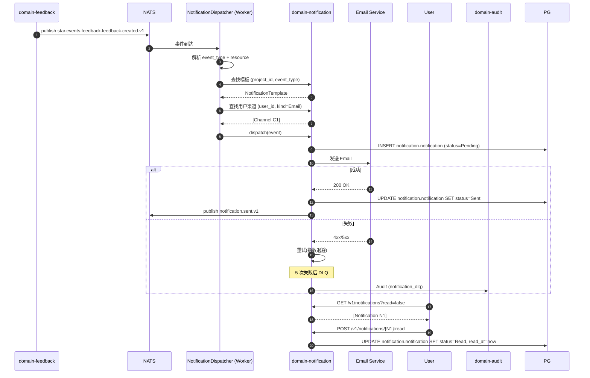

# domain-notification 实施 spec

> **状态**: Draft v0.1 (2026-08-25)
> **上游依赖**:
> - 《Requirements》§12, REQ-NOTIF-001, REQ-NOTIF-002(2026-08-26 补充,默认降噪策略)
> - 《Basic Design》§2.1(表 23), §5.7
> - 《API Design》§3.16
> - 《Data Design》§4.15 (`notification` schema)
> - 《Security Design》§3.1-3.4
> **下游交付**: Implementation team — Rust crate 路径 `crates/domain-notification/`
> **最后审稿**: 待 RFC 化时

---

## 1. 职责与边界

`domain-notification` 承载**通知渠道与模板**(§12,REQ-NOTIF-001)。MVP 邮件 + 站内,Slack / 钉钉列入 V1(§30.3)。

默认降噪策略(REQ-NOTIF-002,2026-08-26 补充):`NotificationDispatcher` 默认仅在需要人工决策的节点触发通知 —— WAITING_FEEDBACK、Validation 失败、Protected Action 待授权;Agent 执行的中间步骤不触发通知,但 100% 记入 AgentSession Transcript(INV-AGT-09),不影响可审计性。该默认策略上游未标注 V1/V2/Future 分级,视为当前默认行为,见 INV-N-07。

**属于本 crate 的**:
- NotificationChannel(用户渠道:email / in_app / Slack)
- NotificationTemplate(项目级模板)
- Notification 实体(已发送 / 未读 / 已读)
- NotificationDispatcher(异步,通过 NATS 订阅各 Domain Event)

**不属于本 crate 的**:
- 邮件发送服务(由 infrastructure Provider 适配)
- 业务事件触发(本 Module 是订阅者,接收其他 Domain Event)
- 通知聚合(每个 NotificationChannel 独立)

## 2. 关键实体

引用 data-design §4.15 (`notification` schema):

**NotificationChannel**(聚合根)
- 标识: `channel_id`, `tenant_id`, `user_id`
- 类型: `kind`(Email / InApp / Slack / DingTalk)
- 配置: `address`(邮箱 / 站内 user_id / Slack webhook)
- 状态: `enabled`(可独立开关)
- 时间: `created_at`, `updated_at`

**NotificationTemplate**(聚合根,Project 级)
- 标识: `template_id`, `tenant_id`, `project_id`
- 事件类型: `event_type`(如 `feedback:waiting_feedback`, `validation:failed`)
- 渠道: `channel_kinds[]`
- 内容: `subject`, `body_template`(Handlebars / 类似)
- 启用: `enabled`

**Notification**(实体,Append-only + 状态字段)
- 标识: `notification_id`, `tenant_id`
- 收件人: `user_id`
- 事件: `event_type`, `resource_type`, `resource_id`
- 渠道: `channel_id`
- 内容: `subject`, `body`
- 状态: `status`(Pending / Sent / Delivered / Read / Failed)
- 时间: `created_at`, `sent_at`, `read_at`

## 3. 关键不变量

| ID | 不变量 | 上游依据 |
|---|---|---|
| INV-N-01 | 必带 tenant_id,跨 tenant 拒绝 | basic-design §6.1, REQ-SEC-001 |
| INV-N-02 | Notification 异步发送(不阻塞业务事务) | basic-design §2.1 表 23 |
| INV-N-03 | NotificationChannel 仅本人可读 / 改 | basic-design §10 |
| INV-N-04 | NotificationTemplate 仅 Project Admin 可改 | data-design §4.15 |
| INV-N-05 | Notification 不可修改 body / subject(Append-only + 状态字段) | data-design §4.15 |
| INV-N-06 | 失败重试(指数退避,最多 5 次),超限进入 DLQ | basic-design §5.4 |
| INV-N-07 | 默认仅在 WAITING_FEEDBACK / Validation 失败 / Protected Action 待授权三类人工决策节点触发通知;Agent 中间步骤不触发通知,但仍 100% 写入 AgentSession Transcript | requirements REQ-NOTIF-002, INV-AGT-09 |

## 4. 接口签名

继承 api-design §3.16。

```rust
// crates/domain-notification/src/port.rs

pub trait NotificationCommandPort {
    async fn register_channel(
        &self,
        cmd: RegisterChannelCommand,  // kind, address
        actor: ActorContext,
    ) -> Result<ChannelId, NotificationError>;

    async fn update_channel(
        &self,
        cmd: UpdateChannelCommand,  // enabled
        actor: ActorContext,
    ) -> Result<NotificationChannel, NotificationError>;

    async fn delete_channel(
        &self,
        id: ChannelId,
        actor: ActorContext,
    ) -> Result<(), NotificationError>;

    async fn mark_as_read(
        &self,
        cmd: MarkAsReadCommand,  // notification_id
        actor: ActorContext,
    ) -> Result<Notification, NotificationError>;

    async fn mark_all_read(
        &self,
        actor: ActorContext,
    ) -> Result<(), NotificationError>;
}

pub trait NotificationQueryPort {
    async fn list_channels(&self, actor: ActorContext) -> Result<Vec<NotificationChannel>, NotificationError>;
    async fn list_notifications(&self, q: ListNotificationQuery, viewer: ActorContext) -> Result<Vec<Notification>, NotificationError>;
}

/// Worker 调用,异步发送
pub trait NotificationDispatcher {
    async fn dispatch(&self, event: NotificationEvent) -> Result<(), NotificationError>;
}
```

## 5. Domain Events

**本 Module 不发布业务 Domain Event**,仅作为**订阅者**接收各 Module 事件并触发 Notification 发送。

**订阅者**(部分):
- `star.events.feedback.feedback.created.v1`(高 severity P0/P1)
- `star.events.feedback.feedback.waiting_feedback.v1`
- `star.events.validation.validation_result.failed.v1`
- `star.events.validation.validation_result.overridden.v1`
- `star.events.worktree.worktree.conflict_detected.v1`
- `star.events.worktree.worktree.abandoned.v1`
- `star.events.agent.agent_session.waiting_feedback.v1`
- `star.events.agent.agent_session.crashed.v1`
- `star.events.audit.export.completed.v1`(通知 Tenant Admin)

**发布**:
- `star.events.notification.sent.v1`(Worker 发送完成)
- `star.events.notification.failed.v1`(Worker 发送失败)

## 6. 数据所有权

引用 data-design §4.15(`notification` schema):

- `notification.channel`(聚合根)
- `notification.template`(聚合根)
- `notification.notification`(实体,Append-only + 状态)

**RLS 策略**:
- 全部启用 RLS,`USING (current_setting('app.current_tenant_id') = tenant_id)`
- `notification.channel` 额外:`AND user_id = current_setting('app.current_user_id')`(本人)

**索引策略**:
- `notification.channel(user_id)` — 用户渠道列表
- `notification.notification(user_id, status, created_at DESC)` — 未读列表
- `notification.template(project_id, event_type, channel_kinds)` — 模板查找

## 7. 鉴权与授权

**Permission 字符串**:
- `notification:read`(Authenticated,本人)
- `notification_channel:read`, `notification_channel:create`, `notification_channel:update`, `notification_channel:delete`(本人)
- `notification_template:read`, `notification_template:update`(Project Admin)

**内置 Role**:
- `tenant_admin` / `project_admin` — 全部
- `developer` / `viewer` — 自身通知 + 渠道管理

## 8. 错误码

| 错误码 | HTTP | 触发条件 |
|---|---|---|
| `SEC-001/002/007` | 401/403/403 | 鉴权类 |
| `N-001` | 404 | Notification / Channel 不存在 |
| `N-002` | 422 | Email 格式非法 / Slack webhook 无效 |
| `N-003` | 403 | 非本人访问 Channel |
| `N-004` | 409 | Channel 已存在(同 kind) |
| `N-005` | 422 | 邮件发送失败(进入 DLQ) |

## 9. 实施任务分解

| 任务 | 描述 | 依赖 | TBD-MEASURE | 估算 |
|---|---|---|---|---|
| T1 | NotificationChannel + NotificationTemplate + Notification 实体 | 无 | — | 80K tokens |
| T2 | `NotificationCommandPort` 5 个方法 + 错误码 | T1 | — | 100K tokens |
| T3 | `NotificationQueryPort` 2 个方法 | T1, T2 | — | 60K tokens |
| T4 | `NotificationDispatcher` 1 个方法(Worker 异步) | T1 | data-design §4.15 | 60K tokens |
| T5 | Email Adapter(infrastructure,SendGrid / SMTP) | T4 | api-design §3.16 | 200K tokens |
| T6 | InApp 渠道(站内推送,WS push) | T4 | api-design §4 WebSocket | 100K tokens |
| T7 | 模板引擎(Handlebars) | T4 | data-design §4.15 | 80K tokens |
| T8 | 失败重试(指数退避,DLQ) | T4 | basic-design §5.4 | 80K tokens |
| T9 | 单元测试 + RLS + 渠道本人访问 | T1-T8 | security-design §3.5.4 | 100K tokens |
| T10 | 集成测试:事件触发 → Notification 创建 → Email 发送 | T9 | api-design §3.16 | 100K tokens |

**合计估算**: ~960K tokens ≈ 4 人·天(AI 协作模式)

## 10. 验收标准(AC)

```gherkin
Feature: 通知渠道与发送

  Scenario: 注册 Email Channel
    Given User U
    When POST /v1/notification-channels {kind: Email, address: "u@example.com"}
    Then 201 Created {channel_id}
    And  Validation 邮箱格式

  Scenario: 触发 Notification
    Given User U 订阅 feedback:created 事件
    And Feedback F1 (severity=P0) 创建
    When Worker 接收 NATS 事件
    Then Notification 创建(user=U, event_type=feedback:created, status=Pending)
    And  Email 异步发送
    And  status=Pending → Sent → Delivered

  Scenario: 标记已读
    Given Notification N (status=Delivered)
    When POST /v1/notifications/{N}:read
    Then status=Delivered → Read
    And  read_at 写入

  Scenario: 跨 Tenant 渠道访问
    Given Channel C (User U1, Tenant X)
    When User U2 (Tenant Y) 尝试 GET /v1/notification-channels/{C}
    Then 403 SEC-007

  Scenario: 邮件失败重试
    Given Email 发送失败(网络)
    When Worker 重试
    Then 指数退避(1min, 5min, 25min, ...)
    And  超过 5 次进入 DLQ + Audit
```

## 11. 风险与缓解

| Risk | 影响 | 缓解 | 引用 |
|---|---|---|---|
| 邮件发送失败 | Medium | T8 重试 + DLQ | basic-design §5.4 |
| Notification 阻塞业务事务 | High | INV-N-02 异步 NATS 推送 | basic-design §2.1 |
| 渠道越权 | High | RLS + user_id 强制 | basic-design §6.1 |
| 模板注入(XSS) | Medium | T7 模板引擎沙箱化 | security-design §7 |

## 12. Open Issues

- J-N-01: Slack / 钉钉 何时 V1 支持?(目前 MVP 邮件 + 站内,§30.3)
- J-N-02: 通知去重(同事件不重复发)?(目前无,V1 评估)
- J-N-03: NotificationTemplate 是否支持多语言?(目前单语言)
- J-N-04: 通知静默时间(do not disturb hours)?(目前无)

## 附录 A:关键流程时序图 — 事件触发 → Notification 发送



## 附录 B:边界清单

| 边界类型 | 本 Module 行为 |
|---|---|
| 上游依赖 | 无业务依赖(订阅各 Domain 事件) |
| 下游调用 | `domain-audit`(发送失败 / DLQ) |
| 跨域事务 | 无(异步,Worker 解耦) |
| RLS 强制 | 全部 PG 表启用 RLS,Channel 额外 user_id 强制 |
| 13 类 tenant_id 对象 | 间接覆盖(本 Module 通知 13 类对象的事件,但自身非 13 类) |
| 14 状态 AgentSession 触发 | 间接(订阅 `agent_session.waiting_feedback` / `crashed`) |
| 17 状态 Worktree 触发 | 间接(订阅 `worktree.conflict_detected` / `abandoned`) |
| WorkItem 3 态 | 间接(订阅 `work_item.status_changed`) |

**接口稳定承诺**:Port trait 签名 + 通知去重策略 + 4 条错误码 + Email / InApp 渠道在后续 RFC 阶段不会变更。

## 15. 与其他 domain 协作 (v0.16 协作细化新增)

per [basic-design v0.16 §3.2.9 22 domain contact face 表](../../basic-design.md) + [ADR-0039 §D26-D32 Worktree Orchestration 跨域协作](../../architecture/2026-08-26-upgrade/adr/0039-worktree-orchestration-cross-domain.md) + [spec/saga/01 v0.2 SagaCoordinationRole](../../architecture/2026-08-26-upgrade/spec/saga/01-saga-coordination-spec.md),本节定义 `notification` 与 22 domain 中 7 个 domain 的显式接触面。

| 源 Domain | 目标 Domain | 接触方式 | 接触点 |
|---|---|---|---|
| project | notification | Customer-Supplier | Project.notification_scheme_id 引用 |
| automation | notification | Customer-Supplier | AutomationRule.action = Notification 触发 (per REQ-NOTIF-001) |
| integration | notification | Customer-Supplier | integration 通过 notification 分发 GitHub/GitLab 事件 |
| notification | work-item | Separate Ways(异步) | 监听 WorkItem StateChanged 触发 |
| notification | feedback | Separate Ways(异步) | 监听 FeedbackCreated 触发 Inbox/Email (per REQ-NOTIF-002 降噪) |
| notification | validation | Separate Ways(异步) | 监听 ValidationFailed 触发 (per REQ-NOTIF-001) |

**接触面统计**: 6 条 (v0.16 新增,本 spec 由 `scripts/inter_collab_refine.py` 批量生成)

**dual-use 警告** (per AGENTS.md §5 v0.6 + Q1-D 拍板): 5 域 (player/economy/match/social/admin) 是 RGS 仓历史治理命名,Star 仓不建立业务子域↔DDD 映射。本 spec 协作基于 22 domain crate,不通过 5 域绑定推导。


---

## 6. Orca 借鉴点 12 落地（FR-ORCA-040 / FR-ORCA-041，per `docs/ecosystem-survey/orca-design-survey.md` v1.0 §13）

> 上游：ULYS-104 (parent `01a0b920-28d5-7dc8-93c2-9cbc73ba9c4d`)，子条目 ULYS-163。
> spec 锚点：§13.2 行 527-533 + 附录 B 行 711-712（blob `0bd0e9b6`）。

### 6.1 FR-ORCA-040 Agent Finish / Needs-You 通知

**需求**：agent 状态从 working → done / needs you → 通过 native notification 通知用户
（macOS Notification Center / Windows toast / Linux libnotify）。

**MVP 实装**（本次 ULYS-163 范围，backend-only）：

| 落点 | 状态 |
|---|---|
| `NotificationEventType` 新增 `AgentFinished` + `NeedsYou` 两个突破抑制变体 | ✅ 已 ship（lib.rs:73-77 + as_str 映射 + is_breakthrough） |
| `as_str()` 映射 `"agent.finished"` / `"agent.needs_you"` | ✅ 已 ship（lib.rs:108-109） |
| 突破 INV-N-07 默认抑制，dispatch 必成 | ✅ 已 ship（lib.rs:127-128 is_breakthrough match arms） |
| Native notification 适配层（macOS / Windows / Linux 三个 OS Provider） | ⏳ P1 followup（本期 backend only，MVP 仅暴露突破抑制语义） |

**AC（验收条件）**：

- AC-1：dispatch `AgentFinished` / `NeedsYou` 必须返回 `Ok(Notification)`，不被 `EventSuppressed` 拒绝（已覆盖 `it_v5_fr_orca_040_agent_finished_needs_you_breakthrough`）。
- AC-2：`as_str()` 返回 `"agent.finished"` / `"agent.needs_you"`，可被 audit/event-bus 消费（已覆盖 `event_as_str_new_variants` lib test）。
- AC-3：调用方调用语义必须显式区分 working → done 与 working → needs you，不允许以单一 `AgentStepCompleted` 替代。

### 6.2 FR-ORCA-041 Unread Worktree Bolded（不 badge）

**需求**：未读 worktree 在 sidebar **加粗**（不显示数字 badge）；用户 click 后清除 unread。

**MVP 实装**（本期 backend-only）：

| 落点 | 状态 |
|---|---|
| `Notification::is_unread()` 方法（判据：`read_at == None` 且 status 非终态） | ✅ 已 ship（lib.rs:333-339） |
| `Notification::should_bold_for_sidebar(unread_count)` 静态方法（判据：unread_count > 0） | ✅ 已 ship（lib.rs:344-346） |
| `list_by_user(unread_only=true)` 查询已可用（前置已 ship） | ✅ 已 ship（lib.rs:489-493） |
| Sidebar UI 渲染层加粗（font-weight bold） | ⏳ P1 followup（本期无 frontend，apps/cats-client 仍为 M0 placeholder） |
| Sidebar 不渲染数字 badge（取消 badge count） | ⏳ P1 followup（与上一项同包） |
| 点开 sidebar 项后调 `mark_read` 清 unread | ✅ Backend ready；前端绑定 = P1 |

**AC（验收条件）**：

- AC-1：刚 dispatch 的通知 `is_unread() == true`（已覆盖 `notification_is_unread_after_dispatch` lib test + `it_v5_fr_orca_041_unread_bolded_flow` 步骤 1）。
- AC-2：调用 `mark_read` 后 `is_unread() == false`（已覆盖 `notification_is_unread_after_mark_read_returns_false` lib test + `it_v5_fr_orca_041_unread_bolded_flow` 步骤 3）。
- AC-3：`should_bold_for_sidebar(0) == false`、`should_bold_for_sidebar(>0) == true`（已覆盖 `sidebar_should_bold_when_unread_count_gt_zero` lib test）。
- AC-4：sidebar 不显示数字 badge（仅加粗）—— 此 AC 须 frontend（apps/cats-client M0 → M2 时落地）；本期 backend 文档层面已强制判据 `unread_count > 0` 仅控制 bolded，不暴露 badge 计数 API。

### 6.3 不在 MVP 范围（明确边界）

| 项 | 不做理由 |
|---|---|
| Native notification Provider 适配（macOS NSUserNotification / Windows toast / Linux libnotify） | 跨 OS 适配复杂，本期 backend only；用户当前通过 `list_by_user` 拉取通知后由前端触发系统通知 |
| Sidebar UI 加粗渲染 | apps/cats-client 仍为 M0 placeholder（per ULIS-45 task-service SSE README）；前端 M2 升级时一并落地 |
| "Mark unread" 按钮（让用户手动把已读标回 unread） | spec §13.1 提及但 §13.2 未列入 FR-ORCA-040/041；保留为未来扩展 |
| 跨 device 同步 unread 状态（设备 A 读了，设备 B 仍显示未读） | spec 未要求；INV-AGT-09 提示 100% 写入 Transcript 但未要求实时同步 |
| Notification 聚合（digest / quiet hours） | spec §30.3 列入 V1；本期 P2 scope 不含 |

### 6.4 测试矩阵

| 测试 | 位置 | 覆盖 |
|---|---|---|
| `event_breakthrough_invn07`（含 AgentFinished + NeedsYou） | lib.rs `tests` 模块 | FR-ORCA-040 突破抑制 |
| `event_suppressed_invn07` | lib.rs `tests` 模块 | INV-N-07 默认抑制仍生效（AgentFinished / NeedsYou 不被错归入抑制） |
| `event_as_str_new_variants` | lib.rs `tests` 模块 | FR-ORCA-040 as_str 映射 |
| `notification_is_unread_after_dispatch` | lib.rs `tests` 模块 | FR-ORCA-041 AC-1 |
| `notification_is_unread_after_mark_read_returns_false` | lib.rs `tests` 模块 | FR-ORCA-041 AC-2 |
| `sidebar_should_bold_when_unread_count_gt_zero` | lib.rs `tests` 模块 | FR-ORCA-041 AC-3 |
| `it_v5_fr_orca_040_agent_finished_needs_you_breakthrough` | tests/integration_test.rs | FR-ORCA-040 端到端 dispatch |
| `it_v5_fr_orca_041_unread_bolded_flow` | tests/integration_test.rs | FR-ORCA-041 端到端 dispatch → mark_read → is_unread 翻转 |

---

> 本 §6 由 ULYS-163 worker 于 2026-09-22 JST 添加，对应 v1.0 spec 的 §13 落地。Stage 2 done → ULYS-163 进入 Stage 3 时由父 issue worker 审稿。
