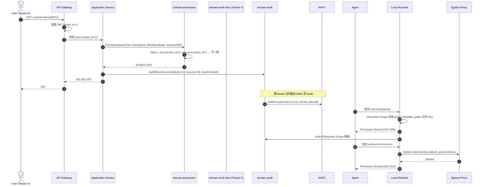

# domain-permission 实施 spec

> **状态**: Draft v0.1 (2026-08-25)
> **上游依赖**:
> - 《Requirements》§11, REQ-PERM-001/002
> - 《Basic Design》§2.1(表 21), §4.10, §6.6
> - 《API Design》§3.17
> - 《Data Design》§4.16 (`permission` schema)
> - 《Security Design》§3 (核心章节,全章)
> **下游交付**: Implementation team — Rust crate 路径 `crates/domain-permission/`
> **最后审稿**: 待 RFC 化时

---

## 1. 职责与边界

`domain-permission` 承载 RBAC + Project Policy Permission Scheme(§3.1 security-design,REQ-PERM-001),是横切 Domain,**所有**其他 Domain 都受其约束。Permission 检查由 Application 层 AuthorizationChecker 强制(§3.3 security-design,REQ-PERM-002)。

**属于本 crate 的**:
- Role 聚合根(权限命名集合)
- Permission 字符串枚举(平台级)
- PermissionScheme(Project 级权限方案,含 user/agent role_assignments)
- ActorContext 的 Role 解析

**不属于本 crate 的**:
- 鉴权(JWT 颁发与验证,`domain-identity` 拥有)
- Audit 记录(`domain-audit` Append-only)
- Permission 实际执行(Application 层 AuthorizationChecker)

## 2. 关键实体

引用 data-design §4.16 (`permission` schema):

**Role**(聚合根)
- 标识: `role_id`, `tenant_id`, `name`(如 tenant_admin / project_admin / developer / viewer / 自定义)
- 权限: `permission_keys[]`(Permission 字符串数组)
- 系统标记: `is_system_role`(平台预置,只读)

**Permission**(平台级只读聚合)
- `permission_key`(`work_item:read` / `worktree:create` / `agent_session:start` 等)
- `resource_type`, `action`, `description`
- 预置:全部由 platform_admin 维护

**PermissionScheme**(聚合根,Project 1:1)
- 标识: `scheme_id`, `tenant_id`, `project_id`
- 角色分配: `role_assignments[]`(user_id / group_id / device_id → role_id,JSONB)
- Agent 角色分配: `agent_role_assignments[]`(agent_id → role_id,JSONB,**强制,§3.1 security-design**)
- 默认角色: `default_role_id`

**ActorContext**(横切 Value Object,跨域共享)
- `user_id`, `device_id`, `tenant_id`, `project_id`, `roles: Vec<RoleId>`

## 3. 关键不变量

| ID | 不变量 | 上游依据 |
|---|---|---|
| INV-PM-01 | Permission 检查在 Application 层,**绝不**仅在 Prompt / Domain / UI 层 | REQ-PERM-002, basic-design §4.2.5 |
| INV-PM-02 | Agent 操作必带 `agent_role_assignments`(`domain-agent` 启动时校验) | security-design §3.1, REQ-PERM-002 |
| INV-PM-03 | 系统 Role(tenant_admin / project_admin / developer / viewer)不可被 Tenant 自定义覆盖 | security-design §3.2 |
| INV-PM-04 | 不可创建与 tenant_admin 等效的自定义 Role(防越权) | security-design §3.2 |
| INV-PM-05 | 跨 tenant 访问必须 403 SEC-007 + Audit 记录 | security-design §3.5.1 |
| INV-PM-06 | Cross-Repository 访问 SEC-005,Cross-Worktree 访问 SEC-006 | security-design §3.5.2/3 |
| INV-PM-07 | Protected 动作(如 `pr:merge` / `feedback:reject`)需 2FA 验证 | security-design §3.3 |

## 4. 接口签名

继承 api-design §3.17。

```rust
// crates/domain-permission/src/port.rs

pub trait PermissionCommandPort {
    async fn create_role(
        &self,
        cmd: CreateRoleCommand,  // tenant_id, name, permission_keys[]
        actor: ActorContext,
    ) -> Result<RoleId, PermissionError>;  // 不可与 system role 同名

    async fn update_role(
        &self,
        cmd: UpdateRoleCommand,
        actor: ActorContext,
    ) -> Result<Role, PermissionError>;

    async fn delete_role(
        &self,
        id: RoleId,
        actor: ActorContext,
    ) -> Result<(), PermissionError>;

    async fn replace_permission_scheme(
        &self,
        cmd: ReplacePermissionSchemeCommand,  // 含 role_assignments + agent_role_assignments
        actor: ActorContext,
    ) -> Result<PermissionScheme, PermissionError>;

    async fn assign_agent_role(
        &self,
        cmd: AssignAgentRoleCommand,  // agent_id, role_id (强制)
        actor: ActorContext,
    ) -> Result<PermissionScheme, PermissionError>;
}

pub trait PermissionQueryPort {
    async fn list_roles(&self, actor: ActorContext) -> Result<Vec<Role>, PermissionError>;
    async fn get_role(&self, id: RoleId, actor: ActorContext) -> Result<Role, PermissionError>;
    async fn get_permission_scheme(&self, id: SchemeId, actor: ActorContext) -> Result<PermissionScheme, PermissionError>;
    async fn list_permissions(&self, actor: ActorContext) -> Result<Vec<Permission>, PermissionError>;
    /// 核心:解析 Actor 的全部 Permission 集合
    async fn resolve_actor_permissions(
        &self,
        actor: &ActorContext,
    ) -> Result<HashSet<String>, PermissionError>;
    /// 校验动作(AuthorizationChecker 内部调用)
    async fn check(
        &self,
        actor: &ActorContext,
        action: &Action,
        resource: &Resource,
    ) -> Result<(), AuthzError>;
}
```

## 5. Domain Events

| Subject (NATS) | 触发条件 | Payload |
|---|---|---|
| `star.events.permission.role.created.v1` | `create_role` 成功 | `role_id, tenant_id, name, permission_keys[]` |
| `star.events.permission.role.updated.v1` | `update_role` 成功 | `role_id, version, updated_fields[]` |
| `star.events.permission.scheme.replaced.v1` | `replace_permission_scheme` 成功 | `scheme_id, project_id, version` |
| `star.events.permission.scheme.agent_role_assigned.v1` | `assign_agent_role` 成功 | `scheme_id, agent_id, role_id` |

**订阅者**:
- `domain-audit`(Append)
- `domain-agent`(Agent 启动时拉取 Policy)

## 6. 数据所有权

引用 data-design §4.16(`permission` schema):

- `permission.role`(聚合根)
- `permission.permission`(平台级只读,种子数据)
- `permission.permission_scheme`(聚合根)

**RLS 策略**:
- `permission.role`:`USING (current_setting('app.current_tenant_id') = tenant_id)`
- `permission.permission`:**禁用 RLS**(平台级共享,所有 Tenant 可读)
- `permission.permission_scheme`:`USING (current_setting('app.current_tenant_id') = tenant_id)`

**索引策略**:
- `permission.role(tenant_id, name)` UNIQUE
- `permission.permission_scheme(project_id)` UNIQUE

## 7. 鉴权与授权

引用 security-design §3.1-3.4,§3.6,§3.7(本 Module 是鉴权/授权的源头):

**4 个内置 Role**(security-design §3.2):
- `tenant_admin` — 全部(除 `audit:read` 受限)
- `project_admin` — `*:read` + `*:create` + `*:update` + `*:delete`(本 Project 范围)
- `developer` — `work_item:*` / `worktree:*` / `agent:*` / `feedback:*` / `context:*` / `validation:read`
- `viewer` — `*:read` 仅

**Permission 字符串格式**(security-design §3.1):
```text
{resource}:{action}
示例:
work_item:read / work_item:create / work_item:update / work_item:delete / work_item:transition
worktree:read / worktree:create / worktree:assign / worktree:commit / worktree:delete
agent:read / agent:register
agent_session:start / agent_session:abort / agent_session:read_transcript
feedback:read / feedback:create / feedback:update / feedback:reject
context:read / context:trigger
validation:read / validation:override
scm:read / scm:create / scm:sync / scm:push
validation_result:read / validation:override
runtime:read / runtime:register / runtime:revoke / runtime:remote_disable
audit:read
search:query
scm:github:read / scm:gitlab:read
```

**12 个 Agent Policy 强制点**(security-design §3.6.1,继承 basic-design §4.2.5):
- Repository / Worktree / Path / Tool / Network / Secret / Runtime Limit / Context Limit / Change Scope / Review Gate / Test Gate / Approval Gate

## 8. 错误码

引用 api-design §8.3.7(SEC- 系列,本 Module 是 SEC 错误码主源):

| 错误码 | HTTP | 触发条件 |
|---|---|---|
| `SEC-001` | 401 | Not Authenticated |
| `SEC-002` | 403 | Tenant Mismatch |
| `SEC-003` | 403 | Project Access Denied |
| `SEC-004` | 403 | Role Permission Denied |
| `SEC-005` | 403 | Cross-Repository Forbidden |
| `SEC-006` | 403 | Cross-Worktree Forbidden |
| `SEC-007` | 403 | Cross-Tenant Access Forbidden |
| `SEC-009` | 403 | Cloud AI Restricted |
| `SEC-010` | 403 | No Code Upload |
| `SEC-011` | 403 | Metadata Only |
| `SEC-012` | 403 | Provider Not Allowed |
| `SEC-013` | 403 | Cross-Region Data Boundary |
| `SEC-014` | 403 | Agent Secret Access Denied |
| `SEC-015` | 422 | Untrusted-as-Instruct Detected |
| `PM-001` | 409 | 尝试创建与 system role 同名 Role |
| `PM-002` | 403 | 尝试创建等效于 tenant_admin 的自定义 Role |

## 9. 实施任务分解

| 任务 | 描述 | 依赖 | TBD-MEASURE | 估算 |
|---|---|---|---|---|
| T1 | Role + Permission + PermissionScheme + ActorContext 实体 | 无 | — | 100K tokens |
| T2 | `PermissionCommandPort` 5 个方法 + 错误码 | T1 | — | 120K tokens |
| T3 | `PermissionQueryPort` 6 个方法(包含 `check` 核心方法) | T1, T2 | — | 180K tokens |
| T4 | Permission 字符串枚举(平台级 seed data,约 100+ 字符串) | T1 | security-design §3.1 | 100K tokens |
| T5 | 4 个内置 Role seed data | T1 | security-design §3.2 | 40K tokens |
| T6 | AuthorizationChecker 检查顺序(7 步,§3.3 security-design) | T3 | security-design §3.3 | 120K tokens |
| T7 | 12 个 Agent Policy 强制点辅助方法 | T3 | basic-design §4.2.5 | 150K tokens |
| T8 | Protected 动作 2FA 验证集成 | T6 | security-design §3.3 (step 6) | 100K tokens |
| T9 | 单元测试 + 跨 tenant/repo/worktree 测试矩阵 | T1-T8 | security-design §3.5.4 | 250K tokens |
| T10 | 集成测试:Role 创建 → Scheme 替换 → Agent 启动 Policy 校验 | T9 | api-design §3.17 | 150K tokens |

**合计估算**: ~1.31M tokens ≈ 5-6 人·天(AI 协作模式)

## 10. 验收标准(AC)

```gherkin
Feature: 鉴权与授权

  Scenario: 跨 Tenant 访问拒绝
    Given User U (Tenant X, project_admin) 访问 WorkItem W (Tenant Y)
    When GET /v1/work-items/{W}
    Then 403 SEC-007
    And  AuditEvent 记录 attempt=denied

  Scenario: 自定义 Role 等效 tenant_admin 拒绝
    Given Tenant Admin 尝试创建 Role "super_admin" 包含 tenant_admin 全部权限
    When POST /v1/roles
    Then 403 PM-002 (防越权)
    And  Role 未被创建

  Scenario: Agent 启动校验 PermissionScheme
    Given Agent A 启动前 Application 拉取 PermissionScheme
    And PermissionScheme 含 agent_role_assignments = [A → role_developer]
    When 启动 AgentSession
    Then A 行为受 developer role 约束(可读,不可删除)
    And  AuditEvent 记录 policy_enforced

  Scenario: 12 个 Agent Policy 强制点全部生效
    Given AgentPolicy.allowed_paths = ["src/"]
    When Agent 尝试读 /etc/passwd
    Then 403 AGT-006 (Path 越界)
    And  Agent 进程被 Local Runtime 拦截

  Scenario: Protected 动作需 2FA
    Given User U 尝试 POST /v1/worktrees/{W}:merge
    And U 的 session.auth_time > 30 min
    And U.amr 不含 mfa:*
    When 提交 merge
    Then 403 SEC-008 (Protected 动作需 2FA)

  Scenario: Cross-Worktree Context 拒绝
    Given AgentSession 在 Worktree A, AgentPolicy.allowed_worktrees = [A]
    When Agent 尝试访问 Worktree B 文件
    Then 403 SEC-006 (Cross-Worktree)
```

## 11. 风险与缓解

| Risk | 影响 | 缓解 | 引用 |
|---|---|---|---|
| 越权 Role 创建 | Critical | PM-002 拒绝等效 tenant_admin 自定义 Role | security-design §3.2 |
| Agent 越权修改 | Critical | 12 个强制点 + Application 层 AuthorizationChecker | basic-design §4.2.5, REQ-PERM-002 |
| 跨 Tenant 数据泄漏 | Critical | RLS + AuthorizationChecker 双重 + Object Storage Key 前缀 | basic-design §6.1, security-design §3.5 |
| 仅靠 Prompt 约束 Agent | Critical | 禁止,Policy 强制由 Application 层执行 | REQ-PERM-002 |
| Protected 动作被滥用 | High | 2FA 验证 + Audit | security-design §3.3 |

## 12. Open Issues

- J-PM-01: ABAC 是否在 V1 引入?(security-design §3.1 标注 V1 评估)
- J-PM-02: Record-Level ACL 是否在 V1 引入?(目前不支持)
- J-PM-03: PermissionScheme 是否支持 per-Worktree 级别覆盖?(目前 per-Project)
- J-PM-04: Agent Handoff 时 Policy 是否完全继承?(security-design §3.6.2 草案)

## 附录 A:关键流程时序图 — 跨 Tenant 拒绝与 Agent Policy 强制



## 附录 B:边界清单

| 边界类型 | 本 Module 行为 |
|---|---|
| 上游依赖 | 无核心依赖 |
| 下游调用 | `domain-audit`(所有鉴权事件 Append) |
| 跨域事务 | 无(AuthorizationChecker 是 Application 层调用,本 crate 提供 Port) |
| RLS 强制 | 3 个表启用 RLS,`permission` 表禁用 RLS(平台级共享) |
| 13 类 tenant_id 对象 | **直接覆盖 #1 Repository Credential**(Permission Scheme 约束 secret_access),**间接覆盖全部 13 类**(AuthorizationChecker 是 13 类对象访问的强制闸门) |
| 14 状态 AgentSession 触发 | **强约束**:AgentSession 启动必校验 `agent_role_assignments`,无则拒绝 |
| 17 状态 Worktree 触发 | 间接(Worktree 操作需 `worktree:*` 权限) |
| WorkItem 3 态 | 间接(WorkItem 操作需 `work_item:*` 权限) |

**接口稳定承诺**:Port trait 签名 + 4 个内置 Role + 100+ Permission 字符串 + 12 个 Agent Policy 强制点 + 13 类对象授权矩阵在后续 RFC 阶段不会变更。
