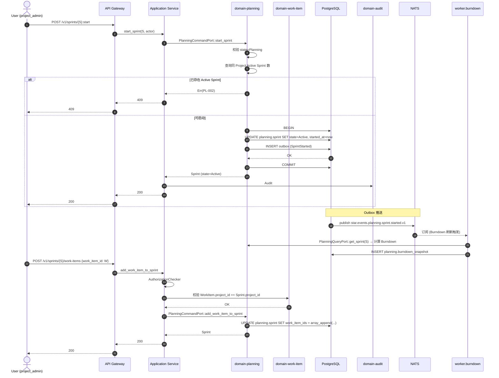

# domain-planning 实施 spec

> **状态**: Draft v0.1 (2026-08-25)
> **上游依赖**:
> - 《Requirements》§9, REQ-PLAN-001~006
> - 《Basic Design》§2.1(表 11), §4.9.2, §4.9.4
> - 《API Design》§3.8
> - 《Data Design》§4.7 (`planning` schema)
> - 《Security Design》§3.1-3.4
> **下游交付**: Implementation team — Rust crate 路径 `crates/domain-planning/`
> **最后审稿**: 待 RFC 化时

---

## 1. 职责与边界

`domain-planning` 承载 Sprint / Backlog / Roadmap 聚合(§9,REQ-PLAN-001~005),负责敏捷规划的核心数据。Burndown 是最小必需图表,Velocity / CFD / Control Chart 列入 V1(§30.3)。

**属于本 crate 的**:
- Sprint 聚合根(时间盒 / Goal / 关联 WorkItem)
- Backlog 排序池(无时间盒)
- Roadmap(Milestone 视图)
- Burndown 数据(WorkItem 数 / Story Points 随时间变化)

**不属于本 crate 的**:
- WorkItem 实体本身(`domain-work-item` 拥有,Sprint 仅引用)
- Board 视图(`domain-board` 拥有)
- Velocity / CFD 报表(V1 候选,worker 异步计算)

## 2. 关键实体

引用 data-design §4.7 (`planning` schema):

**Sprint**(聚合根)
- 标识: `sprint_id`, `tenant_id`, `project_id`
- 元数据: `name`, `goal`, `start_at`, `end_at`
- 状态: `state`(Planning / Active / Closed)
- 关联: `work_item_ids[]`(从 Backlog 转入)
- 容量: `capacity_story_points`(可空)
- 时间: `created_at`, `started_at`, `closed_at`

**Backlog**(聚合根,Project 1:1)
- 标识: `backlog_id`, `tenant_id`, `project_id`
- 排序: `work_item_order[]`(WorkItem ID 数组,按 display_order 排序)
- 容量: `capacity`(可空)

**Roadmap**(聚合根,Project 1:1)
- 标识: `roadmap_id`, `tenant_id`, `project_id`
- Milestones: `milestone_ids[]`

**Milestone**(实体)
- 标识: `milestone_id`, `roadmap_id`, `name`
- 时间: `target_date`
- 关联: `work_item_ids[]`

**BurndownSnapshot**(Projection)
- `sprint_id`, `snapshot_at`, `remaining_story_points`, `remaining_work_item_count`, `ideal_story_points`

## 3. 关键不变量

| ID | 不变量 | 上游依据 |
|---|---|---|
| INV-PL-01 | Sprint 状态迁移: Planning → Active → Closed,不可逆 | basic-design §4.9.2 |
| INV-PL-02 | Sprint `start_at` < `end_at`,且时长 1-4 周(可配置) | REQ-PLAN-001 |
| INV-PL-03 | 同一 Project 同一时刻最多 1 个 Active Sprint | basic-design §4.9.4 |
| INV-PL-04 | WorkItem 可同时属 Backlog + Sprint(由 Sprint 维护 work_item_ids) | basic-design §4.9.4 |
| INV-PL-05 | Burndown 是 Projection(Worker 周期刷新),非业务事实源 | basic-design §5.7 |
| INV-PL-06 | Backlog 排序由 `work_item_order[]` 维护,删除 WorkItem 时同步移除 | basic-design §4.9.4 |

## 4. 接口签名

继承 api-design §3.8。

```rust
// crates/domain-planning/src/port.rs

pub trait PlanningCommandPort {
    async fn create_sprint(
        &self,
        cmd: CreateSprintCommand,  // project_id, name, goal, start_at, end_at
        actor: ActorContext,
    ) -> Result<SprintId, PlanningError>;

    async fn update_sprint(
        &self,
        cmd: UpdateSprintCommand,
        actor: ActorContext,
    ) -> Result<Sprint, PlanningError>;

    async fn start_sprint(
        &self,
        id: SprintId,
        actor: ActorContext,    // Protected
    ) -> Result<Sprint, PlanningError>;  // Planning → Active

    async fn close_sprint(
        &self,
        id: SprintId,
        actor: ActorContext,    // Protected
        cmd: CloseSprintCommand,  // 含 move_incomplete_to: backlog|next_sprint
    ) -> Result<Sprint, PlanningError>;

    async fn reorder_backlog(
        &self,
        cmd: BacklogReorderCommand,  // work_item_order[]
        actor: ActorContext,
    ) -> Result<Backlog, PlanningError>;

    async fn add_work_item_to_sprint(
        &self,
        cmd: AddWorkItemToSprintCommand,
        actor: ActorContext,
    ) -> Result<Sprint, PlanningError>;

    async fn remove_work_item_from_sprint(
        &self,
        cmd: RemoveWorkItemFromSprintCommand,
        actor: ActorContext,
    ) -> Result<Sprint, PlanningError>;
}

pub trait PlanningQueryPort {
    async fn list_sprints(&self, q: ListSprintQuery, viewer: ActorContext) -> Result<Vec<Sprint>, PlanningError>;
    async fn get_sprint(&self, id: SprintId, viewer: ActorContext) -> Result<Sprint, PlanningError>;
    async fn get_backlog(&self, project_id: ProjectId, viewer: ActorContext) -> Result<Backlog, PlanningError>;
    async fn get_roadmap(&self, project_id: ProjectId, viewer: ActorContext) -> Result<Roadmap, PlanningError>;
    async fn get_burndown(&self, sprint_id: SprintId, viewer: ActorContext) -> Result<BurndownReport, PlanningError>;
}
```

## 5. Domain Events

| Subject (NATS) | 触发条件 | Payload |
|---|---|---|
| `star.events.planning.sprint.created.v1` | `create_sprint` 成功 | `sprint_id, project_id, start_at, end_at` |
| `star.events.planning.sprint.started.v1` | `start_sprint` 成功 | `sprint_id, started_at, work_item_count` |
| `star.events.planning.sprint.closed.v1` | `close_sprint` 成功 | `sprint_id, closed_at, moved_incomplete_to` |
| `star.events.planning.backlog.reordered.v1` | `reorder_backlog` 成功 | `project_id, new_order[]` |
| `star.events.planning.sprint.work_item_added.v1` | `add_work_item_to_sprint` 成功 | `sprint_id, work_item_id` |

**订阅者**:
- `domain-audit`(Append)
- `domain-search`(投影)
- `domain-board`(Board Sprint 视图)
- `worker.projection.role`(Burndown Snapshot 触发)

## 6. 数据所有权

引用 data-design §4.7(`planning` schema):

- `planning.sprint`(聚合根)
- `planning.backlog`(聚合根)
- `planning.roadmap`(聚合根)
- `planning.milestone`(实体)
- `planning.burndown_snapshot`(Projection,Worker 周期刷新)

**RLS 策略**:
- 全部启用 RLS,`USING (current_setting('app.current_tenant_id') = tenant_id)`

**索引策略**:
- `planning.sprint(project_id, state)` — 列表查询
- `planning.sprint(project_id, start_at, end_at)` — 时间范围
- `planning.backlog(project_id)` UNIQUE
- `planning.roadmap(project_id)` UNIQUE
- `planning.burndown_snapshot(sprint_id, snapshot_at DESC)` — Burndown 趋势

## 7. 鉴权与授权

**Permission 字符串**:
- `sprint:create`, `sprint:update`, `sprint:start`(Protected), `sprint:close`(Protected)
- `backlog:read`, `backlog:reorder`
- `roadmap:read`, `roadmap:update`
- `burndown:read`

**内置 Role**:
- `tenant_admin` / `project_admin` — 全部
- `developer` — `sprint:create/update`, `backlog:reorder`, `roadmap:read`, `burndown:read`
- `viewer` — 仅 read 类

## 8. 错误码

| 错误码 | HTTP | 触发条件 |
|---|---|---|
| `SEC-001/002/007` | 401/403/403 | 鉴权类 |
| `PL-001` | 422 | start_at >= end_at |
| `PL-002` | 409 | 同一 Project 已存在 Active Sprint |
| `PL-003` | 422 | Sprint 时长超出 1-4 周范围 |
| `PL-004` | 409 | 尝试启动非 Planning 状态的 Sprint |
| `PL-005` | 404 | Backlog / Roadmap 不存在 |
| `PL-006` | 422 | WorkItem 不在 Project 范围 |
| `PL-007` | 409 | Sprint 状态非法迁移(已 Closed) |

## 9. 实施任务分解

| 任务 | 描述 | 依赖 | TBD-MEASURE | 估算 |
|---|---|---|---|---|
| T1 | Sprint + Backlog + Roadmap + Milestone 实体 | 无 | — | 100K tokens |
| T2 | `PlanningCommandPort` 7 个方法 + 错误码 | T1 | — | 140K tokens |
| T3 | `PlanningQueryPort` 5 个方法 | T1, T2 | — | 80K tokens |
| T4 | Sprint 状态迁移规则(Planning→Active→Closed) | T2 | basic-design §4.9.2 | 60K tokens |
| T5 | Backlog 排序与 WorkItem 同步删除 | T2 | basic-design §4.9.4 | 80K tokens |
| T6 | BurndownSnapshot Projection(Worker 周期刷新) | T3 | data-design §11 | 120K tokens |
| T7 | 单元测试 + RLS 测试 + 状态机测试 | T1-T6 | security-design §3.5.4 | 150K tokens |
| T8 | 集成测试:创建 Sprint → 启动 → 添加 WorkItem → Burndown 触发 | T7 | api-design §3.8 | 120K tokens |

**合计估算**: ~850K tokens ≈ 3.5 人·天(AI 协作模式)

## 10. 验收标准(AC)

```gherkin
Feature: Sprint 与 Backlog

  Scenario: 启动 Sprint
    Given Sprint S (state=Planning), Project P 无 Active Sprint
    When POST /v1/sprints/{S}:start
    Then 200 OK, state=Active
    And  started_at 写入
    And  Notification 通知 Project Member

  Scenario: 同一 Project 已有 Active Sprint 时启动
    Given Project P 已有 Active Sprint S1
    When POST /v1/sprints/{S2}:start
    Then 409 PL-002 (已存在 Active Sprint)

  Scenario: 关闭 Sprint 选择回退位置
    Given Sprint S (state=Active), 含 5 个 WorkItem (2 DONE, 3 IN_PROGRESS)
    When POST /v1/sprints/{S}:close {move_incomplete_to: backlog}
    Then 200 OK, state=Closed
    And  3 个 IN_PROGRESS 移回 Backlog
    And  Burndown 终止

  Scenario: 跨 Project 添加 WorkItem
    Given WorkItem W (Project P1)
    When POST /v1/sprints/{S(P2)}/work-items {work_item_id: W}
    Then 422 PL-006 (WorkItem 不在同 Project)

  Scenario: Burndown 数据准确性
    Given Sprint S 含 100 Story Points, 5 天时长
    When Worker 周期刷新 Burndown (Day 2)
    Then BurndownReport.remaining_story_points = 60 (理想 + 实际)
    And  ideal_story_points 符合线性插值
```

## 11. 风险与缓解

| Risk | 影响 | 缓解 | 引用 |
|---|---|---|---|
| 多个 Active Sprint 并存 | High | INV-PL-03 + PL-002 错误码 | basic-design §4.9.4 |
| Sprint 时长配置滥用 | Medium | INV-PL-02 + PL-003 错误码(1-4 周硬约束) | REQ-PLAN-001 |
| Burndown 实时性差 | Low | Worker 周期刷新(每 1h),不阻塞事务 | data-design §11 |
| WorkItem 跨 Project 误入 Sprint | High | PL-006 校验 | basic-design §5.7 |

## 12. Open Issues

- J-PL-01: Velocity / CFD / Control Chart 是否在 MVP 实现?(目前 V1 候选,§30.3)
- J-PL-02: Sprint 是否支持时间盒外添加 WorkItem?(目前允许,但触发 Notification)
- J-PL-03: Milestone 是否支持层级(父子)?(目前平铺)
- J-PL-04: Backlog 是否支持多个排序(manual / priority / story_points)?(目前 manual)

## 附录 A:关键流程时序图 — Sprint 启动与 WorkItem 流转



## 附录 B:边界清单

| 边界类型 | 本 Module 行为 |
|---|---|
| 上游依赖 | `domain-tenant`, `domain-project`, `domain-work-item` (Sprint → WorkItem 引用) |
| 下游调用 | `domain-audit`, `domain-search`, `domain-notification`, `domain-board` |
| 跨域事务 | `add_work_item_to_sprint` 时校验 WorkItem 项目归属(同事务读) |
| RLS 强制 | 5 个表全部启用 RLS |
| 13 类 tenant_id 对象 | 间接覆盖 |
| 14 状态 AgentSession 触发 | 无 |
| 17 状态 Worktree 触发 | 无 |
| WorkItem 3 态 | 间接(Sprint 包含 WorkItem 列表,但不拥有状态机) |

**接口稳定承诺**:Port trait 签名 + 7 条错误码 + 6 条不变量在后续 RFC 阶段不会变更。
