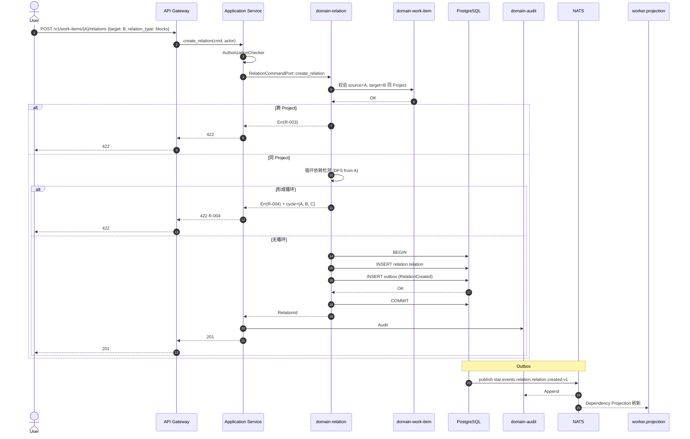

# domain-relation 实施 spec

> **状态**: Draft v0.1 (2026-08-25)
> **上游依赖**:
> - 《Requirements》§10, REQ-COLLAB-002
> - 《Basic Design》§2.1(表 12), §4.9.4
> - 《API Design》§3.9
> - 《Data Design》§4.8 (`relation` schema)
> - 《Security Design》§3.1-3.4
> **下游交付**: Implementation team — Rust crate 路径 `crates/domain-relation/`
> **最后审稿**: 待 RFC 化时

---

## 1. 职责与边界

`domain-relation` 承载 WorkItem 关系(阻塞 / 关联 / 父子)(§10,REQ-COLLAB-002),是甘特图依赖与冲突分析的基础。

**属于本 crate 的**:
- Relation 聚合根(WorkItem 之间的关系)
- 循环依赖检测
- Gantt 视图派生 Projection

**不属于本 crate 的**:
- WorkItem 实体本身(`domain-work-item` 拥有)
- 父-子层级(已在 `domain-work-item` 的 `parent_work_item_id` 实现,本 crate 仅补"关联/阻塞"等显式关系)
- 冲突解决 UI(由 `domain-worktree` 负责)

## 2. 关键实体

引用 data-design §4.8 (`relation` schema):

**Relation**(聚合根)
- 标识: `relation_id`, `tenant_id`, `project_id`
- 源: `source_work_item_id`, `source_kind`(WorkItem)
- 目标: `target_work_item_id`, `target_kind`(WorkItem)
- 类型: `relation_type`(blocks / blocked_by / relates_to / duplicates / clones)
- 元数据: `created_by_user_id`, `created_at`, `note`(可空)

**DependencyProjection**(派生,Application 触发)
- `work_item_id`, `direct_dependencies: Vec<WorkItemId>`, `transitive_dependencies: Vec<WorkItemId>`, `is_circular: bool`

**GanttReport**(派生)
- `work_item_id`, `start_date`, `due_date`, `dependencies[]`, `is_critical_path: bool`

## 3. 关键不变量

| ID | 不变量 | 上游依据 |
|---|---|---|
| INV-R-01 | source ≠ target(自关系禁止) | data-design §4.8 |
| INV-R-02 | 同一对 source + target + relation_type UNIQUE(防重复) | data-design §4.8 |
| INV-R-03 | Relation 创建不引入循环(创建后立即检测) | basic-design §4.9.4 |
| INV-R-04 | source 与 target 必属同 Project(防跨 Project 引用) | data-design §4.8 |
| INV-R-05 | 删除 Relation 不级联删除 WorkItem | basic-design §5.7 |
| INV-R-06 | relation_type 必须是枚举之一(blocks / blocked_by / relates_to / duplicates / clones) | data-design §4.8 |

## 4. 接口签名

继承 api-design §3.9。

```rust
// crates/domain-relation/src/port.rs

pub trait RelationCommandPort {
    async fn create_relation(
        &self,
        cmd: CreateRelationCommand,  // source_id, target_id, relation_type, note?
        actor: ActorContext,
    ) -> Result<RelationId, RelationError>;

    async fn delete_relation(
        &self,
        id: RelationId,
        actor: ActorContext,
    ) -> Result<(), RelationError>;
}

pub trait RelationQueryPort {
    async fn list_by_work_item(
        &self,
        work_item_id: WorkItemId,
        viewer: ActorContext,
    ) -> Result<Vec<Relation>, RelationError>;
    async fn list_dependencies(
        &self,
        work_item_id: WorkItemId,
        viewer: ActorContext,
    ) -> Result<Vec<Dependency>, RelationError>;  // 派生
    async fn detect_circular(
        &self,
        work_item_id: WorkItemId,
        viewer: ActorContext,
    ) -> Result<CircularDependencyReport, RelationError>;  // 派生
    async fn get_gantt(
        &self,
        work_item_id: WorkItemId,
        range: DateRange,
        viewer: ActorContext,
    ) -> Result<GanttReport, RelationError>;  // 派生
}
```

## 5. Domain Events

| Subject (NATS) | 触发条件 | Payload |
|---|---|---|
| `star.events.relation.relation.created.v1` | `create_relation` 成功 | `relation_id, source_id, target_id, relation_type` |
| `star.events.relation.relation.deleted.v1` | `delete_relation` 成功 | `relation_id, source_id, target_id` |
| `star.events.relation.dependency.circular_detected.v1` | `detect_circular` 发现循环 | `work_item_id, cycle: Vec<WorkItemId>` |

**订阅者**:
- `domain-audit`(Append)
- `domain-search`(投影)
- `domain-planning`(Sprint 阻塞通知)

## 6. 数据所有权

引用 data-design §4.8(`relation` schema):

- `relation.relation`(聚合根)
- `relation.dependency_projection`(派生,Application 触发刷新)
- `relation.gantt_report`(派生,Application 触发刷新)

**RLS 策略**:
- `relation.relation`:启用 RLS,`USING (current_setting('app.current_tenant_id') = tenant_id)`
- 派生表:同 RLS

**索引策略**:
- `relation.relation(source_work_item_id, relation_type)` — 反向查询
- `relation.relation(target_work_item_id, relation_type)` — 正向查询
- `relation.relation(source_work_item_id, target_work_item_id, relation_type)` UNIQUE

## 7. 鉴权与授权

**Permission 字符串**:
- `relation:read`, `relation:create`, `relation:delete`

**内置 Role**:
- `tenant_admin` / `project_admin` / `developer` — 全部
- `viewer` — 仅 `relation:read`

## 8. 错误码

| 错误码 | HTTP | 触发条件 |
|---|---|---|
| `SEC-001/002/007` | 401/403/403 | 鉴权类 |
| `R-001` | 422 | source == target(自关系) |
| `R-002` | 409 | 同一 relation 重复 |
| `R-003` | 422 | source 与 target 跨 Project |
| `R-004` | 422 | 创建后形成循环依赖 |
| `R-005` | 422 | relation_type 不在枚举中 |
| `R-006` | 404 | Relation 不存在 |

## 9. 实施任务分解

| 任务 | 描述 | 依赖 | TBD-MEASURE | 估算 |
|---|---|---|---|---|
| T1 | Relation + DependencyProjection + GanttReport 实体 | 无 | — | 60K tokens |
| T2 | `RelationCommandPort` 2 个方法 + 错误码 | T1 | — | 80K tokens |
| T3 | `RelationQueryPort` 4 个方法(派生查询) | T1, T2 | — | 100K tokens |
| T4 | 循环依赖检测算法(DFS / Tarjan) | T2 | basic-design §4.9.4 | 60K tokens |
| T5 | Gantt 派生(关键路径算法) | T3 | data-design §4.8 | 80K tokens |
| T6 | 单元测试 + RLS 测试 + 循环检测测试 | T1-T5 | security-design §3.5.4 | 100K tokens |
| T7 | 集成测试:创建 relation → 循环检测 → Gantt 派生 | T6 | api-design §3.9 | 80K tokens |

**合计估算**: ~560K tokens ≈ 2.5 人·天(AI 协作模式)

## 10. 验收标准(AC)

```gherkin
Feature: WorkItem 关系与依赖

  Scenario: 创建 blocks 关系
    Given WorkItem A, B (同 Project)
    When POST /v1/work-items/{A}/relations {target: B, relation_type: blocks}
    Then 201 Created {relation_id}
    And  AuditEvent 记录 relation_created

  Scenario: 自关系拒绝
    Given WorkItem A
    When POST /v1/work-items/{A}/relations {target: A, relation_type: blocks}
    Then 422 R-001 (source == target)

  Scenario: 跨 Project 关系拒绝
    Given WorkItem A (Project P1), B (Project P2)
    When POST /v1/work-items/{A}/relations {target: B}
    Then 422 R-003 (跨 Project)

  Scenario: 循环依赖检测
    Given A blocks B, B blocks C
    When POST /v1/work-items/{C}/relations {target: A, relation_type: blocks}
    Then 422 R-004 (循环依赖)
    And  CircularDependencyReport 输出 cycle=[A, B, C]

  Scenario: 重复 relation
    Given Relation R1 (A blocks B) 已存在
    When POST /v1/work-items/{A}/relations {target: B, relation_type: blocks}
    Then 409 R-002 (重复)

  Scenario: Gantt 派生
    Given WorkItem A (start=Day 1, due=Day 5), B (Day 3, due=Day 8), C blocks B
    When GET /v1/work-items/{A}/gantt
    Then GanttReport.critical_path = [A, B]
    And  B.is_critical_path = true
```

## 11. 风险与缓解

| Risk | 影响 | 缓解 | 引用 |
|---|---|---|---|
| 循环依赖爆炸 | High | T4 强制检测,创建即拒 | basic-design §4.9.4 |
| 跨 Project 关系泄漏 | Medium | R-003 拒绝 | data-design §4.8 |
| Gantt 派生性能(大规模 Project) | Medium | V1 评估,目前 Project ≤ 1000 WorkItem | data-design §11 |
| 父子关系与 Relation 重复 | Low | INV-R-04 + 父子关系在 `domain-work-item` 单独管理 | basic-design §4.9.2 |

## 12. Open Issues

- J-R-01: Relation 是否支持"软删除"(暂存 / 恢复)?(目前硬删除)
- J-R-02: Gantt 是否支持 Milestone(来自 domain-planning)作为节点?(目前仅 WorkItem)
- J-R-03: 关键路径算法是否考虑 Resource 容量?(目前仅时间)
- J-R-04: Relation 是否支持 Attachment(关联 GitHub PR / 外部 URL)?(目前不支持)

## 附录 A:关键流程时序图 — Relation 创建 + 循环检测



## 附录 B:边界清单

| 边界类型 | 本 Module 行为 |
|---|---|
| 上游依赖 | `domain-tenant`, `domain-work-item` (source / target 引用) |
| 下游调用 | `domain-audit`, `domain-search`, `domain-planning` |
| 跨域事务 | `create_relation` 时校验 WorkItem Project 归属(同事务读) |
| RLS 强制 | `relation.relation` 启用 RLS,派生表同 RLS |
| 13 类 tenant_id 对象 | 间接覆盖 |
| 14 状态 AgentSession 触发 | 无 |
| 17 状态 Worktree 触发 | 无 |
| WorkItem 3 态 | 间接(Relation 父 = WorkItem) |

**接口稳定承诺**:Port trait 签名 + 6 条错误码 + 6 条不变量在后续 RFC 阶段不会变更。
