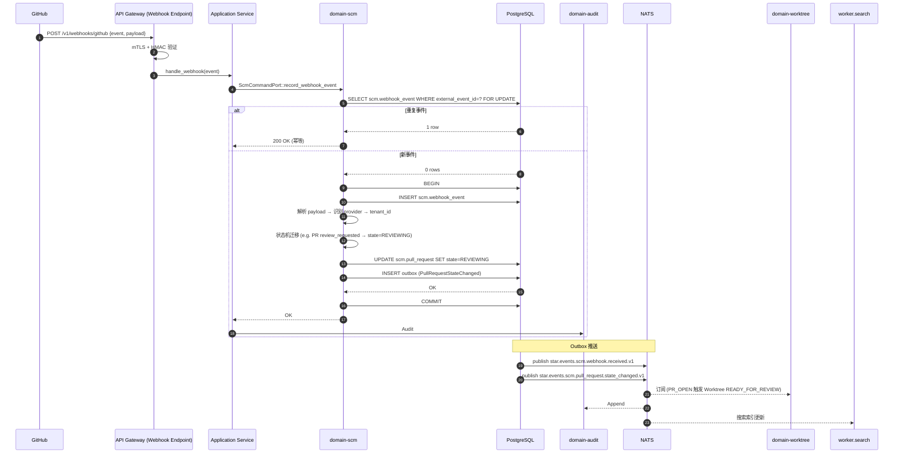

# domain-scm 实施 spec

> **状态**: Draft v0.1 (2026-08-25)
> **上游依赖**:
> - 《Requirements》§19 (SCM / GitHub / GitLab), REQ-SCM-001/002
> - 《Basic Design》§2.1(表 7), §4.7, §5.7, §6.6
> - 《API Design》§3.19
> - 《Data Design》§4.18 (`scm` schema)
> - 《Security Design》§3.1-3.4, §5.5
> **下游交付**: Implementation team — Rust crate 路径 `crates/domain-scm/`
> **最后审稿**: 待 RFC 化时

---

## 1. 职责与边界

`domain-scm` 承载 SCM Adapter 抽象 + Repository 同步(§19,REQ-SCM-001/002)。**Domain 层不得出现厂商特有对象**(`GitHubPullRequestObject` / `GitLabMergeRequestEntity` 等),统一抽象 GitHub / GitLab / 未来 SCM(§19.1)。

**属于本 crate 的**:
- Repository 聚合根(Connected / Mirrored / Managed / LocalOnly,§4.7.4)
- Branch / Commit / PullRequest / Review / Pipeline 实体
- SCM Port 抽象(`ScmPort` trait,§4.7.3)
- ACL(Anti-Corruption Layer)层翻译 GitHub / GitLab 厂商对象
- Webhook 入站处理(去重 + Idempotency)

**不属于本 crate 的**:
- Commit 与 WorkItem 关联(`domain-development` 拥有)
- Local Runtime 集成(`domain-local-runtime` 独立)
- Domain Event 跨域传播(由 `domain-development` 触发)

## 2. 关键实体

引用 data-design §4.18 (`scm` schema):

**Repository**(聚合根,§19.2)
- 标识: `repository_id`, `tenant_id`, `project_id`
- 外部引用: `external_id`(GitHub/GitLab 中的 ID), `provider`(GitHub / GitLab / Gitea / Bitbucket / Future)
- 元数据: `url`, `default_branch`
- 所有权: `ownership`(Connected / Mirrored / Managed / LocalOnly)
- 同步: `last_sync_token`, `last_synced_at`, `sync_status`(InSync / Behind / Ahead / Conflict / Disabled)

**Branch**(实体)
- 标识: `branch_id`, `repository_id`, `name`
- 内容: `head_commit_id`, `base_commit_id`(可选), `protected`(bool)

**Commit**(实体)
- 标识: `commit_id`, `repository_id`, `sha`
- 元数据: `author`, `committer`, `message`
- 关系: `parent_shas[]`, `tree_sha`
- 关联: `linked_work_item_id`(可选,通过 Commit Link)

**PullRequest**(实体,统一抽象 GitHub PR 与 GitLab MR,§7.5 状态机)
- 标识: `pull_request_id`, `repository_id`, `external_id`
- 内容: `source_branch`, `target_branch`, `title`, `description`, `author`
- 状态: `state`(Open / Merged / Closed / Draft)
- 关联: `review_ids[]`, `pipeline_ids[]`, `linked_work_item_id`(可选)
- 状态机: DRAFT → OPEN → REVIEWING → CHANGES_REQUESTED → APPROVED → MERGEABLE → MERGED → CLOSED(§7.5)

**Review / Pipeline / WebhookEvent**(实体,统一抽象)

**SyncState**(值对象,§18.1)
- `sync_token`, `last_synced_at`, `conflict_strategy`(LatestWins / FirstWins / ManualReview / Bidirectional)

## 3. 关键不变量

| ID | 不变量 | 上游依据 |
|---|---|---|
| INV-SCM-01 | Domain 层不出现厂商特有对象(由 ACL 翻译) | basic-design §4.7.1, REQ-SCM-002 |
| INV-SCM-02 | MVP 仅支持 Connected 所有权(Connected 外部 SoR,平台只读) | basic-design §4.7.4, §30.6 |
| INV-SCM-03 | Bidirectional Sync 必须有 Loop 防护(Idempotency Key + Sync Token) | basic-design §4.7.6, RISK-027 |
| INV-SCM-04 | Repository 必带 tenant_id + project_id,跨 tenant 拒绝 | basic-design §6.1, REQ-SEC-001 |
| INV-SCM-05 | Repository Credential 走 Credential Broker,不存明文 | security-design §5.4 |
| INV-SCM-06 | PR Content 必带 tenant_id(Object Storage Key 前缀,§6.1) | basic-design §6.1 |
| INV-SCM-07 | PullRequest.state 状态机严格按 §7.5 迁移 | basic-design §7.5 |
| INV-SCM-08 | Webhook 入站 100% 写 Audit | basic-design §9.3 |

## 4. 接口签名

继承 api-design §3.19。

```rust
// crates/domain-scm/src/port.rs

pub trait ScmPort {
    /// 仓库元数据(读)
    async fn get_repository(&self, external_id: ExternalRepositoryId) -> Result<Repository, ScmError>;
    async fn list_branches(&self, repository_id: ExternalRepositoryId) -> Result<Vec<Branch>, ScmError>;
    async fn get_commit(&self, repository_id: ExternalRepositoryId, sha: &str) -> Result<Commit, ScmError>;
    async fn get_pull_request(&self, repository_id: ExternalRepositoryId, external_pr_id: &str) -> Result<PullRequest, ScmError>;
    async fn list_pull_requests(&self, repository_id: ExternalRepositoryId, filter: PullRequestFilter) -> Result<Vec<PullRequest>, ScmError>;

    /// 写入操作(慎用,需 Permission 校验)
    async fn create_pull_request(&self, cmd: CreatePullRequestCommand) -> Result<PullRequest, ScmError>;
    async fn add_comment(&self, cmd: AddCommentCommand) -> Result<(), ScmError>;
    async fn request_review(&self, cmd: RequestReviewCommand) -> Result<(), ScmError>;

    /// Webhook 注册
    async fn register_webhook(&self, cmd: RegisterWebhookCommand) -> Result<WebhookHandle, ScmError>;
}

pub trait ScmCommandPort {
    async fn register_repository(
        &self,
        cmd: RegisterRepositoryCommand,  // provider, external_id, ownership
        actor: ActorContext,
    ) -> Result<RepositoryId, ScmError>;
    async fn update_sync_state(
        &self,
        cmd: UpdateSyncStateCommand,
        actor: ActorContext,
    ) -> Result<Repository, ScmError>;
    async fn record_webhook_event(
        &self,
        event: WebhookEvent,  // 入站 webhook
    ) -> Result<(), ScmError>;  // 内部调用,Service-Internal
}

pub trait ScmQueryPort {
    async fn get_repository(&self, id: RepositoryId, viewer: ActorContext) -> Result<Repository, ScmError>;
    async fn list_by_project(&self, project_id: ProjectId, viewer: ActorContext) -> Result<Vec<Repository>, ScmError>;
    async fn get_pull_request(&self, id: PullRequestId, viewer: ActorContext) -> Result<PullRequest, ScmError>;
}
```

## 5. Domain Events

| Subject (NATS) | 触发条件 | Payload |
|---|---|---|
| `star.events.scm.repository.registered.v1` | `register_repository` 成功 | `repository_id, provider, ownership, external_id` |
| `star.events.scm.sync_state.changed.v1` | `update_sync_state` 成功 | `repository_id, sync_status, last_synced_at` |
| `star.events.scm.pull_request.linked.v1` | PR 关联 WorkItem | `pull_request_id, work_item_id, repository_id` |
| `star.events.scm.webhook.received.v1` | Webhook 入站 | `provider, event_type, repository_id, external_event_id` |

**订阅者**:
- `domain-audit`(Append,全部事件)
- `domain-worktree`(`pull_request.linked` 触发 Worktree 状态变更)
- `domain-development`(`sync_state.changed` 触发 ChangeSet 同步)
- `domain-search`(投影)

## 6. 数据所有权

引用 data-design §4.18(`scm` schema):

- `scm.repository`(聚合根)
- `scm.branch`(实体)
- `scm.commit`(实体)
- `scm.pull_request`(实体,**非聚合根**,§4.7.2 标注)
- `scm.review`(实体)
- `scm.pipeline`(实体)
- `scm.webhook_event`(实体,Append-only 历史)
- `scm.sync_state`(值对象,内嵌于 repository)

**RLS 策略**:
- 全部启用 RLS,`USING (current_setting('app.current_tenant_id') = tenant_id)`
- Webhook 入站必须先解析 provider → tenant_id(由 Worker 解析,失败 → DLQ + Audit)

**索引策略**:
- `scm.repository(tenant_id, provider, external_id)` UNIQUE
- `scm.repository(project_id, sync_status)`
- `scm.commit(repository_id, sha)` UNIQUE
- `scm.pull_request(repository_id, external_id)` UNIQUE
- `scm.pull_request(linked_work_item_id)`
- `scm.webhook_event(provider, external_event_id)` UNIQUE — Idempotency 去重

## 7. 鉴权与授权

引用 security-design §3.1-3.4:

**Permission 字符串**:
- `scm:read`, `scm:create`, `scm:sync`, `scm:push`
- `scm:github:read`, `scm:gitlab:read`(Provider-specific)
- `pr:read`, `pr:create`, `pr:merge`(Protected)

**内置 Role**:
- `tenant_admin` / `project_admin` — 全部
- `developer` — 全部(除 `pr:merge` 需 Protected)
- `viewer` — 仅 read

**Provider-specific 权限**(security-design §3.1):
- `scm:github:read` / `scm:gitlab:read` — Provider 子分类,用于 Provider 切换时细化

## 8. 错误码

引用 api-design §8.3.12(SC- 系列):

| 错误码 | HTTP | 触发条件 |
|---|---|---|
| `SEC-001/002/007` | 401/403/403 | 鉴权类 |
| `SC-001` | 404 | Repository 不存在 |
| `SC-002` | 422 | Provider 不可用(API 限额) |
| `SC-003` | 409 | 同步冲突(ConflictStrategy 触发) |
| `SC-004` | 409 | 重复 Webhook Event(Idempotency 命中) |
| `SC-005` | 422 | 厂商 API 错误(GitHub/GitLab 4xx/5xx) |
| `SC-006` | 403 | 尝试 sync / push 但 Provider Credential 缺失 |

## 9. 实施任务分解

| 任务 | 描述 | 依赖 | TBD-MEASURE | 估算 |
|---|---|---|---|---|
| T1 | Repository / Branch / Commit / PullRequest / Review / Pipeline 实体 | 无 | — | 120K tokens |
| T2 | `ScmPort` 9 个方法(抽象) + ACL 接口定义 | T1 | — | 80K tokens |
| T3 | `ScmCommandPort` 3 个方法 + 错误码 | T1, T2 | — | 100K tokens |
| T4 | `ScmQueryPort` 3 个方法 | T1-T3 | — | 60K tokens |
| T5 | GitHub Adapter(`crates/infrastructure/src/scm/github.rs`) | T2 | api-design §3.19 | 400K tokens(POC-026) |
| T6 | GitLab Adapter(`crates/infrastructure/src/scm/gitlab.rs`) | T2 | api-design §3.19 | 400K tokens(POC-027) |
| T7 | Webhook 入站处理(Idempotency + 解析 + DLQ) | T3 | basic-design §9.3 | 150K tokens |
| T8 | SyncState 同步(Rate Limit 兜底) | T3 | basic-design §4.7.6 | 120K tokens |
| T9 | PR 状态机迁移(7 状态,§7.5) | T3 | basic-design §7.5 | 100K tokens |
| T10 | 单元测试 + 跨 Provider 测试 | T1-T9 | security-design §3.5.4 | 200K tokens |
| T11 | 集成测试:Register → Sync → Webhook → PR 状态变更 | T10 | api-design §3.19 | 150K tokens |

**合计估算**: ~1.88M tokens ≈ 7-8 人·天(AI 协作模式,主要在 T5/T6 Adapter)

## 10. 验收标准(AC)

```gherkin
Feature: SCM 集成与同步

  Scenario: 注册 GitHub Repository
    Given User U 是 project_admin
    When POST /v1/repositories {provider: GitHub, external_id: "acme/foo", ownership: Connected}
    Then 201 Created {repository_id}
    And  sync_status=InSync
    And  Webhook 自动注册(若支持)

  Scenario: Webhook 入站幂等
    Given GitHub 推送 webhook 事件 E (external_event_id: 12345)
    When 第二次推送同一 external_event_id
    Then 200 OK (幂等,不再处理)
    And  AuditEvent 记录 idempotent_hit

  Scenario: PR 状态机迁移
    Given PR (state=Draft)
    When User 标记 Ready for Review
    Then state=Draft → OPEN
    And  Webhook 触发 review_requested → state=REVIEWING

  Scenario: Cross-Repository 防护
    Given Agent Session 在 Repository A
    When 尝试 read Repository B 文件
    Then 403 SEC-005

  Scenario: Provider Rate Limit
    Given GitHub API 触发 Rate Limit (5000 req/h 满)
    When 尝试 list_branches
    Then 422 SC-002
    And  Notification 通知 Project Admin

  Scenario: Domain 层不出现厂商对象
    Given 任何 Module 尝试 import GitHubPullRequestObject
    When 编译
    Then 编译错误(Forbidden import)
```

## 11. 风险与缓解

| Risk | 影响 | 缓解 | 引用 |
|---|---|---|---|
| SCM Sync Loop | High | INV-SCM-03 + Idempotency Key + Sync Token | basic-design §4.7.6, RISK-027 |
| GitHub / GitLab Rate Limit | Medium | 兜底重试 + Notification | basic-design §4.7.5 |
| Provider Lock-in | Medium | ScmPort 抽象 + ACL 翻译 | basic-design §4.7.3, ADR-022 |
| Domain 泄漏厂商对象 | High | INV-SCM-01 + 编译期检查 | REQ-SCM-002 |
| Webhook 重复处理 | High | external_event_id UNIQUE + Idempotency | basic-design §4.7.6 |
| 13 类对象漏配 | Critical | RLS + AuthorizationChecker 双重 | basic-design §6.1 |

## 12. Open Issues

- J-SCM-01: Self-hosted Git(Gitea / Bitbucket)是否 MVP 支持?(目前 GitHub + GitLab,§30.6)
- J-SCM-02: Bidirectional Sync 默认策略是 ManualReview 还是 LatestWins?(需 ADR)
- J-SCM-03: PR 状态机是否支持 `BLOCKED`(Policy 拒绝)?(目前 7 状态)
- J-SCM-04: Webhook 接收端是否使用 NATS Subscription(异步)或直接 HTTP?(目前 HTTP 入口,Worker 异步处理)

## 附录 A:关键流程时序图 — GitHub Webhook 入站 + PR 状态机迁移



## 附录 B:边界清单

| 边界类型 | 本 Module 行为 |
|---|---|
| 上游依赖 | `domain-tenant`, `domain-project`, `domain-permission` |
| 下游调用 | `domain-audit`, `domain-worktree`, `domain-development`, `domain-search` |
| 跨域事务 | Webhook 触发 Worktree 状态变更(Application 编排) |
| RLS 强制 | 全部 PG 表启用 RLS,Webhook 解析失败 → DLQ |
| **13 类 tenant_id 对象** | **直接覆盖 #1 Repository Credential**(走 Credential Broker,§5.4 security-design)、#12 PR Content(Object Storage Key 强制 tenant_id 前缀) |
| 14 状态 AgentSession 触发 | 间接(PR merge → Worktree 状态变更) |
| 17 状态 Worktree 触发 | **直接**:PR_OPEN → Worktree `PR_OPEN`,MERGED → Worktree `MERGED`(§7.1) |
| WorkItem 3 态 | 间接(PullRequest.linked_work_item_id) |

**接口稳定承诺**:Port trait 签名 + 7 状态 PR 状态机 + 4 种 Repository Ownership 类型 + 8 条错误码在后续 RFC 阶段不会变更。
