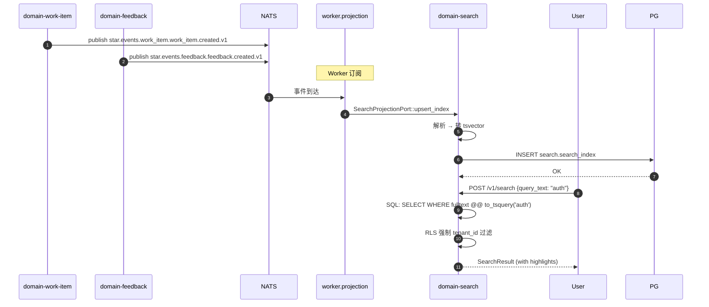

# domain-search 实施 spec

> **状态**: Draft v0.1 (2026-08-25)
> **上游依赖**:
> - 《Requirements》§12, REQ-SEARCH-001
> - 《Basic Design》§2.1(表 14), §5.7
> - 《API Design》§3.11
> - 《Data Design》§4.10 (`search` schema)
> - 《Security Design》§3.1-3.4
> **下游交付**: Implementation team — Rust crate 路径 `crates/domain-search/`
> **最后审稿**: 待 RFC 化时

---

## 1. 职责与边界

`domain-search` 承载**全文 / 符号检索 Projection**(§12,REQ-SEARCH-001)。**不得成为业务事实源**,仅作为派生视图(§2.1 表 14 注 4)。

**属于本 crate 的**:
- SearchIndex Projection(从各 Module 异步同步)
- SearchQuery 查询接口
- SavedSearch 用户保存搜索
- 全文检索 + Symbol 检索(由 `domain-development` SymbolIndex 同步)

**不属于本 crate 的**:
- 任何业务聚合根(本 Module 是 Projection,只读)
- SymbolIndex 实体本身(由 `domain-development` 拥有,本 Module 仅消费)
- 业务事件触发(由 Worker 异步同步)

## 2. 关键实体

引用 data-design §4.10 (`search` schema):

**SearchIndex**(Projection,只读)
- `index_id`, `tenant_id`, `project_id`
- 资源类型: `resource_type`(WorkItem / Comment / Project / Symbol / Feedback)
- 资源 ID: `resource_id`
- 全文: `fulltext`(tsvector,PostgreSQL `to_tsvector`)
- 符号: `symbol_metadata`(name, kind, signature, file_path)
- 元数据: `tags[]`, `created_at`, `updated_at`
- 投影版本: `version`(乐观并发)

**SearchQuery**(值对象)
- `query_text`, `filter: HashMap<String, Value>`, `sort`, `limit`, `offset`
- `user_id`(用于个性化)

**SearchResult**(DTO)
- `total: u64`, `items: Vec<SearchHit>`, `facets: HashMap<String, Vec<Facet>>`

**SearchHit**(DTO)
- `resource_type`, `resource_id`, `score`, `highlights: HashMap<String, String>`

**SavedSearch**(聚合根)
- `saved_search_id`, `tenant_id`, `user_id`, `name`, `query: SearchQuery`, `created_at`

## 3. 关键不变量

| ID | 不变量 | 上游依据 |
|---|---|---|
| INV-S-01 | **Search 不得成为业务事实源**(REQ-SEARCH-001 强约束) | basic-design §2.1 表 14 注 4, §12 |
| INV-S-02 | SearchIndex 由 Worker 异步投影,**不**由业务事务直接写 | basic-design §5.7, §2.1 |
| INV-S-03 | SearchIndex 必带 tenant_id,跨 tenant 拒绝 | basic-design §6.1 |
| INV-S-04 | SearchQuery 7 天滞后 SoR(§5.8 草案) | basic-design §5.8 |
| INV-S-05 | SavedSearch 仅本人可读 / 改 / 删(私有) | data-design §4.10 |
| INV-S-06 | Search 严格只读 Projection,POST /v1/search 不写新业务数据 | api-design §3.11, REQ-SEARCH-001 |

## 4. 接口签名

继承 api-design §3.11。

```rust
// crates/domain-search/src/port.rs

pub trait SearchQueryPort {
    /// 全文检索
    async fn search(&self, q: SearchQuery, viewer: ActorContext) -> Result<SearchResult, SearchError>;
    /// 自动补全
    async fn suggest(&self, query_text: String, viewer: ActorContext) -> Result<Vec<String>, SearchError>;
    /// 最近搜索
    async fn recent(&self, viewer: ActorContext) -> Result<Vec<SearchQuery>, SearchError>;
}

pub trait SavedSearchCommandPort {
    async fn save(&self, cmd: SaveSearchCommand, actor: ActorContext) -> Result<SavedSearchId, SearchError>;
    async fn delete_saved(&self, id: SavedSearchId, actor: ActorContext) -> Result<(), SearchError>;
}

pub trait SavedSearchQueryPort {
    async fn list_saved(&self, viewer: ActorContext) -> Result<Vec<SavedSearch>, SearchError>;
}

/// Worker Projection Port(由 worker 调用,非业务 Path)
pub trait SearchProjectionPort {
    async fn upsert_index(&self, entry: SearchIndexEntry) -> Result<(), SearchError>;
    async fn delete_index(&self, resource_type: String, resource_id: String, tenant_id: TenantId) -> Result<(), SearchError>;
}
```

## 5. Domain Events

**本 Module 不发布业务 Domain Event**,仅作为**订阅者**接收各 Module 事件并更新 SearchIndex。

**订阅者**:
- `star.events.work_item.work_item.created.v1` → upsert Index
- `star.events.work_item.work_item.status_changed.v1` → upsert Index
- `star.events.comment.comment.created.v1` → upsert Index
- `star.events.feedback.feedback.created.v1` → upsert Index
- `star.events.development.symbol_index.refreshed.v1` → upsert Symbol Index
- `star.events.audit.ai_retention.purged.v1` → 可能触发 Purge 索引

**发布**:
- `star.events.search.index.refreshed.v1`(Worker 周期刷新完成)

## 6. 数据所有权

引用 data-design §4.10(`search` schema):

- `search.search_index`(Projection,Worker 写入)
- `search.saved_search`(聚合根)

**RLS 策略**:
- 全部启用 RLS,`USING (current_setting('app.current_tenant_id') = tenant_id)`
- SavedSearch 额外:`AND user_id = current_setting('app.current_user_id')`

**索引策略**:
- `search.search_index` GIN(to_tsvector('english', fulltext)) — 全文
- `search.search_index(resource_type, resource_id)` UNIQUE
- `search.search_index(tenant_id, resource_type, updated_at DESC)` — 列表
- `search.saved_search(user_id, created_at DESC)`

## 7. 鉴权与授权

**Permission 字符串**:
- `search:query`

**内置 Role**:
- `tenant_admin` / `project_admin` / `developer` / `viewer` — 全部 `search:query`
- SavedSearch 仅本人(`user_id` 强制)

## 8. 错误码

| 错误码 | HTTP | 触发条件 |
|---|---|---|
| `SEC-001/002/007` | 401/403/403 | 鉴权类 |
| `S-001` | 422 | SearchQuery 语法非法 |
| `S-002` | 404 | SavedSearch 不存在 |
| `S-003` | 403 | 非本人访问 SavedSearch |
| `S-004` | 422 | Search 超时(限流) |

## 9. 实施任务分解

| 任务 | 描述 | 依赖 | TBD-MEASURE | 估算 |
|---|---|---|---|---|
| T1 | SearchIndex + SavedSearch 实体 | 无 | — | 80K tokens |
| T2 | `SearchQueryPort` 3 个方法 + 错误码 | T1 | — | 100K tokens |
| T3 | `SavedSearchCommandPort` 2 个方法 | T1, T2 | — | 60K tokens |
| T4 | `SavedSearchQueryPort` 1 个方法 | T1-T3 | — | 40K tokens |
| T5 | `SearchProjectionPort` 2 个方法(Worker 异步) | T1 | data-design §4.10 | 80K tokens |
| T6 | PostgreSQL 全文索引(GIN + tsvector) | T1 | data-design §4.10 | 80K tokens |
| T7 | SymbolIndex 同步(从 `domain-development` 接收) | T5 | basic-design §21.2 | 100K tokens |
| T8 | SavedSearch 私有(user_id 强制) | T3 | data-design §4.10 | 40K tokens |
| T9 | 单元测试 + RLS 测试 + Projection 滞后性测试 | T1-T8 | security-design §3.5.4 | 100K tokens |
| T10 | 集成测试:Cross-Module 投影 → 全文检索 → Symbol 检索 | T9 | api-design §3.11 | 80K tokens |

**合计估算**: ~760K tokens ≈ 3 人·天(AI 协作模式)

## 10. 验收标准(AC)

```gherkin
Feature: 全文与符号检索

  Scenario: 全文检索 WorkItem
    Given 索引含 WorkItem "重构 Authentication"
    When POST /v1/search {query_text: "auth"}
    Then 返回含 "重构 Authentication" 的 WorkItem 列表

  Scenario: 符号检索
    Given SymbolIndex 含 `authenticate_user` function
    When POST /v1/search {query_text: "authenticate_user", resource_types: [Symbol]}
    Then 返回 Symbol Hit

  Scenario: SavedSearch 私有
    Given User U1 创建 SavedSearch SS1
    When User U2 尝试 GET /v1/search/saved/{SS1}
    Then 403 S-003 (非本人)

  Scenario: 跨 Tenant 搜索
    Given User U (Tenant X) 搜索
    When 返回结果含 Tenant Y 资源
    Then RLS 过滤为 0 行

  Scenario: Search 不写业务数据
    Given POST /v1/search 包含 result_id 引用
    When 执行
    Then 仅返回检索结果,不修改任何业务聚合

  Scenario: Projection 滞后
    Given WorkItem W1 在 T0 创建
    And Search Worker 每 5 min 同步
    When T0 + 1min 查询
    Then 不一定可见(7 天滞后上限内)
```

## 11. 风险与缓解

| Risk | 影响 | 缓解 | 引用 |
|---|---|---|---|
| Search 误用作 SoR | High | INV-S-01 强约束 + UI/Backend 显式提示 | basic-design §12, REQ-SEARCH-001 |
| 跨 Tenant 越权搜索 | Critical | RLS 强制 + 7 天滞后 | basic-design §6.1 |
| 全文索引过大 | Medium | GIN 索引 + 周期重建 | data-design §8 |
| Symbol 同步滞后 | Medium | Worker 周期刷新 + 增量更新 | basic-design §21.2 |

## 12. Open Issues

- J-S-01: 是否引入 OpenSearch / Elasticsearch 替代 PostgreSQL GIN?(§30.6 排除,目前 PG GIN)
- J-S-02: SavedSearch 是否支持团队共享?(目前仅私有)
- J-S-03: Symbol 检索是否支持 LSP-style 自动补全?(V1 候选)
- J-S-04: Search 7 天滞后是否可由 Tenant Policy 调整?(目前固定)

## 附录 A:关键流程时序图 — 跨 Module 投影 + 全文检索



## 附录 B:边界清单

| 边界类型 | 本 Module 行为 |
|---|---|
| 上游依赖 | 无业务依赖(Worker 投影各 Module 事件) |
| 下游调用 | 无(本 Module 是终态 Projection) |
| 跨域事务 | 无(Worker 异步投影,与业务事务解耦) |
| RLS 强制 | 全部 PG 表启用 RLS,SavedSearch 额外 user_id 强制 |
| 13 类 tenant_id 对象 | 间接覆盖(本 Module 索引覆盖全部 13 类,但仅 Projection) |
| 14 状态 AgentSession 触发 | 间接(Search 索引 AgentSession 元数据) |
| 17 状态 Worktree 触发 | 间接 |
| WorkItem 3 态 | 间接(Search 索引 WorkItem status) |

**接口稳定承诺**:Port trait 签名 + Projection 滞后性 7 天 + SavedSearch 私有 + 4 条错误码在后续 RFC 阶段不会变更。
