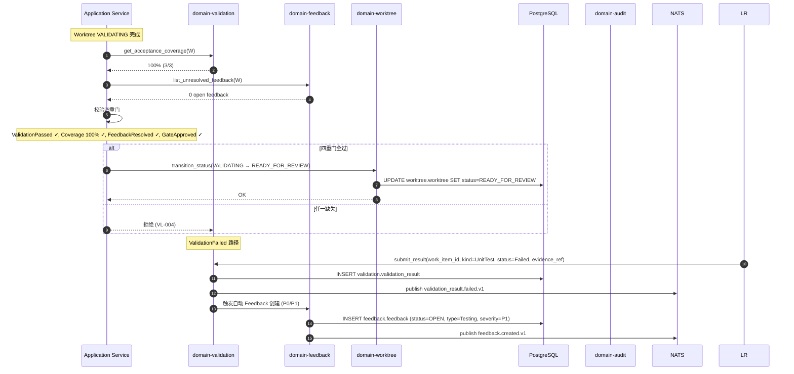

# domain-validation 实施 spec

> **状态**: Draft v0.1 (2026-08-25)
> **上游依赖**:
> - 《Requirements》§27, VAL-001
> - 《Basic Design》§2.1(表 6), §4.5, §5.7, §6.1
> - 《API Design》§3.25
> - 《Data Design》§4.24 (`validation` schema)
> - 《Security Design》§3.1-3.4
> - 《Test Design》§6.3 (验收门禁,修复 D-04 后)
> **下游交付**: Implementation team — Rust crate 路径 `crates/domain-validation/`
> **最后审稿**: 待 RFC 化时

---

## 1. 职责与边界

`domain-validation` 承载 **Validation Evidence 与 Acceptance Coverage**(§4.5),**AI 自我报告不构成完成**(VAL-001 强约束)。负责 ValidationResult 的提交、AcceptanceCoverage 派生、Validation Override 强制审批。

**属于本 crate 的**:
- ValidationResult 聚合根(6 状态,§A.5)
- AcceptanceCoverage 派生(WorkItem AcceptanceCriteria 覆盖率)
- ValidationPolicy 模板
- Evidence Object Storage(Build Log / Test Log)
- 四重门(ValidationPassed && AcceptanceCoverage==100 && FeedbackResolved && GateApproved,VAL-001)

**不属于本 crate 的**:
- Build / Test 执行(由 Local Runtime / CI 触发,本 Module 接收 ValidationResult 提交)
- WorkItem 实体(`domain-work-item` 拥有,本 Module 写 AcceptanceCoverage)
- LLM 推理

## 2. 关键实体

引用 data-design §4.24 (`validation` schema):

**ValidationResult**(聚合根,§27.1)
- 标识: `validation_id`, `tenant_id`, `project_id`
- 关联: `work_item_id`, `worktree_id`, `change_set_id`
- 类型: `kind`(Build / UnitTest / IntegrationTest / Lint / Format / StaticAnalysis / Security / Review / Custom)
- 状态: `status`(Pending / Running / Passed / Failed / Errored / Skipped,§A.5 6 状态)
- 输入: `input_metadata`(命令 / 参数)
- 输出: `output_metadata`(摘要,非全文)
- 证据: `evidence_ref`(Object Storage 引用)
- 时间: `started_at`, `ended_at`, `created_at`

**AcceptanceCoverage**(派生)
- `work_item_id`, `total_count`, `covered_count`, `coverage_percent`
- `uncovered: Vec<AcceptanceCriterionId>`
- `covered_by: HashMap<AcceptanceCriterionId, Vec<ValidationResultId>>`

**ValidationPolicy**(聚合根)
- `policy_id`, `tenant_id`, `name`
- 配置: `required_test_kinds[]`, `min_pass_rate`, `override_allow: bool`(允许人类 Override)

**ValidationOverride**(实体)
- `override_id`, `validation_id`, `reason`, `approver_user_id`, `approved_at`

## 3. 关键不变量

| ID | 不变量 | 上游依据 |
|---|---|---|
| INV-VL-01 | **AI 自我报告不构成完成**(VAL-001 P0 强约束) | basic-design §4.5.5, VAL-001, §10 接口稳定承诺 #2 |
| INV-VL-02 | **四重门必须全部通过**:`ValidationPassed && AcceptanceCoverage==100 && FeedbackResolved && GateApproved` | basic-design §4.5.5, VAL-001, **D-04 修复** |
| INV-VL-03 | **6 状态机严格迁移**(Pending / Running / Passed / Failed / Errored / Skipped,§A.5) | basic-design §A.5 |
| INV-VL-04 | ValidationResult 必带 evidence_ref(不可缺) | basic-design §4.5.5 |
| INV-VL-05 | AcceptanceCoverage 100% 是 WorkItem 进入 READY_FOR_REVIEW 的必要条件 | basic-design §4.1.9, §22.7 |
| INV-VL-06 | Override 必须人类 Protected 鉴权 + Audit | basic-design §4.5.5, security-design §3.3 |
| INV-VL-07 | 必带 tenant_id,跨 tenant 拒绝 | basic-design §6.1, REQ-SEC-001 |
| INV-VL-08 | Build Log / Test Log Object Storage Key 必带 tenant_id 前缀(13 类 #10/#11) | basic-design §6.1 |

## 4. 接口签名

继承 api-design §3.25。

```rust
// crates/domain-validation/src/port.rs

pub trait ValidationCommandPort {
    async fn submit_result(
        &self,
        cmd: SubmitValidationResultCommand,  // work_item_id, worktree_id, kind, status, evidence_ref
        actor: ActorContext,                   // Service-Internal (CI / Local Runtime)
    ) -> Result<ValidationId, ValidationError>;

    async fn override_result(
        &self,
        cmd: OverrideValidationCommand,  // validation_id, reason
        actor: ActorContext,              // Protected, 必须人类
    ) -> Result<ValidationOverride, ValidationError>;

    async fn link_to_acceptance_criterion(
        &self,
        cmd: LinkEvidenceCommand,  // ac_id, validation_id
        actor: ActorContext,
    ) -> Result<AcceptanceCoverage, ValidationError>;

    async fn create_policy(
        &self,
        cmd: CreateValidationPolicyCommand,
        actor: ActorContext,
    ) -> Result<ValidationPolicyId, ValidationError>;
}

pub trait ValidationQueryPort {
    async fn list_results(&self, q: ListValidationQuery, viewer: ActorContext) -> Result<Vec<ValidationResult>, ValidationError>;
    async fn get_result(&self, id: ValidationId, viewer: ActorContext) -> Result<ValidationResult, ValidationError>;
    async fn get_evidence_url(&self, id: ValidationId, viewer: ActorContext) -> Result<EvidenceDownloadURL, ValidationError>;
    async fn get_acceptance_coverage(&self, work_item_id: WorkItemId, viewer: ActorContext) -> Result<AcceptanceCoverageReport, ValidationError>;
    async fn list_policies(&self, actor: ActorContext) -> Result<Vec<ValidationPolicy>, ValidationError>;
}
```

## 5. Domain Events

| Subject (NATS) | 触发条件 | Payload |
|---|---|---|
| `star.events.validation.validation_result.submitted.v1` | `submit_result` 成功 | `validation_id, work_item_id, worktree_id, kind, status` |
| `star.events.validation.validation_result.passed.v1` | `Running → Passed` | `validation_id, kind, evidence_ref` |
| `star.events.validation.validation_result.failed.v1` | `Running → Failed` | `validation_id, kind, failure_summary` |
| `star.events.validation.validation_result.overridden.v1` | `override_result` 成功(Protected) | `validation_id, reason, approver_user_id` |
| `star.events.validation.acceptance_coverage.achieved.v1` | 100% 覆盖达成 | `work_item_id, total_count, covered_count` |
| `star.events.validation.feedback_required.v1` | ValidationFailed 触发 Feedback Required | `work_item_id, validation_id, intervention_queue_priority` |

**订阅者**:
- `domain-audit`(Append,全部事件)
- `domain-notification`(`failed`,`overridden`,`feedback_required`)
- `domain-feedback`(`feedback_required` 触发 Feedback 创建)
- `domain-worktree`(Worktree 状态变更:`VALIDATING → BLOCKED / READY_FOR_REVIEW`)

## 6. 数据所有权

引用 data-design §4.24(`validation` schema):

- `validation.validation_result`(聚合根,**核心聚合根**)
- `validation.acceptance_coverage`(派生,Worker 周期刷新)
- `validation.validation_policy`(聚合根)
- `validation.validation_override`(实体)
- Object Storage:`validation.build_log/{tenant_id}/{validation_id}.log`
- Object Storage:`validation.test_log/{tenant_id}/{validation_id}.log`

**RLS 策略**:
- 全部启用 RLS,`USING (current_setting('app.current_tenant_id') = tenant_id)`
- Object Storage Key 第一段 = `tenant_id`

**索引策略**:
- `validation.validation_result(work_item_id, kind, status, ended_at DESC)` — 列表
- `validation.validation_result(worktree_id, status)` — Worktree 视图
- `validation.acceptance_coverage(work_item_id)` — Acceptance 报告

## 7. 鉴权与授权

**Permission 字符串**:
- `validation:read`, `validation:override`(Protected), `validation:read_evidence`
- `validation_policy:read`, `validation_policy:create`, `validation_policy:update`

**内置 Role**:
- `tenant_admin` / `project_admin` — 全部
- `developer` — 全部(除 `validation:override` 需 Protected)
- `viewer` — 仅 `validation:read`

**Service-Internal**:`submit_result` 必为 Service-Internal(CI / Local Runtime)

## 8. 错误码

引用 api-design §8.3.5(VL- 系列):

| 错误码 | HTTP | 触发条件 |
|---|---|---|
| `SEC-001/002/007` | 401/403/403 | 鉴权类 |
| `VL-001` | 404 | ValidationResult 不存在 |
| `VL-002` | 422 | 缺 evidence_ref(VAL-001 拒绝) |
| `VL-003` | 409 | 非法 6 状态迁移 |
| `VL-004` | 409 | AI 自我报告未通过四重门(VAL-001 拒绝) |
| `VL-005` | 422 | AcceptanceCoverage < 100% 时尝试 READY_FOR_REVIEW |
| `VL-006` | 403 | 非人类尝试 override(Protected) |
| `VL-007` | 422 | 跨 Project 关联 AC(WorkItem 与 AC 不属同 Project) |

## 9. 实施任务分解

| 任务 | 描述 | 依赖 | TBD-MEASURE | 估算 |
|---|---|---|---|---|
| T1 | ValidationResult + AcceptanceCoverage + ValidationPolicy + ValidationOverride 实体 | 无 | — | 120K tokens |
| T2 | 6 状态机迁移表(§A.5) | T1 | basic-design §A.5 | 60K tokens |
| T3 | `ValidationCommandPort` 4 个方法 + 错误码 | T1, T2 | — | 150K tokens |
| T4 | `ValidationQueryPort` 5 个方法 | T1-T3 | — | 100K tokens |
| T5 | **四重门强制校验**(VAL-001 修复后,D-04 强约束) | T1 | basic-design §4.5.5, VAL-001, **D-04** | 200K tokens |
| T6 | AcceptanceCoverage 100% 派生 | T1 | basic-design §4.5.3 | 100K tokens |
| T7 | Override Protected 鉴权 + 2FA + Audit | T3 | security-design §3.3 | 80K tokens |
| T8 | Build Log / Test Log Object Storage(13 类 #10/#11) | T3 | basic-design §6.1, security-design §4.3 | 100K tokens |
| T9 | ValidationFailed → FeedbackRequired 自动触发 | T3 | basic-design §4.3.6 | 80K tokens |
| T10 | 单元测试 + 四重门负向测试(任一缺失拒绝,4 选 1 边界测试,D-04) | T1-T9 | **D-04 修复要点** | 250K tokens |
| T11 | 集成测试:Submit → Passed → Override → AcceptanceCoverage 100 | T10 | api-design §3.25 | 150K tokens |

**合计估算**: ~1.39M tokens ≈ 5.5 人·天(AI 协作模式)

## 10. 验收标准(AC)

```gherkin
Feature: Validation Evidence 与四重门

  Scenario: ValidationResult 必带 evidence
    Given Local Runtime 提交 ValidationResult
    When 缺 evidence_ref
    Then 422 VL-002 (evidence_ref 必带,VAL-001)

  Scenario: 四重门 — ValidationPassed 缺失
    Given WorkItem W 完成 ChangeSet
    And 四重门: AcceptanceCoverage=100% ✓, FeedbackResolved ✓, GateApproved ✓, ValidationPassed ✗
    When 尝试 READY_FOR_REVIEW
    Then 409 VL-004 (四重门不满足,VAL-001)

  Scenario: 四重门 — FeedbackResolved 缺失
    Given 存在 P0 OpenFeedback 未解决
    When 尝试 READY_FOR_REVIEW
    Then 409 VL-004

  Scenario: AcceptanceCoverage 100% 派生
    Given WorkItem W 有 3 个 AC,关联 3 个 ValidationResult
    When GET /v1/work-items/{W}/acceptance-coverage
    Then coverage_percent=100
    And  all AC covered

  Scenario: AcceptanceCoverage < 100%
    Given WorkItem W 有 3 个 AC,仅 2 个有 ValidationResult
    When 尝试 READY_FOR_REVIEW
    Then 422 VL-005 (未达 100%)

  Scenario: Override 需人类
    Given ValidationResult V (Failed)
    When AgentSession 尝试 POST /v1/validation-results/{V}:override
    Then 403 VL-006 (Protected 动作需人类)

  Scenario: AI 自我报告触发 Feedback
    Given ValidationResult 失败
    When 提交
    Then 自动创建 P0 Feedback(ValidationFailed 类型)
    And  Notification 通知 Intervention Queue
```

## 11. 风险与缓解

| Risk | 影响 | 缓解 | 引用 |
|---|---|---|---|
| **AI 自我报告冒充完成** | Critical | **VAL-001 + 四重门强约束**(D-04 修复负向测试) | basic-design §4.5.5, VAL-001, D-04 |
| Override 滥用 | High | Protected 鉴权 + 2FA + Audit | security-design §3.3 |
| AcceptanceCoverage 误算 | Medium | T6 派生精确公式 | basic-design §4.5.3 |
| Build/Test Log 越权 | High | Object Storage Key 强制 tenant_id 前缀 | basic-design §6.1 |
| 13 类对象漏配 | Critical | RLS + AuthorizationChecker 双重 | basic-design §6.1 |

## 12. Open Issues

- J-VL-01: Override 是否需要双签(Project Admin + Tenant Admin)?目前 Project Admin
- J-VL-02: ValidationPolicy 是否支持 per-Worktree 覆盖?(目前 per-Project)
- J-VL-03: AcceptanceCoverage 是否需要 SLA(超时降权)?(目前无)
- J-VL-04: ValidationFailed 自动创建 Feedback 的优先级策略(P0/P1/P2)?

## 附录 A:关键流程时序图 — 四重门校验与 READY_FOR_REVIEW



## 附录 B:边界清单

| 边界类型 | 本 Module 行为 |
|---|---|
| 上游依赖 | `domain-tenant`, `domain-work-item`, `domain-worktree`, `domain-change-set` (`domain-development`), `domain-feedback` |
| 下游调用 | `domain-audit`, `domain-notification`, `domain-feedback`(自动创建), `domain-worktree` |
| 跨域事务 | `submit_result` + AcceptanceCoverage 派生 + Feedback 自动创建(Application 编排) |
| RLS 强制 | 全部 PG 表启用 RLS,Build Log / Test Log Object Storage 强制 tenant_id 前缀 |
| **13 类 tenant_id 对象** | **直接覆盖 #10 Build Log**(Object Storage),#11 Test Log(Object Storage),**间接覆盖 #1/#12**(通过 WorkItem / PR) |
| 14 状态 AgentSession 触发 | **直接**:ValidationPassed 触发 AgentSession `VALIDATING → COMPLETED`,ValidationFailed 触发 `VALIDATING → FAILED` |
| 17 状态 Worktree 触发 | **直接**:ValidationPassed + 七项检查全过触发 Worktree `VALIDATING → READY_FOR_REVIEW`;ValidationFailed 触发 `VALIDATING → BLOCKED` |
| WorkItem 3 态 | **直接**:AcceptanceCoverage 100% 是 WorkItem 进入下一个状态(由 Workflow 控制)的必要条件 |

**接口稳定承诺**:Port trait 签名 + **6 状态机集合** + **四重门强约束** + Override Protected 鉴权 + 7 条错误码在后续 RFC 阶段不会变更(VAL-001 与 §10 接口稳定承诺 #2 锁定)。

## 15. 与其他 domain 协作 (v0.16 协作细化新增)

per [basic-design v0.16 §3.2.9 22 domain contact face 表](../../basic-design.md) + [ADR-0039 §D26-D32 Worktree Orchestration 跨域协作](../../architecture/2026-08-26-upgrade/adr/0039-worktree-orchestration-cross-domain.md) + [spec/saga/01 v0.2 SagaCoordinationRole](../../architecture/2026-08-26-upgrade/spec/saga/01-saga-coordination-spec.md),本节定义 `validation` 与 22 domain 中 1 个 domain 的显式接触面。

| 源 Domain | 目标 Domain | 接触方式 | 接触点 |
|---|---|---|---|
| notification | validation | Separate Ways(异步) | 监听 ValidationFailed 触发 (per REQ-NOTIF-001) |

**接触面统计**: 1 条 (v0.16 新增,本 spec 由 `scripts/inter_collab_refine.py` 批量生成)

**dual-use 警告** (per AGENTS.md §5 v0.6 + Q1-D 拍板): 5 域 (player/economy/match/social/admin) 是 RGS 仓历史治理命名,Star 仓不建立业务子域↔DDD 映射。本 spec 协作基于 22 domain crate,不通过 5 域绑定推导。
