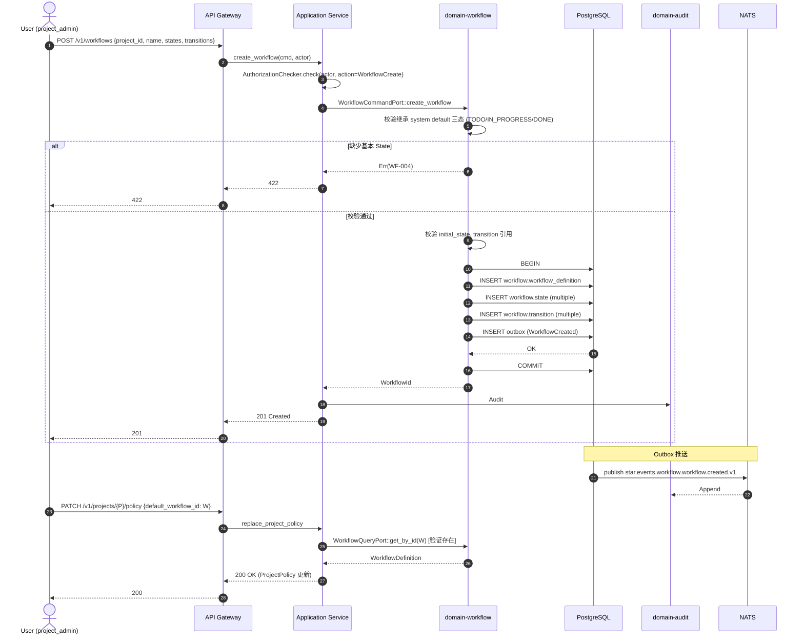

# domain-workflow 实施 spec

> **状态**: Draft v0.1 (2026-08-25)
> **上游依赖**:
> - 《Requirements》§8.2
> - 《Basic Design》§2.1(表 9), §4.9.2, §7.2
> - 《API Design》§3.6
> - 《Data Design》§4.5 (`workflow` schema)
> - 《Security Design》§3.1-3.4
> **下游交付**: Implementation team — Rust crate 路径 `crates/domain-workflow/`
> **最后审稿**: 待 RFC 化时

---

## 1. 职责与边界

`domain-workflow` 承载 WorkflowDefinition 聚合根,定义 WorkItem 的状态机(State / Transition)。WorkItem 默认三态 TODO/IN_PROGRESS/DONE 由 system default 提供;Project 可基于 WorkflowDefinition 自定义扩展(§7.2,REQ-WF-001)。

**属于本 crate 的**:
- WorkflowDefinition / State / Transition 实体的生命周期
- 默认三态(系统内置,只读)
- 自定义 Workflow 模板的创建 / 修改 / 删除

**不属于本 crate 的**:
- WorkItem 实体本身(`domain-work-item` 拥有)
- 状态迁移的执行(`domain-work-item::transition_status` 调用本 crate 查询合法性)
- Project Policy 整体(`domain-project` 拥有,本 crate 仅是其引用对象)

## 2. 关键实体

引用 data-design §4.5 (`workflow` schema):

**WorkflowDefinition**(聚合根)
- 标识: `workflow_id`, `tenant_id`, `project_id`(可空 → system default)
- 元数据: `name`, `description`, `version`, `is_system_default`
- 状态集: `state_ids[]`, `transitions[]`
- 必含: `initial_state_id`

**State**(实体)
- 标识: `state_id`, `workflow_id`, `name`(如 TODO/IN_PROGRESS/DONE/IN_REVIEW/BLOCKED/CANCELLED)
- 类别: `category`(Initial / Intermediate / Terminal)
- 视觉: `display_color`, `display_order`

**Transition**(实体)
- `transition_id`, `workflow_id`, `from_state_id`, `to_state_id`
- 守卫: `required_permission`(permission 字符串), `required_role`
- 触发: `trigger_event`(可选,事件驱动)

**SystemDefault**(平台级只读)
- 预置 3 态 TODO → IN_PROGRESS → DONE,所有 Tenant 共享

## 3. 关键不变量

| ID | 不变量 | 上游依据 |
|---|---|---|
| INV-WF-01 | system_default Workflow 不可被修改 / 删除(平台级只读) | basic-design §7.2 |
| INV-WF-02 | 每个 WorkflowDefinition 必有一个 Initial State 且唯一 | data-design §4.5 |
| INV-WF-03 | Transition 必须有 from / to,且 from ≠ to | data-design §4.5 |
| INV-WF-04 | State 名称在同一 Workflow 内 UNIQUE | data-design §4.5 |
| INV-WF-05 | 删除 WorkflowDefinition 前需级联检查 Project Policy 引用 | basic-design §5.7 |
| INV-WF-06 | 自定义 Workflow 必须继承 system default 的全部基本 State(TODO / IN_PROGRESS / DONE) | REQ-WF-001 强约束 |

## 4. 接口签名

继承 api-design §3.6。

```rust
// crates/domain-workflow/src/port.rs

pub trait WorkflowCommandPort {
    async fn create_workflow(
        &self,
        cmd: CreateWorkflowCommand,  // 含 project_id, name, states[], transitions[]
        actor: ActorContext,
    ) -> Result<WorkflowId, WorkflowError>;

    async fn update_workflow(
        &self,
        cmd: UpdateWorkflowCommand,
        actor: ActorContext,
    ) -> Result<WorkflowDefinition, WorkflowError>;

    async fn delete_workflow(
        &self,
        id: WorkflowId,
        actor: ActorContext,
    ) -> Result<(), WorkflowError>;

    async fn add_state(
        &self,
        cmd: AddStateCommand,   // workflow_id, name, category
        actor: ActorContext,
    ) -> Result<StateId, WorkflowError>;

    async fn add_transition(
        &self,
        cmd: AddTransitionCommand,  // workflow_id, from, to, required_permission?
        actor: ActorContext,
    ) -> Result<TransitionId, WorkflowError>;
}

pub trait WorkflowQueryPort {
    async fn get_by_id(&self, id: WorkflowId, actor: ActorContext) -> Result<WorkflowDefinition, WorkflowError>;
    async fn list_states(&self, workflow_id: WorkflowId, actor: ActorContext) -> Result<Vec<State>, WorkflowError>;
    async fn list_transitions(&self, workflow_id: WorkflowId, actor: ActorContext) -> Result<Vec<Transition>, WorkflowError>;
    /// 查询状态迁移合法性
    async fn validate_transition(
        &self,
        workflow_id: WorkflowId,
        from: StateId,
        to: StateId,
    ) -> Result<bool, WorkflowError>;
    async fn get_system_default(&self) -> Result<WorkflowDefinition, WorkflowError>;  // system default,无 actor
}
```

## 5. Domain Events

| Subject (NATS) | 触发条件 | Payload |
|---|---|---|
| `star.events.workflow.workflow.created.v1` | `create_workflow` 成功 | `workflow_id, project_id, is_system_default` |
| `star.events.workflow.workflow.updated.v1` | `update_workflow` 成功 | `workflow_id, version, updated_at` |
| `star.events.workflow.workflow.deleted.v1` | `delete_workflow` 成功 | `workflow_id` |
| `star.events.workflow.state.added.v1` | `add_state` 成功 | `state_id, workflow_id, name, category` |
| `star.events.workflow.transition.added.v1` | `add_transition` 成功 | `transition_id, workflow_id, from, to` |

**订阅者**:
- `domain-audit`(Append)
- `domain-search`(投影 Project 关联 Workflow 时)

## 6. 数据所有权

引用 data-design §4.5(`workflow` schema):

- `workflow.workflow_definition`(聚合根)
- `workflow.state`(实体)
- `workflow.transition`(实体)
- `workflow.system_default_workflow`(平台级只读,seed data)

**RLS 策略**:
- `workflow.workflow_definition`:`USING (current_setting('app.current_tenant_id') = tenant_id OR is_system_default=true)`
- `workflow.state` / `workflow.transition`:`JOIN workflow_id` 走相同 RLS
- `workflow.system_default_workflow`:禁用 RLS(平台级共享)

**索引策略**:
- `workflow.workflow_definition(project_id)` UNIQUE(同 Project 仅一个有效 Workflow)
- `workflow.workflow_definition(tenant_id, is_system_default)` 用于 system default 查询
- `workflow.state(workflow_id, name)` UNIQUE

## 7. 鉴权与授权

引用 security-design §3.1-3.4:

**Permission 字符串**:
- `workflow:read`, `workflow:create`, `workflow:update`, `workflow:delete`

**内置 Role 覆盖**:
- `tenant_admin` — 全部
- `project_admin` — 全部(本 Project 范围)
- `developer` / `viewer` — 仅 `workflow:read`

**特殊约束**:
- `system_default` Workflow 任何修改尝试 → 403 `WF-005`
- 删除 WorkflowDefinition 需 Protected(`workflow:delete` + project_admin)

## 8. 错误码

| 错误码 | HTTP | 触发条件 |
|---|---|---|
| `SEC-001` / `SEC-002` / `SEC-007` | 401/403/403 | 鉴权类 |
| `WF-001` | 404 | WorkflowDefinition 不存在 |
| `WF-002` | 422 | Workflow 必须包含 initial_state |
| `WF-003` | 409 | 同一 Workflow 内 State 名称重复 |
| `WF-004` | 422 | 自定义 Workflow 缺少 system default 基本 State |
| `WF-005` | 403 | 尝试修改 system_default Workflow |
| `WF-006` | 409 | WorkflowDefinition 被 ProjectPolicy 引用,删除拒绝 |
| `WF-007` | 422 | Transition from == to |
| `WF-008` | 422 | Transition 引用不存在的 State |

## 9. 实施任务分解

| 任务 | 描述 | 依赖 | TBD-MEASURE | 估算 |
|---|---|---|---|---|
| T1 | WorkflowDefinition + State + Transition 实体 + Value Object | 无 | — | 80K tokens |
| T2 | `WorkflowCommandPort` 5 个方法 + 错误码 | T1 | — | 100K tokens |
| T3 | `WorkflowQueryPort` 5 个方法(包含 `validate_transition`) | T1, T2 | — | 80K tokens |
| T4 | system_default Workflow seed data(3 态 TODO/IN_PROGRESS/DONE) | T1 | basic-design §7.2 | 40K tokens |
| T5 | 自定义 Workflow 继承 system default 校验(INV-WF-06) | T2 | data-design §4.5 | 60K tokens |
| T6 | 级联删除检查(Project Policy 引用) | T2 | basic-design §5.7 | 60K tokens |
| T7 | 单元测试 + RLS 测试 + 状态机迁移测试 | T1-T6 | security-design §3.5.4 | 150K tokens |
| T8 | 集成测试:创建自定义 Workflow → 关联 Project → WorkItem 使用 | T7 | api-design §3.6 | 100K tokens |

**合计估算**: ~670K tokens ≈ 3 人·天(AI 协作模式)

## 10. 验收标准(AC)

```gherkin
Feature: Workflow 定义与状态机

  Scenario: 创建自定义 Workflow
    Given 用户是 project_admin
    When POST /v1/workflows {project_id, name, states: [TODO, IN_PROGRESS, IN_REVIEW, DONE], transitions}
    Then 201 Created {workflow_id}
    And  Workflow 继承 system default 三态 TODO/IN_PROGRESS/DONE
    And  自定义 IN_REVIEW 状态已添加

  Scenario: 修改 system_default Workflow 被拒绝
    Given system_default Workflow
    When 任何用户尝试 PATCH /v1/workflows/{system_default}
    Then 403 WF-005 (system_default 只读)

  Scenario: 状态机迁移合法性校验
    Given Workflow W 含 transition (IN_PROGRESS, IN_REVIEW)
    And Workflow W 不含 transition (IN_REVIEW, DONE)
    When validate_transition(W, IN_REVIEW, DONE)
    Then 返回 false (非法迁移)
    When validate_transition(W, IN_PROGRESS, IN_REVIEW)
    Then 返回 true

  Scenario: 删除被 ProjectPolicy 引用
    Given Workflow W 被 Project P 的 default_workflow_id 引用
    When DELETE /v1/workflows/{W}
    Then 409 WF-006 (Project 仍引用)
    And  Workflow 未被删除

  Scenario: 跨 Tenant 访问
    Given User U (Tenant X) 访问 Workflow W (Tenant Y)
    When GET /v1/workflows/{W}
    Then 403 SEC-007
```

## 11. 风险与缓解

| Risk | 影响 | 缓解 | 引用 |
|---|---|---|---|
| 自定义 Workflow 失去"默认三态"硬约束 | High | INV-WF-06 强制,创建校验 | REQ-WF-001 |
| 状态机循环迁移 / 不可达 | Medium | validate_transition 提供 DAG 校验(后续 RFC) | data-design §4.5 |
| system_default 误改 | Critical | DB 角色无 UPDATE 权限,应用层 WF-005 拒绝 | basic-design §0.3 |
| 删除被 Project 引用 | Medium | INV-WF-05 级联检查 | basic-design §5.7 |

## 12. Open Issues

- J-WF-01: WorkflowDefinition 是否支持版本化(Workflow v1 / v2,WorkItem 引用固定版本)?目前单版本
- J-WF-02: Transition 是否支持条件(IF WorkItem.priority = P0)?目前仅 required_permission
- J-WF-03: system_default 是否暴露给 Tenant Admin 修改(深度定制)?目前平台级只读
- J-WF-04: Workflow 是否支持 Marketplace(平台预置模板 + Tenant 自定义)?目前不支持

## 附录 A:关键流程时序图 — 自定义 Workflow 创建与 Project 引用



## 附录 B:边界清单

| 边界类型 | 本 Module 行为 |
|---|---|
| 上游依赖 | 无核心依赖(system_default 由本 crate seed) |
| 下游调用 | `domain-audit`, `domain-search`(投影) |
| 跨域事务 | `replace_project_policy` 时由 `domain-project` 查询本 crate(Application 编排) |
| RLS 强制 | `workflow.workflow_definition` / `workflow.state` / `workflow.transition` 启用 RLS,`system_default_workflow` 禁用 RLS(平台级) |
| 13 类 tenant_id 对象 | 间接覆盖(WorkflowDefinition 必带 tenant_id) |
| 14 状态 AgentSession 触发 | 无 |
| 17 状态 Worktree 触发 | 无 |
| WorkItem 3 态 | **本 Module 拥有 system_default 三态**(TODO/IN_PROGRESS/DONE),自定义扩展由 Project Policy 引用本 crate WorkflowDefinition |

**接口稳定承诺**:Port trait 签名 + 8 条错误码 + 6 条不变量 + system default 三态结构在后续 RFC 阶段不会变更。

## 15. 与其他 domain 协作 (v0.16 协作细化新增)

per [basic-design v0.16 §3.2.9 22 domain contact face 表](../../basic-design.md) + [ADR-0039 §D26-D32 Worktree Orchestration 跨域协作](../../architecture/2026-08-26-upgrade/adr/0039-worktree-orchestration-cross-domain.md) + [spec/saga/01 v0.2 SagaCoordinationRole](../../architecture/2026-08-26-upgrade/spec/saga/01-saga-coordination-spec.md),本节定义 `workflow` 与 22 domain 中 5 个 domain 的显式接触面。

| 源 Domain | 目标 Domain | 接触方式 | 接触点 |
|---|---|---|---|
| project | workflow | Customer-Supplier | Project.workflow_definition_id 引用 |
| workflow | work-item | Customer-Supplier | WorkflowDefinition → state machine (per REQ-WF-001) |
| workflow | permission | Customer-Supplier | Transition Guard (RequireRole/RequireValidation/RequireApproval, per REQ-WF-003) |
| automation | workflow | Customer-Supplier | AutomationRule 走 Workflow Guard 校验,不可绕过 (per REQ-AUTO-003 批量操作派生) |

**接触面统计**: 4 条 (v0.16 新增,本 spec 由 `scripts/inter_collab_refine.py` 批量生成)

**dual-use 警告** (per AGENTS.md §5 v0.6 + Q1-D 拍板): 5 域 (player/economy/match/social/admin) 是 RGS 仓历史治理命名,Star 仓不建立业务子域↔DDD 映射。本 spec 协作基于 22 domain crate,不通过 5 域绑定推导。
