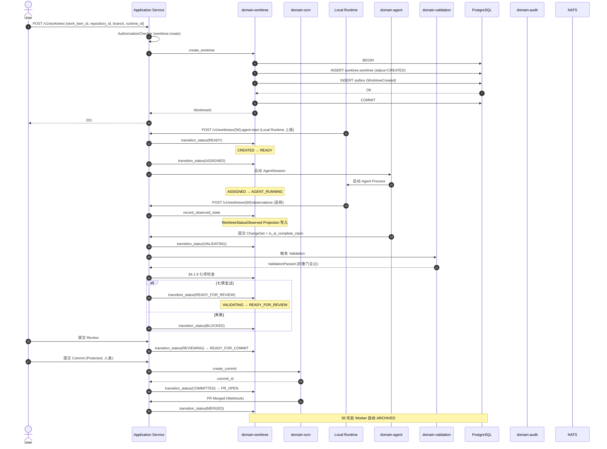

# domain-worktree 实施 spec

> **状态**: Draft v0.1 (2026-08-25)
> **上游依赖**:
> - 《Requirements》§22, WT-001~003, REQ-WF-002, REQ-DEV-001/002
> - 《Basic Design》§2.1(表 2), §4.1, §7.1, §5.7, §6.1
> - 《API Design》§3.21 (17 状态迁移端点)
> - 《Data Design》§4.20 (`worktree` schema)
> - 《Security Design》§3.1-3.4, §3.5.3
> **下游交付**: Implementation team — Rust crate 路径 `crates/domain-worktree/`
> **最后审稿**: 待 RFC 化时

---

## 1. 职责与边界

`domain-worktree` 是 Vibe Coding 并行执行的**隔离边界**与**一级领域对象**(§22,REQ-WT-001~003,ADR-016)。Worktree **不**是 Repository Metadata 或 Branch 的附属字段,需承载 Status / Health / ConflictState / Ahead / Behind 等独立状态。

**属于本 crate 的**:
- Worktree 聚合根(17 个状态,§7.1)
- WorktreeStatusObserved(高频本地状态 Projection,§22.1)
- WorktreeConflict 实体(File-level / Symbol-level)
- WorktreeReconciliationState 值对象
- Conflict Intelligence(File-level 第一阶段,§22.4)
- Worktree Heatmap(派生)

**不属于本 crate 的**:
- Repository / Branch / Commit(`domain-scm` 拥有)
- ChangeSet / DevelopmentExecution(`domain-development` 拥有)
- AgentSession 实体(`domain-agent` 拥有,Worktree 仅以 worktree_id 引用)

## 2. 关键实体

引用 data-design §4.20 (`worktree` schema):

**Worktree**(聚合根)
- 标识: `worktree_id`, `tenant_id`, `workspace_id`, `project_id`, `work_item_id`
- 关联: `repository_id`, `branch`, `base_branch`, `development_execution_id`
- 物理: `runtime_id`(LocalRuntime / SelfHostedRunner / CloudWorkspace), `local_path_reference`(由 Local Runtime 解释,平台不可信)
- 角色: `owner_user_id`, `assigned_agent_id`(可选), `current_agent_session_id`(可选)
- 状态: `status`, `health`, `dirty_state`, `conflict_state`, `ahead`, `behind`
- 内容: `changed_files[]`, `changed_symbols[]`, `test_state`, `build_state`
- 协调: `context_state`, `feedback_state`, `synchronization_state`, `last_activity_at`

**WorktreeStatusObserved**(Projection,§22.1)
- 高频本地状态: dirty_state, ahead, behind, test_state, build_state
- 时间: `last_observed_at`
- 标识: `worktree_id`, `sequence`, `payload_version`

**WorktreeConflict**(实体,§22.4)
- 标识: `conflict_id`, `worktree_id`
- 范围: `repository_id`, `file_paths[]`, `conflict_kind`(File-level / Symbol-level)
- 严重: `risk_level`(None / Low / Medium / High)
- 状态: `detected_at`, `resolved_at?`

**WorktreeReconciliationState**(值对象,§22.6)
- `runtime_id`, `desired_state_version`, `observed_state_version`, `deviations: Vec<Deviation>`

## 3. 关键不变量

| ID | 不变量 | 上游依据 |
|---|---|---|
| INV-WT-01 | **Status Independence**:Worktree.status 与 WorkItem.status 独立,可同时存在任意组合 | basic-design §7.1, REQ-WF-002 |
| INV-WT-02 | **17 状态机严格迁移**(§7.1 接口稳定承诺) | basic-design §7.1, §10 接口稳定承诺 #5 |
| INV-WT-03 | **Runtime Anchor**:每个 Worktree 必绑一个 Runtime(Local / Self-hosted / Cloud) | basic-design §4.1.5 |
| INV-WT-04 | **Local Path Opacity**:平台不直接读 `local_path_reference`,仅 Local Runtime 可信 | basic-design §4.1.5 |
| INV-WT-05 | **Reconciliation Required**:Local Runtime 重连后必须 Reconcile Desired ↔ Observed | basic-design §4.1.8, §45 |
| INV-WT-06 | **Completion Gate**:进入 `READY_FOR_REVIEW` 需通过 §4.1.9 七项检查 | basic-design §4.1.9 |
| INV-WT-07 | 1 WorkItem → 0/1/N Worktree;1 Worktree → 0..N AgentSession | REQ-DEV-001/002 |
| INV-WT-08 | Worktree 必带 tenant_id,跨 tenant 拒绝 | basic-design §6.1, REQ-SEC-001 |
| INV-WT-09 | **Worktree Isolation**(§22.5):Filesystem / Env / Build / Dependency Cache / Agent Memory / Secret / Port / Process / Temp File | basic-design §4.1.7, ARCH-OBL-DEV-001 |
| INV-WT-10 | **Stale Display**:UI 区分 Current(< 60s) / Possibly Stale(60-300s) / Offline(≥ 300s) / Unknown(< 60s 启动) | basic-design §4.1.5, §23.4 |

## 4. 接口签名

继承 api-design §3.21。

```rust
// crates/domain-worktree/src/port.rs

pub trait WorktreeCommandPort {
    async fn create_worktree(
        &self,
        cmd: CreateWorktreeCommand,  // work_item_id, repository_id, branch, runtime_id
        actor: ActorContext,
    ) -> Result<WorktreeId, WorktreeError>;

    async fn assign_to_agent(
        &self,
        cmd: AssignWorktreeCommand,   // agent_id, agent_session_id
        actor: ActorContext,
    ) -> Result<(), WorktreeError>;

    async fn record_observed_state(
        &self,
        cmd: RecordObservedStateCommand, // dirty_state, ahead, behind, current_agent_session_id
        actor: ActorContext,             // 必须是 Local Runtime
    ) -> Result<(), WorktreeError>;

    async fn transition_status(
        &self,
        cmd: TransitionStatusCommand,    // from, to, reason
        actor: ActorContext,
    ) -> Result<WorktreeStatus, WorktreeError>;  // 17 状态之一

    async fn abandon(
        &self,
        cmd: AbandonCommand,             // reason
        actor: ActorContext,
    ) -> Result<(), WorktreeError>;
}

pub trait WorktreeQueryPort {
    async fn get_by_id(&self, id: WorktreeId, viewer: ActorContext) -> Result<Worktree, WorktreeError>;
    async fn list_by_work_item(&self, work_item_id: WorkItemId, viewer: ActorContext) -> Result<Vec<WorktreeSummary>, WorktreeError>;
    async fn list_by_agent(&self, agent_id: AgentId, viewer: ActorContext) -> Result<Vec<WorktreeSummary>, WorktreeError>;
    async fn detect_conflicts(&self, worktree_id: WorktreeId, viewer: ActorContext) -> Result<Vec<WorktreeConflict>, WorktreeError>;
    async fn heatmap(&self, repository_id: RepositoryId, viewer: ActorContext) -> Result<WorktreeHeatmap, WorktreeError>;
}
```

## 5. Domain Events

| Subject (NATS) | 触发条件 | Payload |
|---|---|---|
| `star.events.worktree.worktree.created.v1` | `create_worktree` 成功 | `worktree_id, work_item_id, runtime_id, repository_id, branch` |
| `star.events.worktree.worktree.assigned.v1` | `assign_to_agent` 成功 | `worktree_id, agent_id, agent_session_id` |
| `star.events.worktree.worktree.status_observed.v1` | `record_observed_state` 成功 | `worktree_id, dirty_state, ahead, behind, last_observed_at` |
| `star.events.worktree.worktree.status_changed.v1` | `transition_status` 成功 | `worktree_id, from, to, reason` |
| `star.events.worktree.worktree.dirty_state_changed.v1` | dirty_state 变化 | `worktree_id, dirty_state, changed_files[]` |
| `star.events.worktree.worktree.conflict_detected.v1` | `detect_conflicts` 发现 | `worktree_id, file_paths[], risk_level` |
| `star.events.worktree.worktree.abandoned.v1` | `abandon` 成功 | `worktree_id, reason, abandoned_at` |

**订阅者**:
- `domain-audit`(Append,全部事件)
- `domain-validation`(`VALIDATING` 状态触发 Validation)
- `domain-collaboration`(Realtime 推送,§2.1 表 24)
- `domain-notification`(`conflict_detected`,`abandoned`)

## 6. 数据所有权

引用 data-design §4.20(`worktree` schema):

- `worktree.worktree`(聚合根,**核心聚合根**)
- `worktree.worktree_status_observed`(Projection,30 天热数据)
- `worktree.worktree_conflict`(实体)
- `worktree.worktree_reconciliation_state`(值对象,内嵌 / 独立按需)

**RLS 策略**:
- 全部启用 RLS,`USING (current_setting('app.current_tenant_id') = tenant_id)`

**索引策略**(data-design §8):
- `worktree.worktree(work_item_id, status)` — 列表
- `worktree.worktree(runtime_id, status)` — Runtime 视图
- `worktree.worktree(repository_id, status)` — Repository 视图
- `worktree.worktree_status_observed(worktree_id, last_observed_at DESC)` — 最新状态
- `worktree.worktree_conflict(worktree_id, detected_at DESC)`

## 7. 鉴权与授权

引用 security-design §3.7(Worktree 操作授权表):

**Permission 字符串**:
- `worktree:read`, `worktree:create`, `worktree:update`, `worktree:delete`
- `worktree:assign`, `worktree:commit`, `worktree:abandon`, `worktree:block`, `worktree:unblock`, `worktree:resolve_conflict`
- `review:create`, `commit:create`(Protected)

**内置 Role**:
- `tenant_admin` / `project_admin` — 全部
- `developer` — 全部(除 commit 需 Protected)
- `viewer` — 仅 read

**Service-Internal 触发**:
- `transition_status` 的多数迁移(AGENT_RUNNING → VALIDATING 等)由 Application 触发,Service-Internal

## 8. 错误码

引用 api-design §8.3.1(WT- 系列):

| 错误码 | HTTP | 触发条件 |
|---|---|---|
| `SEC-001/002/005/006/007` | 401/403/403 | 鉴权 / Cross-Repo / Cross-Worktree / Cross-Tenant |
| `WT-001` | 422 | Worktree 必带 Runtime |
| `WT-002` | 409 | 非法状态迁移(17 状态机外) |
| `WT-003` | 422 | Completion Gate §4.1.9 七项检查未全通过 |
| `WT-004` | 404 | Worktree 不存在 |
| `WT-005` | 409 | Worktree 仍有未合并 ChangeSet |
| `WT-006` | 403 | Stale Display:Observed State 已超时,UI 提示不可信 |
| `WT-007` | 422 | Worktree Isolation 检查失败(Filesystem Scope 等) |
| `WT-009` | 403 | 尝试 abandon 但 Policy 拒绝(Protected) |
| `AGT-002/005/006/007/008/009` | 403/422 | Agent 越权(Repository / Tool / Path / Runtime / Context / Change Scope) |

## 9. 实施任务分解

| 任务 | 描述 | 依赖 | TBD-MEASURE | 估算 |
|---|---|---|---|---|
| T1 | Worktree 聚合根 + 17 状态枚举 + 状态机迁移表 | 无 | — | 150K tokens |
| T2 | `WorktreeCommandPort` 5 个方法 + 错误码 | T1 | — | 180K tokens |
| T3 | `WorktreeQueryPort` 5 个方法 | T1, T2 | — | 100K tokens |
| T4 | WorktreeStatusObserved Projection(高频写,30 天热数据) | T1 | data-design §4.20 | 120K tokens |
| T5 | WorktreeConflict + File-level Detection | T1 | basic-design §4.1.6, §22.4 | 200K tokens |
| T6 | WorktreeReconciliation(Desired ↔ Observed 比对) | T2 | basic-design §4.1.8, §22.6 | 150K tokens |
| T7 | Worktree Isolation 检查(Filesystem / Env / Process 等 9 项) | T2 | basic-design §4.1.7, ARCH-OBL-DEV-001 | 180K tokens |
| T8 | Completion Gate §4.1.9 七项检查 | T2 | basic-design §4.1.9 | 200K tokens |
| T9 | Stale Display 状态计算(last_observed_at) | T4 | basic-design §23.4 | 60K tokens |
| T10 | Worktree Heatmap 派生 | T5 | basic-design §4.1.6 | 150K tokens |
| T11 | 单元测试 + 17 状态全覆盖测试 + 隔离测试 | T1-T10 | security-design §3.5.4 | 250K tokens |
| T12 | 集成测试:Create → Assign → Agent Run → Validate → Commit | T11 | api-design §3.21 | 200K tokens |

**合计估算**: ~1.94M tokens ≈ 8 人·天(AI 协作模式)

## 10. 验收标准(AC)

```gherkin
Feature: Worktree 生命周期与状态机

  Scenario: 创建 Worktree 必带 Runtime
    Given WorkItem W, Repository R
    When POST /v1/worktrees {work_item_id: W, repository_id: R, branch: "feat", runtime_id: null}
    Then 422 WT-001 (Runtime 必带)

  Scenario: 17 状态严格迁移
    Given Worktree WT (status=CREATED)
    When transition_status(WT, READY)
    Then 200 OK
    When transition_status(WT, MERGED)  // 非法(跳过中间状态)
    Then 409 WT-002

  Scenario: Completion Gate 七项检查
    Given Worktree WT (status=VALIDATING)
    And 七项检查中 Critical Feedback 未解决
    When transition_status(WT, READY_FOR_REVIEW)
    Then 409 WT-003 (Completion Gate 失败)

  Scenario: Worktree Isolation 检查
    Given AgentSession 在 Worktree A
    When 尝试 read Worktree B 的 local_path_reference
    Then 403 SEC-006 (Cross-Worktree Forbidden)

  Scenario: Stale Display
    Given Worktree WT last_observed_at = 5 min ago
    When UI 读取状态
    Then 标记 "Possibly Stale" (60-300s 区间)

  Scenario: Worktree Status 独立于 WorkItem
    Given WorkItem W (status=IN_PROGRESS)
    And Worktree A (status=AGENT_RUNNING), B (BLOCKED), C (REVIEWING)
    When 任意组合同时存在
    Then 200 OK (全部合法,REQ-WF-002 强约束)
```

## 11. 风险与缓解

| Risk | 影响 | 缓解 | 引用 |
|---|---|---|---|
| Cross-Worktree Context Leakage | High | INV-WT-09 + Local Runtime 强制 | basic-design §4.1.7, RISK-019, ARCH-OBL-DEV-001 |
| Worktree 状态不一致 | High | Reconciliation Protocol | basic-design §4.1.8, RISK-022 |
| Completion Gate 误判 | Medium | 七项检查全过 + 7 天冷却 | basic-design §4.1.9 |
| Worktree 数量爆炸 | Medium | Heatmap 投影优化 | basic-design §4.1.6 |
| 13 类对象漏配 | Critical | RLS + AuthorizationChecker 双重 | basic-design §6.1 |

## 12. Open Issues

- J-WT-01: Symbol-level Conflict Detection 何时 V1 引入?(目前 File-level,§30.3)
- J-WT-02: 1 Worktree → N AgentSession 是否支持并发?(目前 1 Active,§22.1)
- J-WT-03: Worktree 是否支持跨 Repository?(目前 1 Worktree → 1 Repository,§22)
- J-WT-04: Stale Display 阈值(60s/300s)是否可由 Project Policy 调整?(目前硬编码)

## 附录 A:关键流程时序图 — Worktree 创建到 MERGED 全状态机



## 附录 B:边界清单

| 边界类型 | 本 Module 行为 |
|---|---|
| 上游依赖 | `domain-tenant`, `domain-workspace`, `domain-project`, `domain-work-item`, `domain-scm`, `domain-local-runtime` |
| 下游调用 | `domain-audit`, `domain-validation`, `domain-collaboration`, `domain-notification`, `domain-agent` |
| 跨域事务 | `create_worktree` + SCM 提交 + Validation 编排(Application 单事务) |
| RLS 强制 | 全部 PG 表启用 RLS,本地路径不存 PG(仅 Local Runtime 引用) |
| **13 类 tenant_id 对象** | **直接覆盖 #3 Worktree**(聚合根),间接 #1/#12(Repository / PR 引用) |
| 14 状态 AgentSession 触发 | **直接**:Worktree 分配 AgentSession(assigned_agent_id),AGENT_RUNNING 状态由 AgentSession 启动触发 |
| **17 状态 Worktree 触发** | **本 Module 拥有全部 17 状态**:CREATED / READY / ASSIGNED / AGENT_RUNNING / WAITING_FEEDBACK / FEEDBACK_RECEIVED / VALIDATING / BLOCKED / CONFLICTED / READY_FOR_REVIEW / REVIEWING / READY_FOR_COMMIT / COMMITTED / PR_OPEN / MERGED / ABANDONED / ARCHIVED(§7.1) |
| WorkItem 3 态 | **间接**:WorkItem.status 独立(REQ-WF-002),Worktree.status 变更不反向写 WorkItem |

**接口稳定承诺**:Port trait 签名 + **17 状态机集合** + 9 项 Isolation 检查 + Completion Gate 七项检查 + 7 状态投影 + 10 条错误码在后续 RFC 阶段不会变更。
