# 00 — 设计应有的工程总览 (Design Topology Overview)

> **目的**: 主图 — 把 4 个设计源头汇聚成「设计应有的工程」一张总览图, 用于跟实际工程实现的拓扑对比.
> **数据源**: [[S1]]-[[S7]] (per [README.md §1](./README.md))
> **设计视角**: 3 视图 (Agent View / LangGraph view / Agent Runtime view) + 22 domain crate + 3-tier checkpoint + 5 张表

---

## 主图 (Master Topology)

```mermaid
flowchart TB
    %% ============================================================
    %% Layer 0: 设计源头 (Design Sources)
    %% ============================================================
    subgraph SOURCES["📚 设计源头 (per S1-S7)"]
        direction LR
        S1["S1 BD-AGENT-VIEW-001<br/>3-tier UI + 10 模块"]
        S2["S2 LangGraph 02<br/>22 组件 + 9 SA + TMO"]
        S3["S3 LangGraph 03<br/>25 模块 + 7 subgraph"]
        S4["S4 Runtime 02<br/>3 层 + 9 Archetype + 13 Systems"]
        S5["S5 Runtime 03<br/>9 crate 新建 + 12 ECS Comp"]
        S6["S6 22 domain 接入<br/>Tier 1-6"]
        S7["S7 PG Checkpointer<br/>5 表 W/T/M 严格"]
    end

    %% ============================================================
    %% Layer 1: UI Tier (per S1 + S2 §4)
    %% ============================================================
    subgraph UI["🖥️ UI Tier (Next.js 14 + App Router)"]
        direction TB
        subgraph AgentView["Agent View (per S1) — 派生视图"]
            AVPage["app/agent-view/page.tsx<br/>M-AGV-9 root"]
            AVCanvas["AgentCanvasView<br/>M-AGV-6 SVG 无限画布"]
            AVFilter["AgentFilter<br/>M-AGV-8 顶部 dropdown"]
        end
        subgraph LGFrontend["LangGraph Frontend (per S2 §4)"]
            AppShell["AppShell<br/>5-tab: Kanban/Timeline/Backlog/Agents/Worktrees"]
            ChatBar["★ Chat Bar<br/>L0 user_input 入口"]
            TaskCardModal["Task Card Modal<br/>★ Sub-agent 详情"]
        end
        subgraph SharedState["Shared Frontend State"]
            ZStore["zustand store<br/>3 集合: agentSessions/worktrees/workItems<br/>per S1 §4.2"]
        end
    end

    %% ============================================================
    %% Layer 2: Orchestration Tier (per S2 + S3)
    %% ============================================================
    subgraph ORCH["🧠 业务编排 Tier (Star-LG Backend, Python)"]
        direction TB
        subgraph L0["L0 全体代理 (per S2 §2.1)"]
            TopAgent["TopAgent<br/>C-01 整体控制<br/>M-01 graph.py"]
            TopNodes["T-N1..T-N7 节点<br/>parse_intent/dispatch/collect/respond/interrupt/guard_check"]
        end
        subgraph TMO["★ TMO 7 节点 (per S2 §2.6 v0.2)"]
            TMOMgr["TaskOperationsManager<br/>C-16 + M-19 唯一 cross-task actor"]
            MNodes["M-N1..M-N7<br/>merge/split/reorder/bulk/summarize/reassign/metadata"]
            DAGVal["DAGValidator C-20<br/>M-22 cycle detection O(V+E)"]
        end
        subgraph SAPool["L1 Sub-Agent Pool (per S2 §2.2)"]
            SAPoolNode["SubAgentPool<br/>C-02 + M-04 共通模板"]
            SA["SA-01..SA-09 + SA-10<br/>9 + 1 业务类型<br/>M-06 + M-25"]
        end
        subgraph CrossC["Cross-Cutting (per S2 §1.1)"]
            ChkStore["CheckpointStore<br/>C-04 + M-08 3-tier ABC"]
            McpClient["McpClient<br/>C-05 + M-10 star-mcp 16 tools"]
            UIStreamer["UIStreamer<br/>C-06 + M-12 WebSocket/SSE"]
            TaskCardMgr["TaskCardManager<br/>C-07 UI ↔ Sub-agent mirror"]
            AuditLog["AuditLogger<br/>C-08 + M-13 全 tool call 記録"]
            TokenTel["TokenTelemetry<br/>C-09 + M-14 token 計量"]
            GuardEnf["GuardEnforcer<br/>C-10 + M-15 守门 37 项"]
            InterruptMgr["InterruptManager<br/>C-12 + M-16 human-in-loop"]
        end
    end

    %% ============================================================
    %% Layer 3: Runtime Tier (per S4 + S5)
    %% ============================================================
    subgraph RUNTIME["⚙️ 运行时 Tier (Agent Runtime Core, Rust)"]
        direction TB
        subgraph ModeMgr["Runtime Mode Manager (per S4 §2.2)"]
            Lightweight["Lightweight Mode<br/>< 10 Agent"]
            Hysteresis["Hysteresis Zone<br/>10-11"]
            ECSMode["ECS Mode<br/>≥ 12 Agent"]
        end
        subgraph L0Dispatch["L0 派发层 (per S4 §3.1)"]
            TaskQ["TaskQueue<br/>SQLite WAL"]
            Dispatcher["Dispatcher<br/>Tokio async"]
            ProcPool["ProcessPool<br/>8-16 worker"]
            RateLim["RateLimiter<br/>token bucket"]
            Backpress["Backpressure<br/>+ DLQ + Retry"]
            Observer["Observer<br/>metrics + trace"]
        end
        subgraph L1ECS["L1 ECS Runtime (per S4 §3.2)"]
            ECSWorld["ECS World<br/>9 Archetype SA-01..SA-09"]
            Comp12["12 Components<br/>Identity/State/Lifecycle/ContextRef/..."]
            Sys13["13 Systems<br/>Scheduler/Lifecycle/Event/Planner/Llm/Tool/Mcp/Retrieval/Context/Memory/Permission/Persistence/Metrics"]
        end
        subgraph L2Pool["L2 业务共享池 (per S4 §3.3)"]
            LLMPool["LLM Pool<br/>Provider + Model + Tokenizer"]
            MCPPool["MCP Pool<br/>Registry + Connection"]
            HTTPPool["HTTP Pool<br/>reqwest + keep-alive"]
            ToolReg["Tool Registry<br/>全局共享"]
            RAGPool["RAG Pool<br/>Retriever + Cache + Vector"]
            Others["Tokenizer/Prompt Registry/Rate Limit/CB"]
        end
    end

    %% ============================================================
    %% Layer 4: Domain Crates (per S6)
    %% ============================================================
    subgraph DOMAINS["📦 Domain Crates (Rust workspace 47 package, 22 domain 接入 Tier 1-6)"]
        direction TB
        T1["Tier 1: 基础 3 crate<br/>domain-tenant / domain-identity / domain-permission"]
        T2["Tier 2: 业务原子 3 crate<br/>domain-workspace / domain-project / domain-work-item"]
        T3["Tier 3: 业务实体 4 crate<br/>domain-worktree / domain-agent / domain-feedback / domain-decision"]
        T4["Tier 4: 业务复合 4 crate<br/>domain-scm / domain-validation / domain-automation / domain-search"]
        T5["Tier 5: 业务扩展 4 crate<br/>domain-policy / domain-notification / domain-context / domain-resume"]
        T6["Tier 6: 业务高级 6 crate<br/>domain-audit / domain-integration / domain-event / domain-flow / domain-lease + 1"]
        New9["★ 9 新建 domain-* (per S5 §1.1)<br/>domain-dispatcher / domain-llm / domain-mcp / domain-tool / domain-rag / domain-context / domain-memory / domain-rate-limiter / domain-observability"]
    end

    %% ============================================================
    %% Layer 5: Persistence Tier (per S2 §2.4 + S7)
    %% ============================================================
    subgraph PERSIST["💾 持久化 Tier (3-tier Checkpoint)"]
        direction TB
        T1Mem["Tier 1: Memory<br/>MemorySaver (per session)<br/>per S2 §2.4.1"]
        T2SQL["Tier 2: SQLite<br/>SqliteSaver (default v0.1)<br/>per S2 §2.4.1"]
        T3PG["Tier 3: PostgreSQL<br/>PostgresSaver (v0.2 production)<br/>per S7 §3.1"]
        subgraph PGTables["★ 5 张表 (per S7 §3.2 守门 #13 W/T/M 严格)"]
            Tbl1["checkpoints (T)"]
            Tbl2["checkpoint_writes (T)"]
            Tbl3["checkpoint_summaries (T)"]
            Tbl4["checkpoint_metadata (M)"]
            Tbl5["audit_audit_event (T, WORM)<br/>per ADR-0043"]
        end
    end

    %% ============================================================
    %% Layer 6: Platform / Infra (per ADR-0047 §3.5 + 9/1 拍板)
    %% ============================================================
    subgraph PLATFORM["🌐 平台 / 基建 (per S7 §3.5 + 守门偏好)"]
        Envoy["★ Envoy 独立 deployment<br/>(per 9/1 13:05 JST 偏好)"]
        K3s["k3s 部署"]
        MTLS["mTLS via cert-manager"]
    end

    %% ============================================================
    %% 设计源头 → 拓扑的归属关系
    %% ============================================================
    S1 -.->|defines| AgentView
    S2 -.->|defines| LGFrontend
    S2 -.->|defines| L0
    S2 -.->|defines| TMO
    S2 -.->|defines| CrossC
    S3 -.->|refines| L0
    S3 -.->|refines| TMO
    S3 -.->|refines| SAPool
    S4 -.->|defines| L0Dispatch
    S4 -.->|defines| L1ECS
    S4 -.->|defines| L2Pool
    S5 -.->|refines| L1ECS
    S5 -.->|refines| New9
    S6 -.->|defines| T1
    S6 -.->|defines| T2
    S6 -.->|defines| T3
    S6 -.->|defines| T4
    S6 -.->|defines| T5
    S6 -.->|defines| T6
    S7 -.->|defines| T3PG
    S7 -.->|defines| PGTables

    %% ============================================================
    %% 跨层数据流 (实线 = 实装, 虚线 = 设计应有)
    %% ============================================================
    ChatBar -->|"POST /api/top-agent/dispatch<br/>(per S2 §5.2)"| TopAgent
    TaskCardModal -.->|"WS /api/sub-agent/{id}/stream<br/>(per S2 §5.2)"| SAPool
    AVPage -->|"useStore read"| ZStore
    AVCanvas -->|"SVG render"| ZStore
    AVFilter -->|"zustand select"| ZStore

    TopAgent -->|"spawn N 並行 ≤50<br/>(per S2 §1.2)"| SAPool
    TopAgent -->|"5 int 协议<br/>dispatch/cancel/interrupt_response/progress/result"| SAPool
    TopAgent -->|"7 路由 (T-N1..T-N7)"| TopNodes
    TMOMgr -->|"7 协议 (M-N1..M-N7)<br/>(per S2 §2.6.2)"| MNodes
    MNodes -->|"强制 L0 协调<br/>(per 守门 #13 a)"| SAPool
    DAGVal -->|"O(V+E) cycle check"| TMOMgr

    SAPool -->|"AuditedMcpToolNode<br/>(per S2 §2.5.2)"| McpClient
    SAPool -.->|guard_check_node| GuardEnf
    McpClient -->|"star-mcp stdio/Streamable<br/>(per ADR-0032)"| New9
    AuditLog -->|"全 tool_call 記録"| ChkStore
    GuardEnf -->|"AGENTS.md §4 37 项<br/>(per S2 §2.5.3)"| AuditLog
    TokenTel -->|"per-task + per-session"| ChkStore
    InterruptMgr -->|"human decision"| SAPool
    TaskCardMgr -->|"mirror state"| UIStreamer
    UIStreamer -->|"WS/SSE/REST 3 通道"| LGFrontend

    %% Runtime 内部
    ModeMgr -->|"<10 / 10-11 / ≥12"| L0Dispatch
    L0Dispatch -->|"Tokio task 派发"| L1ECS
    ProcPool -->|"守门 #24 subprocess 池"| L1ECS
    L1ECS -->|"9 Archetype 引用<br/>(per S4 §3.2 拍板 A 引用不重写)"| SAPool
    L1ECS -->|"12 Components"| Sys13
    L1ECS -->|"业务请求"| L2Pool
    L2Pool -->|"Provider 共享"| LLMPool
    L2Pool -->|"MCP Registry"| MCPPool
    L2Pool -->|"HTTP keep-alive"| HTTPPool
    Sys13 -.->|"PersistenceSystem 跨域"| ChkStore

    %% L0 ECS 跟 22 domain crate 映射 (per S4 §3.5)
    L1ECS -->|"domain-agent (新)<br/>per S5 §1.1"| New9
    L0Dispatch -->|"domain-dispatcher (新)"| New9
    L2Pool -->|"domain-llm/mcp/tool/rag (新 P3-C)"| New9
    L2Pool -->|"domain-context/memory (新 P3-D)"| New9
    L0Dispatch -->|"domain-rate-limiter/observability (新 P3-B)"| New9

    %% 22 domain crate Tier 1-6 依赖
    T1 --> T2
    T2 --> T3
    T3 --> T4
    T4 --> T5
    T5 --> T6
    T6 -.->|"admin 域核心"| Tbl5

    %% Checkpoint 3-tier
    ChkStore --> T1Mem
    ChkStore --> T2SQL
    ChkStore --> T3PG
    T1Mem -.->|"async flush"| T2SQL
    T2SQL -.->|"async flush<br/>5 域 Lead T3 至少 1 人到位触发<br/>(per S7 §4)"| T3PG
    T3PG --> Tbl1
    T3PG --> Tbl2
    T3PG --> Tbl3
    T3PG --> Tbl4

    %% Platform
    T3PG -->|"envoy fronting<br/>(per 9/1 13:05 JST)"| Envoy
    Envoy --> MTLS
    K3s -.->|deploy| Envoy
```

---

## 节点数统计

| 层级 | 节点 | 来源 |
|---|---|---|
| UI Tier | 8 (3 Agent View + 3 LG Frontend + 1 Shared + 1 App Shell) | [[S1]] + [[S2]] |
| Orchestration Tier | 18 (TopAgent + TopNodes + TMO 3 + SA + Cross 8) | [[S2]] + [[S3]] |
| Runtime Tier | 17 (Mode 3 + L0 6 + L1 3 + L2 7-3) | [[S4]] + [[S5]] |
| Domain Crates | 7 (T1-T6 + New9) | [[S6]] + [[S5]] |
| Persistence | 9 (3 tier + 5 表 + ABC) | [[S2]] §2.4 + [[S7]] |
| Platform | 3 (Envoy + k3s + mTLS) | [[S7]] §3.5 |
| 设计源头 | 7 | [[S1]]-[[S7]] |
| **总节点** | **~69** | (避免单图过载, ≤ 100 上限) |

---

## 已知缺口 (per 守门 #11 缺标比错标安全)

- **G-1**: 30+ domain spec 单文件 (per `docs/specs/`) 未画入, 等 DDD Review 拍板
- **G-2**: Phase D-I 阶段性演进 commit 链 (per ADR-0035~0038) 不画, 拓扑是「应有态」
- **G-3**: mobile-flutter-mvp (per `docs/architecture/2026-09-02-upgrade/spec/mobile/`) 未整合
- **G-4**: Phase E-I 9 个 worktree merge (per AGENTS.md §7 #8) 的演进 commit 不画
- **G-5**: 5 域 Lead 真人未到位, 5 域 RACI 暂以 Mavis 临时代签占位 (per 守门 #14 v2)

## Obsidian 双向链 (Bidirectional Links, v0.2 NEW)

> **拍板 (per 2026-09-06 17:13 JST 用户)**: docswiki 8 份转 Obsidian Wiki 风格, 完整集 frontmatter 13 字段, 节点→节点 + 源→拓扑双向链

### 1. 出现在本拓扑的节点 (in-topology)

- [[S1]]
- [[S2]]
- [[S3]]
- [[S4]]
- [[S5]]
- [[S6]]
- [[S7]]
- [[View-AgentView]]
- [[View-LangGraph]]
- [[View-AgentRuntime]]

### 2. 横向相关 (related)

- [[01-ui-agent-view]]
- [[02-orchestration-langgraph]]
- [[03-runtime-ecs]]
- [[04-domain-crates]]
- [[05-persistence-checkpoint]]
- [[06-data-flow]]

### 3. 参见 (see-also)

- [[S2]]
- [[S4]]
- [[S7]]

### 4. Obsidian Canvas

- 配套 `.canvas` 文件: `docs/wiki/docswiki/canvas/00-design-topology.canvas`
- Obsidian Canvas 插件打开, 节点按 sub-graph 分色, 边显式标

### 5. 节点笔记索引

- 152 份节点笔记位于 `docs/wiki/docswiki/nodes/`
- 节点 ID = 文件名 (e.g. `C-01.md` / `domain-tenant.md` / `M-N1.md`)

### 6. 守门实证 (本段 v0.2 NEW)

- 0 回溯叙事 (per 守门 #12)
- 100% 文档实证 (per 守门 #12)
- 缺标比错标 (per 守门 #11)
- 3 view 平行, 不建立业务子域↔DDD 映射 (per 守门 #3)
- 修订 author = Ulysses (per 守门 #10 + 8/27 19:39 JST 授权)
