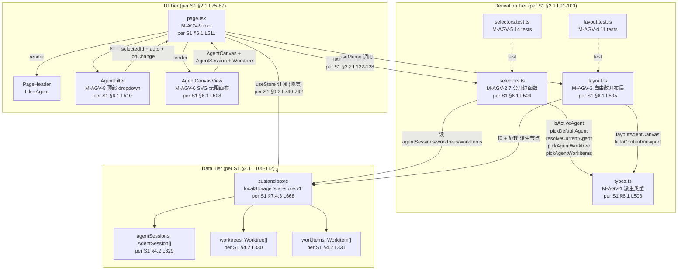
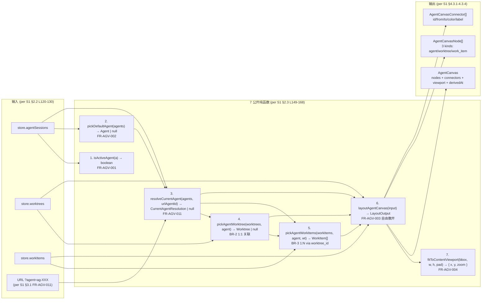
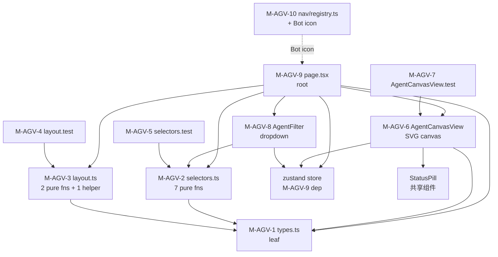
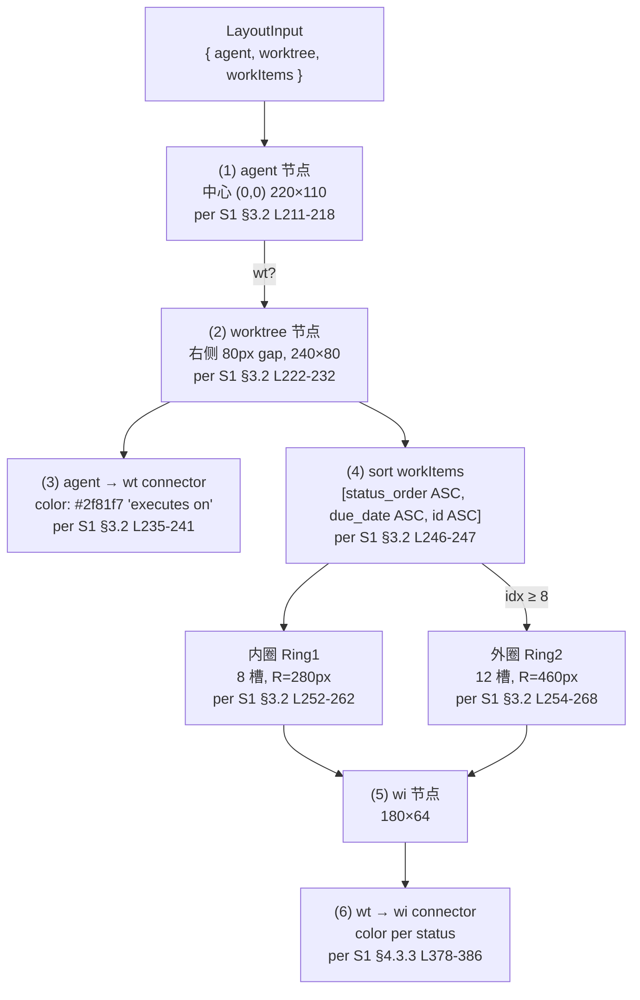
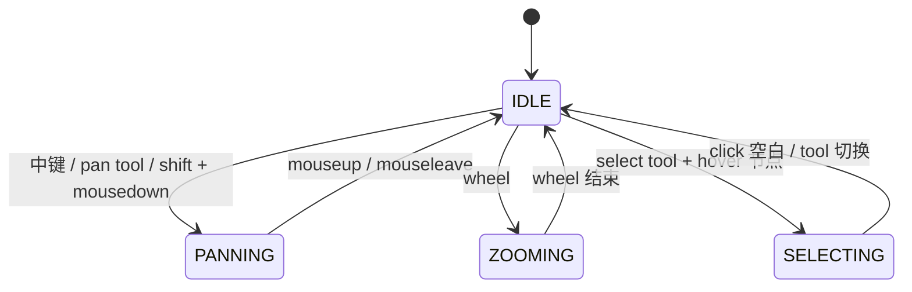

# 01 — Agent View 拓扑 (派生视图)

> **数据源**: [[S1]] [`docs/design/BD-AGENT-VIEW-001.md`](../../design/BD-AGENT-VIEW-001.md)
> **范围**: frontend/src/app/agent-view + frontend/src/lib/agent-view + frontend/src/components/agent-view
> **核心**: 3-tier UI / 10 模块 / 7 派生纯函数 / 3 类节点 + connector

---

## 1. 3-Tier 架构 (per [[S1]] §2.1)

---

## 2. 派生链 (Derivation Chain, per [[S1]] §2.3 L146-174)

---

## 3. 模块依赖图 (per [[S1]] §6.2 L516-540)

**依赖方向**: 单向, 无循环 (per [[S1]] §6.2 L542-546).

---

## 4. 布局算法 (per [[S1]] §3.2 L201-275)

---

## 5. 画布状态机 (per [[S1]] §5.1 L417-437)

---

## 6. 节点视觉规格 (per [[S1]] §7.2 L627-633)

| 节点 | 尺寸 | 背景 | 边框 (默认/hover/select) | 内容 |
|---|---|---|---|---|
| **agent** | 220×110 | `#0d2849` | `#1f6feb` / `#2f81f7` / `#79c0ff` | Bot icon + kind + id + status pill + tokens + cost |
| **worktree** | 240×80 | `#161b22` | `#30363d` / `#2f81f7` / `#79c0ff` | GitBranch icon + "worktree" + branch + status pill |
| **work_item** | 180×64 | `#161b22` | `#30363d` / `#2f81f7` / `#79c0ff` | key + title + status pill + priority |

**Connector 颜色** (per [[S1]] §4.3.3 L378-386):
- `in_progress` → `#2f81f7` (info blue)
- `review` → `#d29922` (warn amber)
- `blocked` → `#f85149` (err red)
- `todo` → `#8b949e` (ink-dim)
- `done` → `#3fb950` (ok green)
- `wontfix` → `#6e7681` (ink-mute)

---

## 7. 路由表 (per [[S1]] §9.1 L724-734)

| 路径 | Method | Handler | 用途 |
|---|---|---|---|
| `/agent-view` | GET | `app/agent-view/page.tsx` | 主入口 |
| `/agent-view?agent=ag-XXX` | GET | 同上 | URL State override (FR-AGV-011) |
| `/agent?selected=ag-XXX` | GET | `app/agent/page.tsx` | 双击 agent 跳详情 |
| `/worktree?selected=wt-XXX` | GET | `app/worktree/page.tsx` | 双击 worktree 跳详情 |
| `/work-item?selected=wi-XXX` | GET | `app/work-item/page.tsx` | 双击 wi 跳详情 |
| `/board?worktree_id=wt-XXX` | GET | `app/board/page.tsx` | header Kanban 跳 |
| `/agents` | GET | `app/(app)/agents/page.tsx` | 空状态跳 |

---

## 8. 异常处理 (per [[S1]] §5.3 L484-493)

| # | 异常 | 触发 | 处理 | 返回 |
|---|---|---|---|---|
| EX-1 | store.agentSessions.length === 0 | 渲染空状态 | 空 state + 跳 /agents | 空 |
| EX-2 | resolveCurrentAgent 返回 null | 渲染空状态 | "No resolvable agent" | 空 |
| EX-3 | worktree 为 null (agent 没 wt) | layout 跳过 wt 节点 | 只画 agent | 部分画布 |
| EX-4 | workItems 为空 | layout 跳过 wi 节点 | 画 agent + wt + 1 connector | 部分画布 |
| EX-5 | URL `?agent=ag-XXX` 找不到 | fallback 默认 | auto=true | 默认 + auto 角标 |
| EX-6 | worktree_id 引用问题 | renderNode 跳过 wi 节点 | 部分画布 | 部分 |

---

## 已知缺口 (per 守门 #11)

- **G-1**: 不画入 MCP/Star-LG 后端 (per [[S1]] §0 dual-use 提醒, Agent View 是 SPA in-memory, 0 外部服务)
- **G-2**: 不画入 zustand store 内部 action (per [[S1]] §9.2 L744 NFR-7 只读, 不调 action)
- **G-3**: 不画入 minimap 点击跳转 (per [[S1]] §1.2 缺口 #6)
- **G-4**: 不画入 i18n agent/worktree status 字典 (per [[S1]] §1.2 缺口 #5)
- **G-5**: 不画入 canvas 持久化 (per [[S1]] §1.2 缺口 #3)
- **G-6**: 不画入 minimap 节点位置 click handler (per [[S1]] §1.2 缺口 #6)

## Obsidian 双向链 (Bidirectional Links, v0.2 NEW)

> **拍板 (per 2026-09-06 17:13 JST 用户)**: docswiki 8 份转 Obsidian Wiki 风格, 完整集 frontmatter 13 字段, 节点→节点 + 源→拓扑双向链

### 1. 出现在本拓扑的节点 (in-topology)

- [[S1]]
- [[View-AgentView]]
- [[M-AGV-1]]
- [[M-AGV-2]]
- [[M-AGV-3]]
- [[M-AGV-4]]
- [[M-AGV-5]]
- [[M-AGV-6]]
- [[M-AGV-7]]
- [[M-AGV-8]]
- [[M-AGV-9]]
- [[M-AGV-10]]
- [[domain-worktree]]
- [[domain-work-item]]

### 2. 横向相关 (related)

- [[00-design-topology]]
- [[02-orchestration-langgraph]]

### 3. 参见 (see-also)

- [[S1]]
- [[View-AgentView]]

### 4. Obsidian Canvas

- 配套 `.canvas` 文件: `docs/wiki/docswiki/canvas/01-ui-agent-view.canvas`
- Obsidian Canvas 插件打开, 节点按 sub-graph 分色, 边显式标

### 5. 节点笔记索引

- 152 份节点笔记位于 `docs/wiki/docswiki/nodes/`
- 节点 ID = 文件名 (e.g. `C-01.md` / `domain-tenant.md` / `M-N1.md`)

### 6. 守门实证 (本段 v0.2 NEW)

- 0 回溯叙事 (per 守门 #12)
- 100% 文档实证 (per 守门 #12)
- 缺标比错标 (per 守门 #11)
- 3 view 平行, 不建立业务子域↔DDD 映射 (per 守门 #3)
- 修订 author = Ulysses (per 守门 #10 + 8/27 19:39 JST 授权)
