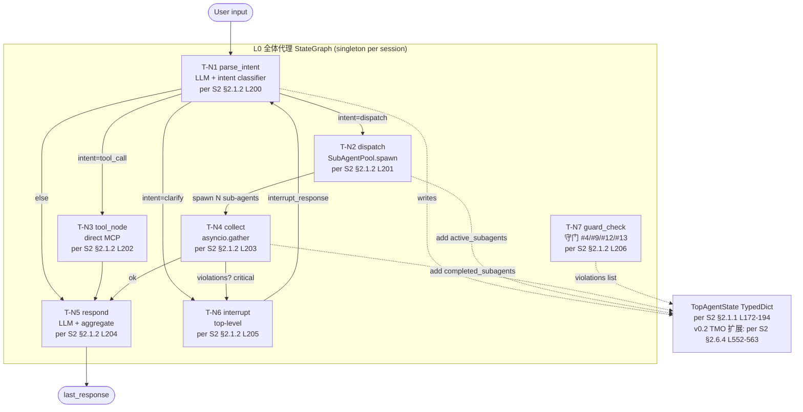
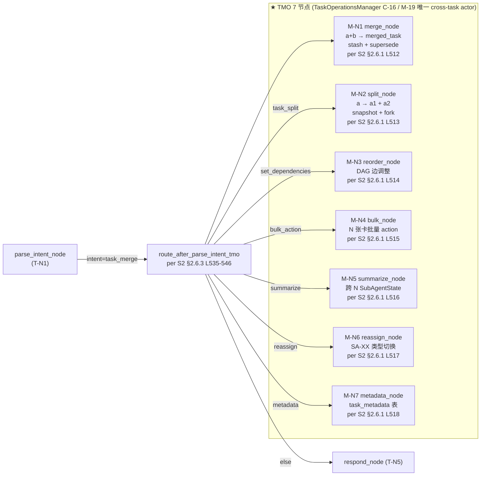
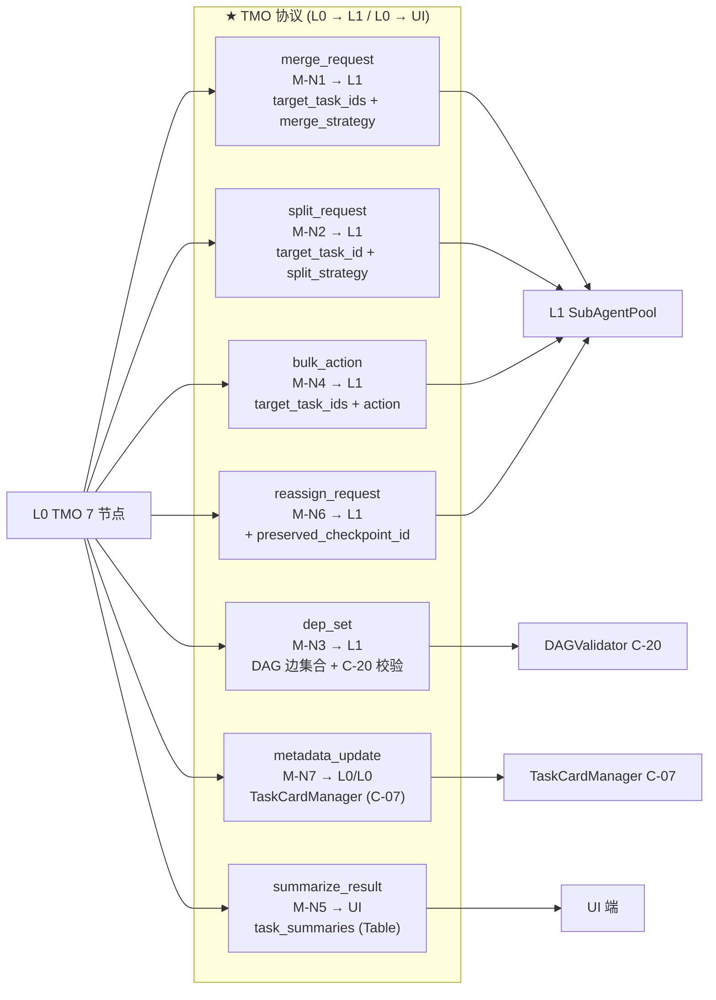
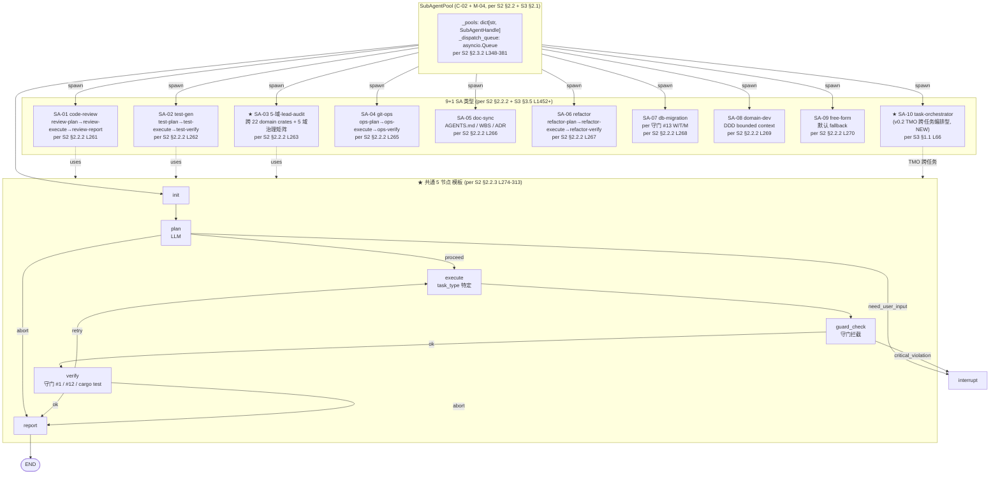
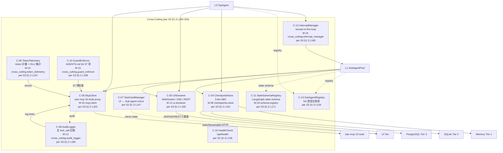
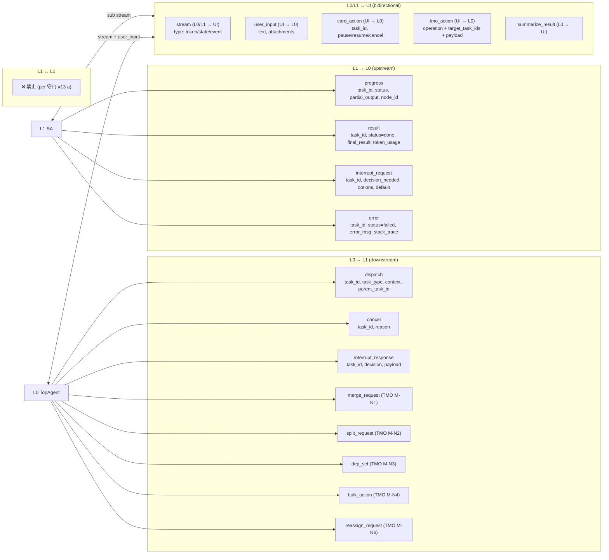
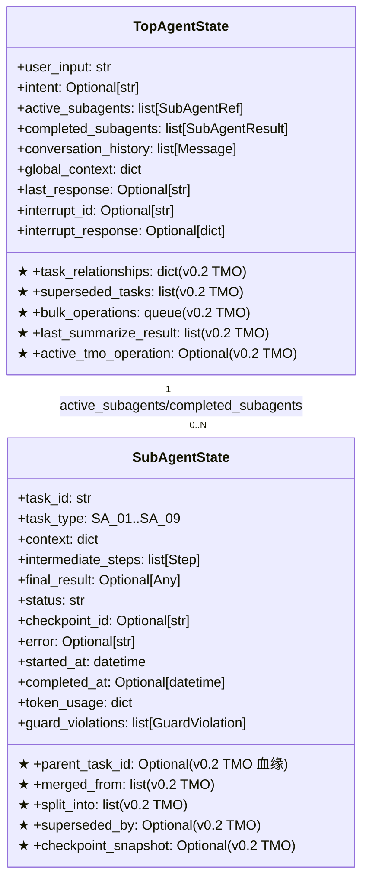

# 02 — LangGraph Orchestration 拓扑 (L0 + TMO + L1 SA + Cross-Cutting)

> **数据源**: [[S2]] [`docs/architecture/2026-09-03-langgraph/02-basic-design.md`](../../architecture/2026-09-03-langgraph/02-basic-design.md) + [[S3]] [`docs/architecture/2026-09-03-langgraph/03-detailed-design.md`](../../architecture/2026-09-03-langgraph/03-detailed-design.md)
> **范围**: star-lg Python crate, 2-level hierarchical LangGraph (L0 全体代理 + L1 任务卡子代理), 22 组件 ([[C-01]]..[[C-22]]), 25 模块 ([[M-01]]..[[M-25]]), 9+1 SA 类型, TMO 7 节点 ([[M-N1]]..[[M-N7]])

---

## 1. L0 全体代理 (Top Agent, per [[S2]] §2.1)

---

## 2. TMO 7 节点 (Task Management Operations, v0.2, per [[S2]] §2.6.1)

**核心约束 (per 守门 #13 a)**: TMO 7 节点全部 L0 协调, 跨任务操作只经 L0, **禁止 L1↔L1** (per [[S2]] §2.6 L506).

---

## 3. TMO 7 协议 (per [[S2]] §2.6.2 L521-530)

---

## 4. L1 Sub-Agent Pool + 9+1 SA (per [[S2]] §2.2.2 + [[S3]] §3.5)

---

## 5. 跨切关注点 (Cross-Cutting Components, per [[S2]] §1.1 L101-109)

---

## 6. 通信协议 (per [[S2]] §2.3.1 L317-340)

**L1↔L1 禁止 (per 守门 #13 a)**: 防止状态污染, 跨任务操作全部走 L0 协调 (per [[S2]] §2.6 L506).

---

## 7. 22 组件清单 ([[C-01]]..[[C-22]], per [[S2]] §1.3 L140-163)

| ID | 名称 | 層 | 重要度 | TMO v0.2 |
|---|---|---|---|---|
| **[[C-01]]** | TopAgent | L0 | P0 | — |
| **[[C-02]]** | SubAgentPool | L0 | P0 | — |
| **[[C-03]]** | SubAgent (9 types) | L1 | P0 | — |
| **[[C-04]]** | CheckpointStore | Cross | P0 | — |
| **[[C-05]]** | McpClient | L2 | P0 | — |
| **[[C-06]]** | UIStreamer | Cross | P0 | — |
| **[[C-07]]** | TaskCardManager | L0/L1 | P0 | — |
| **[[C-08]]** | AuditLogger | Cross | P0 | — |
| **[[C-09]]** | TokenTelemetry | Cross | P1 | — |
| **[[C-10]]** | GuardEnforcer | Cross | P1 | — |
| **[[C-11]]** | StateSchemaRegistry | Cross | P1 | — |
| **[[C-12]]** | InterruptManager | L0/L1 | P0 | — |
| **[[C-13]]** | SubAgentRegistry | L0 | P1 | — |
| **[[C-14]]** | CrossDomainDispatcher | L2 | P2 | — |
| **[[C-15]]** | HealthCheck | Cross | P1 | — |
| **[[C-16]]** | TaskOperationsManager | L0 | P0 | ★ v0.2 |
| **[[C-17]]** | TaskRelationshipGraph | L0/L1 | P0 | ★ v0.2 |
| **[[C-18]]** | BulkOperationQueue | L0 | P0 | ★ v0.2 |
| **[[C-19]]** | MetadataRegistry | L0 | P1 | ★ v0.2 |
| **[[C-20]]** | DAGValidator | L0 | P0 | ★ v0.2 |
| **[[C-21]]** | ReassignManager | L0 | P1 | ★ v0.2 |
| **[[C-22]]** | SummarizeCollector | L0 | P1 | ★ v0.2 |

---

## 8. 25 模块清单 ([[M-01]]..[[M-25]], per [[S3]] §1.2 L150-178)

| ID | 名称 | 責務 | 公開 interface | 依存 |
|---|---|---|---|---|
| [[M-01]] | `top_agent.graph` | TopAgent StateGraph 定義 | `TopAgent` class | sub_agent.pool, checkpoints, mcp |
| [[M-02]] | `top_agent.nodes` | [[T-N1]]..[[T-N7]] 実装 | `parse_intent_node`, `dispatch_node` | mcp.client, sub_agent.pool, llm |
| [[M-03]] | `top_agent.state` | TopAgentState TypedDict | `TopAgentState` | — |
| [[M-04]] | `sub_agent.pool` | spawn / lifecycle | `SubAgentPool.spawn()`, `.cancel()` | sub_agent.handle, sub_agent.registry |
| [[M-05]] | `sub_agent.base` | 共通 5 节点 模板 | `make_subagent_graph(task_type)` | sub_agent.state, mcp.audited_tool_node |
| [[M-06]] | `sub_agent.types` | [[SA-01]]..[[SA-09]] 実装 | `SA_01_CODE_REVIEW`... | sub_agent.base |
| [[M-07]] | `sub_agent.registry` | 类型 → 実装 mapping | `register(type, factory)`, `get(type)` | sub_agent.types |
| [[M-08]] | `checkpoints.store` | 3-tier ABC | `CheckpointStore` (abstract) | — |
| [[M-09]] | `checkpoints.sqlite` | Tier 2 実装 (default v0.1) | `SqliteCheckpointer` | checkpoints.store |
| [[M-10]] | `mcp.client` | star-mcp 16 tools proxy | `McpClient.call(tool, params)` | mcp tool metadata |
| [[M-11]] | `mcp.audited_tool_node` | audit + guard ToolNode | `AuditedMcpToolNode` | cross_cutting.audit_logger, guard_enforcer |
| [[M-12]] | `ui.streamer` | WebSocket / SSE 推送 | `UIStreamer.push(msg)`, `.subscribe(ws)` | — |
| [[M-13]] | `cross_cutting.audit_logger` | 全 tool call 記録 | `AuditLogger.log(entry)` | db (per 守门 #13 T) |
| [[M-14]] | `cross_cutting.token_telemetry` | token 計量 | `TokenTelemetry.record(call, result)` | — |
| [[M-15]] | `cross_cutting.guard_enforcer` | AGENTS.md §4 37 项 自动检查 | `GuardEnforcer.check_tool_call(call)` | — |
| [[M-16]] | `cross_cutting.interrupt_manager` | human-in-loop interrupt / resume | `InterruptManager.interrupt/resume` | — |
| [[M-17]] | `api.app` | FastAPI app + 路由 mount | `create_app()` | api.routes_* |
| [[M-18]] | `schema.registry` | State schema 中央管理 | `StateSchemaRegistry.register/migrate` | schema.v1, schema.migration |
| [[M-19]] | `task_ops.manager` | TMO 7 节点 集中调度, 唯一 cross-task actor | `TaskOperationsManager.merge/split/.../metadata()` | sub_agent.pool, task_ops.relationship_graph, sub_agent.registry |
| [[M-20]] | `task_ops.relationship_graph` | 任务卡 DAG (4 字段), cycle prevention | `TaskRelationshipGraph.add_edge/set/get/has_cycle()` | — |
| [[M-21]] | `task_ops.bulk_queue` | 批量操作队列 + asyncio.gather, 部分失败回滚 | `BulkOperationQueue.enqueue/flush()` | sub_agent.pool, task_ops.manager |
| [[M-22]] | `task_ops.dag_validator` | cycle detection O(V+E), 检测到环 → reject + interrupt | `DAGValidator.validate(relationships)` | task_ops.relationship_graph |
| [[M-23]] | `task_ops.metadata_registry` | task_metadata 表中央管理 (Master RLS per 守门 #13 c) | `MetadataRegistry.update/get` | db (守门 #13 M 表) |
| [[M-24]] | `task_ops.reassign_manager` | SA-XX 类型切换 + checkpoint preserved | `ReassignManager.reassign(task_id, new_type)` | sub_agent.pool, sub_agent.registry, checkpoints.store |
| [[M-25]] | `task_ops.summarize_collector` | 跨 N SubAgentState 聚合, LLM 表格化 | `SummarizeCollector.collect/llm_summarize` | sub_agent.pool, llm |

---

## 9. 外部 API 端点 (per [[S2]] §5.2 L960-983)

| Endpoint | Method | 用途 | TMO |
|---|---|---|---|
| `/api/top-agent/dispatch` | POST | UI → Top, user input | — |
| `/api/top-agent/stream` | WS | Top → UI, streaming | — |
| `/api/top-agent/state` | GET | UI → Top, state poll | — |
| `/api/top-agent/cancel` | POST | UI → Top, cancel all | — |
| `/api/sub-agent/{task_id}/stream` | WS | Sub → UI, streaming | — |
| `/api/sub-agent/{task_id}/state` | GET | UI → Sub, state | — |
| `/api/sub-agent/{task_id}/interact` | POST | UI → Sub, interrupt_response | — |
| `/api/sub-agent/{task_id}/cancel` | POST | UI → Sub, cancel | — |
| `/api/tasks` | GET | UI → backend, list all | — |
| `/api/tasks/{task_id}` | GET | UI → backend, task detail | — |
| `/api/health` | GET | UI / monitoring → backend | — |
| `/api/metrics` | GET | monitoring → backend (Prometheus) | — |
| `/api/tmo/merge` | POST | UI → Top, TMO [[M-N1]] 合并 a+b | ★ |
| `/api/tmo/split` | POST | UI → Top, TMO [[M-N2]] 拆分 a→a1+a2 | ★ |
| `/api/tmo/dependencies` | POST | UI → Top, TMO [[M-N3]] dep_set | ★ |
| `/api/tmo/bulk` | POST | UI → Top, TMO [[M-N4]] 批量 action | ★ |
| `/api/tmo/summarize` | POST | UI → Top, TMO [[M-N5]] 跨任务汇总 | ★ |
| `/api/tmo/reassign` | POST | UI → Top, TMO [[M-N6]] 类型 SA-XX 切换 | ★ |
| `/api/tmo/metadata` | POST | UI → Top, TMO [[M-N7]] task_metadata 更新 | ★ |
| `/api/tmo/relationships` | GET | UI → Top, 查询 DAG 边 | ★ |

---

## 10. LangGraph State Schema (per [[S3]] §3.1)

---

## 已知缺口 (per 守门 #11)

- **G-1**: `state_schema_v1` 跟 v0.2 TMO migration 路径细节未画 (per [[S3]] §3.1 + 04-state-schema-v1-migration.md)
- **G-2**: [[SA-10]] task-orchestrator subgraph 内部节点未展开 (per [[S3]] §1.1 L66 提及, 3.5 仅列出)
- **G-3**: schema/migration.py 跨版本迁移算法不画 (per [[S3]] §1.1 L128)
- **G-4**: 不画入 9 SA × ECS Archetype 业务逻辑具体实现 (per [[S4]] §3.5 G-13 已知缺口)
- **G-5**: 22 domain 真实数据接入状态 (部分接入) 不画 (per AGENTS.md §7 #1 11/25 部分)
- **G-6**: 5 域 Lead 真人未到位, [[SA-03]] audit 暂以 Mavis 临时代签 (per 守门 #14 v2)

## Obsidian 双向链 (Bidirectional Links, v0.2 NEW)

> **拍板 (per 2026-09-06 17:13 JST 用户)**: docswiki 8 份转 Obsidian Wiki 风格, 完整集 frontmatter 13 字段, 节点→节点 + 源→拓扑双向链

### 1. 出现在本拓扑的节点 (in-topology)

- [[S2]]
- [[S3]]
- [[View-LangGraph]]
- [[C-01]]
- [[C-02]]
- [[C-03]]
- [[C-04]]
- [[C-05]]
- [[C-06]]
- [[C-07]]
- [[C-08]]
- [[C-09]]
- [[C-10]]
- [[C-11]]
- [[C-12]]
- [[C-13]]
- [[C-14]]
- [[C-15]]
- [[C-16]]
- [[C-17]]
- [[C-18]]
- [[C-19]]
- [[C-20]]
- [[C-21]]
- [[C-22]]
- [[T-N1]]
- [[T-N2]]
- [[T-N3]]
- [[T-N4]]
- [[T-N5]]
- [[T-N6]]
- [[T-N7]]
- [[M-N1]]
- [[M-N2]]
- [[M-N3]]
- [[M-N4]]
- [[M-N5]]
- [[M-N6]]
- [[M-N7]]
- [[SA-01]]
- [[SA-02]]
- [[SA-03]]
- [[SA-04]]
- [[SA-05]]
- [[SA-06]]
- [[SA-07]]
- [[SA-08]]
- [[SA-09]]
- [[SA-10]]
- [[M-01]]
- [[M-02]]
- [[M-03]]
- [[M-04]]
- [[M-05]]
- [[M-06]]
- [[M-07]]
- [[M-08]]
- [[M-09]]
- [[M-10]]
- [[M-11]]
- [[M-12]]
- [[M-13]]
- [[M-14]]
- [[M-15]]
- [[M-16]]
- [[M-17]]
- [[M-18]]
- [[M-19]]
- [[M-20]]
- [[M-21]]
- [[M-22]]
- [[M-23]]
- [[M-24]]
- [[M-25]]

### 2. 横向相关 (related)

- [[00-design-topology]]
- [[03-runtime-ecs]]
- [[05-persistence-checkpoint]]
- [[06-data-flow]]

### 3. 参见 (see-also)

- [[S2]]
- [[S3]]
- [[View-LangGraph]]

### 4. Obsidian Canvas

- 配套 `.canvas` 文件: `docs/wiki/docswiki/canvas/02-orchestration-langgraph.canvas`
- Obsidian Canvas 插件打开, 节点按 sub-graph 分色, 边显式标

### 5. 节点笔记索引

- 152 份节点笔记位于 `docs/wiki/docswiki/nodes/`
- 节点 ID = 文件名 (e.g. `C-01.md` / `domain-tenant.md` / `M-N1.md`)

### 6. 守门实证 (本段 v0.2 NEW)

- 0 回溯叙事 (per 守门 #12)
- 100% 文档实证 (per 守门 #12)
- 缺标比错标 (per 守门 #11)
- 3 view 平行, 不建立业务子域↔DDD 映射 (per 守门 #3)
- 修订 author = Ulysses (per 守门 #10 + 8/27 19:39 JST 授权)
