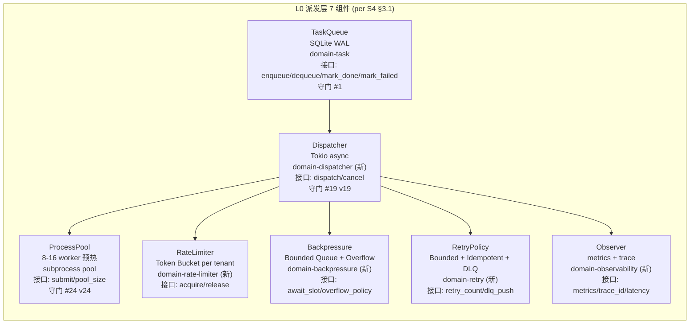
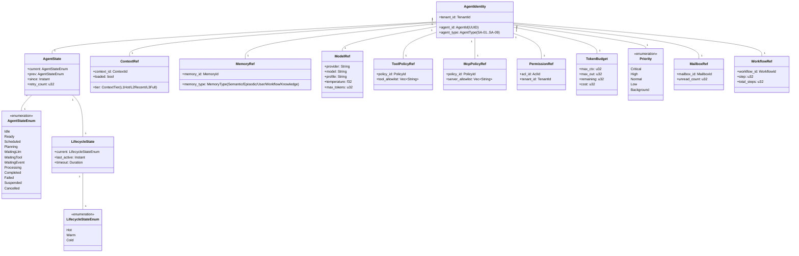
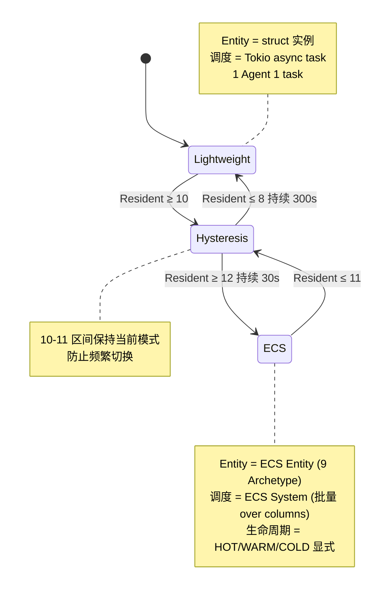
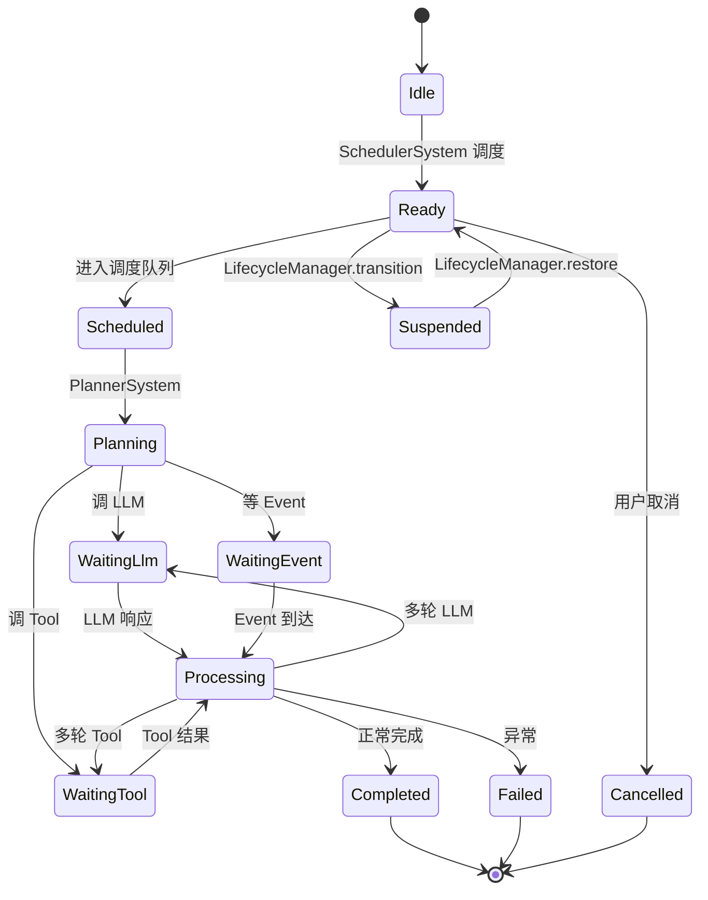
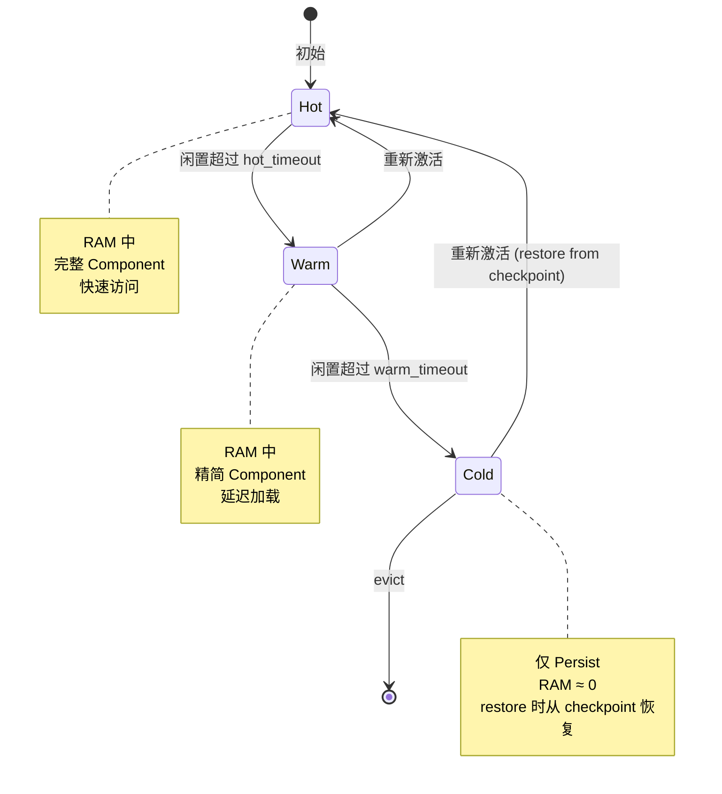
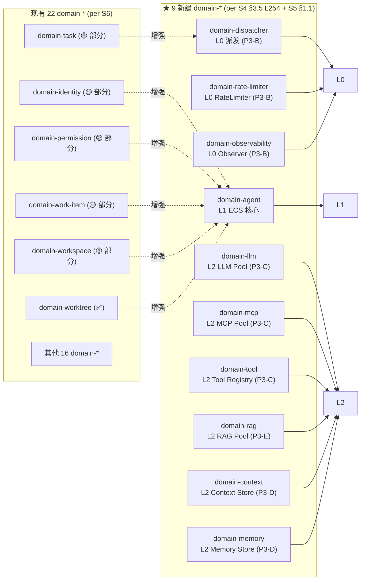

# 03 — Agent Runtime 拓扑 (L0 派发 + L1 ECS + L2 业务共享池)

> **数据源**: [[S4]] [`docs/architecture/2026-09-03-agent-runtime/02-basic-design.md`](../../architecture/2026-09-03-agent-runtime/02-basic-design.md) + [[S5]] [`docs/architecture/2026-09-03-agent-runtime/03-detailed-design.md`](../../architecture/2026-09-03-agent-runtime/03-detailed-design.md)
> **范围**: Agent Runtime Core (Rust), 3 层架构 (L0 派发 + L1 ECS + L2 业务共享池), Runtime 双模式 (Lightweight / ECS), 9 SA Archetype, 13 Systems, 12 ECS Components, 31 domain-* crate 目标

---

## 1. 3 层 + Runtime 双模式 (per [[S4]] §2.1 + §2.2)

```mermaid
flowchart TB
    subgraph AppLayer["Application Layer (业务 Agent, per S4 §2.1 L74-77)"]
        Plugin["Plugin A / Plugin B / Plugin C<br/>(per S4 §2.1 L75)"]
    end

    subgraph Core["Agent Runtime Core (per S4 §2.1 L82-123)"]
        direction TB

        subgraph ModeMgr["Runtime Mode Manager (per S4 §2.2 L144-155)"]
            Light["Lightweight Mode<br/>Resident < 10 Agent<br/>per S4 §2.2 L146"]
            Hyst["Hysteresis Zone<br/>10-11 Agent<br/>per S4 §2.2 L148"]
            ECS["ECS Mode<br/>Resident ≥ 12 Agent 持续 30s<br/>per S4 §2.2 L147"]
            Light <-->|切换| Hyst
            Hyst <-->|切换| ECS
        end

        subgraph L0["L0 派发层 (per S4 §2.1 L93-112 + §3.1 L167-178)"]
            TaskQ["TaskQueue<br/>SQLite WAL 持久化<br/>per S4 §3.1 L171"]
            Dispatcher["Dispatcher<br/>Tokio async 调度<br/>per S4 §3.1 L172"]
            ProcPool["ProcessPool<br/>8-16 worker 预热 (守门 #24)<br/>per S4 §3.1 L173"]
            RateLim["RateLimiter<br/>Token Bucket<br/>per S4 §3.1 L174"]
            Backpress["Backpressure<br/>Bounded Queue + Overflow Policy<br/>per S4 §3.1 L175"]
            Retry["RetryPolicy<br/>Bounded + Idempotent<br/>per S4 §3.1 L176"]
            Observer["Observer<br/>metrics + trace<br/>per S4 §3.1 L177"]
        end

        subgraph L1["L1 ECS Runtime (per S4 §2.1 L94-111 + §3.2 L179-198)"]
            World["ECS World<br/>9 Archetype SA-01..SA-09"]
            Comp12["12 ECS Components<br/>(per S4 §3.2 L183-196)"]
            Sys13["★ 13 Systems<br/>(per S4 §3.4 L218-232)"]
        end

        subgraph L2["L2 业务共享池 (per S4 §3.3 L199-212)"]
            LLMPool["LLM Pool<br/>Provider + Model + Tokenizer<br/>per S4 §3.3 L203"]
            MCPPool["MCP Pool<br/>Registry + Connection + Capability Cache<br/>per S4 §3.3 L204"]
            HTTPPool["HTTP Pool<br/>reqwest::Client + Pool<br/>per S4 §3.3 L205"]
            ToolReg["Tool Registry<br/>全局共享 HashMap<br/>per S4 §3.3 L206"]
            RAGPool["RAG Pool<br/>Retriever + Cache + Vector<br/>per S4 §3.3 L207"]
            Tokenizer["Tokenizer<br/>Arc<Tokenizer> 共享<br/>per S4 §3.3 L208"]
            PromptReg["Prompt Registry<br/>模板共享<br/>per S4 §3.3 L209"]
            RateLimit["Rate Limiter<br/>Provider Rate Limit<br/>per S4 §3.3 L211"]
            CB["Circuit Breaker<br/>Arc<CircuitBreaker><br/>per S4 §3.3 L212"]
        end
    end

    subgraph Ext["External State Layer (per S4 §2.1 L127-139)"]
        Ctx["Context Store<br/>L1/L2/L3 Tier"]
        Mem["Memory Store<br/>S/E/U/W/K 5 类"]
        Evt["Event Store<br/>WORM"]
        Pay["Payload Store<br/>大消息"]
        Durable["Durable Store<br/>SQLite/PG"]
        FastCache["Fast Cache<br/>(Redis)"]
        Vec["Vector Store<br/>(Qdrant)"]
    end

    Plugin -->|"Plugin API (Component/System/Tool)"| ModeMgr
    ModeMgr -->|"<10 / 10-11 / ≥12"| L0
    L0 -->|"Tokio task 派发"| L1
    L1 -->|"业务请求"| L2
    L2 --> Ext
```

---

## 2. L0 派发层组件 (per [[S4]] §3.1 L169-178)

**L0 性能目标 (per [[S4]] §6.1 L524)**: L0 派发延迟 < 100ms p95.

---

## 3. L1 ECS 12 Components (per [[S4]] §3.2 L183-196)

---

## 4. L1 ECS 13 Systems (per [[S4]] §3.4 L218-232)

```mermaid
flowchart TB
    subgraph Sys["★ 13 Systems (per S4 §3.4)"]
        Sched["SchedulerSystem<br/>Agent 调度 (Ready Queue + Priority)<br/>每 frame<br/>per S4 §3.4 L220"]
        Life["LifecycleSystem<br/>HOT/WARM/COLD 状态转换<br/>每 frame<br/>per S4 §3.4 L221"]
        Evt["EventSystem<br/>Event 路由 + Mailbox 投递<br/>Event-driven<br/>per S4 §3.4 L222"]
        Plan["PlannerSystem<br/>任务规划<br/>调度时<br/>per S4 §3.4 L223"]
        Llm["LlmSystem<br/>LLM 请求 + Token 計量<br/>LLM 调用时<br/>per S4 §3.4 L224"]
        Tool["ToolSystem<br/>Tool 调用 + 权限检查<br/>Tool 调用时<br/>per S4 §3.4 L225"]
        Mcp["McpSystem<br/>MCP 调用<br/>MCP 调用时<br/>per S4 §3.4 L226"]
        Ret["RetrievalSystem<br/>RAG 检索<br/>RAG 调用时<br/>per S4 §3.4 L227"]
        Ctx["ContextSystem<br/>Context 装载/卸载 (Lazy Load)<br/>Context 需要时<br/>per S4 §3.4 L228"]
        Memo["MemorySystem<br/>Memory 读写<br/>Memory 访问时<br/>per S4 §3.4 L229"]
        Perm["PermissionSystem<br/>权限检查<br/>任何外部调用<br/>per S4 §3.4 L230"]
        Pers["PersistenceSystem<br/>Checkpoint + 持久化<br/>任务状态变更<br/>per S4 §3.4 L231"]
        Met["MetricsSystem<br/>可观测性指标采集<br/>每 frame<br/>per S4 §3.4 L232"]
    end

    %% 关系 (per S4 §3.4 + §3.5)
    Sched -.->|"跟 LangGraph 独立"| L1
    Life -.->|"Runtime 概念"| L1
    Evt -.->|"跟 LangGraph 状态转换并行"| LGView
    Plan -.->|"引用 LangGraph 9/3 planner node"| LGView
    Llm -.->|"独立 L2 LLM Pool"| L1
    Tool -.->|"跟 LangGraph tool node 协作"| LGView
    Mcp -.->|"跟 LangGraph MCP node 协作"| LGView
    Ret -.->|"独立 L2 RAG Pool"| L1
    Ctx -.->|"独立 L2 Context Store"| L1
    Memo -.->|"独立 L2 Memory Store"| L1
    Perm -.->|"跨域 Tenant + ACL"| L1
    Pers -.->|"跨域 L2 + DB"| L1
    Met -.->|"独立 L0 Observer"| L1

    L1["L1 ECS Runtime"]
    LGView["LangGraph view"]
```

---

## 5. Runtime 双模式状态机 (per [[S5]] §3.1-§3.2)

**模式切换一致性 (per [[S4]] §2.2 L155 + SRS §83)**: 不丢 Event / 不重复 Tool / 不丢 Agent State / 不丢 ContextRef / 不重复 LLM 请求. 零停机迁移.

---

## 6. Agent 状态机 (per [[S5]] §3.1)

---

## 7. Lifecycle HOT/WARM/COLD 状态机 (per [[S5]] §3.2)

---

## 8. 31 domain-* crate 目标映射 (per [[S4]] §3.5 + [[S5]] §1.1)

**总计**: 22 + 9 = 31 domain-* crate 目标 (per [[S4]] §3.5 L254 + [[S5]] §1.2 L95).

---

## 9. ECS 框架选型 (per [[S5]] §1.3)

| 维度 | bevy_ecs | flecs | 自研 Minimal ECS |
|---|---|---|---|
| Memory Overhead | 中 (Archetype-based) | 低 (Sparse set) | 极低 |
| Dynamic Entity Cost | O(1) spawn | O(1) | O(1) |
| Query Cost | 快 (Archetype filter) | 极快 | 取决于实现 |
| Serialization | 支持 (Reflect) | 支持 (meta) | 需自实现 |
| Concurrency | 良好 (Send + Sync) | 良好 | 取决于实现 |
| Lifecycle Support | 需自实现 System | 需自实现 Observer | 需自实现 |
| STAR 适用 | ✅ 适合 9 Archetype 业务 | ✅ 适合 1M Entity 列存 | ⚠️ 维护成本高 |
| **P3-B 选型建议** | **★ 推荐** (Rust 生态成熟) | 备选 (低开销) | 备选 (极简) |

**P3-B 选型决策**: 拍板后填入 (per [[S4]] §9 G-2 已知缺口).

---

## 10. Runtime API (per [[S4]] §5.1 L443-457)

```mermaid
classDiagram
    class RuntimeApi {
        <<trait>>
        +create_agent(identity) Result~AgentId~
        +delete_agent(agent_id) Result
        +get_agent(agent_id) Result~Agent~
        +send_event(event) Result~EventId~
        +suspend_agent(agent_id) Result
        +resume_agent(agent_id) Result
        +cancel_agent(agent_id) Result
        +get_agent_state(agent_id) Result~AgentStateSnapshot~
        +get_runtime_metrics() Result~RuntimeMetrics~
    }
    class ManagementApi {
        <<trait>>
        +get_runtime_mode() Result~RuntimeMode~
        +get_threshold(key) Result~ConfigValue~
        +get_hot_limit() Result~u32~
        +get_memory_limit() Result~MemoryLimit~
        +get_queue_limit() Result~QueueLimit~
        +get_tenant_quota(tenant_id) Result~TenantQuota~
        +get_provider_limit(provider) Result~ProviderLimit~
    }
    class EventBus {
        <<trait>>
        +publish(event) Result~EventId~
        +subscribe(agent_id) Result~MailboxStream~
        +unsubscribe(agent_id, sub_id) Result
    }
    class Scheduler {
        <<trait>>
        +schedule(task) Result~ScheduleId~
        +cancel(schedule_id) Result
        +get_ready_queue() Result~Vec~Task~~
        +get_hot_slot_usage() Result~f32~
        +get_agent_wait_time(agent_id) Result~Duration~
    }
    class LifecycleManager {
        <<trait>>
        +transition(agent_id, target) Result
        +persist(agent_id) Result
        +restore(agent_id) Result~Agent~
        +timeout(agent_id) Result~bool~
        +evict(agent_id) Result
    }
```

---

## 11. NFR 性能目标 (per [[S4]] §6.1 L518-527)

| NFR | 目标 | 测量 |
|---|---|---|
| Logical Agent 数 | 1,000,000 | 单元/IT/E2E |
| HOT Agent 数 | 1,000-5,000 | 同上 |
| WARM Agent 内存 | < 100 KB / Agent, 优化 10-50 KB | `avg_warm_agent_bytes` |
| COLD Agent 内存 | ≈ 0 Runtime RAM | 同上 |
| Total Runtime RAM (1M logical) | < 16 GB | 16GB 机器 87 小时派发 |
| L0 派发延迟 | < 100ms p95 | `schedule_latency` |
| L1 ECS 状态转移 | < 1ms p95 | `system_latency` |
| L2 Pool 复用率 | > 90% | `pool_utilization` |
| Throughput | 200 task/s 持续 (16GB 机器) | `tasks_per_sec` |

---

## 已知缺口 (per 守门 #11)

- **G-1**: bevy_ecs / flecs 选型未拍板 (per [[S4]] §9 G-2 已知缺口)
- **G-2**: EventBus + Mailbox 未实现 (per [[S4]] §9 G-3)
- **G-3**: Shared LLM/HTTP/MCP Pool 未落地 (per [[S4]] §9 G-4)
- **G-4**: Crash Recovery + Checkpoint 协议未完成 (per [[S4]] §9 G-7)
- **G-5**: Token 计量 telemetry 真实数据缺 (per [[S4]] §9 G-9)
- **G-6**: 守门 #1 v18 H2 跨 session 续 (5 domain 类型不兼容, per [[S4]] §9 G-10)
- **G-7**: 9 SA Type × ECS Archetype 业务逻辑兼容性 (per [[S4]] §9 G-13)
- **G-8**: Process Pool 跟 Tokio 协作的 runtime 隔离 (per [[S4]] §9 G-14)
- **G-9**: Tenant Quota 跟 Priority 冲突解决 (per [[S4]] §9 G-15)
- **G-10**: 5 域 Lead 真人未到位, RACI 暂以 Mavis 临时代签 (per 守门 #14 v2)

## Obsidian 双向链 (Bidirectional Links, v0.2 NEW)

> **拍板 (per 2026-09-06 17:13 JST 用户)**: docswiki 8 份转 Obsidian Wiki 风格, 完整集 frontmatter 13 字段, 节点→节点 + 源→拓扑双向链

### 1. 出现在本拓扑的节点 (in-topology)

- [[S4]]
- [[S5]]
- [[View-AgentRuntime]]
- [[Comp-AgentIdentity]]
- [[Comp-AgentState]]
- [[Comp-LifecycleState]]
- [[Comp-ContextRef]]
- [[Comp-MemoryRef]]
- [[Comp-ModelRef]]
- [[Comp-ToolPolicyRef]]
- [[Comp-McpPolicyRef]]
- [[Comp-PermissionRef]]
- [[Comp-TokenBudget]]
- [[Comp-Priority]]
- [[Comp-MailboxRef]]
- [[Sys-Scheduler]]
- [[Sys-Lifecycle]]
- [[Sys-Event]]
- [[Sys-Planner]]
- [[Sys-Llm]]
- [[Sys-Tool]]
- [[Sys-Mcp]]
- [[Sys-Retrieval]]
- [[Sys-Context]]
- [[Sys-Memory]]
- [[Sys-Permission]]
- [[Sys-Persistence]]
- [[Sys-Metrics]]
- [[domain-dispatcher]]
- [[domain-llm]]
- [[domain-mcp]]
- [[domain-tool]]
- [[domain-rag]]
- [[domain-context]]
- [[domain-memory]]
- [[domain-rate-limiter]]
- [[domain-observability]]
- [[domain-agent]]

### 2. 横向相关 (related)

- [[00-design-topology]]
- [[02-orchestration-langgraph]]
- [[04-domain-crates]]
- [[05-persistence-checkpoint]]

### 3. 参见 (see-also)

- [[S4]]
- [[S5]]
- [[View-AgentRuntime]]

### 4. Obsidian Canvas

- 配套 `.canvas` 文件: `docs/wiki/docswiki/canvas/03-runtime-ecs.canvas`
- Obsidian Canvas 插件打开, 节点按 sub-graph 分色, 边显式标

### 5. 节点笔记索引

- 152 份节点笔记位于 `docs/wiki/docswiki/nodes/`
- 节点 ID = 文件名 (e.g. `C-01.md` / `domain-tenant.md` / `M-N1.md`)

### 6. 守门实证 (本段 v0.2 NEW)

- 0 回溯叙事 (per 守门 #12)
- 100% 文档实证 (per 守门 #12)
- 缺标比错标 (per 守门 #11)
- 3 view 平行, 不建立业务子域↔DDD 映射 (per 守门 #3)
- 修订 author = Ulysses (per 守门 #10 + 8/27 19:39 JST 授权)
