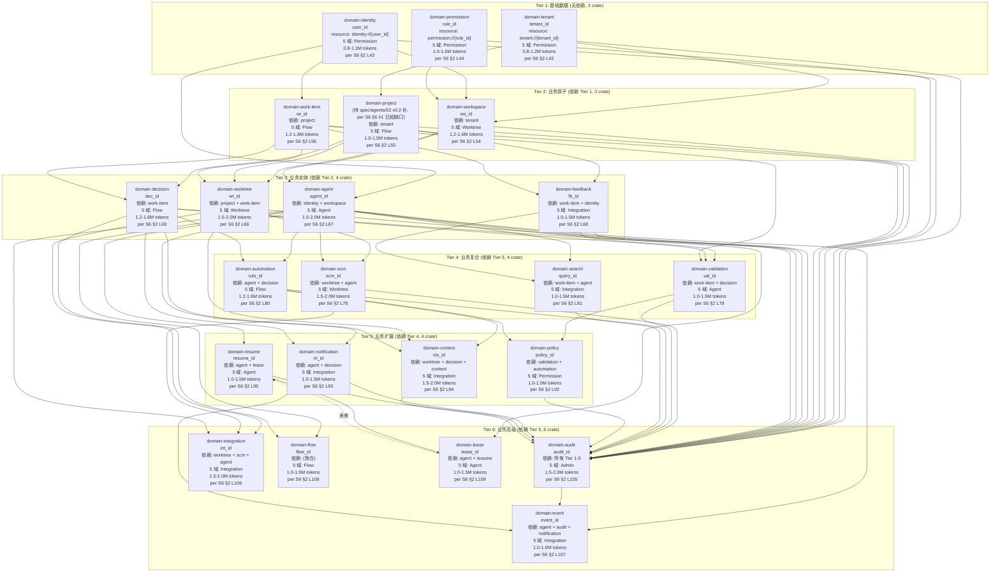

# 04 — 22 domain-* crate 拓扑 (Tier 1-6 接入顺序 + 依赖)

> **数据源**: S6 [`docs/architecture/2026-08-26-upgrade/spec/integration/01-22-domain-integration-spec.md`](../../architecture/2026-08-26-upgrade/spec/integration/01-22-domain-integration-spec.md)
> **范围**: 22 domain crate, Tier 1-6 接入顺序 + 依赖深度分层, 跟 5 域映射 (Permission / Worktree / Flow / Agent / Integration / Admin), 接入工作量估算

---

## 1. Tier 1-6 接入顺序 (per S6 §2)

---

## 2. Tier 工作量统计 (per S6 §2.1 L117-126)

| Tier | Crate 数 | 5 域分布 | 工作量合计 (tokens) | 累计 (tokens) |
|---|---|---|---|---|
| Tier 1 | 3 | Permission 3 | 2.6-3.9M | 2.6-3.9M |
| Tier 2 | 3 | Worktree 1 + Flow 2 | 3.4-4.7M | 6.0-8.6M |
| Tier 3 | 4 | Worktree 1 + Agent 1 + Integration 1 + Flow 1 | 5.2-7.1M | 11.2-15.7M |
| Tier 4 | 4 | Worktree 1 + Agent 1 + Flow 1 + Integration 1 | 4.7-6.6M | 15.9-22.3M |
| Tier 5 | 4 | Permission 1 + Integration 2 + Agent 1 | 4.5-6.5M | 20.4-28.8M |
| Tier 6 | 6 | Admin 1 + Integration 3 + Flow 1 + Agent 1 | 6.0-8.5M | 26.4-37.3M |
| **总计** | **22+1=23** | — | **26.4-37.3M** | ≈ 3-4 人·周 |

> **重要**: 5 域映射 (Permission / Worktree / Flow / Agent / Integration / Admin) 是**历史治理命名** (per AGENTS.md §5 守门 #3 拍板), 跟 DDD bounded context **非同一分类**, 不建立业务子域↔DDD 映射.

---

## 3. 每 crate 验收 5 项 (per S6 §3)

per [S6 §3 L128-131](spec/integration/01-22-domain-integration-spec.md):

| # | 验收项 | 引用 |
|---|---|---|
| 1 | Resources 4 类 | per [`spec/mcp/02 §1`](../spec/mcp/02-resources-prompts-spec.md) |
| 2 | Read 权限矩阵 | per [`spec/agents/02 §3`](../spec/agents/02-data-sources-spec.md) |
| 3 | Write 权限矩阵 | per [`spec/agents/02 §4`](../spec/agents/02-data-sources-spec.md) |
| 4 | Cache TTL 表 | per [`spec/cache/01 §4`](../spec/cache/01-cache-contract-spec.md) |
| 5 | 数据源清单 | per [`spec/agents/02 §2`](../spec/agents/02-data-sources-spec.md) |

---

## 4. Tier 验证门 (per S6 §2 验收)

| Tier | 验证门 |
|---|---|
| **Tier 1** | 3 crate 全部 100% 接入 + 3×3=9 测试 + DDD Review + Permission Lead 签字 |
| **Tier 2** | 3 crate + 9 测试 + Worktree Lead + Flow Lead 双签字 + Saga 触发跑通 |
| **Tier 3** | 4 crate + 12 测试 + 3 域 Lead (Worktree/Agent/Integration) 签字 + Flow Lead decision 域决策签字 |
| **Tier 4** | 4 crate + 12 测试 + 4 域 Lead 签字 + Saga 跑通 + scm 真实 Git provider 联通 (per ADR-0035 §2 D8 L84-103 star-sa 4 provider trait) |
| **Tier 5** | 4 crate + 12 测试 + 3 域 Lead 签字 + Saga 跑通 + cache 策略实装 |
| **Tier 6** | 6 crate + 18 测试 + 5 域 Lead 全签字 + Saga 跑通 + 性能基线 + DDD Review 全终审 |

---

## 5. 触发 Saga (per S6 §2 跨 crate 写入)

| Tier | 触发 Saga | 引用 |
|---|---|---|
| Tier 2 | workspace creation → Tenant scope check (per spec/saga/01 §4 Q-003 简化版 + tenant_id 校验 step) | per S6 §2 L58 |
| Tier 3 | worktree create → decision log (per spec/agents/01 §2 Lease 协议 30s heartbeat 复用 + decision 写 audit log) | per S6 §2 L71 |
| Tier 4 | pr open → audit log + notification (per spec/saga/01 §4 5 步流程 AuditLog step + NotificationStep) | per S6 §2 L84 |
| Tier 5 | policy update → audit + notification (per spec/saga/01 §4 Q-003 流程 AuditLog + Notification + cache 写穿透) | per S6 §2 L97 |
| Tier 6 | integration event → audit + notification (per spec/services/02 §3 SSE event schema CacheInvalidate 广播 + spec/saga/01 §5 状态机持久化) | per S6 §2 L111 |

---

## 6. 跨 5 域 Lead RACI (per S6 §2 验收门)

| 5 域 Lead | 主要负责 | Tier 1 | Tier 2 | Tier 3 | Tier 4 | Tier 5 | Tier 6 |
|---|---|---|---|---|---|---|---|
| **Permission 域 Lead** | tenant / identity / permission / policy | T1 全 | — | — | — | T5a | — |
| **Worktree 域 Lead** | workspace / worktree / scm | — | T2a | T3a | T4a | — | — |
| **Flow 域 Lead** | project / work-item / decision / automation | — | T2b+T2c | T3d | T4c | — | T6d |
| **Agent 域 Lead** | agent / validation / resume / lease | — | — | T3b | T4b | T5d | T6e |
| **Integration 域 Lead** | feedback / search / notification / context / integration / event | — | — | T3c | T4d | T5b+T5c | T6b+T6c |
| **Admin 域 Lead** | audit (COC 独立控制面 per 8/21 JST) | — | — | — | — | — | T6a |

> **注意**: 5 域 Lead 真人**未到位** (per [`docs/recruitment/5-business-domain-lead-referral.md`](../../recruitment/5-business-domain-lead-referral.md)), 暂以 Mavis 临时代签 (per 守门 #14 v2 9/3 19:35 JST 拍板 D 维持), 真人到位后追溯签字覆盖.

---

## 已知缺口 (per 守门 #11)

- **G-1**: `domain-project` 主键待 spec/agents/02 v0.2 补 (per S6 §2 L55 + §6 #1 已知缺口)
- **G-2**: 22+1=23 中 `domain-lease` 算 1 跨域, 部分文档记 22 核心 + 1 跨域 (per S6 §2 L109), 实际工作树现状以 `cargo metadata` 为准 (per AGENTS.md §4.2 实装前一致性门)
- **G-3**: 5 域映射仅用于 RACI 责任边界, 不建立业务子域↔DDD 映射 (per 守门 #3 拍板)
- **G-4**: 不画入 30+ 单个 domain spec (`docs/specs/`) 内部 Read/Write 矩阵细节, 等 DDD Review
- **G-5**: 不画入 spec/saga/01 5 步流程内部 step 实现 (per S6 §2 引用, 详见 `spec/saga/01-saga-coordination-spec.md`)
- **G-6**: 不画入 spec/agents/02 Read/Write 权限矩阵 13 類 (per S6 §3 引用, 详见 `spec/agents/02-data-sources-spec.md`)
