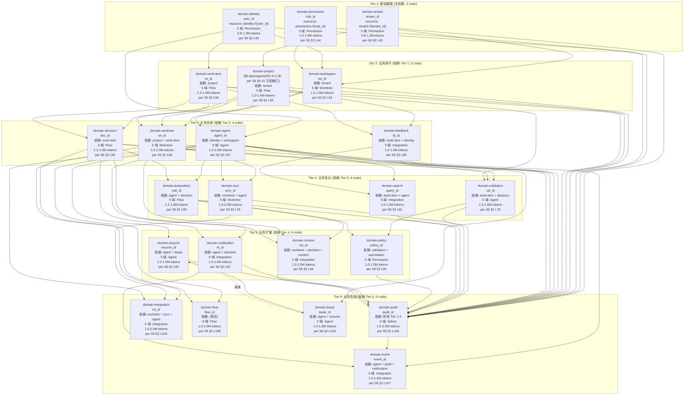

# 04 — 22 domain-* crate 拓扑 (Tier 1-6 接入顺序 + 依赖)

> **数据源**: [[S6]] [`docs/architecture/2026-08-26-upgrade/spec/integration/01-22-domain-integration-spec.md`](../../architecture/2026-08-26-upgrade/spec/integration/01-22-[[domain-integration-spec]].md)
> **范围**: 22 domain crate, Tier 1-6 接入顺序 + 依赖深度分层, 跟 5 域映射 (Permission / Worktree / Flow / Agent / Integration / Admin), 接入工作量估算

---

## 1. Tier 1-6 接入顺序 (per [[S6]] §2)

---

## 2. Tier 工作量统计 (per [[S6]] §2.1 L117-126)

| Tier | Crate 数 | 5 域分布 | 工作量合计 (tokens) | 累计 (tokens) |
|---|---|---|---|---|
| Tier 1 | 3 | Permission 3 | 2.6-3.9M | 2.6-3.9M |
| Tier 2 | 3 | Worktree 1 + Flow 2 | 3.4-4.7M | 6.0-8.6M |
| Tier 3 | 4 | Worktree 1 + Agent 1 + Integration 1 + Flow 1 | 5.2-7.1M | 11.2-15.7M |
| Tier 4 | 4 | Worktree 1 + Agent 1 + Flow 1 + Integration 1 | 4.7-6.6M | 15.9-22.3M |
| Tier 5 | 4 | Permission 1 + Integration 2 + Agent 1 | 4.5-6.5M | 20.4-28.8M |
| Tier 6 | 6 | Admin 1 + Integration 3 + Flow 1 + Agent 1 | 6.0-8.5M | 26.4-37.3M |
| **总计** | **22+1=23** | — | **26.4-37.3M** | ≈ 3-4 人·周 |

> **重要**: 5 域映射 (Permission / Worktree / Flow / Agent / Integration / Admin) 是**历史治理命名** (per AGENTS.md §5 守门 #3 拍板), 跟 DDD bounded context **非同一分类**, 不建立业务子域↔DDD 映射.

> **⚠️ 修正 (per 2026-09-06 18:46 JST `wiki_diff.py` 实测)**: 本节写 22+9=31 是**设计意图** (per [[S4]]+[[S5]]), 跟 `cargo metadata` 实测 **52 crate** (34 domain-* + 15 star-* + 3 other) 严重不符. docswiki **漏列** 15 个已实装 star-* + 3 个 other + 12 个 extra domain-*. 详见 [[99-pg-broker-audit]] §2 dual-namespace 拆解. 后续每图末「已知缺口」已标 G-1.

> **⚠️ 9 个"应新建" 也是设计意图 (per [[S5]] §1.1)**: [[domain-dispatcher]] / [[domain-llm]] / [[domain-mcp]] / [[domain-tool]] / [[domain-rag]] / [[domain-context]] / [[domain-memory]] / [[domain-rate-limiter]] / [[domain-observability]]. 截至 2026-09-06 实测: **0/9 实装** (5 个跟已实装 star-* 重名, 命名空间错, 详见 [[99-pg-broker-audit]] §2.3).

---

## 3. 每 crate 验收 5 项 (per [[S6]] §3)

per [[[S6]] §3 L128-131](spec/integration/01-22-[[domain-integration-spec]].md):

| # | 验收项 | 引用 |
|---|---|---|
| 1 | Resources 4 类 | per [`spec/mcp/02 §1`](../spec/mcp/02-resources-prompts-spec.md) |
| 2 | Read 权限矩阵 | per [`spec/agents/02 §3`](../spec/agents/02-data-sources-spec.md) |
| 3 | Write 权限矩阵 | per [`spec/agents/02 §4`](../spec/agents/02-data-sources-spec.md) |
| 4 | Cache TTL 表 | per [`spec/cache/01 §4`](../spec/cache/01-cache-contract-spec.md) |
| 5 | 数据源清单 | per [`spec/agents/02 §2`](../spec/agents/02-data-sources-spec.md) |

---

## 4. Tier 验证门 (per [[S6]] §2 验收)

| Tier | 验证门 |
|---|---|
| **Tier 1** | 3 crate 全部 100% 接入 + 3×3=9 测试 + DDD Review + Permission Lead 签字 |
| **Tier 2** | 3 crate + 9 测试 + Worktree Lead + Flow Lead 双签字 + Saga 触发跑通 |
| **Tier 3** | 4 crate + 12 测试 + 3 域 Lead (Worktree/Agent/Integration) 签字 + Flow Lead decision 域决策签字 |
| **Tier 4** | 4 crate + 12 测试 + 4 域 Lead 签字 + Saga 跑通 + scm 真实 Git provider 联通 (per ADR-0035 §2 D8 L84-103 star-sa 4 provider trait) |
| **Tier 5** | 4 crate + 12 测试 + 3 域 Lead 签字 + Saga 跑通 + cache 策略实装 |
| **Tier 6** | 6 crate + 18 测试 + 5 域 Lead 全签字 + Saga 跑通 + 性能基线 + DDD Review 全终审 |

---

## 5. 触发 Saga (per [[S6]] §2 跨 crate 写入)

| Tier | 触发 Saga | 引用 |
|---|---|---|
| Tier 2 | workspace creation → Tenant scope check (per spec/saga/01 §4 Q-003 简化版 + tenant_id 校验 step) | per [[S6]] §2 L58 |
| Tier 3 | worktree create → decision log (per spec/agents/01 §2 Lease 协议 30s heartbeat 复用 + decision 写 audit log) | per [[S6]] §2 L71 |
| Tier 4 | pr open → audit log + notification (per spec/saga/01 §4 5 步流程 AuditLog step + NotificationStep) | per [[S6]] §2 L84 |
| Tier 5 | policy update → audit + notification (per spec/saga/01 §4 Q-003 流程 AuditLog + Notification + cache 写穿透) | per [[S6]] §2 L97 |
| Tier 6 | integration event → audit + notification (per spec/services/02 §3 SSE event schema CacheInvalidate 广播 + spec/saga/01 §5 状态机持久化) | per [[S6]] §2 L111 |

---

## 6. 跨 5 域 Lead RACI (per [[S6]] §2 验收门)

| 5 域 Lead | 主要负责 | Tier 1 | Tier 2 | Tier 3 | Tier 4 | Tier 5 | Tier 6 |
|---|---|---|---|---|---|---|---|
| **Permission 域 Lead** | tenant / identity / permission / policy | T1 全 | — | — | — | T5a | — |
| **Worktree 域 Lead** | workspace / worktree / scm | — | T2a | T3a | T4a | — | — |
| **Flow 域 Lead** | project / work-item / decision / automation | — | T2b+T2c | T3d | T4c | — | T6d |
| **Agent 域 Lead** | agent / validation / resume / lease | — | — | T3b | T4b | T5d | T6e |
| **Integration 域 Lead** | feedback / search / notification / context / integration / event | — | — | T3c | T4d | T5b+T5c | T6b+T6c |
| **Admin 域 Lead** | audit (COC 独立控制面 per 8/21 JST) | — | — | — | — | — | T6a |

> **注意**: 5 域 Lead 真人**未到位** (per [`docs/recruitment/5-business-domain-lead-referral.md`](../../recruitment/5-business-[[domain-lead-referral]].md)), 暂以 Mavis 临时代签 (per 守门 #14 v2 9/3 19:35 JST 拍板 D 维持), 真人到位后追溯签字覆盖.

---

## 已知缺口 (per 守门 #11)

- **G-1**: `domain-project` 主键待 spec/agents/02 v0.2 补 (per [[S6]] §2 L55 + §6 #1 已知缺口)
- **G-2**: 22+1=23 中 `domain-lease` 算 1 跨域, 部分文档记 22 核心 + 1 跨域 (per [[S6]] §2 L109), 实际工作树现状以 `cargo metadata` 为准 (per AGENTS.md §4.2 实装前一致性门)
- **G-3**: 5 域映射仅用于 RACI 责任边界, 不建立业务子域↔DDD 映射 (per 守门 #3 拍板)
- **G-4**: 不画入 30+ 单个 domain spec (`docs/specs/`) 内部 Read/Write 矩阵细节, 等 DDD Review
- **G-5**: 不画入 spec/saga/01 5 步流程内部 step 实现 (per [[S6]] §2 引用, 详见 `spec/saga/01-saga-coordination-spec.md`)
- **G-6 (per 2026-09-06 18:46 JST `wiki_diff.py` 实测)**: docswiki §1-§2 写 22+9=31 跟 `cargo metadata` 实测 52 不符 (+21), 漏 15 star-* + 3 other + 12 extra domain-*, 详见 [[99-pg-broker-audit]]
- **G-7**: [[S4]]/[[S5]] 没说清 dual-namespace 命名规则, 需增 ADR-0048 (per [[99-pg-broker-audit]] §7 P1)
- **G-8**: 16 个 domain-* extra (Tier 1-6 没含) 待 DDD Review 拍板归入哪个 Tier (per [[99-pg-broker-audit]] §6 G-8)
- **G-9**: 9 个 docswiki 列的"应新建" domain crate 实装 0/9 (per [[99-pg-broker-audit]] §3 缺陷 4)

---

## 7. Dual-namespace 架构 (per 2026-09-06 18:46 JST `wiki_diff.py` 实测)

> **重要发现 (per [[99-pg-broker-audit]] §1 缺陷 2)**: 工程实际是 dual-namespace 架构, [[S4]]/[[S5]] + docswiki 完全没说清.

| namespace | 数量 | 角色 | 责任人 | docswiki 状态 |
|---|---|---|---|---|
| **domain-*** | 34 | DDD bounded context (业务域) | 5 域 Lead (Mavis 临时代签 per 守门 #14 v2) | §1 列 22 (缺 12 extra) |
| **star-*** | 15 | 共享运行时 (cross-cutting) | Runtime Lead / Mavis (Mavis 临时代签) | **完全漏列** (本节补) |
| **other** | 3 | 入口 + 平台 | 平台 Lead (Mavis 临时代签) | **完全漏列** |

**dual-namespace 命名规则** (per `cargo metadata` 实证, 待 ADR-0048 拍板):
- `domain-*` = DDD bounded context 业务域, 22 域 Lead 责任边界
- `star-*` = shared runtime 跨切 runtime, Mavis/Runtime 责任边界, 不属于 5 域任一域
- **冲突案例**: 9 个"应新建"中的 `domain-dispatcher` / `domain-mcp` / `domain-context` 跟已实装 `star-dispatcher` / `star-mcp` / `star-context` 重名, 命名空间错
- 修法: 9 个"应新建"重命名为 `star-*` 命名空间, 跟 §1 Tier 1-6 接入目标整合 (但 star-* 仍走 Runtime 责任边界, 不归 5 域)

---

## 8. 实际已实装的 15 个 star-* crate (per `cargo metadata`, 本节补)

| crate | src 文件数 | 角色 (per Cargo.toml description / 实际 API) | docswiki/[[S4]] 是否提到 |
|---|---|---|---|
| **star-mcp** | 49 | MCP server (16 tools + transport_http + handlers + sa_real_impls) | ✗ [[S4]] 漏 (应新建 [[domain-mcp]], 命名错) |
| **star-api-rest** | 20 | REST API (per spec/rest/01) | ✗ [[S4]] 漏 |
| **star-cli** | 16 | CLI (per 守门 #6 PowerShell only) | ✗ [[S4]] 漏 |
| **star-saga** | 11 | Saga 协调 (per spec/saga/01 5 步流程) | ✗ [[S4]] 漏 (虽然 [[S4]] 提 saga 但没说实际 star-saga) |
| **star-sa** | 6 | Sub-Agent (per [[S2]] §1.1 + [[S4]] §2.1 9 SA Archetype) | ✓ [[S2]]/[[S4]] partial (提 SA 但没说实际 star-sa) |
| **star-dispatcher** | 5 | L0 派发 (per [[S4]] §3.1) | ✗ [[S4]] 漏 (应新建 [[domain-dispatcher]], 命名错) |
| **star-cache** | 4 | Cache (per spec/cache/01 §4 TTL 表) | ✗ [[S4]] 漏 |
| **star-credential** | 4 | Credential (per 守门 #5 环境变量安全) | ✗ [[S4]] 漏 |
| **star-treesitter** | 4 | Tree-sitter (per 2026-09-03 treesitter-worktree-graph view) | ✗ [[S4]] 漏 |
| **star-context** | 3 | ActorContext (per H2 star_context 9/3 P0-1) | ✓ [[S4]] partial (提 H2 但没拍板命名) |
| **star-sse** | 3 | SSE 推送 (per spec/services/02) | ✗ [[S4]] 漏 |
| **star-webhook** | 3 | Webhook (per spec/services/03) | ✗ [[S4]] 漏 |
| **star-taskgraph** | 2 | Task Graph (per BATCH-REQ-001 v0.1.2 + ADR-0040) | ✗ [[S4]] 漏 |
| **star-vcs** | 2 | VCS (per ADR-0023 GitGit + 4 Provider) | ✗ [[S4]] 漏 |
| **star-dto** | 1 | DTO 共享 | ✗ [[S4]] 漏 |
| **总计** | **133** | — | **2/15 提到 ([[S2]]/[[S4]] partial)** |

> **核心观察**: 15 个 star-* crate 已实装且 work, [[S4]] §3.5 写的 9 个"应新建" 应改为 0/9 (因为 5 个跟已实装 star-* 重名). 这跟 [[99-pg-broker-audit]] §1 缺陷 4 一致.

---

## 9. 实际已实装的 3 个 other (per `cargo metadata`, 本节补)

| crate | 角色 | docswiki/[[S4]] 是否提到 |
|---|---|---|
| **api** | REST 入口 (per spec/rest/01) | ✗ [[S4]] 漏 |
| **application** | Application Layer (per [[S4]] §2.1) | ✗ [[S4]] 漏 (虽然 [[S4]] 提 Application Layer 但没说是 crate) |
| **infrastructure** | Infrastructure 聚合 | ✗ [[S4]] 漏 |
- **G-6**: 不画入 spec/agents/02 Read/Write 权限矩阵 13 類 (per [[S6]] §3 引用, 详见 `spec/agents/02-data-sources-spec.md`)

## Obsidian 双向链 (Bidirectional Links, v0.2 NEW)

> **拍板 (per 2026-09-06 17:13 JST 用户)**: docswiki 8 份转 Obsidian Wiki 风格, 完整集 frontmatter 13 字段, 节点→节点 + 源→拓扑双向链

### 1. 出现在本拓扑的节点 (in-topology)

- [[S6]]
- [[domain-tenant]]
- [[domain-identity]]
- [[domain-permission]]
- [[domain-workspace]]
- [[domain-project]]
- [[domain-work-item]]
- [[domain-worktree]]
- [[domain-agent]]
- [[domain-feedback]]
- [[domain-decision]]
- [[domain-scm]]
- [[domain-validation]]
- [[domain-automation]]
- [[domain-search]]
- [[domain-policy]]
- [[domain-notification]]
- [[domain-context]]
- [[domain-resume]]
- [[domain-audit]]
- [[domain-integration]]
- [[domain-event]]
- [[domain-flow]]
- [[domain-lease]]
- [[star-mcp]]
- [[star-api-rest]]
- [[star-cli]]
- [[star-saga]]
- [[star-sa]]
- [[star-dispatcher]]
- [[star-cache]]
- [[star-credential]]
- [[star-treesitter]]
- [[star-context]]
- [[star-sse]]
- [[star-webhook]]
- [[star-taskgraph]]
- [[star-vcs]]
- [[star-dto]]
- [[api]]
- [[application]]
- [[infrastructure]]
- [[domain-dispatcher-design]]
- [[domain-llm-design]]
- [[domain-mcp-design]]
- [[domain-tool-design]]
- [[domain-rag-design]]
- [[domain-context-design]]
- [[domain-memory-design]]
- [[domain-rate-limiter-design]]
- [[domain-observability-design]]

### 2. 横向相关 (related)

- [[00-design-topology]]
- [[03-runtime-ecs]]
- [[99-pg-broker-audit]]
- [[99-verifier-report]]

### 3. 参见 (see-also)

- [[S6]]

### 4. Obsidian Canvas

- 配套 `.canvas` 文件: `docs/wiki/docswiki/canvas/04-domain-crates.canvas`
- Obsidian Canvas 插件打开, 节点按 sub-graph 分色, 边显式标

### 5. 节点笔记索引

- 152 份节点笔记位于 `docs/wiki/docswiki/nodes/`
- 节点 ID = 文件名 (e.g. `C-01.md` / `domain-tenant.md` / `M-N1.md`)

### 6. 守门实证 (本段 v0.2 NEW)

- 0 回溯叙事 (per 守门 #12)
- 100% 文档实证 (per 守门 #12)
- 缺标比错标 (per 守门 #11)
- 3 view 平行, 不建立业务子域↔DDD 映射 (per 守门 #3)
- 修订 author = Ulysses (per 守门 #10 + 8/27 19:39 JST 授权)
