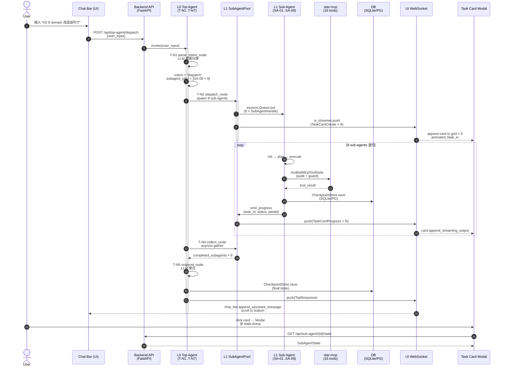
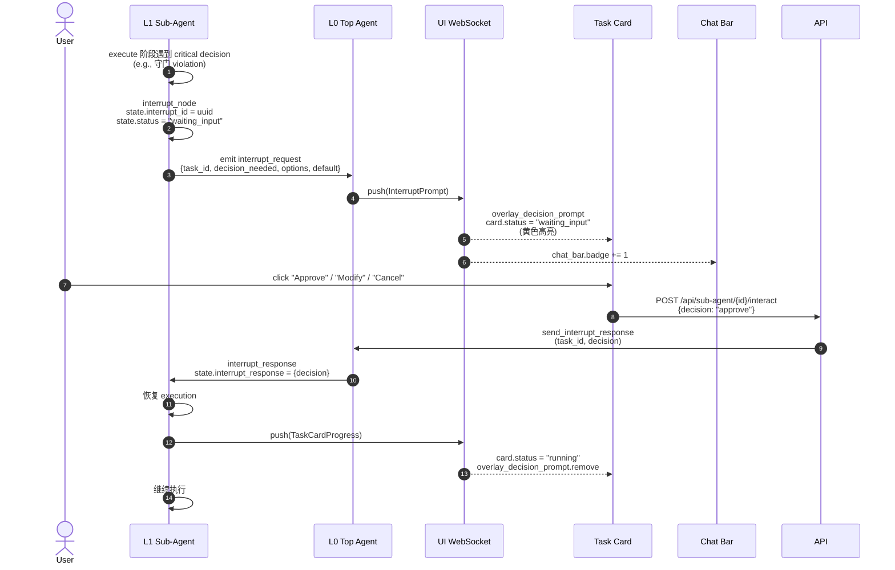
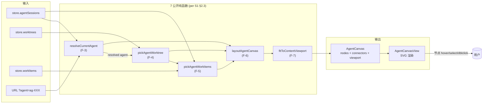
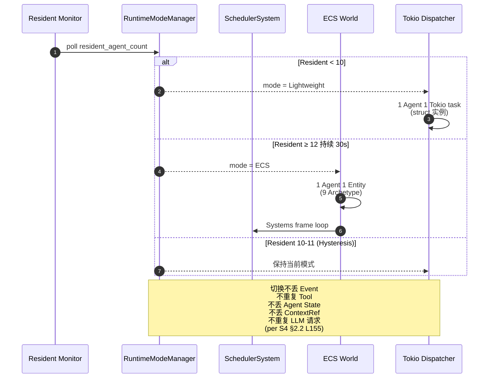
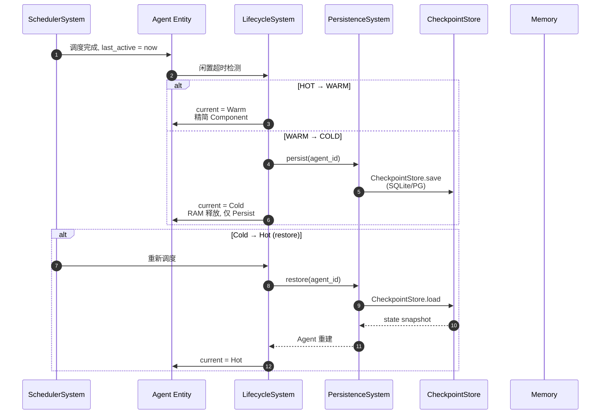
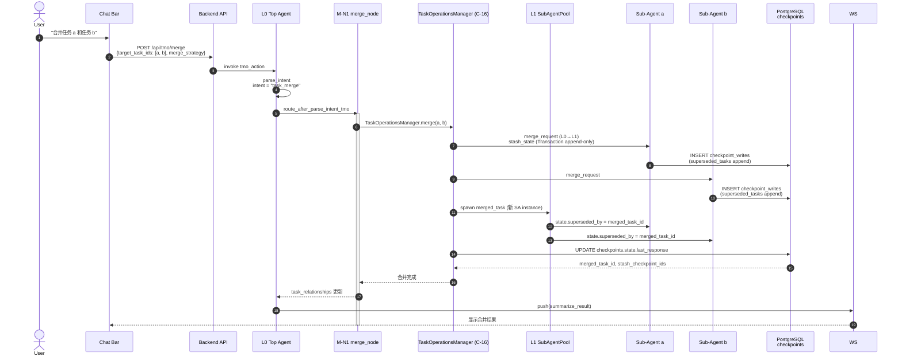
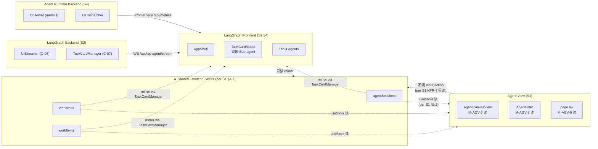
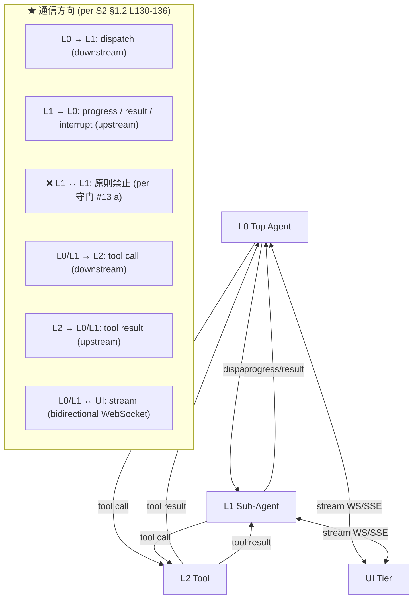

# 06 — 跨 View 关键数据流 (Data Flow Topology)

> **数据源**: [[S2]] §4.2 交互フロー [LangGraph 02 §4.2](../../architecture/2026-09-03-langgraph/02-basic-design.md) + [[S3]] §4 时序图 [LangGraph 03 §4](../../architecture/2026-09-03-langgraph/03-detailed-design.md) + [[S4]] [Agent Runtime 02](../../architecture/2026-09-03-agent-runtime/02-basic-design.md)
> **目的**: 跨 view 关键数据流: User input → L0 → L1 → L2 → Tool → DB → Response, 含 TMO 跨任务操作流

---

## 1. 主流程: User Input → L0 → L1 → UI Stream (per [[S2]] §4.2.1 L839-884)

---

## 2. Human-in-the-Loop Interrupt 流 (per [[S2]] §4.2.2 L886-917)

---

## 3. Agent View 派生流 (per [[S1]] §2.2 L117-142)

---

## 4. Runtime Mode 切换流 (per [[S5]] §4.2 UC-02)

---

## 5. HOT → WARM → COLD Lifecycle 流 (per [[S5]] §3.2)

---

## 6. TMO 合并流 ([[M-N1]] merge, per [[S2]] §2.6.1 + [[S7]] §3.4)

---

## 7. 跨 View 数据共享流 (per 守门 #3 反转 + [[S1]] §4.2)

---

## 8. 通信通道总览 (per [[S2]] §1.2 L130-136)

---

## 已知缺口 (per 守门 #11)

- **G-1**: TMO split / reorder / bulk / summarize / reassign / metadata 6 子项详细时序不画 (per [[S2]] §2.6, 等 PHASE-LANGGRAPH-TMO-IMPL-REPORT 实装)
- **G-2**: 跨 session resume 协议 (per ADR-0030 Agent Lease/Heartbeat/Resume) 不画, 详见 `docs/architecture/2026-08-26-upgrade/spec/flows/03-agent-resume.md`
- **G-3**: Saga 5 步流程 (AuditLog/Notification/CacheInvalidate 等) 不画, 详见 `docs/architecture/2026-08-26-upgrade/spec/saga/01-saga-coordination-spec.md`
- **G-4**: Backpressure Overflow Policy (per [[S5]] §6.3) 详细算法不画
- **G-5**: Multi-tenant isolation 13 類 RLS (per 守门 #13 d) 实施细节不画
- **G-6**: 5 域 Lead 真人未到位, RACI 跨域流暂以 Mavis 临时代签 (per 守门 #14 v2)

## Obsidian 双向链 (Bidirectional Links, v0.2 NEW)

> **拍板 (per 2026-09-06 17:13 JST 用户)**: docswiki 8 份转 Obsidian Wiki 风格, 完整集 frontmatter 13 字段, 节点→节点 + 源→拓扑双向链

### 1. 出现在本拓扑的节点 (in-topology)

- [[S2]]
- [[S4]]
- [[C-01]]
- [[C-02]]
- [[C-03]]
- [[C-05]]
- [[C-06]]
- [[C-07]]
- [[C-12]]
- [[C-16]]
- [[C-17]]
- [[C-20]]
- [[M-N1]]
- [[T-N1]]
- [[T-N2]]
- [[T-N3]]
- [[T-N4]]
- [[T-N5]]
- [[T-N6]]
- [[T-N7]]
- [[SA-08]]

### 2. 横向相关 (related)

- [[00-design-topology]]
- [[02-orchestration-langgraph]]
- [[03-runtime-ecs]]
- [[05-persistence-checkpoint]]

### 3. 参见 (see-also)

- [[S2]]
- [[S4]]

### 4. Obsidian Canvas

- 配套 `.canvas` 文件: `docs/wiki/docswiki/canvas/06-data-flow.canvas`
- Obsidian Canvas 插件打开, 节点按 sub-graph 分色, 边显式标

### 5. 节点笔记索引

- 152 份节点笔记位于 `docs/wiki/docswiki/nodes/`
- 节点 ID = 文件名 (e.g. `C-01.md` / `domain-tenant.md` / `M-N1.md`)

### 6. 守门实证 (本段 v0.2 NEW)

- 0 回溯叙事 (per 守门 #12)
- 100% 文档实证 (per 守门 #12)
- 缺标比错标 (per 守门 #11)
- 3 view 平行, 不建立业务子域↔DDD 映射 (per 守门 #3)
- 修订 author = Ulysses (per 守门 #10 + 8/27 19:39 JST 授权)
