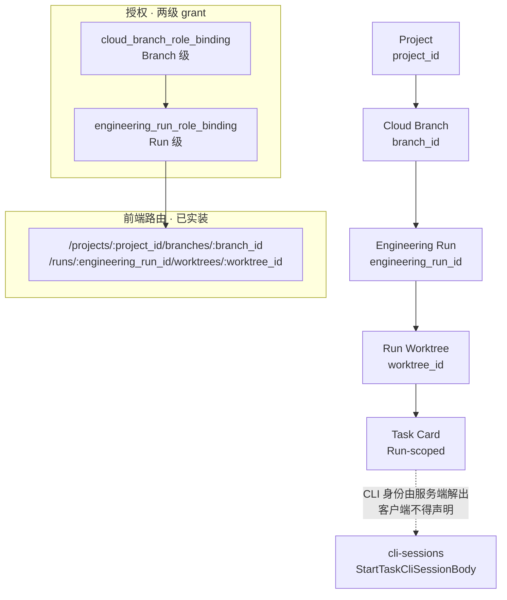
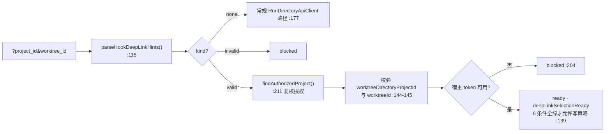

# view: 2026-10-02-engineering-run-directory

**架构 view**: `2026-10-02-engineering-run-directory`
**性质**: 实测 view —— 把 AGENTS.md 产品导航硬约束「`Project → Cloud Branch → Engineering Run → Run Worktree`」翻译成代码事实，并逐条标注**已实装 / 硬编码关闭 / 仅设计**。
**实测基线**: `dev@c1ce1630`
**取证方式**: `git grep` / 读源码行号，不经文档转述

---

## 1. 四层导航的代码落点

产品导航硬约束要求左侧主导航按四层展开。本 view 记录它在代码里的真实形态。



关键路由是 atlas 实测 57 条前端路由中**唯一一条四层参数路由**：

```
/projects/:project_id/branches/:branch_id/runs/:engineering_run_id/worktrees/:worktree_id
```

### 1.1 前端文件

| 层 | 路径 |
|---|---|
| 路由薄壳 | `frontend/src/app/(app)/projects/[project_id]/branches/[branch_id]/runs/[engineering_run_id]/worktrees/[worktree_id]/page.tsx` |
| Shell | `frontend/src/components/run/RunWorkspaceShell.tsx` |
| 四层树 | `frontend/src/lib/run/runDirectoryTree.ts` + `components/run/ProjectRunTree.tsx`（挂载于 `Sidebar.tsx:235`） |
| API 客户端 | `frontend/src/lib/run/runDirectoryApi.ts` |
| 会话 | `frontend/src/lib/run/runDirectorySession.tsx`（`status: "missing"｜"ready"｜"blocked"`） |
| Task Card | `frontend/src/components/run/RunTaskCardsPanel.tsx` |

### 1.2 客户端有界预算（实测上限）

| 项 | 上限 | 位置 |
|---|---:|---|
| 目录分页 | 50 | `runDirectoryApi.ts:95` |
| Task Card 分页 | 12 | `runDirectoryApi.ts:96` |
| 响应体 | 512 KiB / 2 MiB | `:94` / `:97` |
| 超时 | 15 s | `:98` |
| 树预算 | `{parents:16, pagesPerParent:4}` | `runDirectoryTree.ts:49` |
| Task Card 最大页数 | 100 | `RunTaskCardsPanel.tsx:30` |

这组数字对应 AGENTS.md「Rust 桌面端必须分页/虚拟化、有界缓存，避免 UI 阻塞与无界日志驻留」硬约束。

### 1.3 双端授权校验

`RunWorkspaceShell.tsx:40-58` 先 `clearFocus()` 再 `getRunContext(run, worktree)`，随后**客户端二次校验**路径与授权 context 一致，不符即抛 `scope_mismatch`；`:35` 用 `canonicalRunWorktreeHref()` 在发请求前拒绝非法路由。客户端校验是纵深防御，**不替代**服务端授权。

## 2. 授权：两级 grant 缺一即 404

`crates/star-api-rest/src/group_api/engineering_runs.rs`（577 行，已挂载于 `group_api.rs:663`）

| 元素 | 行号 | 说明 |
|---|---:|---|
| `RunAuthority` | 179 | Branch + Run + Project + **两级 grant** 聚合体 |
| `RunTaskScope` | 187 | 供其他 handler 复用的最小授权投影 |
| `authorize_run_task_scope()` | 325 | `pub(super)` 复用入口 |
| `branch_authority` | 273 | `FOR SHARE` |
| `run_authority` | 294 | `FOR SHARE`；Run 必须**同时**满足 Branch grant **和** `permission.engineering_run_role_binding`（:311），缺一即 404 |

分页游标也是 scope-bound：`DirectoryCursor` 为 base64url JSON，`cursor.kind` 或 `parent_id` 与请求不符即 `directory_cursor_scope_mismatch`（:108）—— 防止游标被跨目录复用。

`WORKTREE_SELECT`（:415）有显式注释「No filesystem path is projected」，经三表 JOIN `engineering_run_worktree_binding` → `worktree_project_binding` → `worktree_canvas_worktree`。**文件系统路径不进入目录响应**。

## 3. 数据模型：SCD2 + 双向守卫

### 3.1 `2026-10-01-engineering-run-directory.sql`

| 表 | 分类 | 依据 |
|---|---|---|
| `scm.cloud_branch` / `_revision` | **M** SCD2 | COMMENT :485-486 |
| `permission.cloud_branch_role_binding` | **M** SCD2 | COMMENT :487 |
| `multica.engineering_run` / `_revision` | **M** SCD2 | COMMENT :491；`owner_user_id` 明示**非隐式授权** |
| `permission.engineering_run_role_binding` | **M** SCD2 | COMMENT :493 |
| `multica.engineering_run_worktree_binding` | **M** SCD2 | COMMENT :495，一 Run / Worktree |
| `multica.engineering_directory_event` | **T** append-only | COMMENT :499，明示**非 outbox 队列** |

### 3.2 `2026-10-02-task-run-engineering-run-binding.sql`

`multica.task_execution_run` 新增 5 列（:17-22）：`branch_id`、`engineering_run_id`、`worktree_project_binding_id`、`engineering_run_worktree_binding_id`、`engineering_run_snapshot JSONB` —— **T** append-only。

约束设计值得注意：`ck_task_run_engineering_run_identity_complete`（:34）要求 5 列**全 NULL 或全非 NULL**，并且 **`engineering_run_id <> run_id`**（:46，即快照里的 Run 必须与执行 Run 不同，防止自指）；snapshot ≤ 8192 B，且 JSON tuple 必须**逐字段等于**列值 —— 不能只信 JSON。

触发器 `cli_task_run_engineering_run_binding_guard`（:150）：新 CLI 行**禁止**全 NULL identity（:109）；snapshot 必须**恰好** 25 字段、无未知字段（:119），7 个 version 须 `1..2147483647`，3 个 role ∈ 4 枚举值，`branch_full_ref` 须 `refs/heads/` 且 12-512 字节。

### 3.3 `2026-10-02-task-run-owner.sql`

- `multica.task_metadata` 加 `repository_id` / `branch_id` / `engineering_run_id`（:10-13）—— **M/SCD2**，`ck_task_metadata_run_owner_scd2`（:94）强制换 owner 必须开新版本
- `multica.task_run_outbox`（:46-69）—— **T** append-only，`event_type` 仅 3 值，`reject_task_run_outbox_mutation`（:75）禁 UPDATE/DELETE，**RLS ENABLE + FORCE**（:309-310），4 条 policy：select/insert 按 `app.tenant_id` / `app.actor_id`，update/delete 一律 `USING(false)`
- 双向守卫：`guard_task_worktree_run_owner`（:151）要求 Task ↔ Worktree 同 Run；`guard_engineering_run_worktree_task_owner`（:196）当 Worktree 已有他 Run 的卡片时禁止改绑。二者均 `FOR SHARE` 锁 + fail-closed
- `emit_task_run_outbox`（:242）要求 `app.actor_id` + `app.correlation_id` 事务上下文，缺失即 23514

双向守卫是本 design 的核心：它把「Run 是 Worktree 与 Task 的唯一归属方」这一不变式压进数据库，而非依赖应用层自觉。

## 4. CLI 绑定：客户端不得声明 Run 身份

⚠️ `ab037da2 feat(cli): bind task runs to engineering directory` **不是 `star` CLI 子命令**。实测 `crates/star-cli/src/`（17 文件）与 `crates/domain-cli/` 对 `engineering_run|cli_sessions|task_run` 命中数 = **0**。

真实落点是**服务端 admission**（`group_api/cli_sessions.rs`）：

| 端点 | 方法 + Path |
|---|---|
| CLI session 创建 | `POST /api/v1/worktrees/{worktree_id}/work-items/{work_item_id}/cli-sessions` |
| 状态查询 | `GET …/cli-sessions/{id}` |
| 取消 | `DELETE …/cli-sessions/{id}` |
| 附件票据 | `POST …/cli-sessions/{id}/attachment-tickets` |

安全设计：`StartTaskCliSessionBody` **拒绝**客户端自带 `engineering_run_id`（测试 `start_body_rejects_browser_supplied_engineering_run_identity`）。服务端由 `load_current_task_run_directory_binding()` 从持久目录解出 canonical tuple —— 身份是**服务端授予**的，不是客户端声明的。

契约版本化：fence digest domain `star.task_run_spawn_fence.v2\0`，grant 签名 domain `star.task-cli.execution-grant.v3\0`。Runtime 侧 `domain-local-runtime/src/task_execution.rs:296` 消费 `engineering_run`，:619 从 fence 写入 `PreparedTaskCliExecution`。

## 5. Hooks 深链：走既有选项卡，不建树节点

AGENTS.md 硬约束：Hook 配置必须沿用既有「高级设置 → Hooks」选项卡，**不得**成为 Worktree 树节点。实装遵守此约束：`RunWorkspaceShell.tsx:88` 用 `Link → /settings/advanced/hooks?project_id&worktree_id`。

仅 2 个文件、纯前端：`settings/advanced/[tab]/HookPolicyPage.tsx`（+467/−60）+ `.test.tsx`（测试 +213）。



要点：深链 hint **必须经 Run 目录 API 复核**才生效，不能仅凭 query 参数信任；状态机 `pending → ready | blocked`；可 dismiss（:161-169 strip query 参数）。

**提交历史陷阱**：`9a250be8` 是 merge commit（parents `78adb5d5` + `65c0570c`），tree 与 `65c0570c` 完全相同（`142a4b9c`），**零新增内容**。真实改动只在 `65c0570c`。

## 6. 硬编码关闭清单（最重要的诚实边界）

以下能力在 UI 上「看起来存在」，但代码里被显式关闭。**不可按「已实现」对外表述**。

| 声称 | 实测证据 |
|---|---|
| Run-owned Apps 可用 | `engineering_runs.rs:525` 硬编码 `"run_owned_apps_available": false, "execution_admission_available": false` → `RunTaskCardsPanel.tsx:66` 直接早退，永不请求 |
| 6 个 Run App tab | `RunWorkspaceShell.tsx:26` 定义 6 个 tab，但 :76 除 Task Cards 外全部 `disabled` + 文案「待迁移」；:79 只渲染 Task Cards |
| 卡内打开 CLI | `RunTaskCardsPanel.tsx:102` 按钮 `disabled`，文案「打开 CLI · 暂不可用」 |
| 目录树运行时可用 | `app/layout.tsx:70` 的 `<Providers>` **未传** `runDirectorySession`，`providers.tsx:16` 默认 `null` → 会话恒为 `missing` |
| owner migration 生效 | `2026-10-02-task-run-owner.sql` 在仓库中，但**未在任何目标库执行**（P3 报告 §3.3 自述） |

即：**四层导航的数据模型、授权、API、前端组件均已实装且挂载**，但运行时接入存在断点 —— 目录树会话未注入导致树恒为 `missing`，Run Apps 与 CLI 打开入口显式禁用。这与 P3 报告 §3 缺口、P2 报告 §3 缺口一致。

## 7. 已知缺口

- **未执行任何测试**：本 view 为只读静态侦察，cargo test / vitest / playwright 全部未运行。「已实装」仅指代码存在且 router 已挂载，**不等于行为已验证**
- **DB 层未验证**：三个 migration 未在任何目标库执行；RLS / grants / 触发器无实测证据
- 未逐条核对 P3 报告 8 条缺口中的其余各条，仅复核了 `RunDirectoryHostSession` 未传入这一条为真
- Schedule dispatch / lease / retry 未实装（`PHASE-ENGINEERING-LOOP-CORE-REPORT.md:39` 自述），与 [[view-2026-10-04-dev-baseline]] §4.6 的「未接线」清单一致
- 两个 ERUN 报告在 PowerShell 直读为乱码（疑似 GBK/UTF-8 混排），部分章节仅能取到 grep 行号
