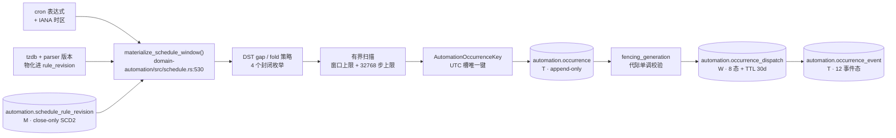

# view: 2026-10-04-dev-baseline

**架构 view**: `2026-10-04-dev-baseline`
**性质**: 汇总 view —— 不新增设计文档，而是对 `dev` 分支当前架构状态做**实测快照**，并补齐此前 view 索引缺失的 9 个 view。
**根**: `docs/architecture/`（14 个 view 目录）
**实测基线**: `dev@c1ce1630`（2026-10-04 18:19 +09:00）
**取证方式**: `git ls-tree` / `git grep` / `git show` 直接读 git 对象，不经工作区

---

## 1. 为什么要这份 view

`docs/architecture/` 下已有 14 个 view 目录，但 `pgwiki/30-architecture/views/` 的索引只列了 5 个（截至 2026-09-03）。缺口是**索引滞后**，不是文档缺失。

同时，GitHub wiki 原有数据层基线是 `origin/main@ced02a5f`（2026-10-02）。`dev` 领先 main **198 commits**，因此 wiki 若继续以 main 为基线，会**完全缺失** Automation Schedule 与 Engineering Run 两个子系统。

本 view 固定上述两个缺口：

| 项 | 旧状态 | 本 view 实测 |
|---|---|---|
| 架构 view 索引 | 5 个 | **14 个**（见 §3） |
| 数据基线 | `origin/main@ced02a5f` | `dev@c1ce1630` |
| Automation Schedule 子系统 | 未知 | 3 crate / 2 migration / 7 表 / 4 handler（见 §4） |
| Engineering Run 四层导航 | 设计态 | 路由已实装（见 §5） |

## 2. 实测总量

| 维度 | 实测值 | 取证方式（对 `dev@c1ce1630`） |
|---|---:|---|
| crate 目录 | 105 | `git ls-tree -d dev -- crates/` |
| Cargo workspace member | 97 | `git show dev:Cargo.toml` |
| Rust 源文件 | 741 | `git ls-tree -r dev -- crates/` |
| Rust 行数 | 250,602 | `git grep -c -e '' dev -- crates` |
| `#[test]` / `#[tokio::test]` | 3,686 | `git grep -c -E -e '#\[(tokio::)?test' dev -- crates` |
| 0 测试 crate | **0** | 每个 crate 计数 > 0 |
| `docs/**/*.md` | 1,416 | `git ls-tree -r dev -- docs` |
| ADR | 27 | `adr-NNN-*`（重号 0034，缺号 42/48） |
| 前端路由（`page.tsx`） | 57 | `git ls-tree -r dev -- frontend/src/app` |
| REST API 路由 | 68 | `crates/star-api-rest/src/**` |
| `star` CLI 子命令 | 13 | `crates/star-cli` |
| PostgreSQL migration | 43 | `git ls-tree -r dev -- db/migrations` |
| CI workflow | 10 | `.github/workflows/*.yml` |
| 数据库表卡 | 93 | `docs/wiki/pgwiki/20-database/_table/` |

与旧基线 `ced02a5f` 的差值：LOC +6,403、`.rs` +5、测试 +30、docs +24、migration +4、ADR 口径 28→27（pgwiki 镜像本就 27 份，差异源于计数口径）。

## 3. 完整 14 个架构 view

```mermaid
flowchart LR
    subgraph BASE["基础 view · 2026-08-26 起"]
        V1["2026-08-26-upgrade<br/>114 篇 · ADR 0021-0053 + spec 20 域"]
    end
    subgraph ORCH["编排与运行时"]
        V2["2026-09-02-upgrade<br/>1 篇 · Flutter MVP"]
        V3["2026-09-03-langgraph<br/>4 篇 · L0/L1 两级"]
        V4["2026-09-03-agent-runtime<br/>2 篇 · ECS 运行时"]
        V5["2026-09-03-arg<br/>14 篇 · 最完整 V 模型链"]
        V6["2026-09-03-treesitter-worktree-graph<br/>2 篇 · 代码图"]
    end
    subgraph CORE["核心机制"]
        V7["2026-09-07-exclusion-idempotency<br/>3 篇"]
        V8["2026-09-09-subtask-binding<br/>3 篇"]
    end
    subgraph MOCK["契约与开关"]
        V9["2026-09-22-aci-mock-interface<br/>1 篇"]
        V10["2026-09-22-mock-switches<br/>1 篇"]
    end
    subgraph DESK["桌面端 Rust→WASM"]
        V11["2026-09-28-upgrade<br/>1 篇 · 前端内存研究"]
        V12["2026-09-29-upgrade<br/>2 篇 · 端侧研究与 P0P1"]
        V13["2026-09-30-upgrade<br/>9 篇 · Tauri 桌面端全链路"]
    end
    subgraph MEM["协议与基线"]
        V14["2026-10-01-upgrade<br/>2 篇 · Session Memory 协议 + Tauri PoC 索引"]
        V15["2026-10-04-dev-baseline<br/>本篇 · 实测基线"]
    end
    BASE --> ORCH --> CORE --> MOCK --> DESK --> MEM
```



| # | view | 篇数 | 主题 |
|---|---|---:|---|
| 1 | `2026-08-26-upgrade` | 114 | 主干升级：ADR 0021-0053、threat model、20 域 spec、acceptance 17 项 |
| 2 | `2026-09-02-upgrade` | 1 | Flutter 移动端 MVP 设计 |
| 3 | `2026-09-03-langgraph` | 4 | LangGraph 两级编排 + state schema v1 迁移 |
| 4 | `2026-09-03-agent-runtime` | 2 | Rust Agent Runtime ECS 基本/详细设计 |
| 5 | `2026-09-03-arg` | 14 | 唯一完整走完 SRS→BD→DD→RACI→分阶段实现的 view |
| 6 | `2026-09-03-treesitter-worktree-graph` | 2 | tree-sitter 代码图与 worktree 关联 |
| 7 | `2026-09-07-exclusion-idempotency` | 3 | 排除法与幂等性 |
| 8 | `2026-09-09-subtask-binding` | 3 | 子任务绑定契约 |
| 9 | `2026-09-22-aci-mock-interface` | 1 | ACI mock 接口分析 |
| 10 | `2026-09-22-mock-switches` | 1 | mock 开关机制分析 |
| 11 | `2026-09-28-upgrade` | 1 | Rust→WASM 前端内存研究 |
| 12 | `2026-09-29-upgrade` | 2 | 端侧 Rust app 研究 + WASM P0P1 落地 |
| 13 | `2026-09-30-upgrade` | 9 | Tauri 桌面端：P0/P3 落地、P5 前端、P6 分发、P7 E2E 性能、P8 签名更新、P9 CI secrets、P10 Sentry |
| 14 | `2026-10-01-upgrade` | 2 | Session Memory 协议 + Tauri PoC 索引 |
| — | `2026-10-04-dev-baseline`（本篇） | 1 | 实测基线快照 |

`2026-09-03-arg` 是文档体系的**样板**：唯一一篇把 requirements → basic-design → detailed-design → RACI → 分 10 个阶段逐个实现并各自带报告的 view。其他 view 的深度均不及它。

## 4. Automation Schedule 子系统（实测）

2026-10 唯一的新增业务子系统，SRS/BD/DD 三件套齐全（`SRS-AUTOMATION-SCHEDULE-API-001` / `BD-` / `DD-`），另有 3 份实施报告。

### 4.1 命名陷阱

`crates/star-scheduler/` **不是**本子系统。它是 CPM 关键路径排程器（`crates/star-scheduler/src/lib.rs:82-485`，`Task` / `Dependency` / `critical_path`），与 Automation Schedule 无代码关系。真正的子系统只有 3 个 crate。

### 4.2 代码位置

| crate | 文件 | 行数 | 作用 |
|---|---|---:|---|
| `domain-automation` | `src/schedule.rs` | 1140 | 领域契约 + cron/IANA/DST 物化器（纯函数） |
| `star-api-rest` | `src/group_api/schedule_rules.rs` | 1311 | Run-scoped REST handler（axum） |
| `star-pg-adapter` | `src/repository/automation_schedule.rs` | 878 | 租约 / fencing / 重试适配器 |

依赖精确锁版本：`cron = "=0.17.0"`、`chrono-tz = "=0.10.4"`（根 `Cargo.toml:216-217`）—— parser 与 tzdb 版本进 `rule_revision` 表，是可复现物化的前提。

### 4.3 物化管线



### 4.4 7 张表与 W/T/M 分类

守门 #13 要求基本设计阶段 100% 表覆盖 W/T/M 三类分类。实测 7/7 全部满足，且 RLS 与审计规则同样 100%：

| 表 | 分类 | 关键列 |
|---|---|---|
| `automation.schedule_rule_revision` | **M** close-only SCD2 | `rule_version` / `cron_expression` / `time_zone` / `parser_version` / `tzdb_version` / `valid_from`–`valid_to` / 5 个 policy 列 / `engineering_run_id` |
| `automation.schedule_rule_audit` | **T** append-only | `action IN ('created','superseded')` / `actor_id` / `correlation_id` |
| `automation.occurrence` | **T** append-only | `UNIQUE (tenant_id, rule_id, rule_version, scheduled_for_utc)` / `target_snapshot_digest` |
| `automation.occurrence_dispatch` | **W** 有 TTL | `dispatch_state`(8 态) / `fencing_generation` / `lease_expires_at` / `retention_period DEFAULT 30 days` |
| `automation.occurrence_event` | **T** append-only | `event_type`(12 态) / `attempt_no` / `fencing_generation` |
| `automation.schedule_rule_outbox` | **T** append-only | `event_type IN ('schedule_rule.created','schedule_rule.revised')` |
| `automation.schedule_rule_command_idempotency` | **W** | `idempotency_key_hash` BYTEA(32) / `retention_period DEFAULT 24 hours` |

强制机制：7/7 表 `ENABLE + FORCE ROW LEVEL SECURITY` + `tenant_id` 租户策略；M/T 表 `ON DELETE RESTRICT` + `BEFORE UPDATE OR DELETE` 拒绝触发器；3 个守卫函数 —— `guard_schedule_rule_scd2`（SCD2 不变性）、`reject_schedule_history_mutation`（历史不可变）、`guard_occurrence_dispatch`（fencing 单调连续 + 状态机白名单）。

### 4.5 API 路由

基路径 `/api/v1/projects/{project_id}/engineering-runs/{run_id}/automation/schedule-rules`（`schedule_rules.rs:275,279`）—— 注意它**已经是 Engineering Run scoped**。

| Method | Path | Handler | 状态 |
|---|---|---|---|
| GET | `…/schedule-rules` | `list_rules` `:286` | implemented，成功路径未测 |
| GET | `…/schedule-rules/{rule_id}` | `get_rule` `:339` | implemented，成功路径未测 |
| POST | `…/schedule-rules` | `create_rule` `:354` | implemented，成功路径未测 |
| PUT | `…/schedule-rules/{rule_id}` | `revise_rule` `:422` | implemented，成功路径未测 |

4 个 handler 均已挂载进生产 `build_group_router`（`group_api.rs:670`），每个都经 `begin_schedule_tx` + `authorize_run` + `require_schedule_writer`。「未测成功路径」≠ design-only：9F4A 报告自述只覆盖 401/403/413 拒绝路径。

### 4.6 已实装 vs 未接线（关键诚实边界）

| 判定 | 内容 |
|---|---|
| ✅ 已实装 | 领域契约 + 有界物化（9 内联测试）、7 表 schema + 3 守卫 + 7/7 FORCE RLS、4 handler + 认证/授权/幂等/事务、PG 租约适配器 7 方法 |
| ⚠️ **未接线** | `PgAutomationScheduleRepository` 的**唯一调用方是集成测试**。全 `crates/` grep 该类型名与 7 个方法名，命中仅自身定义与 `tests/schedule_postgres.rs`；**无 worker、无 binary、无 handler 引用** |
| ⚠️ 未接线 | API 内的 `materialize_schedule_window` 调用（`:668`）在 `validate_recurrence` 内，**只校验不落 occurrence** |
| ⚠️ 未接线 | `schedule_rule_outbox` 表已建但**无任何 Rust 侧读/投递代码** → 写入有、消费无 |
| ❌ 仅设计 | occurrence → TaskExecutionRun admission、资源预留、Outbox 消费者、BI/Benchmark join、pause/resume/cancel |

即：**规则 CRUD 与物化算法已实装，但"到点触发执行"这条链路尚未闭合**，生产仍 fail-closed。这与 9F4A 报告 `:17` 自述一致。

### 4.7 测试证据

| 文件 | 测试数 | 覆盖 |
|---|---:|---|
| `domain-automation/src/schedule.rs` | 9 | 契约/键/快照/fence/物化/DST fold/gap/misfire/扫描上限 |
| `star-api-rest/src/group_api/schedule_rules.rs` | 6 | policy→列映射、权限不越界、私有响应、已挂载+需认证、先拒 scope 后访库、body 限 |
| `star-pg-adapter/tests/schedule_postgres.rs` | 4 | 幂等+RLS+append-only、并发 claim+fencing+heartbeat、retry+终态 TTL+过期租约回收、deadline+尝试耗尽 |
| Schedule 专属合计 | **19** | 交叉校验：`domain-automation/src` 共 26 个 `#[test]`，与 9F3 报告声称吻合 |

## 5. Engineering Run 四层导航

产品导航硬约束为 `Project → Cloud Branch → Engineering Run → Run Worktree`。dev 上该四层路由**已实装**：

```
/projects/:project_id/branches/:branch_id/runs/:engineering_run_id/worktrees/:worktree_id
```

它是 atlas 实测 57 条前端路由中唯一一条四层参数路由，也是 Schedule API 采用 Run-scoped 路径的同源决策。详见 GitHub wiki 的 [Engineering-Run-and-Worktree](https://github.com/UlyssesLeoLee/Star/wiki/Engineering-Run-and-Worktree)。

## 6. 已知缺口

- 本 view 为**静态实测**：未运行任何 cargo / PostgreSQL 命令，测试存在性已核对但通过/失败状态未验证
- 未逐条对照 SRS/BD/DD 正文，故「文档声称但代码没有」的完整差异清单尚未产出
- 9F4A 报告自述目标环境 migration「not installed or verified」，7 表在目标环境的实际状态未验证
- License/SBOM 门未闭合：9F4A §3.7 记无 `cargo-deny` 策略文件，默认全 workspace 检查失败
- `dev` 与 `origin/main` 分叉 198 commits；本 view 以 `dev` 为准，main 基线数据已过期
